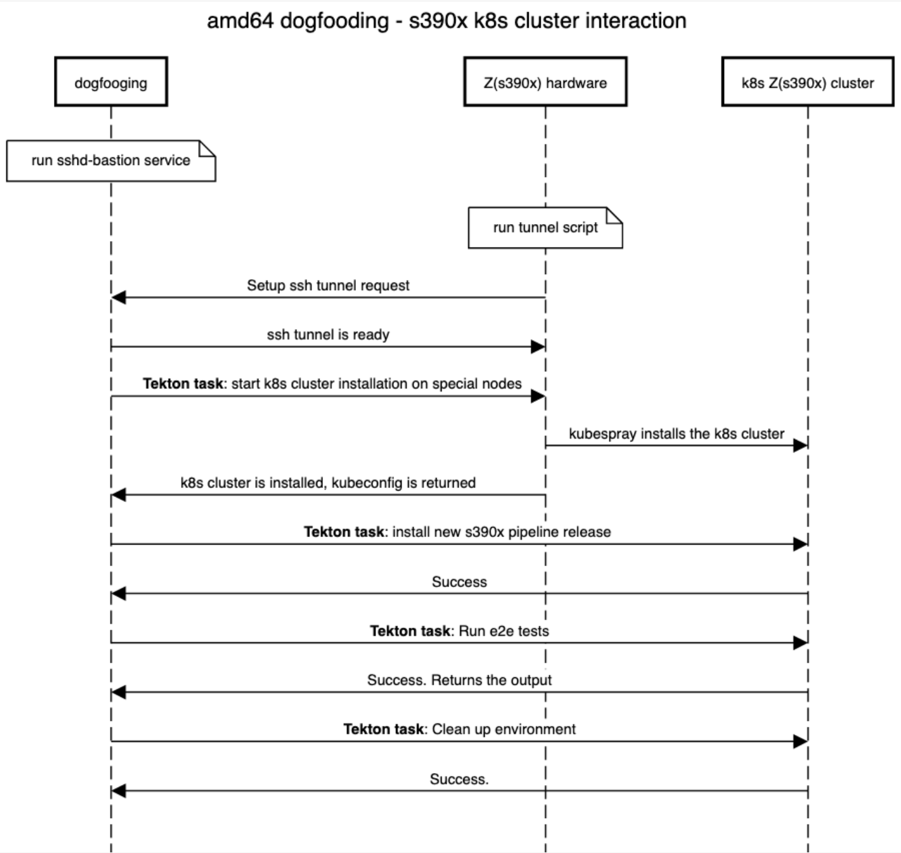

# TEP-0020: s390x architecture support

<!-- toc -->
- [Summary](#summary)
- [Motivation](#motivation)
  - [Goals](#goals)
  - [Non-Goals](#non-goals)
- [Proposal](#proposal)
  - [Design Details](#design-details)
    - [Diagram for pipeline test with s390x hardware](#diagram-for-pipeline-test-with-s390x-hardware)
- [Risks and Mitigations](#risks-and-mitigations)
- [Test Plan](#test-plan)
- [References](#references)
<!-- /toc -->

## Summary

This TEP proposes extension of the dogfooding part of CI/CD system to be able
to run the test for Tekton parts (pipeline, triggers, operator, dashboard, cli)
on `s390x` native  hardware architecture. It is based on the idea to support
non-amd64 architectures, proposed in [TEP 19](https://github.com/tektoncd/community/pull/211).

## Motivation

s390x is a processor architecture for IBM Z and LinuxOne, s390x builds are
available for many open source products and solutions. Tekton is a great
framework to build, test, and deploy the solutions, but to be able to do that for
s390x, it is necessary to have s390x release of Tekton itself.

### Goals

- Describe setup to get access to s390x native hardware.
- Describe flow to test Tekton artifacts for s390x architecture
(based on "other architectures support" [TEP 19](https://github.com/tektoncd/community/pull/211)).

### Non-Goals

- Specific hardware requirements and k8s cluster maintaining are not covered 
by this TEP.
- Missing container images(available for amd64 only) to run e2e s390x tests are
not covered by this TEP and will be fixed separately.

## Proposal

Extend current Tekton CI/CD system to run Tekton tests for s390x architecture.
As a result Tekton artifacts (container images and yaml files) will be tested
for s390x in the same way as it is done for amd64.

The details of other architecture setup proposal are described in TEP 19.

Main points, applied to s390x architecture support proposal:

amd64 Tekton cluster will take responsibilities:
- to build the corresponding part of Tekton.
- to install Tekton on non-amd64 k8s cluster.
- to initiate all other actions.
- to show results/logs in the UI.

s390x k8s cluster will:
- operate on native hardware.
- have required Tekton version installed.
- execute the tests.

All steps are packed as Tekton tasks.

### Design details

The Tekton code itself is buildable for s390x. The main part of proposed updates
are required to get access to s390x hardware to run arch specific tasks. s390x
hardware is provided by IBM and not publicly available at the moment. Also
there is no cloud provider at this moment to get k8s s390x cluster. To run s390x
specific Tekton tasks, IBM will provide Z(s390x) hardware(large baremetal server)
in a yellow zone, which means restricted access, limited ports open, etc. The
connection between dogfooding amd64 community cluster and s390x hardware will be
set up via [sshd-bastion](https://github.com/openshift/release/tree/master/core-services/sshd-bastion).
The idea here is to have a bastion host, running on amd64 cluster and script on
s390x side to connect to this service via SSH and set up a tunnel so that
others connections between clusters can be transparently proxied. After tunnel
is done, all the interaction between amd64 main cluster and s390x hardware will
be done inside the tunnel.
Practically it means that special k8s service(s) should be installed and
configured on the amd64 cluster side, example for tunnel between OCP and
Z hardware is available [here](https://github.com/openshift/release/blob/master/core-services/sshd-bastion/z/deployment.yaml#L5-L121)
(OCP is just example and the same setup is doable with vanilla k8s cluster).
From the s390x hardware side, a special [script](https://github.com/multi-arch/ocp-remote-ci/blob/master/libvirt/tunnel/tunnel.sh)
should be running.
As soon as both pieces are connected to each other, the dogfooding(k8s + Tekton)
cluster can interact with Z hardware using ports, specified in the sshd-bastion
and tunnel script. Ports are configurable and usually they are 22 (ssh),
6443 (k8s), 443(https).

Because there is no k8s s390x provider available now, it is required to do k8s
cluster installation on provided s390x hardware. It can be done via [kubespray](https://github.com/kubernetes-sigs/kubespray)
and not part of this TEP.

With s390x hardware can be provided:
- several k8s s390x preinstalled cluster or
- Tekton task to install new k8s s390x cluster via ssh tunneling connection to
s390x hardware.

#### Diagram for pipelinetest with s390x hardware

Sequence diagram for tekton pipeline repo with:
- k8s Z cluster installation -> new pipeline build installation -> run e2e test -> clean up

### Risks and Mitigations

1. s390x specific errors can exist if Tekton code works with low-level memory
allocation in a little-endian scheme, as s390x is the only architecture left
with big-endian memory allocation. However at this moment such problems are not
identified for Tekton. If they appear, domain experts, provided by interested
party (IBM), should fix the problems.
2. Usually developers test the new code locally only for amd64, so failing tests
for s390x with new code are initially expected. There should be community members
with access to s390x hardware(assigned by IBM) to fix the tests.

## Test Plan

Existing unit and e2e tests will be executed on s390x architecture.

## References

- [TEP 19 "Other architecture support"](https://github.com/tektoncd/community/blob/master/teps/0019-other-arch-support.md)
- Issue [tektoncd/plumbing#495](https://github.com/tektoncd/plumbing/issues/495)
- Issue [tektoncd/pipeline#856](https://github.com/tektoncd/pipeline/issues/856)
- Issue [tektoncd/pipeline#3064](https://github.com/tektoncd/pipeline/issues/3064)
