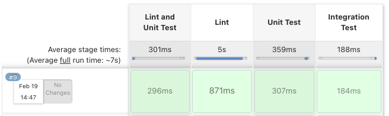
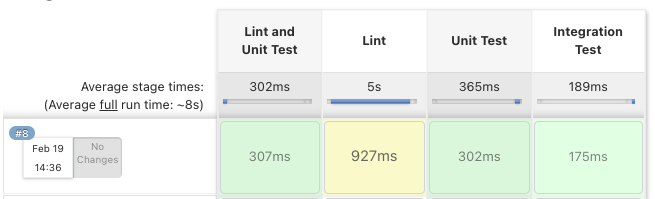
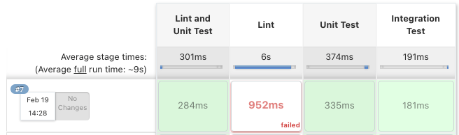

# TEP-0050: Ignore Task Failures

<!-- toc -->
- [Summary](#summary)
- [Motivation](#motivation)
  - [Goals](#goals)
  - [Non-Goals](#non-goals)
- [Requirements](#requirements)
  - [Use Cases](#use-cases)
- [References](#references)
<!-- /toc -->

## Summary

Tekton pipelines are defined as a collection of tasks in which each task is executed as a pod on a Kubernetes cluster.
Tasks are scheduled and executed in directed acyclic graph where each task represents a node on the graph. Two nodes
or two tasks are connected by an edge which is defined using either resource dependency (`from` or `task results`) or
ordering dependency (`runAfter`). One single task failure results in a pipeline failure i.e. a task resulting in a
failure blocks executing the rest of the graph. 

```yaml
$ kubectl get pr pipelinerun-with-failing-task-csmjr -o json | jq .status.conditions
[
  {
    "lastTransitionTime": "2021-02-05T18:51:15Z",
    "message": "Tasks Completed: 1 (Failed: 1, Cancelled 0), Skipped: 3",
    "reason": "Failed",
    "status": "False",
    "type": "Succeeded"
  }
]
```

Tekton [catalog](https://github.com/tektoncd/catalog) has a wide range of `tasks` which are designed to be reusable
in many pipelines. As a pipeline execution engine, we encourage the pipeline authors to utilize arbitrary tasks from
the Tekton catalog. But, many common pipelines have the requirement where a task failure must not block executing the
rest of the tasks.

A pipeline author has an option to utilize `finally` section of the pipeline in which all the final tasks are executed
after all the tasks in a graph have completed regardless of success or failure. `finally` has its own advantages and
very helpful in various use cases including notifications, cleanup, etc.

But, the pipeline authors does not have the flexibility to unblock executing the rest of the graph after experiencing a
single task failure.


## Motivation

It should be possible to utilize tasks from the Tekton catalog in a pipeline. A pipeline author has no
control over the task definitions but may desire to ignore a failure and continue executing the rest of the graph.


### Goals

* Design a task failure strategy so that the pipeline author can control the behavior of the underlying tasks 
  and decide whether to continue executing the rest of the graph in the event of failure.

* Be applicable to any pipeline with references to the tasks in a catalog or inlined task specifications.

### Non-Goals

* Not an alternative to combining the tasks in a pipeline which is covered in
  [TEP-0044 Composing Tasks with Tasks](https://github.com/tektoncd/community/pull/316).

* Not optimizing pipeline runtime which is covered in
  [TEP-0046 PipelineRun in a Pod](https://github.com/tektoncd/community/pull/318).

## Requirements

* Users should be able to use any task from the catalog without having to alter its specification to allow that task to
  fail without stopping the execution of a pipeline.

* It should be possible to know that a task failed, and the rest of the graph was allowed to continue by observing
  the status of the `PipelineRun`.

* Do not fail the pipeline if any of the tasks fail and continue executing rest of the tasks.

### Use Cases

* As a pipeline author, I would like to design a pipeline where a task running
  [unit tests](https://github.com/tektoncd/catalog/tree/master/task/golang-test/0.1) might fail,
  but the pipeline can continue running integration tests and deploying an application to a staging cluster, so that the
  application can be shared with other developers for early feedback.

  For example, do not fail the pipeline if `unit tests` fail. Continue deploying to a staging cluster if integration tests
  succeed.

  ```
           |                     |
           v                     v
       unit tests      integration tests
                                |
                                v
                      deploy to staging cluster
  ```

* As a pipeline author, I would like to design a pipeline where a task running
  [linting](https://github.com/tektoncd/catalog/tree/master/task/golangci-lint/0.1) might fail,
  but can continue running tests, so that my pipeline can report failures from the linting and all the tests.

  For example, do not fail the pipeline if `linting` fail, continue reporting the linter analysis.

  ```
           |                     |
           v                     v
       linting               unit tests
           |                     |
           v                     v
   report linter output    integration tests
  ```

  In this example, `linting` and `unit tests` are executed in parallel. This specific use case can be
  supported by `pipeline in pipeline` approach by creating two separate pipelines,
  (1) `linting` -> `report linter output` and (2) `unit tests` -> `integration tests`.
  `pipeline in pipeline` approach would be better fit when you want `linting` to fail the pipeline.
  But, `linting` is a very expensive operation and do not want the pipeline to fail if `linting` fails.

* As a new Tekton user, I want to migrate existing workflows from the other CI/CD systems that allowed a
  similar task unit of failure.

  The following pipeline is represented in Jenkins. We can consider `stages` an equivalent of `tasks` in a `pipeline`.
  In this pipeline, `linting` and `unit test` are defined as `parallel` stages and starts executing at the same time.
  The `catchError` on `linting` ignores lint failure and repairs the overall build status such that the integration
  tests are executed.

  ```
  pipeline {
    agent any
    stages {
        stage('Lint and Unit Test'){
          parallel {
            stage('Lint') {
              options {catchError(message: "lint failed", buildResult: 'SUCCESS')}
              steps {
                sh 'make lint'
              }
            }
            stage('Unit Test') {
              steps {
                sh 'make check'
                junit 'reports/**/*.xml'
              }
            }
          }
        }
        stage('Integration Test') {
            steps {
                sh 'run-tests.sh'
                junit 'reports/**/TEST-*.xml'
            }
        }
    }
  }
  ```

  

  Jenkins Dashboard showing `linting` as `unstable` with `catchError` setting the stage result to `UNSTABLE`:

  ```
  options {catchError(message: "lint failed", stageResult: 'UNSTABLE', buildResult: 'SUCCESS')}
  ```

  

  Jenkins Dashboard showing `linting` as `failed` with `catchError` setting the stage result to `FAILURE`:

  ```
  options {catchError(message: "lint failed", stageResult: 'FAILURE', buildResult: 'SUCCESS')}
  ```

  

## References

* [TEP-0040 Ignore Step Errors](https://github.com/tektoncd/community/pull/302)
* [Jenkins Pipeline ](https://www.jenkins.io/doc/book/pipeline/)
* [Parallel Stages with Declarative Pipeline](https://www.jenkins.io/blog/2017/09/25/declarative-1/) - Thank you, Andrew Bayer!
* [Jenkins fail fast](https://stackoverflow.com/questions/40600621/continue-jenkins-pipeline-past-failed-stage)
* [Jenkins ignore failure in pipeline](https://stackoverflow.com/questions/44022775/jenkins-ignore-failure-in-pipeline-build-step)
