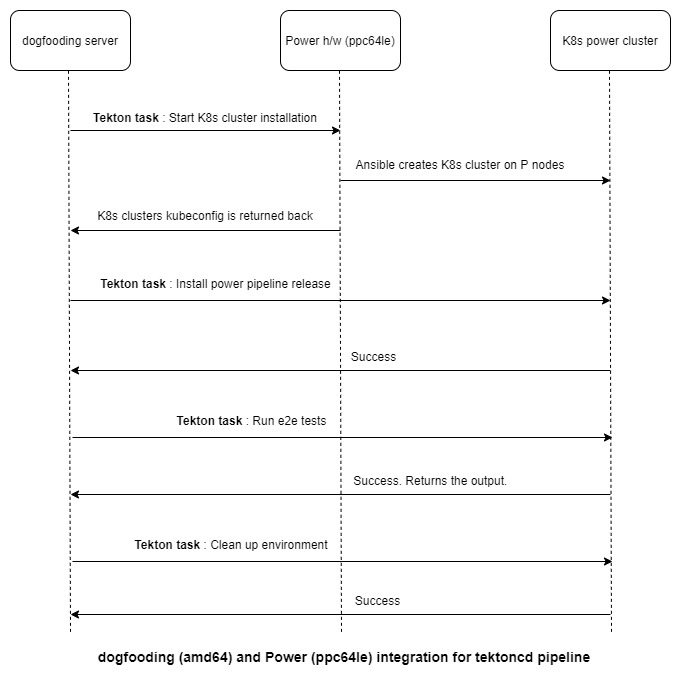

# TEP-0051: ppc64le architecture support

<!-- toc -->
- [Summary](#summary)
- [Motivation](#motivation)
  - [Goals](#goals)
  - [Non-Goals](#non-goals)
- [Proposal](#proposal)
  - [Design details](#design-details)
    - [Diagram for pipelinetest with ppc64le hardware](#diagram-for-pipelinetest-with-ppc64le-hardware)
  - [Risks and Mitigations](#risks-and-mitigations)
- [Test Plan](#test-plan)
- [References](#references)
<!-- /toc -->

## Summary

This TEP proposes extension of the dogfooding part of CI/CD system to be able
to run the test for Tekton parts (pipeline, triggers, operator, dashboard, cli)
on `ppc64le` native  hardware architecture. It is based on the idea to support
non-amd64 architectures, proposed in [TEP 19](https://github.com/tektoncd/community/pull/211).

## Motivation

ppc64le is a processor architecture for IBM Power systems. ppc64le builds are
available for many open source products and solutions. Tekton is a great
framework to build, test, and deploy the solutions, but to be able to do that for
ppc64le, it is necessary to have ppc64le release of Tekton itself.

### Goals

- Describe setup to get access to ppc64le native hardware.
- Describe flow to test Tekton artifacts for ppc64le architecture
(based on "other architectures support" [TEP 19](https://github.com/tektoncd/community/pull/211)).

### Non-Goals

- Specific hardware requirements and k8s cluster maintaining are not covered 
by this TEP.
- Missing container images(available for amd64 only) to run e2e ppc64le tests are
not covered by this TEP and will be fixed separately.

## Proposal

Extend current Tekton CI/CD system to run Tekton tests for ppc64le architecture.
As a result Tekton artifacts (container images and yaml files) will be tested
for ppc64le in the same way as it is done for amd64.

The details of other architecture setup proposal are described in TEP 19.

Main points, applied to ppc64le architecture support proposal:

amd64 Tekton cluster will take responsibilities:
- to build the corresponding part of Tekton.
- to install Tekton on non-amd64 k8s cluster.
- to initiate all other actions.
- to show results/logs in the UI.

ppc64le k8s cluster will:
- operate on native hardware.
- have required Tekton version installed.
- execute the tests.

All steps are packed as Tekton tasks.

### Design details

The Tekton code itself is buildable for ppc64le. The main part of proposed updates
are required to get access to ppc64le hardware to run arch specific tasks. ppc64le
hardware is provided by IBM. Also there is no cloud provider at this moment to get 
k8s ppc64le cluster directly. To run ppc64le specific Tekton tasks, IBM will provide
Power(ppc64le) hardware on IBM cloud with restricted access & limited ports open, etc.
The dogfooding(k8s + Tekton) cluster can interact with ppc64le hardware using 
kubeconfig.

Because there is no k8s ppc64le provider available now, it is required to do k8s
cluster installation on provided ppc64le hardware. 

With ppc64le hardware can be provided:
- several k8s ppc64le preinstalled cluster or
- Tekton task to install new k8s ppc64le cluster

#### Diagram for pipelinetest with ppc64le hardware

Sequence diagram for tekton pipeline repo with:
- k8s P cluster installation -> new pipeline build installation -> run e2e test -> clean up

### Risks and Mitigations

1. ppc64le specific errors can exist. However at this moment such problems are not
identified for Tekton. If they appear, domain experts, provided by interested
party (IBM), should fix the problems.
2. Usually developers test the new code locally only for amd64, so failing tests
for ppc64le with new code are initially expected. There should be community members
with access to ppc64le hardware(assigned by IBM) to fix the tests.

## Test Plan

Existing unit and e2e tests will be executed on ppc64le architecture.

## References

- [TEP 19 "Other architecture support"](https://github.com/tektoncd/community/blob/main/teps/0019-other-arch-support.md)
- Issue [tektoncd/pipeline#856](https://github.com/tektoncd/pipeline/issues/856)
