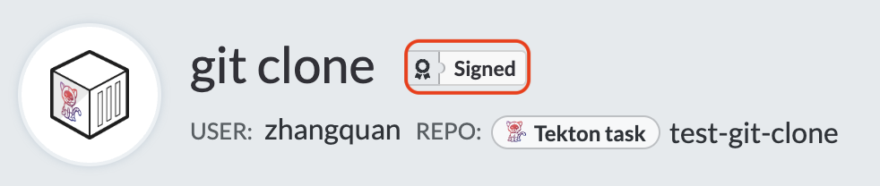

# TEP-0079: Tekton Catalog Support Tiers

<!-- toc -->
- [Summary](#summary)
- [Motivation](#motivation)
  - [Critical User Journeys](#critical-user-journeys)
    - [User](#user)
    - [Casual Contributor](#casual-contributor)
    - [Dedicated Contributor](#dedicated-contributor)
    - [Tekton Maintainer](#tekton-maintainer)
  - [Goals](#goals)
    - [Ownership and Maintenance](#ownership-and-maintenance)
    - [Automated Testing and Dogfooding](#automated-testing-and-dogfooding)
    - [Image Scanning for Common Vulnerabilities and Exposures (CVEs)](#image-scanning-for-common-vulnerabilities-and-exposures-cves)
    - [Verified Remote Resources](#verified-remote-resources)
- [Definitions](#definitions)
- [Proposal](#proposal)
  - [Ownership and Maintenance](#ownership-and-maintenance-1)
    - [Community Catalogs](#community-catalogs)
      - [Requirements](#requirements)
    - [Verified Catalogs](#verified-catalogs)
      - [Requirements](#requirements-1)
      - [Additions to Verified Catalogs](#additions-to-verified-catalogs)
    - [Hub](#hub)
    - [CLI](#cli)
    - [Cluster](#cluster)
    - [Bundles](#bundles)
    - [Remote Resolution](#remote-resolution)
      - [Bundles Resolver](#bundles-resolver)
      - [Git Resolver](#git-resolver)
      - [Hub Resolver](#hub-resolver)
    - [Responsibilities](#responsibilities)
      - [Resource Ownership](#resource-ownership)
      - [Catalog Ownership](#catalog-ownership)
    - [Design Evaluation](#design-evaluation)
    - [Alternatives](#alternatives)
      - [1. Verified Support Tier](#1-verified-support-tier)
        - [Design Evaluation](#design-evaluation-1)
      - [2. Community Catalogs in tektoncd-catalog GitHub Org](#2-community-catalogs-in-tektoncd-catalog-github-org)
        - [Design Evaluation](#design-evaluation-2)
  - [Automated Testing and Dogfooding](#automated-testing-and-dogfooding-1)
    - [Test Pipelines](#test-pipelines)
      - [Setup](#setup)
      - [Execution](#execution)
      - [Verification](#verification)
      - [Example](#example)
    - [Verified Catalog Testing Infrastructure](#verified-catalog-testing-infrastructure)
      - [Integration Test](#integration-test)
        - [Integration Test on PR Merge](#integration-test-on-pr-merge)
        - [Nightly Integration Test](#nightly-integration-test)
      - [Build Test](#build-test)
    - [Community Catalog Template Testing Infrastructure](#community-catalog-template-testing-infrastructure)
      - [Example](#example-1)
    - [Design Evaluation](#design-evaluation-3)
    - [Future Work](#future-work)
  - [Image Scanning for Common Vulnerabilities and Exposures (CVEs)](#image-scanning-for-common-vulnerabilities-and-exposures-cves-1)
    - [CVEs Scanning Tool](#cves-scanning-tool)
    - [Scanning Policy &amp; Surface Vulnerability Report](#scanning-policy--surface-vulnerability-report)
    - [Extract Container Images from Catalogs](#extract-container-images-from-catalogs)
    - [Design Evaluation](#design-evaluation-4)
    - [Alternatives](#alternatives-1)
      - [1. Store Container Images in Metadata File](#1-store-container-images-in-metadata-file)
  - [Verified Remote Resources](#verified-remote-resources-1)
    - [Sign the Verified Catalog](#sign-the-verified-catalog)
    - [Verified Catalog Repository Setup](#verified-catalog-repository-setup)
    - [Design Evaluation](#design-evaluation-5)
    - [Future Work](#future-work-1)
- [References](#references)
<!-- /toc -->

## Summary

The aim of this TEP is to establish support tiers for resources in the Artifact Hub to ensure users get high quality
resources that they can rely on while making it easy for Contributors to share resources in the Artifact Hub. This TEP
builds on prior work in [TEP-0003][tep-0003], [TEP-0110][tep-0110].

## Motivation

### Critical User Journeys

#### User

Story: As a user of Tekton Pipelines, I want to be able to use `Tasks` and `Pipelines` from the Artifact Hub. I want to
know that I can rely on them to work as advertised.

Anti-story: As a user of Tekton Pipelines, I try to use a `Task` from the Artifact Hub, but it turns out that it doesn't
work, e.g. the `Result` that the `Task` is supposed to produce is invalid or the `Steps` fail for unexpected reasons.

#### Casual Contributor

As a casual Contributor to the Tekton Catalog, I have created a `Task` that works for me, and I'd like to submit it to
the Catalog, but I don't want to do much more work than that. I'm willing to deal with bugs reported and pull requests
opened for it, but I don't want to have to bother submitting tests with it.

#### Dedicated Contributor

As a dedicated Contributor to the Tekton Catalog, I have created a `Task` and I want to make sure it continues to work
over time. I'm willing to put in the time to create a test, but I want to understand exactly how to create that test
without having to track down a Maintainer to help me. Moreover, I want to sign the `Task` to mark it as trusted.

#### Tekton Maintainer

As a Maintainer of a Tekton project, I have a `Task` which I would like to be an verified part of Tekton and I would
like other Tekton Maintainers to help maintain over time. In addition to automated testing for the `Task`, I want the
image used in the `Task` to be regularly scanned for common vulnerabilities and exposures so that we ensure verified
`Tasks` are secure. I also want this verified `Task` to demonstrate best and secure practices that users can use as a
sample when authoring their own `Tasks`. Even more, I want to dogfood features and components in Tekton to gather
feedback and iterate quickly.

### Goals

#### Ownership and Maintenance

Every resource in the [`tektoncd-catalog`][tektoncd-catalog] GitHub organization needs to have Owners to maintain them. The Ownership needs to be distributed among community members and Tekton Maintainers to ensure that the workload is manageable and sustainable.

#### Automated Testing and Dogfooding

Users need to be able to check that shared Tekton resources work as expected so that they can rely on them.

Contributors need to know how to provide tests to ensure their resources in Catalogs work as expected. In addition,
they need to know how to set up the infrastructure that they can use to run those tests against.

Maintainers need to dogfood Tekton to gather feedback and iterate quickly, so the test infrastructure should use Tekton.

#### Image Scanning for Common Vulnerabilities and Exposures (CVEs)

Shared Tekton resources refer to images from a lot of places. We need to regularly scan these images for common
vulnerabilities and exposures, and surface any issues to Maintainers and Contributors.

#### Verified Remote Resources

Contributors need to sign resources they own in the Catalog and Maintainers need to sign resources that are
provided and maintained by Tekton. They need to sign the resources so that they may be trusted, depending on users'
requirements, and provenance attestations can be made to meet software supply chain security goals.

[TEP-0091: Verified Remote Resources][tep-0091] will flesh out the details of signing, while this TEP will focus on
surfacing the signing information and building a corpus of verified resources that users can trust. The verification will be done in the Tekton Pipeline's reconciler after remote resolution as designed in [TEP-0091][tep-0091].

## Definitions

The keywords “MUST”, “MUST NOT”, “REQUIRED”, “SHALL”, “SHALL NOT”, “SHOULD”, “SHOULD NOT”, “RECOMMENDED”, 
“NOT RECOMMENDED”, “MAY”, and “OPTIONAL” are to be interpreted as described in [RFC 2119][rfc2119].

Terms used in this TEP are defined as follows:

* **Catalog**: A repository that complies with the organization contracts defined in [TEP-0003][tep-0003-org] or
[TEP-0115][tep-0115]. The git-based versioning defined in [TEP-0115][tep-0115] is preferred. 

* **Resource**: Item shared in a Tekton Catalog e.g. `Task` or `Pipeline`.

* **Tekton Catalog Maintainers**: The core group of OWNERS who can approve changes in verified Tekton Catalogs.
Today, they are defined in [OWNERS][catalog-owners] file in the existing Catalog at `tektoncd/catalog`. The current maintainers of `tektoncd/catalog` should become the maintainers in the `tektoncd-catalog` github org.

## Proposal

### Ownership and Maintenance

As previously discussed in [TEP-0115][tep-0115-org] and [migration][migration] to the [Artifact Hub][hub],
the Tekton Community has decided to migrate to the decentralized model for Catalogs and use the Artifact Hub to surface Tekton Catalogs.
Given the above changes, we propose creating two support tiers: `Community` and `Verified`. Community Catalogs make it easy for Contributors to share resources, while the Verified Catalogs provide high quality resources that users can rely on. Community and Verified Catalogs will be published in the [Hub][hub].

#### Community Catalogs

To ensure the workload of maintaining shared resources is sustainable, Contributors can share and maintain resources
in their own Community Catalogs. Community Catalogs will provide a low barrier of entry, in the testing and security 
requirements, to encourage community contributions.

##### Requirements

1. The Catalog MUST comply with the contract and versioning defined in [TEP-0003][tep-0003-org] or [TEP-0115][tep-0115].
We will support the directory-based versioning for backwards compatibility during migration; new Catalogs should use the
git-based versioning defined in TEP-0115.
2. The Catalog MUST define an OWNER file that specifies at least one Maintainer.
3. The Catalog MAY have automated testing (using Tekton or not). If there are any failures, they MAY be resolved. The automated 
testing is discussed further [below](#automated-testing-and-dogfooding-1).
4. The Catalog MAY be scanned for common vulnerabilities and exposures. If any issues are discovered, they MAY be
patched or disclosed. Scanning is discussed [below](#image-scanning-for-common-vulnerabilities-and-exposures-cves-1).
5. The Catalog MAY support verification as proposed in [TEP-0091: Verified Remote Resources][tep-0091]. For now, it 
MAY be published to a public OCI registry as a [Tekton Bundle][bundle] and signed by the Owners. In the future, it MAY
be updated to support accepted proposal of [TEP-0091: Verified Remote Resources][tep-0091]. Verification is discussed 
further [below](#verified-remote-resources-1).
6. The Catalog MAY be well documented with all configuration options described and working examples provided.
7. The Catalog MAY follow and demonstrate best practices e.g. [`Task` authoring recommendations][task-authoring-recs].
If there are new best practices, the Catalog MAY be updated.
8. The Catalog MAY be updated to the latest version of Tekton and other dependencies.

#### Verified Catalogs

To provide a corpus of high quality resources that users can rely on, we propose creating Verified Catalogs with high
maintenance, testing and security standards. 

As described in [TEP-0115][tep-0115], the Verified Catalogs will be in repositories in `tektoncd-catalog` GitHub 
organization - https://github.com/tektoncd-catalog. 

##### Requirements

These are requirements for Verified Catalogs:

1. The Catalog MUST comply with the contract and versioning defined in [TEP-0115][tep-0115].
2. The Catalog MUST define an OWNER file listing the Tekton Catalog Maintainers. The ownership responsibilities are
described [below](#responsibilities).
3. The Catalog MUST have automated testing using Tekton for dogfooding. If there are any failures, they MUST be
resolved as soon as possible; the SLO is one week. Automated testing is discussed further
[below](#automated-testing-and-dogfooding-1).
4. The Catalog MUST be scanned for common vulnerabilities and exposures. If any issues are discovered, they MUST be
patched or disclosed as soon as possible; the SLO is one week. Scanning for CVEs is discussed further
[below](#image-scanning-for-common-vulnerabilities-and-exposures-cves-1).
5. The Catalog MUST support verification as proposed in [TEP-0091: Verified Remote Resources][tep-0091]. For now, 
it MUST be published to a public OCI registry as a [Tekton Bundle][bundle] and signed by Tekton. In the future, it MUST
be updated to support accepted proposal of [TEP-0091: Verified Remote Resources][tep-0091]. Verification is discussed
further [below](#verified-remote-resources-1).
6. The Catalog MUST be well documented with all configuration options described and working examples provided.
7. The Catalog MUST follow and demonstrate best practices e.g. [`Task` authoring recommendations][task-authoring-recs].
If there are new best practices, the Catalog MUST be updated if applicable.
8. The Catalog SHOULD be updated to the latest version of Tekton and other dependencies.

##### Additions to Verified Catalogs

Adding a new Verified Catalog or adding a resource into a Verified Catalog should be an exception, not the norm. The 
set of Verified Catalogs and their resources should be relatively small so that it is sustainable to maintain them. 

A new Verified Catalog may be created, or a new resource added to it if:
* _Quality_: It meets the [requirements of the Verified Catalog](#requirements-1).
* _Bandwidth_: The [Tekton Catalog Maintainers][catalog-owners] approve its addition based on its usefulness to the
community and existing bandwidth to maintain the resource.

#### Hub

Users rely on the [Artifact Hub][hub] to discover shared resources. The Artifact Hub supports publishing resources from
multiple Catalogs. Users and organizations can create their own Catalogs and share them in the Artifact Hub ([guide][artifact-hub-guide]), as long as they comply with the Catalog contract.

To distinguish the Catalogs support tier in the Hub, the [Tekton Catalog Maintainers][catalog-owners] have reserved the `tektoncd` org in the Artifact Hub. **Only** the catalogs published under the `tektoncd` org are with the `Verified` support tier. The community contributors are able to create their own Artifact Hub organization to publish Catalogs, the support tier of such Catalogs are `Community`.

The [Tekton Catalog Maintainers][catalog-owners] also reserved the `tektoncd-legacy` org in the Hub, surfacing the current [centralized Catalog repo][central-catalog-repo] following the legacy directory-based versioning. We will stop surfacing catalogs from the centralized Catalog repo in the Artifact Hub after the 9-month migration period as discussed in [TEP-0115][tep-0115-migration].

#### CLI

Today, users can use the CLI to install resources from Catalogs by passing in the Catalog name to the `--from` argument
as shown in the examples below. This adds a label to the resource indicating the source Catalog:

```shell
# Community Catalog

$ tkn hub install task golang-lint --version 0.3 --from tekton

Task golang-lint(0.3) installed in default namespace

$ kubectl describe task.tekton.dev/golang-lint

Name:         golang-lint
Namespace:    default
Labels:       app.kubernetes.io/version=0.3
              hub.tekton.dev/catalog=tekton
... 
```

The Artifact Hub guarantees the uniqueness of the Catalog name and Org name, so we can continue using the `--from` to indicate the Catalog name.
This should add labels to the resource indicating the source Catalog (`artifacthub.io/catalog`), the source Org (`artifacthub.io/org`) and the support tier (`artifacthub.io/support-tier`). The source Org is returned in the Artifact Hub API response, and the support tier is determined by the value of the source Org (i.e. `if org == "tektoncd"`)

```shell
# Buildpacks Community Catalog

$ tkn hub install task buildpacks --version 0.3 --from buildpacks

Task buildpacks(0.3) installed in default namespace

$ kubectl describe task.tekton.dev/buildpacks

Name:         buildpacks
Namespace:    default
Labels:       app.kubernetes.io/version=0.3
              artifacthub.io/catalog=buildpacks
              artifacthub.io/org=buildpacks
              artifacthub.io/support-tier=community            
...
 
# Git Verified Catalog

$ tkn hub install task git-clone --version 0.7 --from git-clone

Task git-clone(0.7) installed in default namespace

$ kubectl describe task.tekton.dev/git-clone

Name:         git-clone
Namespace:    default
Labels:       app.kubernetes.io/version=0.7
              artifacthub.io/catalog=git-clone
              artifacthub.io/org=tektoncd   # return by the Artifact Hub API
              artifacthub.io/support-tier=verified  # verified because the org is "tektoncd"
...
```

#### Cluster

When resources are installed in a cluster, without using the CLI, it may be difficult to identify which Tekton Catalog
it came from because they won't have the labels added by the CLI.

To make it easy for users to identify the source Catalog from the Hub, we propose adding three annotations:
* `tekton.dev/catalog` with the two-part domain unique identifier: `<catalog-org>.<catalog-name>`
* `tekton.dev/catalog-support-tier` with the support tier of the Catalog, either `"verified"` or `"community"`
* `tekton.dev/catalog-url` with the repository path of the Catalog

The rationale for adding the two-part dot domain is:
* URL can change and resource can be moved elsewhere - if we want to know the provenance of a Catalog resource, the URL
is not something we can rely on.
* Domain identifier allow us to easily know which provider is providing a given Catalog. A company may want to introduce
their own Catalogs for their users and having a domain id make sure there would be no conflicts with verified resources.
* Tools can always rely on the domain id to remain the same.

```yaml
# annotations on resource from the "buildpacks" community catalog
annotations:
  tekton.dev/pipelines.minVersion: "0.7.0"
  tekton.dev/tags: build
  tekton.dev/catalog: buildpacks.tekton-integration
  tekton.dev/catalog-support-tier: community
  tekton.dev/catalog-url: https://github.com/buildpacks/tekton-integration

# annotations on resource from the "openshift" community catalog
annotations:
  tekton.dev/pipelines.minVersion: "0.17.0"
  tekton.dev/tags: build
  tekton.dev/catalog: openshift.catalog
  tekton.dev/catalog-support-tier: community  
  tekton.dev/catalog-url: https://github.com/openshift/catalog

# annotations on resource from the "git" verified catalog
annotations:
  tekton.dev/pipelines.minVersion: "0.30.0"
  tekton.dev/tags: gitops
  tekton.dev/catalog: tektoncd.git
  tekton.dev/catalog-support-tier: verified
  tekton.dev/catalog-url: https://github.com/tektoncd-catalog/git

# annotations on resource from the "kaniko" verified catalog
annotations:
  tekton.dev/pipelines.minVersion: "0.30.0"
  tekton.dev/tags: build
  tekton.dev/catalog: tektoncd.kaniko
  tekton.dev/catalog-support-tier: verified
  tekton.dev/catalog-url: https://github.com/tektoncd-catalog/kaniko
```

#### Bundles

We propose publishing Tekton Bundles of the resources in the Verified Catalogs; note that we publish one Bundle per 
resource currently. Users can use the applicable reference to fetch and use the resource, as such:

```yaml
# bundle from a resource in the verified "git" catalog
taskRef:
    name: git-clone
    bundle: gcr.io/tekton-releases/catalogs/git/git-clone:0.7

# bundle from a resource in the verified "kaniko" catalog
taskRef:
  name: kaniko
  bundle: gcr.io/tekton-releases/catalogs/kaniko/kaniko:0.3
```

Community Contributors can publish Tekton Bundles from their own Catalogs to the their own registries using the resources provided by Tekton e.g. there is a `Task` for [publishing resource in a Catalog to Bundles][catalog-publish] in the existing Tekton Catalog.

#### Remote Resolution

In [TEP-0060: Remote Resource Resolution][tep-0060], we introduced fetching resources from remote resources.
Remote Resolution works well with the Community and verified Catalogs as demonstrated in the examples below. 

##### Bundles Resolver

Using [Bundles Resolver][bundle-resolver]:

```yaml
# bundle of a resource from the verified "git" catalog
taskRef:
  resolver: bundle
  params:
    - name: bundle
      value: gcr.io/tekton/catalog/git/git-clone:0.7
    - name: name
      value: git-clone
    - name: kind
      value: task

# bundle of a resource from the community "buildpacks" catalog
taskRef:
  resolver: bundle
  params:
    - name: bundle
      value: gcr.io/buildpacks/catalog/buildpacks/buildpacks:0.3
    - name: name
      value: buildpacks
    - name: kind
      value: task
```

##### Git Resolver

Using [Git Resolver][git-resolver]:

```yaml
# "clone" task in the verified "git" catalog
taskRef:
  resolver: git
  params:
    - name: url
      value: https://github.com/tektoncd-catalog/git
    - name: revision
      value: v0.5
    - name: pathInRepo
      value: task/clone/clone.yaml

# "buildpacks" task the community "buildpacks" catalog
taskRef:
  resolver: git
  resource:
    - name: url
      value: https://github.com/buildpacks/tekton-integration
    - name: revision
      value: main
    - name: pathInRepo
      value: task/buildpacks/buildpacks.yaml
```

##### Hub Resolver

Using [Hub Resolver][hub-resolver]:

```yaml
# "clone" task in the verified "git" catalog
taskRef:
  resolver: hub
  params:
    - name: type
      value: artifact
    - name: catalog
      value: git
    - name: kind
      value: task
    - name: name
      value: clone
    - name: version
      value: 0.5

# "buildpacks" task the community "buildpacks" catalog
taskRef:
  resolver: hub
  params:
    - name: type
      value: artifact
    - name: catalog
      value: buildpacks
    - name: kind
      value: task
    - name: name
      value: buildpacks
    - name: version
      value: 0.3
```

#### Responsibilities

##### Resource Ownership

The responsibilities of owning a resource include but are not limited to:

1. Reviewing and approving all changes to the resource.
2. Resolving any failures of tests validating the resource.
3. Responding to and resolving any issues reported concerning the resource.
4. Updating the resources to be compatible with new versions of Tekton, and other dependencies.

##### Catalog Ownership

The responsibilities of owning a Catalog include but are not limited to:

1. Reviewing and approving new resources contributed to the Catalog.
2. Maintaining the health of the testing infrastructure.
3. Triaging issues and involving the owners of the affected resources.
4. Ensuring the resources meet the quality standards of the Catalog.

#### Design Evaluation

This design builds on the prior work to decouple Catalog organization from resource reference in [TEP-0110][tep-0110]
and git-based versioning in [TEP-0115][tep-0115]. The Catalogs used to provide Verified and Community support tiers 
makes it easier to enforce the applicable quality standards while maintaining the lower barrier of entry.

#### Alternatives

##### 1. Verified Support Tier

[TEP-0003: Tekton Catalog Organization][tep-0003] proposed three support tiers for resources in the Tekton Catalog,
*community*, *verified* and *official*, which are differentiated as such:

|                        | Community |      Verified      |      Official      |
|:----------------------:|:---------:|:------------------:|:------------------:|
|   Automated Testing    |    :x:    | :heavy_check_mark: | :heavy_check_mark: |
| Images scanned for CVE |    :x:    |        :x:         | :heavy_check_mark: |
|  Maintained by Tekton  |    :x:    |        :x:         | :heavy_check_mark: |

###### Design Evaluation

Resources in the verified tier are effectively resources in the community tier that are tested. Given that resources in the community tier can be tested or untested, we can use a simpler mechanism to indicate their testing status, such as a badge in the Artifact Hub. Therefore, adding a verified support tier is unnecessary, and we'd prefer to keep the tiers simple.

The *official* Tekton Catalog support tier collides with the Artifact Hub ["official status"][artifact-hub-official-status], which means the publisher **owns the software deployed by a package** (e.g. the `kaniko` task published by the kaniko maintainers can claim the `official status` instead of the Tekton maintainers). The naming collision causes confusion and inconsistency between the Tekton and the Artifact Hub users, and therefore we prefer to avoid using the term *official* in Tekton Catalogs. 

##### 2. Community Catalogs in tektoncd-catalog GitHub Org

We could allow hosting Community Catalogs in tektoncd-catalog GitHub Org and use another means to indicate the tier 
of the Catalog, such as by using the `catalog-support-tier` field in Hub configuration.

###### Design Evaluation

There's no clear benefit for allowing Contributors to host Catalogs in the tektoncd-catalog GitHub Org. However, 
it adds more maintenance burden because the Tekton Maintainers would have to create the repositories, and provide
general oversight. Contributors are already hosting Catalogs in their own organizations and repositories e.g.
[eBay][ebay] and [Buildpacks][buildpacks].

### Automated Testing and Dogfooding

In this section, we design the automated test infrastructure and test pipelines setup for both Verified Catalogs and Community Catalogs.

#### Test Pipelines

Following the Catalog Contract defined in [TEP-0115][tep-0115-contract], the owners need to provide one or more test `pipelines` in the `./{resource-type}/{resource-name}/tests/pipelineRun.yaml` file of the catalog resource directories to run the integration test for the resource.

The `pipelines` SHOULD contain 3 parts: `setup`, `execution`, and `verification`.

##### Setup

The `pipelines` MAY have tasks or resources that do any required setup (e.g. resolving `git-clone` task via Hub Resolver)

##### Execution

The `pipelines` MUST have the resource under test. 

The resource SHOULD be executed more than once. This can be made easier by leveraging fanning out resources with combinations of `Parameters`, as proposed in [TEP-0090: Matrix][tep-0090].

If the resource is a `Pipeline`, then we need `Pipelines in Pipelines` support in Tekton Pipelines as proposed in [TEP-0056: Pipelines in Pipelines][tep-0056].

##### Verification

The `Pipeline` SHOULD have resources that assert that the resource under test has worked when applicable by:

* Verifying all `Results`
* Verifying all `Workspace` mutations
* Verifying any expected “side effects” (e.g. a successful deployment)

##### Example
The following is a test `pipeline` example for [`kaniko`][kaniko] task, which ***sets up*** the `fetch-repository` task via Hub Resolver, ***executes*** the `kaniko` task, and ***verifies*** the URL and Digest produced by the `kaniko` task.

```yaml
apiVersion: tekton.dev/v1beta1
kind: Pipeline
metadata:
  name: kaniko-test-pipeline
spec:
  workspaces:
  - name: shared-workspace
  params:
  - name: image
    description: reference of the image to build
  tasks:
  - name: fetch-repository  # Setup
    taskRef:
      resolver: hub
      params:
      - name: name
        value: git-clone
      - name: version
        value: "0.9"
    workspaces:
    - name: output
      workspace: shared-workspace
    params:
    - name: url
      value: https://github.com/kelseyhightower/nocode
    - name: subdirectory
      value: ""
    - name: deleteExisting
      value: "true"
  - name: kaniko  # Execution
    taskRef:
      name: kaniko
    runAfter:
    - fetch-repository
    workspaces:
    - name: source
      workspace: shared-workspace
    params:
    - name: IMAGE
      value: $(params.image)
    - name: EXTRA_ARGS
      value:
        - --skip-tls-verify
  - name: verify-digest # Verification
    runAfter:
    - kaniko
    params:
    - name: digest
      value: $(tasks.kaniko.results.IMAGE_DIGEST)
    taskSpec:
      params:
      - name: digest
      steps:
      - name: bash
        image: ubuntu
        script: |
          echo $(params.digest)
          case .$(params.digest) in
            ".sha"*) exit 0 ;;
            *)       echo "Digest value is not correct" && exit 1 ;;
          esac
  - name: verify-url # Verification
    runAfter:
    - kaniko
    params:
    - name: url
      value: $(tasks.kaniko.results.IMAGE_URL)
    taskSpec:
      params:
      - name: url
      steps:
      - name: bash
        image: ubuntu
        script: |
          echo $(params.url)
          case .$(params.url) in
            *"/kaniko-nocode") exit 0 ;;
            *)       echo "URL value is not correct" && exit 1 ;;
          esac
```

#### Verified Catalog Testing Infrastructure

In this section, we design the test infrastructure and test strategy for the Verified Catalogs based on the `test pipeline` setup as described above.

As discussed in [TEP-0115][tep-0115-org], the Verified Catalogs will be hosted as separate repositories in the [tektoncd-catalog][tektoncd-catalog] GitHub organization. These repositories are owned by Tekton Maintainers and should follow the `tektoncd` [project requirements][tektoncd-project-requirement].

The Verified Catalogs test should use the existing infrastructure provided in the [plumbing repo][plumbing] to meet the same standard of automation with other `tektoncd` projects. Specifically, we will continue to use `Prow`  and the existing [Prow Cluster][prow-cluster] for repository and organization management requirements (i.e. label management, reviewer auto assignment, and pull request management...).

To dogfood Tekton, we propose to use Tekton as the test automation infrastructure for the Verified Catalogs, leveraging the [Dogfooding Cluster][dogfooding-cluster] and the existing [Tekton setup][plumbing-tekton] in the plumbing repo.

We propose two required tests and the corresponding GitHub checks for the Verified Catalogs:

##### Integration Test

The integration tests SHOULD run the catalog resource from end to end. The integration tests should be run both as a CI gated check on PR merge and on a nightly basis.

We propose to use the [kind-e2e task][kind-e2e] to spin up a `KinD` cluster to run the test `pipelines` when triggered. The `kind-e2e task` executes the `./test/e2e-tests.sh` script in the target catalog which then runs the test `pipelines` in the catalog resource directory(`./{resource-type}/{resource-name}/tests/`). The `Tekton Pipelines` versions to be tested against can be configured in the `./test/e2e-tests.sh` script, which will be further discussed in the below sections.

Please refer to the [kind-e2e doc][kind-e2e-doc] for more information.

###### Integration Test on PR Merge

We propose to test the Verified Catalogs against:
- The **most recent** `Tekton Pipelines` release 
- The **minimum compatible** `Tekton Pipelines` release (specified by `tekton.dev/minVersion` label of the Task)

The successful completion of the integration tests passes the `pull-tekton-catalog-integration-tests-latest` and `pull-tekton-catalog-integration-tests-min-compatible` GitHub checks respectively to unblock a PR merge. The integration test should be triggered by pull request `opened`, `reopened`, `synchronize` events, or by `/test pull-tekton-catalog-integration-tests-latest` and `/test pull-tekton-catalog-integration-tests-min-compatible` comments in the pull request.


This is a conceptual high-level flow:

  ```
           |                                      |
           v                                      v
  start-integration-test-GitHub-check       git-batch-merge
                                                  |
                                                  v
                                            kind-e2e-test
                                                  |
                                                  v      
                                  update-integration-test-GitHub-check
                                                  |
                                                  v     
                                            upload-logs                                                                          
  ```

###### Nightly Integration Test

We propose to test the Verified Catalogs against the **latest nightly release** of `Tekton Pipelines` as periodic nightly jobs. 

The pro and con of this approach are the same: we may catch issues with Tekton Pipelines itself. Since backward incompatible changes require an ApiGroup bump, this should never fail, but probably sometimes will. Failures here are probably caused by bugs in Tekton Pipelines. This means we may catch more issues before releases, but also means that Catalog tests may fail for non-catalog related reasons.

Since these failures are more likely to be caused by Tekton Pipelines than by the Tasks, we will only run these as periodic nightly jobs and not let these failures block a PR merge. 

The failures of nightly tests should be automatically sent to a dedicated new slack channel - `catalog-maintainers` to raise the awareness of the failures to the Tekton Catalog Maintainers (we have a [send-to-channel-slack][send-to-channel-slack] catalog task to support this). It will be up to Tekton Catalog Maintainers to track down their failures.

##### Build Test

The build tests SHOULD check the syntax of the yaml files and the contract of the Catalog. The successful completion of the build test pass `pull-tekton-catalog-build-tests` GitHub check to unblock a PR merge. The Build Test should be triggered by pull request `opened`, `reopened`, `synchronize` events, or the `/test pull-tekton-catalog-build-test` comment in the pull request.

[Catlin][catlin-repo] is a command-line tool that lints Tekton Resources and Catalogs which checks
  - If the resource is on a valid path
  - If the resource is a valid Tekton Resource
  - If all mandatory fields are added to the resource file
  - If all images used in Task Spec are tagged
  - If platforms are specified in a correct format

We propose to use [Catlin Task][catlin-task] in the build test. This is a conceptual flow:

  ```
           |                              |
           v                              v
  start-build-test-GitHub-check      git-batch-merge
                                          |
                                          v
                                     catlin-lint
                                          |
                                          v      
                              update-build-test-GitHub-check
                                          |
                                          v     
                                    upload-logs                                                                          
  ```

#### Community Catalog Template Testing Infrastructure

The test infrastructure in the plumbing repo is designed for all `tektoncd` projects, which may not fit a Community Catalog repo's needs and may be too complicated for the authors to start with. To encourage Community Catalog authors to set up automated tests for their catalogs (using Tekton!), we propose to provide a template repo in the `tektoncd-catalog` GitHub org for Community Catalog authors to follow. This tutorial-like template should contain the **simple and minimum** required setup for the automated build tests and integration tests, guiding Community Catalog authors to achieve the same testing functionality as the Verified Catalogs using Tekton primitives.

##### Example
The following is a simplified `EventListener` + `Trigger` example listening `/test pull-tekton-catalog-build-test` command.

```yaml
apiVersion: triggers.tekton.dev/v1beta1
kind: EventListener
metadata:
  name: tekton-catalog-automated-testing-event-listener
spec:
  triggers:
    - name: pull-build-test
      interceptors:
      - ref:
          name: "github"
        params:
        - name: "eventTypes"
          value: ["issue_comment"]
        - name: "secretRef"
          value:
            secretName: github-secret
            secretKey: secretToken
      - ref:
          name: "cel"
        params:
        - name: "filter"
          value: "body.comment.body == '/test pull-tekton-catalog-build-test'"
        - name: "overlays"
          value:
          - key: add_pr_body.pull_request_url
            expression: "body.issue.pull_request.url"
      - webhook:
          objectRef:
            kind: Service
            name: add-pr-body
            apiVersion: v1
      template:
        ref: catalog-build-test-template
      bindings:
      - ref: catalog-build-test-binding
  resources:
    kubernetesResource:
      serviceType: LoadBalancer
      spec:
        template:
          spec:
            serviceAccountName: tekton-catalog-automated-testing-sa
```

The following simplified build test `pipeline` will then be triggered via the `catalog-build-test-template` and the `catalog-build-test-binding`:

```yaml
apiVersion: tekton.dev/v1beta1
kind: Pipeline
metadata:
  name: catalog-build-test
spec:
  description: >-
    This pipeline: 1) generate a Github user token;
    2) start the "pull-tekton-catalog-build-tests" Github Check;
    3) clone and merge the target repo;
    4) run Catlin linitng;
    5) finally, send a comment of linting result and update the Github Check to the PR;
  workspaces:
    - name: github-app-secret
      description: Workspace where the signing private key is stored
    - name: source
      description: Workspace where the git repo is prepared for linting.
  params:
    ...
  tasks:
    - name: generate-token
      taskRef:
        resolver: hub
        params:
        - name: kind
          value: task
        - name: name
          value: github-app-token
        - name: version
          value: "0.2"
      params:
        ...
      workspaces:
      - name: secrets
        workspace: github-app-secret
    - name: start-github-check
      taskRef:
        name: update-github-check
      params:
      - name: jwt-token
        value: $(tasks.generate-token.results.token)
      - name: status
        value: in_progress
      - name: check-run-name
        value: pull-tekton-catalog-build-tests
    - name: clone-repo
      taskRef:
        resolver: hub
        params:
        - name: name
          value: git-batch-merge
        - name: version
          value: "0.2"
      workspaces:
      - name: output
        workspace: source
      params:
        ...
    - name: lint-catalog
      runAfter:
        - "clone-repo"
      taskRef:
        name: catlin-lint
      workspaces:
        - name: source
          workspace: source
      params:
        ...
  finally:
    - name: post-comment
      taskRef:
        resolver: hub
        params:
        - name: kind
          value: task
        - name: name
          value: github-add-comment
        - name: version
          value: "0.7"
      params:
        - name: COMMENT_OR_FILE
          value: "catlin.txt" # the lint result file generated by lint-catalog Pipeline Task
        ...
      workspaces:
      - name: comment-file
        workspace: source
    - name: update-github-check
      taskRef:
        name: update-github-check
      params:
      - name: status
        value: completed
      - name: conclusion
        value: $(tasks.lint-catalog.status)
      - name: jwt-token
        value: $(tasks.generate-token.results.token)
      - name: check-run-name
        value: pull-tekton-catalog-build-tests
        ...
```

#### Design Evaluation

This design proposes an automated testing strategy to ensure the high quality of the Verified Catalogs while achieving the same amount of automation as other `tektoncd` projects by leveraging the plumping repo. This proposal tries to maximize the use of Tekton native components, which enhance Tekton adoption as "a powerful and flexible framework for creating CI/CD systems" and reveals potential limitations. This design also proposes a tutorial-like template with the simplest and minimum end-to-end testing infra setup to encourage the community Catalog authors to follow, which helps build a robust and sustainable Community Tekton Catalog ecosystem. 

#### Future Work

For now, all the resources in the Verified Catalogs are in `v1beta1` and we only run tests on `v1beta1` API version. Since the community is working on `v1` API version support, we should consider to upgrade the resources in Verified Catalogs and corresponding tests to `v1` API version once it is supported.

While this proposal attempts to maximize the use of Tekton native components for the automated testing as much as possible, the `e2e-tests.sh` test script is still required to enable the end-to-end flow today. In the future, we could investigate replacing the test script with Tekton to further dogfood Tekton.

### Image Scanning for Common Vulnerabilities and Exposures (CVEs)

#### CVEs Scanning Tool

[Trivy][trivy] is an open source, simple and comprehensive vulnerability scanner for container images and other artifacts, the advantages of which include but not limited to:

1. **Comprehensive Coverage**: Trivy supports comprehensive vulnerability detection against a wide variety of OS Packages and application dependencies for 8 languages including Go. In addition to container image scanning, Trivy is also able to detect security issues targeting filesystem, git repository, kubernetes cluster and resources.
2. **High Accuracy**: Trivy provides highly accurate security reports, especially Alpine Linux and RHEL/CentOS.
3. **Performance & Scalability**: Trivy is fast and scalable thanks to the underlying static analysis technique. The first scan finishes within 10s of submission (depending on the network).
4. **Easiness**: Trivy can be installed easily, executed both in standalone & client/server mode, and no prerequisite (DB, system library, env requirement...) is required.

A comparison between Trivy and other CVEs scanning tools is available [here][trivy-comparison]. Given the above advantages, Trivy will be selected as the vulnerability scanning tool for Tekton Catalogs.

#### Scanning Policy & Surface Vulnerability Report

The Artifact Hub [Scanner Service][scanner] uses Trivy as the underlying CVEs scanning tool, periodically running container image security reports for Helm Charts, OLM operators and 5 other kind of resource surfaced by the Artifact Hub. We propose to integrate Tekton Catalogs to the Artifact Hub [Scanner Service][scanner] to run and surface Trivy security reports in the Artifact Hub.

In the first iteration of the TEP, we will use the current scanning policy defined the Artifact Hub:
1. The scanner runs twice an hour and scans packages’ versions that haven’t been scanned yet.
2. The latest package version available is scanned daily.
3. The previous versions are scanned weekly. 
4. The Versions released more than one year ago won’t be scanned anymore.

The container images must be stored in the registries that are publicly available. The security report will be displayed on the Artifact Hub UI for each version of the packages.

#### Extract Container Images from Catalogs

We propose to extract and collect all the container images used in the Tekton resource (`task` or `pipeline`) by iterating through all the values in the `tasks.steps.image` fields of the resource. The extracted container images are stored in the Artifact Hub DB, which will be processed periodically by the [Scanner Service][scanner]. For example, `bash:latest` and `alpine` are extracted in the following `task`:

```yaml
apiVersion: tekton.dev/v1beta1
kind: Task
metadata:
  name: hello-world
...
spec:
  steps:
    - name: say-hello
      image: bash:latest
      script: echo 'hello'
    - name: say-world
      image: alpine
      script: echo 'world'
```

If the `image` value (or part of the value) is specified by `params`, the default value of the `params` (if provided) are collected and used to run the security report. For example, `gcr.io/tekton-releases/github.com/tektoncd/pipeline/cmd/git-init:v0.40.2` is extracted from the following `task`:

```yaml
apiVersion: tekton.dev/v1beta1
kind: Task
metadata:
  name: git-clone
...
spec:
...
  params:
    - name: gitInitImage
      description: The image providing the git-init binary that this Task runs.
      type: string
      default: "gcr.io/tekton-releases/github.com/tektoncd/pipeline/cmd/git-init:v0.40.2"
  steps:
    - name: clone
      image: "$(params.gitInitImage)"
      script: |
        #!/usr/bin/env sh
        ...
```

Please note that it is presumed that the `image` field references the correct `param` and a valid container image string is formed after the substitution. If wrong values are specified in the `step.image` (either a wrong `param` pointer or invalid container image value), the resource itself is invalid and therefore no vulnerability report will be generated for this step.

Similarly, `bash:latest` and `alpine` are extracted from the following `pipeline`:

```yaml
apiVersion: tekton.dev/v1beta1
kind: Pipeline
metadata:
  name: demo-pipeline
...
spec:
  tasks:
  - name: say-hello
    taskSpec:
      steps:
      - name: say-hello-step
        image: bash:latest
        script: echo 'hello'
  - name: say-world
    taskSpec:
      steps:
      - name: say-world-step
        image: alpine
        script: echo 'world'
```

If a `pipeline` resource contains `pipelineTask` specified by `taskRef` for example:

```yaml
tasks:
  - name: build-image
    taskRef:
      name: build-and-push
```
the container images used in the `pipelineTask` (i.e. `build-and-push`) will **not** be included in the security report.


#### Design Evaluation

This design builds on the existing infrastructure and the security report UI design of the Artifact Hub. A significant amount of engineering effort can be saved by leveraging the out-of-box features provided by the Artifact Hub.

#### Alternatives
##### 1. Store Container Images in Metadata File

The Artifact Hub provides a [generic solution][artifact-hub-image-upload] for publishers to specify the container images in a dedicated [`artifacthub-pkg.yml`][artifact-hub-image-upload-yaml] metadata file that can be parsed by the Artifact Hub. While this solution can be easily opted in for Tekton resources, it is an extra cost for Tekton users to maintain the metadata file. Also, we cannot guarantee that the images being scanned are the images actually used in the resource if the metadata file is outdated.

### Verified Remote Resources

#### Sign the Verified Catalog

Following the design in TEP-0091, all the releases of Verified Catalog resources should be [signed][tep-0091-sign] by the signing [tkn tool][tkn-sign] and the signature should be stored in the `tekton.dev/signature` annotation:

```yaml
apiVersion: tekton.dev/v1beta1
kind: Task
metadata:
  annotations:
    tekton.dev/signature: MEQCIHhFC480mv7mh/6dxAlp/mvuvGXanuSghMsT+iBhWxt5AiBDvHv8sfKjJ3Ozrzvp+cjr30AOx1SPQDCcaJjlpAoVrA==
  name: example-task
spec:
  steps:
  - args:
    - Hello World!
    command:
    - echo
    image: ubuntu
    name: echo
    resources: {}
```

The `tekton.dev/signature` annotation will be parsed by [Artifact Hub][hub] for every published Tekton resource. A `signed` badge will be displayed in the UI for every release of resource that contains the signature annotation, demonstrating that the integrity of the resource can be verified.



The [verification][tep-0091-verification] of the signature can be done in the Tekton Pipeline's reconciler during the remote resolution.

A new signing key pair - `verified-catalog` will be generated using KMS to sign the Verified Catalogs, which will be hosted in the [`tekton-releases`][tekton-releases] GCP project (please request access from Tekton Maintainers if needed). The KMS signing permissions(`Cloud KMS Admin`, `Cloud KMS CryptoKey Signer/Verifier`, `Viewer`) are only granted to the Tekton Catalog Maintainers.

#### Verified Catalog Repository Setup

Since the `verified-catalog` key pair signing permission is only granted to Tekton Maintainers, the public contributors are not able to sign the resources with the key. To encourage public contribution to the Verified Catalog and enforce all the resources are signed in the releases, we propose to separate branches in the following way:

- **Main** branch - the development branch, both Tekton Maintainers and public contributors can submit code changes via PR. The resources in the **Main** branch should **NOT** contain signatures and the verification is not enforced in the CI.

- **Release** branches (`release-<major>.<minor>.<patch>`) - The Release branches are created based on the Main branch. Only Tekton Maintainers have the permission to create Release branches when needed. 
  - release-1.0.0
  - release-1.1.0

The Tekton Maintainers manually [sign][tkn-sign] the resource files based on the specific commits from the Main branch, and push the signed resources to the Release branch. A CI job will be created to check and verify the signature is provided and valid before the code can be checked in.

The Tekton Maintainers should cut tags/releases based on the Release branches so that every release contains only signed resources.

#### Design Evaluation

This design leverages existing work in [TEP-0091][tep-0091] and the Artifact Hub. Showing the `signed` badge in the Artifact Hub helps users filter the resources that can be verified. The repository setup separates the development and release workspaces, which encourages public contribution and enforces the signed resources in releases at the same time.

#### Future Work
We only automate the signature verification process in the CI in the current design. In the future, we could further automate the signing and branch/tag creation process.

## References

* [Tekton Catalog and Hub Design][catalog-hub-design]
* [Pipeline Catalog Integration Proposal][catalog-proposal]
* [Original Tekton Catalog Tiers Proposal][catalog-support-tiers]
* [Tekton Catalog Test Infrastructure Design Doc](doc-infra)
* [TEP for Catalog Test Requirements and Infra for Verified+][tep-infra]
* [TEP-0003: Tekton Catalog Organization][tep-0003]
* [TEP-0091: Verified Remote Resources][tep-0091]

[artifact-hub-guide]: https://artifacthub.io/docs/topics/repositories/tekton-tasks/
[artifact-hub-official-status]: https://artifacthub.io/docs/topics/repositories/#official-status
[artifact-hub-image-upload]: https://artifacthub.io/docs/topics/security_report/
[artifact-hub-image-upload-yaml]: https://github.com/artifacthub/hub/blob/master/docs/metadata/artifacthub-pkg.yml#L13#coredns-plugins-keda-scalers-keptn-integrations-opa-policies-and-tinkerbell-actions
[catalog-proposal]: https://docs.google.com/document/d/1O8VHZ-7tNuuRjPNjPfdo8bD--WDrkcz-lbtJ3P8Wugs/edit#heading=h.iyqzt1brkg3o
[catalog-hub-design]: https://docs.google.com/document/d/1pZY7ROLuW47ymZYqUgAbxskmirrmDg2dd8VPATYXrxI/edit#
[catalog-support-tiers]: https://docs.google.com/document/d/1BClb6cHQkbSpnHS_OZkmQyDMrB4QX4E5JXxQ_G2er7M/edit?usp=sharing
[tep-0003]: ./0003-tekton-catalog-organization.md
[tep-0003-org]: ./0003-tekton-catalog-organization.md#organization
[tep-0003-ownership]: ./0003-tekton-catalog-organization.md#ownership
[tep-0003-upstream]: ./0003-tekton-catalog-organization.md#upstream-catalogs
[tep-0003-hub]: ./0003-tekton-catalog-organization.md#the-hub-and-multiple-catalogs
[tep-0056]: ./0056-pipelines-in-pipelines.md
[tep-0090]: ./0090-matrix.md
[tep-0091]: ./0091-trusted-resources.md
[tep-0091-sign]: ./0091-trusted-resources.md#sign-the-resources
[tep-0091-verification]: ./0091-trusted-resources.md#verify-the-resources
[tep-0060]: ./0060-remote-resource-resolution.md
[tep-0110]: ./0110-decouple-catalog-organization-and-reference.md
[tep-0115]: ./0115-tekton-catalog-git-based-versioning.md
[tep-0115-org]: ./0115-tekton-catalog-git-based-versioning.md#git-based-versioning
[tep-0115-migration]: ./0115-tekton-catalog-git-based-versioning.md#migration
[tep-0115-contract]: ./0115-tekton-catalog-git-based-versioning.md#organization-contract
[tep-infra]: https://github.com/tektoncd/community/pull/170
[doc-infra]: https://docs.google.com/document/d/1-czjvjfpuIqYKsfkvZ5RxIbtoFNLTEtOxaZB71Aehdg
[github-rename]: https://docs.github.com/en/repositories/creating-and-managing-repositories/renaming-a-repository
[catalog-owners]: https://github.com/tektoncd/catalog/blob/main/OWNERS
[hub]: https://artifacthub.io/
[deprecation]: https://github.com/tektoncd/community/blob/main/teps/0003-tekton-catalog-organization.md#deprecation--removal-strategy
[task-authoring-recs]: https://github.com/tektoncd/catalog/blob/main/recommendations.md
[bundle]: https://tekton.dev/docs/pipelines/pipelines/#tekton-bundles
[hub-config]: https://github.com/tektoncd/hub/blob/68dfd7ed39ca9fc6ea8eb3c95a729110c6c7f81c/config.yaml#L37-L43
[catlin-repo]: https://github.com/tektoncd/catlin
[catlin-task]: https://github.com/tektoncd/plumbing/blob/main/tekton/ci/jobs/tekton-catalog-catlin-lint.yaml
[rfc2119]: https://datatracker.ietf.org/doc/html/rfc2119
[bundle-resolver]: https://github.com/tektoncd/resolution/tree/5d7918cb5b6f183d79cf0f91f4f08ecb204505a0/bundleresolver
[git-resolver]: https://github.com/tektoncd/resolution/tree/7f92187843085874229aa4c43e5c6d7d392a26fa/gitresolver
[hub-resolver]: https://github.com/tektoncd/resolution/tree/5d7918cb5b6f183d79cf0f91f4f08ecb204505a0/hubresolver
[catalog-publish]: https://github.com/tektoncd/catalog/tree/e91c9135dbffc088d70ab60434622b4b65680784/task/tekton-catalog-publish/0.1
[buildpacks]: https://github.com/buildpacks/tekton-integration
[eBay]: https://github.com/eBay/tekton-slack-notify
[migration]: https://github.com/tektoncd/hub/issues/667
[central-catalog-repo]: https://github.com/tektoncd/catalog
[kaniko]: https://github.com/tektoncd/catalog/tree/main/task/kaniko/0.6
[plumbing]: https://github.com/tektoncd/plumbing
[plumbing-tekton]: https://github.com/tektoncd/plumbing/blob/main/tekton/README.md
[prow-cluster]: https://github.com/tektoncd/plumbing/blob/main/docs/prow.md
[dogfooding-cluster]: https://github.com/tektoncd/plumbing/blob/main/docs/dogfooding.md
[kind-e2e]: https://github.com/tektoncd/plumbing/blob/main/tekton/ci/jobs/e2e-kind.yaml
[kind-e2e-doc]: https://github.com/tektoncd/plumbing/blob/main/docs/kind-e2e.md
[trivy]: https://github.com/aquasecurity/trivy
[trivy-comparison]: https://aquasecurity.github.io/trivy/v0.17.2/comparison/
[scanner]: https://artifacthub.io/docs/topics/security_report/
[tkn-sign]: https://github.com/tektoncd/cli/blob/main/docs/cmd/tkn_task_sign.md
[tekton-releases]: http://console.cloud.google.com/home/dashboard?project=tekton-releases
[tektoncd-catalog]: https://github.com/tektoncd-catalog
[tektoncd-project-requirement]: https://github.com/tektoncd/community/blob/main/process.md#project-requirements
[send-to-channel-slack]: https://github.com/tektoncd/catalog/tree/main/task/send-to-channel-slack/0.1