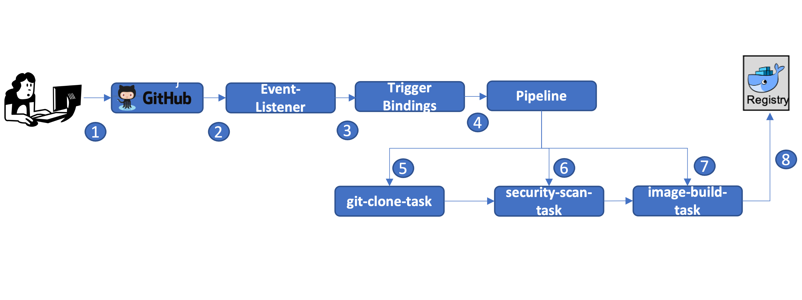

# TEP-0084: end-to-end provenance collection

<!--
**Note:** When your TEP is complete, all of these comment blocks should be removed.

```
<<[UNRESOLVED optional short context or usernames ]>>
Stuff that is being argued.
<<[/UNRESOLVED]>>
```
-->

<!-- toc -->
- [Summary](#summary)
- [Motivation](#motivation)
  - [Goals](#goals)
  - [Non-Goals](#non-goals)
  - [Use Cases](#use-cases)
- [Requirements](#requirements)
- [Proposal](#proposal)
      - [1. Event Signing Interface](#1-event-signing-interface)
      - [2. Provenance for pipelinerun](#2-provenance-for-pipelinerun)
      - [3. Attestation Format](#3-attestation-format)
  - [Notes/Caveats (optional)](#notescaveats-optional)
  - [Risks and Mitigations](#risks-and-mitigations)
  - [User Experience (optional)](#user-experience-optional)
  - [Performance (optional)](#performance-optional)
- [Design Details](#design-details)
- [Test Plan](#test-plan)
- [Design Evaluation](#design-evaluation)
- [Drawbacks](#drawbacks)
- [Alternatives](#alternatives)
- [Infrastructure Needed (optional)](#infrastructure-needed-optional)
- [Upgrade &amp; Migration Strategy (optional)](#upgrade--migration-strategy-optional)
- [Implementation Pull request(s)](#implementation-pull-requests)
- [References (optional)](#references-optional)
<!-- /toc -->

## Summary

As we are designing and building supply chain security solutions, one of the critical requirement is to be able to to capture attestable provenance for every action from code --> container. And our CICD pipelines are biggest part within this spectrum of code --> container. In this proposal, we are presenting some ideas around achieving them in comprehensive manner.

There is some existing great work being done with ["tektoncd/chains"](https://github.com/tektoncd/chains). The objective in this proposal is to build technologies that complement and extends "chains".


## Motivation

Let's consider a simple CI workflow shown below:



With "chains", we are able to capture the signed provenance for individual `taskruns`, that includes  input parameters, image/command used for execution and output results. If we query provenance for the output `image`, we only get the record for `image-build` task with input parameter telling us that `image` was build from `clone-dir` path. But, we do not get or link provenance across multiple tasks in the pipeline, such that we can attest end-to-end.


### Goals

* Allow automated attestation of pipeline execution from event-trigger to completion
* Attestation records are captured in popular formats like "in-toto"
* These record(s) are automatically signed  and pushed to different storage backends (same techniques that chains employed)
* The attestation record(s) for pipeline execution are self-contained to perform independent provenance audit
* The attestation process is transparent to the user, in the sense user do not need to change their pipeline. However, changes to the pipeline and/or task definition may be required to comply with expected format

### Non-Goals

* Ensure performance impact on pipeline execution is minimum
* Any failure in the controller does not impact pipeline execution
* All the verifications/enforcements during pipeline execution are currently out-of-scope (possibly should be addressed by separate pipeline admission controller)
* Attest volumes and workspaces. Given that `taskrun` attestations also do not provide this information, a separate TEP is suggested to both narrow the scope of this TEP and ensure attesting volumes and workspaces is given the required focus.

### Use Cases

1. **Deploy images built from a trusted pipeline.** As the maintainer of a containerized application, I want to verify that all the steps involved in building a container image have been performed by trusted operations. By attesting `pipelineruns`, all the tasks involved in building the container image are visible in a centralized location. It becomes obvious if a non-vetted task, e.g. `inject-miner`, was involved in building the container image.

## Requirements

<!--
Describe constraints on the solution that must be met. Examples might include
performance characteristics that must be met, specific edge cases that must
be handled, or user scenarios that will be affected and must be accomodated.
-->

* Must be possible to automatically attest `pipelineruns`
* `pipelinerun` attestation must include parameters and results from `pipelinerun` and each of its `taskrun`

<!--
TODO: Add requirements for event-payload
-->

## Proposal

In this proposal, we are suggesting following extensions for an end-to-end and comprehensive provenance:

##### 1. Event Signing Interface
As the event-payload is received by the `EventListener`, we need an interface to introspect/query payload so we can sign it from the controller.

##### 2. Provenance for pipelinerun
In addition to individual `taskruns`, we collect the attestation for `pipelineruns`. This would allow us to attest: (a) list of all tasks executed in the pipelines (b) order in which these tasks were executed (c) list of parameters shared across tasks.

Chains supports two attestation formats for `taskruns`: `tekton` and `in-toto`. Both must be supported for `pipelineruns` attestations.

The `tekton` format is simply the `Status` of a `taskrun`. Similarly, for `pipelineruns`, this should also be the `Status` of the `pipelinerun`.

The `in-toto` format created by chains wraps the [SLSA Provenance v0.2](https://slsa.dev/provenance/v0.2) attestation format. The `in-toto` attestation itself should be the same for `taskruns` and `pipelineruns`. The `SLSA Provenance` attestation requires special attention:

* **subject**: For `taskruns`, Chains processes the `taskrun` results and resources to determine which images were built then use this information to populate this field. For `pipelineruns`, Chains must instead process the `pipelinerun` results. Pipeline authors can easily set `pipelinerun` results based on `taskrun` results, allowing them to more easily use existing Tasks that do not conform to Chains type hinting while keeping the Chains implementation simpler (no deep inspection). Given that resources are deprecated, further support should not be added.
* **predicate.buildType**: Chains sets this value to `https://tekton.dev/attestations/chains@v2` for `taskruns` attestations. In order to facilitate consumption, a different value should be used: `https://tekton.dev/attestations/chains/pipelinerun@v2`.
* **predicate.invocation**: For `taskruns`, Chains populates this object with the task parameters. Similarly, Chains must populate this object with `pipelinerun` parameters. Default parameters must also be added.
* **predicate.buildConfig**: For `taskruns`, Chains creates an object with a single attribute, `steps`, which corresponds to all the steps within the `taskrun`. For `pipelineruns`, Chains must instead set the attribute `tasks` which is an array of objects representing each `taskrun` in the `pipelinerun`. Notice that skipped tasks are not represented in the attestation since they do not contribute to builiding the image. Each object contains following attributes:
  * **name**: The name of the `pipelinetask` within the `pipelinerun`.
  * **after**: The name of the `pipelinetask` within the `pipelinerun` that was configured to be executed prior to this `taskrun`. If none, this field is omitted. The list of tasks in `predicate.buildConfig.tasks` is sorted by execution time. However, `taskruns` within a `pipelinerun` can be executed in parallel. This field helps reconstruct the multi-dimensional execution order of `taskruns`.
  * **status**: Either "Succeeded" or "Failed".
  * **ref.kind**: Either `ClusterTask` or `Task`.
  * **ref.name**: The name of the `task` within the k8s cluster or within the Tekton Bundle.
  * **ref.bundle**: Reference to the Tekton Bundle defining the task, or omitted if a Tekton Bundle was not used.
  * **startedOn**: When the `taskrun` started.
  * **finishedOn**: When the `taskrun` finished.
  * **steps**: The same information found in the `predicate.buildConfig.steps` of a `taskrun` attestation.
  * **invocation**: The same information found in the `predicate.invocation` of a `taskrun` attestation. This is needed to ensure default parameters on the task are visible in the attestation. It also maps pipeline parameters to task parameters.
  * **results**: An array of objects representing the results of a `taskrun`. Each object contains the attribute `name` and `value`. Their values are of type string. `taskrun` results are important in the context of a `pipelinerun` because `taskrun` results may be used by other tasks, thus impacting the output of the `pipelinerun`.
* **predicate.materials**: For `taskruns`, Chains populates this object based on specially named task parameters or results, i.e. `CHAINS-GIT_COMMIT` and `CHAINS-GIT_URL`. Similarly, Chains must populate this object with the corresponding pipeline parameters or results.


##### 3. Attestation Format
(As an optimizion option) Instead of creating seperate attestation records for `taskrun`, `pipelinerun`, `event-payload`, create a single attestation record at the "end" of a `pipelinerun` that includes everything.

In our running example above, with this changes, for a given `image` we can attest that:
1.  A pipeline was trigger by event with attested payload
2. In the pipeline, 3 tasks were execure in this order: "git-clone" --> "security-scan" --> "image-build".
3. The "image" was built from "clone-repo" dirpath, which was populated by "git-clone" task from {repo-url, revision} which match the signed event-payload.

These attestations help audit/validate our pipeline executions for:

1. A pipeline was trigger by authorized event
2. The source of input parameters to our tasks. In our example the source was an event-payload, but it could be configuration resources as well.
3. List and order of all tasks performed in the pipeline

### Notes/Caveats (optional)

<!--
What are the caveats to the proposal?
What are some important details that didn't come across above.
Go in to as much detail as necessary here.
This might be a good place to talk about core concepts and how they relate.
-->

### Risks and Mitigations

<!--
What are the risks of this proposal and how do we mitigate. Think broadly.
For example, consider both security and how this will impact the larger
kubernetes ecosystem.

How will security be reviewed and by whom?

How will UX be reviewed and by whom?

Consider including folks that also work outside the WGs or subproject.
-->

### User Experience (optional)

<!--
Consideration about the user experience. Depending on the area of change,
users may be task and pipeline editors, they may trigger task and pipeline
runs or they may be responsible for monitoring the execution of runs,
via CLI, dashboard or a monitoring system.

Consider including folks that also work on CLI and dashboard.
-->

### Performance (optional)

<!--
Consideration about performance.
What impact does this change have on the start-up time and execution time
of task and pipeline runs? What impact does it have on the resource footprint
of Tekton controllers as well as task and pipeline runs?

Consider which use cases are impacted by this change and what are their
performance requirements.
-->

## Design Details

<!--
This section should contain enough information that the specifics of your
change are understandable.  This may include API specs (though not always
required) or even code snippets.  If there's any ambiguity about HOW your
proposal will be implemented, this is the place to discuss them.

If it's helpful to include workflow diagrams or any other related images,
add them under "/teps/images/". It's upto the TEP author to choose the name
of the file, but general guidance is to include at least TEP number in the
file name, for example, "/teps/images/NNNN-workflow.jpg".
-->

## Test Plan

<!--
**Note:** *Not required until targeted at a release.*

Consider the following in developing a test plan for this enhancement:
- Will there be e2e and integration tests, in addition to unit tests?
- How will it be tested in isolation vs with other components?

No need to outline all of the test cases, just the general strategy.  Anything
that would count as tricky in the implementation and anything particularly
challenging to test should be called out.

All code is expected to have adequate tests (eventually with coverage
expectations).
-->

## Design Evaluation
<!--
How does this proposal affect the reusability, simplicity, flexibility
and conformance of Tekton, as described in [design principles](https://github.com/tektoncd/community/blob/master/design-principles.md)
-->

## Drawbacks

<!--
Why should this TEP _not_ be implemented?
-->

## Alternatives

<!--
What other approaches did you consider and why did you rule them out?  These do
not need to be as detailed as the proposal, but should include enough
information to express the idea and why it was not acceptable.
-->

## Infrastructure Needed (optional)

<!--
Use this section if you need things from the project/SIG.  Examples include a
new subproject, repos requested, github details.  Listing these here allows a
SIG to get the process for these resources started right away.
-->

## Upgrade & Migration Strategy (optional)

<!--
Use this section to detail wether this feature needs an upgrade or
migration strategy. This is especially useful when we modify a
behavior or add a feature that may replace and deprecate a current one.
-->

## Implementation Pull request(s)

<!--
Once the TEP is ready to be marked as implemented, list down all the Github
Pull-request(s) merged.
Note: This section is exclusively for merged pull requests, for this TEP.
It will be a quick reference for those looking for implementation of this TEP.
-->

## References (optional)

<!--
Use this section to add links to GitHub issues, other TEPs, design docs in Tekton
shared drive, examples, etc. This is useful to refer back to any other related links
to get more details.
-->
