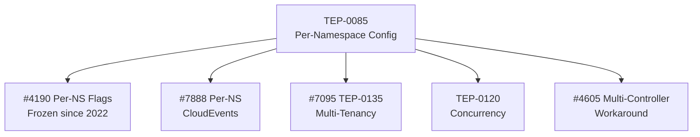
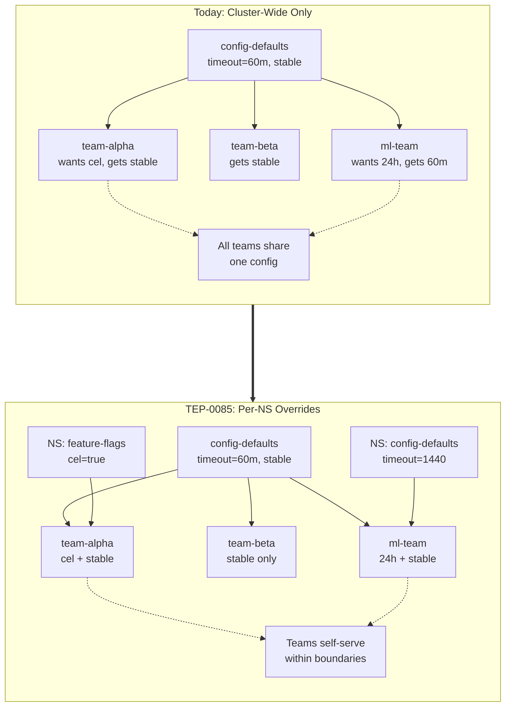
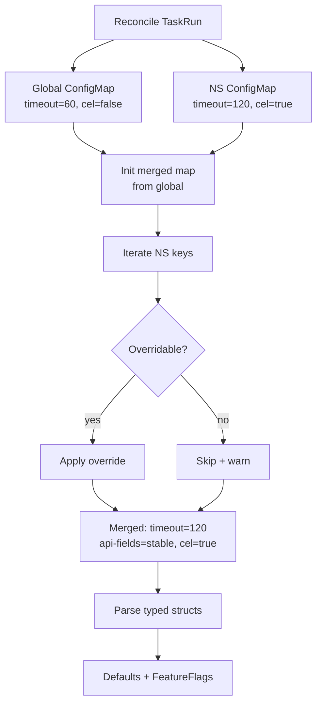
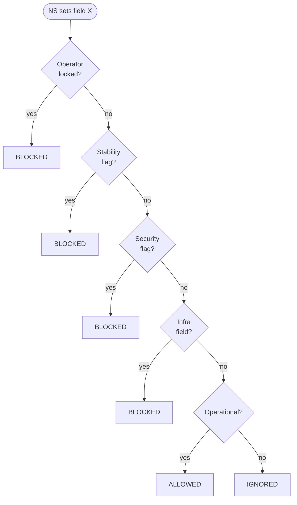
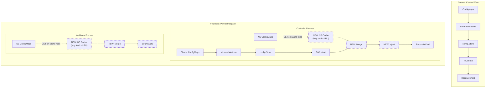
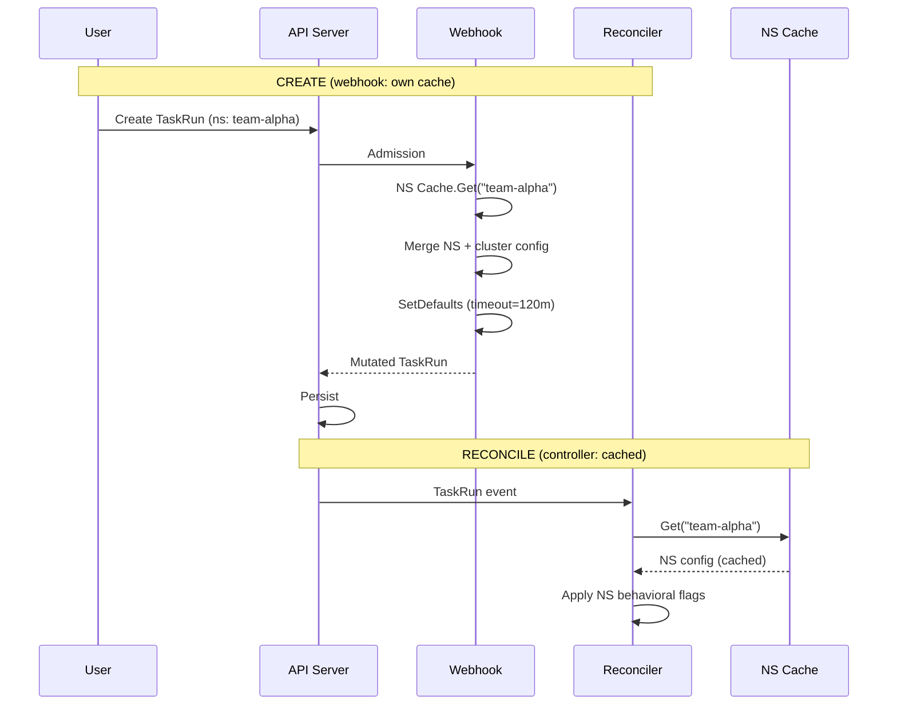

# TEP-0085: Per-Namespace Controller Configuration

<!-- toc -->
- [Summary](#summary)
- [Motivation](#motivation)
- [Goals](#goals)
- [Non-Goals](#non-goals)
- [Requirements](#requirements)
- [Use Cases](#use-cases)
  - [Gradual Migration](#gradual-migration)
  - [Flexible Configuration](#flexible-configuration)
  - [Thorough Testing](#thorough-testing)
  - [Multi-Tenant Clusters](#multi-tenant-clusters)
- [Proposal](#proposal)
  - [Overview](#overview)
  - [Namespace ConfigMap Discovery](#namespace-configmap-discovery)
  - [Operator Control via per-namespace-configuration](#operator-control-via-per-namespace-configuration)
  - [Configuration Hierarchy and Merging](#configuration-hierarchy-and-merging)
  - [Overridable Fields](#overridable-fields)
    - [config-defaults Fields](#config-defaults-fields)
    - [feature-flags Fields](#feature-flags-fields)
  - [Security Considerations](#security-considerations)
  - [Displaying Merged Configuration](#displaying-merged-configuration)
- [Design Details](#design-details)
  - [Namespace ConfigMap Informer](#namespace-configmap-informer)
  - [Config Merging Implementation](#config-merging-implementation)
  - [Webhook Defaulting Interaction](#webhook-defaulting-interaction)
  - [Validation](#validation)
  - [Impact on Existing Resources](#impact-on-existing-resources)
  - [Impact on Resource Types](#impact-on-resource-types)
- [Design Evaluation](#design-evaluation)
  - [Pros](#pros)
  - [Cons](#cons)
  - [Risks and Mitigations](#risks-and-mitigations)
  - [Prior Art](#prior-art)
    - [Namespace-Scoped Configuration Patterns](#namespace-scoped-configuration-patterns)
    - [Projects That Chose Cluster-Only Configuration](#projects-that-chose-cluster-only-configuration)
- [Alternatives](#alternatives)
  - [Environment Variable Approach (PR #607)](#environment-variable-approach-pr-607)
  - [Namespace Annotations](#namespace-annotations)
  - [Per-TaskRun/PipelineRun Configuration](#per-taskrunpipelinerun-configuration)
  - [CRD-Based Configuration](#crd-based-configuration)
  - [Multiple Controller Instances](#multiple-controller-instances)
  - [Centralized Configuration Model](#centralized-configuration-model)
- [Test Plan](#test-plan)
  - [Unit Tests](#unit-tests)
  - [Integration Tests](#integration-tests)
  - [CI Testing Matrix](#ci-testing-matrix)
- [Implementation Plan](#implementation-plan)
  - [Milestones](#milestones)
- [Future Work](#future-work)
- [References](#references)
<!-- /toc -->

## Summary

This TEP proposes support for overriding Tekton Pipelines' configuration on a per-namespace basis. It builds on the original problem statement (merged in [PR #506](https://github.com/tektoncd/community/pull/506)) and incorporates reviewer feedback from the proposal [PR #607](https://github.com/tektoncd/community/pull/607), which was closed without the feedback being addressed.

The design uses namespace-scoped ConfigMaps discovered via labels. A `per-namespace-configuration` field in the cluster-wide `feature-flags` ConfigMap gates whether namespace overrides are honored, giving cluster operators explicit control over the feature. The proposal defines a field-by-field categorization of which config fields are overridable per namespace and which are cluster-only.

This TEP introduces:

- `per-namespace-configuration` field in the cluster `feature-flags` ConfigMap (`true` or `false`)
- `namespace-config-cache-size` field for tuning the namespace config LRU cache
- `non-overridable-fields` field for operator lockdown
- Namespace ConfigMaps (`tekton-config-defaults`, `tekton-feature-flags`) discovered by label

**Cluster-level `feature-flags` ConfigMap** (new fields added by this TEP):

```yaml
apiVersion: v1
kind: ConfigMap
metadata:
  name: feature-flags
  namespace: tekton-pipelines
data:
  per-namespace-configuration: "true"                   # default: "false"
  namespace-config-cache-size: "1000"             # default: 1000
  non-overridable-fields: "coschedule,enable-step-actions"  # optional operator lockdown
  # ... existing feature flags ...
```

**Namespace-level ConfigMap** (created by namespace administrators):

```yaml
apiVersion: v1
kind: ConfigMap
metadata:
  name: tekton-feature-flags
  namespace: team-alpha
  labels:
    app.kubernetes.io/part-of: tekton-pipelines
    tekton.dev/pipeline-config: "true"
data:
  enable-cel-in-whenexpression: "true"
```

## Motivation

As of February 2026, Tekton Pipelines' configuration is entirely cluster-wide. All ConfigMaps (`config-defaults`, `feature-flags`, etc.) reside in the `tekton-pipelines` namespace and apply uniformly to every namespace in the cluster. This forces binary rollouts of behavioral changes: organizations hosting multiple teams must migrate everybody at once, and individual teams cannot test backwards-incompatible flags without their own cluster. Multi-tenant setups cannot assign different service accounts, timeouts, pod templates, or feature flags per namespace.

TEP-0085 is a dependency for multiple long-standing feature requests:

- **[tektoncd/pipeline#4190](https://github.com/tektoncd/pipeline/issues/4190)** (Per-Namespace Feature Flags), frozen since 2022 waiting for a per-namespace configuration mechanism.
- **[tektoncd/pipeline#7095](https://github.com/tektoncd/pipeline/issues/7095)** (TEP-0135 multi-tenancy gap), requires per-namespace `coschedule` settings for tenant isolation.
- **[TEP-0120](https://github.com/tektoncd/community/blob/main/teps/0120-canceling-concurrent-pipelineruns.md)** (Canceling Concurrent PipelineRuns), references TEP-0085 for per-namespace concurrency control.
- **[tektoncd/pipeline#7888](https://github.com/tektoncd/pipeline/issues/7888)** (Per-Namespace CloudEvents), requires per-namespace CloudEvents sink configuration.
- **[tektoncd/pipeline#4605](https://github.com/tektoncd/pipeline/issues/4605)** (Multiple Controller Instances), the heavyweight workaround TEP-0085 replaces.

The following diagram illustrates how TEP-0085 serves as a foundation piece that unblocks multiple dependent proposals and feature requests:



## Goals

- Operators can opt in to allowing configuration overrides per namespace using a cluster-level gate.
- Namespace administrators can create ConfigMaps in their namespace to override specific, operator-approved configuration fields.
- The design requires no controller restart when new namespaces want overrides.
- The design aligns with [TEP-0138](https://github.com/tektoncd/community/blob/main/teps/0138-decouple-api-and-feature-versioning.md)'s per-feature flag model.
- Operators can lock specific configuration fields as non-overridable.

## Non-Goals

- Per-TaskRun or per-PipelineRun configuration overrides. Namespace-level is the granularity targeted by this TEP. Per-run overrides are deferred to [Future Work](#future-work).
- Overriding `config-logging`, `config-observability`, or `config-registry-cert` ConfigMaps per namespace. These are controller-level concerns that do not vary per user workload.
- Automatic migration of existing resources when namespace configuration changes.
- Tekton Operator integration specifics (the Operator can adopt this pattern, but its implementation is out of scope).

## Requirements

- Operator can enable or disable per-namespace configuration overrides at the cluster level.
- Namespace administrators can specify configuration overrides without modifying the controller deployment or requiring controller restarts.
- ConfigMap discovery must be efficient and scale to clusters with many namespaces.
- The design must work with [TEP-0138](https://github.com/tektoncd/community/blob/main/teps/0138-decouple-api-and-feature-versioning.md)'s per-feature flags.
- Operators must be able to restrict which fields can be overridden per namespace.
- Users must be able to inspect the resolved (merged) configuration for a given namespace.

## Use Cases

| Section | Summary |
|---------|---------|
| [Gradual Migration](#gradual-migration) | Operator enables a flag per namespace so teams can opt in individually |
| [Flexible Configuration](#flexible-configuration) | Different service accounts, timeouts, pod templates per tenant |
| [Thorough Testing](#thorough-testing) | Test behavioral changes in isolated namespaces without separate clusters |
| [Multi-Tenant Clusters](#multi-tenant-clusters) | Platform team applies different defaults per team namespace |

### Gradual Migration

As an operator, I need to gradually migrate functionality by enabling users and teams to opt in to new functionality over time before the migration is complete. For example, I want to enable `enable-cel-in-whenexpression` for the `team-alpha` namespace while keeping it disabled cluster-wide, so that team can validate their pipelines before a broader rollout.

As a user, I need to migrate to and use new functionality in my namespace before the feature is enabled across the cluster.

### Flexible Configuration

As an operator, I need to apply customized configuration for a given namespace in my cluster, such as a different default service account, different timeout defaults, or different pod template settings for specific tenants.

### Thorough Testing

As a contributor, I need to test behavioral changes in isolated namespaces to ensure that they work as expected in different configurations, without deploying separate clusters.

### Multi-Tenant Clusters

As a platform team managing a shared Tekton cluster, I need different teams to have different default configurations (service accounts, timeouts, feature flags) based on their security requirements, workload characteristics, and migration readiness.

The following diagram illustrates the difference between today's cluster-wide configuration and the per-namespace override model proposed by this TEP:



## Proposal

| Section | Summary |
|---------|---------|
| [Overview](#overview) | Four-component design: ConfigMaps, gate, merging, field categorization |
| [Namespace ConfigMap Discovery](#namespace-configmap-discovery) | Label-based discovery, ConfigMap naming conventions |
| [Operator Control via per-namespace-configuration](#operator-control-via-per-namespace-configuration) | Cluster-level gate: `false` (default) or `true` |
| [Configuration Hierarchy and Merging](#configuration-hierarchy-and-merging) | Three-level precedence, raw map merge before parsing |
| [Overridable Fields](#overridable-fields) | Field-by-field categorization for config-defaults and feature-flags |
| [Security Considerations](#security-considerations) | Six safeguards: opt-in, non-overridable fields, RBAC, system NS exclusion |
| [Displaying Merged Configuration](#displaying-merged-configuration) | Annotation, logs, and future CLI for config inspection |

### Overview

This proposal introduces namespace-scoped ConfigMaps that override the cluster-wide Tekton Pipelines configuration on a per-namespace basis. The design consists of four components:

1. **Namespace ConfigMaps**: ConfigMaps in user namespaces, discovered via labels, containing per-namespace overrides for `config-defaults` and `feature-flags`.
2. **`per-namespace-configuration`**: A boolean field in the cluster-wide `feature-flags` ConfigMap that gates whether namespace overrides are honored.
3. **Config merging**: Field-by-field merge at the typed Go struct level, with precedence: namespace ConfigMap > cluster ConfigMap > hardcoded defaults.
4. **Overridable field categorization**: An explicit list of which fields can be overridden per namespace and which are cluster-only.

### Namespace ConfigMap Discovery

Namespace-scoped ConfigMaps are discovered using a **label-based approach** modeled after [Tekton Pruner](https://github.com/tektoncd/pruner). This pattern is proven in production within the Tekton ecosystem and avoids the controller restart and scalability issues identified in [PR #607](https://github.com/tektoncd/community/pull/607) review feedback.

**Namespace ConfigMap naming:**

| Cluster-wide ConfigMap | Namespace ConfigMap Name | Purpose |
|------------------------|--------------------------|---------|
| `config-defaults` | `tekton-config-defaults` | Override default values (timeouts, service accounts, etc.) |
| `feature-flags` | `tekton-feature-flags` | Override feature flag settings |

The `tekton-` prefix avoids naming collisions with user ConfigMaps, per [feedback from @vdemeester](https://github.com/tektoncd/community/pull/607).

**Required labels for namespace ConfigMaps:**

```yaml
labels:
  app.kubernetes.io/part-of: tekton-pipelines
  tekton.dev/pipeline-config: "true"
```

Both labels must be present for a ConfigMap to be recognized as a namespace-level configuration override:

| Label | Purpose |
|-------|---------|
| `app.kubernetes.io/part-of: tekton-pipelines` | Identifies this resource as belonging to Tekton Pipelines. This is a [Kubernetes recommended label](https://kubernetes.io/docs/concepts/overview/working-with-objects/common-labels/) used across the Tekton ecosystem for consistent tooling and queries. |
| `tekton.dev/pipeline-config: "true"` | Marks this ConfigMap as a pipeline controller configuration override. Scoped to the pipeline controller, leaving room for other Tekton controllers to adopt similar patterns with their own labels. |

**Example: Namespace feature-flags override**

```yaml
apiVersion: v1
kind: ConfigMap
metadata:
  name: tekton-feature-flags
  namespace: team-alpha
  labels:
    app.kubernetes.io/part-of: tekton-pipelines
    tekton.dev/pipeline-config: "true"
data:
  enable-cel-in-whenexpression: "true"
  coschedule: "isolate-pipelinerun"
```

**Example: Namespace config-defaults override**

```yaml
apiVersion: v1
kind: ConfigMap
metadata:
  name: tekton-config-defaults
  namespace: team-alpha
  labels:
    app.kubernetes.io/part-of: tekton-pipelines
    tekton.dev/pipeline-config: "true"
data:
  default-service-account: "team-alpha-sa"
  default-timeout-minutes: "120"
```

### Operator Control via per-namespace-configuration

A new field `per-namespace-configuration` is added to the cluster-wide `feature-flags` ConfigMap:

```yaml
apiVersion: v1
kind: ConfigMap
metadata:
  name: feature-flags
  namespace: tekton-pipelines
data:
  per-namespace-configuration: "false"  # default: "false"
  namespace-config-cache-size: "1000"  # default: 1000
  # ... existing feature flags ...
```

| Field | Default | Description |
|-------|---------|-------------|
| `per-namespace-configuration` | `false` | `false`: namespace ConfigMaps ignored (backward compatible). `true`: namespace ConfigMaps discovered and merged. |
| `namespace-config-cache-size` | `1000` | Max number of namespace configs held in the LRU cache. Tune for clusters with many namespaces. |

By defaulting to `false`, this feature is entirely opt-in and introduces no behavioral change for existing installations.

Based on [feedback from @vdemeester](https://github.com/tektoncd/community/pull/607), this uses a ConfigMap field instead of an environment variable, eliminating the need for controller restarts.

### Configuration Hierarchy and Merging

When `per-namespace-configuration` is set to `true`, configuration is resolved using the following precedence (highest to lowest):

1. **Namespace ConfigMap**: Fields explicitly set in the namespace-scoped ConfigMap
2. **Cluster ConfigMap**: Fields from the cluster-wide ConfigMap in `tekton-pipelines`
3. **Hardcoded defaults**: Built-in defaults in the Tekton Pipelines codebase

Merging happens at the **raw `map[string]string` level** before parsing into typed Go structs. This approach is necessary because the existing [`FeatureFlags` struct](https://github.com/tektoncd/pipeline/blob/main/pkg/apis/config/feature_flags.go#L182-L213) uses raw `bool` types, which cannot distinguish between "explicitly set to false" and "not set" after parsing. By merging at the ConfigMap data level, the implementation preserves the ability to detect which fields are present in the namespace override.

```go
// Merge strategy: raw map merge, then single parse call
func MergeConfigMaps(globalData, namespaceData map[string]string, overridableFields []string) map[string]string {
    merged := make(map[string]string)
    // Start with global config
    for k, v := range globalData {
        merged[k] = v
    }
    // Override with namespace config for allowed fields only
    for k, v := range namespaceData {
        if isOverridable(k, overridableFields) {
            merged[k] = v
        }
    }
    return merged
}

// After merging, parse once
mergedData := MergeConfigMaps(globalConfigMap.Data, namespaceConfigMap.Data, allowedOverrides)
mergedDefaults := config.NewDefaultsFromMap(mergedData)
mergedFeatureFlags := config.NewFeatureFlagsFromMap(mergedData)
```

This raw map merge delegates to the existing [`NewDefaultsFromMap`](https://github.com/tektoncd/pipeline/blob/main/pkg/apis/config/default.go#L141) and [`NewFeatureFlagsFromMap`](https://github.com/tektoncd/pipeline/blob/main/pkg/apis/config/feature_flags.go#L225) parsing functions, ensuring consistency with cluster-wide config parsing and avoiding refactoring of the `FeatureFlags` struct to use pointer types.

The following diagram illustrates the merge algorithm step-by-step, including how security fields are protected and concrete examples of field-level merge outcomes:



### Overridable Fields

Not all configuration fields should be overridable per namespace. Fields are categorized as **overridable** (namespace administrators may set these) or **cluster-only** (only cluster operators may set these). The categorization is based on whether a field affects user workload behavior (overridable) or controller/infrastructure behavior (cluster-only).

#### config-defaults Fields

| Field | Overridable | Rationale |
|-------|:-----------:|-----------|
| `default-service-account` | Yes | Different teams need different service accounts for RBAC |
| `default-timeout-minutes` | Yes | Teams have different workload duration requirements |
| `default-managed-by-label-value` | Yes | Teams may use different management tooling |
| `default-pod-template` | Yes | Teams need different scheduling, tolerations, and node selectors |
| `default-affinity-assistant-pod-template` | Yes | Follows `default-pod-template` pattern |
| `default-task-run-workspace-binding` | Yes | Teams may use different default workspace bindings |
| `default-max-matrix-combinations-count` | Yes | Teams may need different matrix limits based on workload |
| `default-forbidden-env` | No | Security control that operators must enforce cluster-wide |
| `default-resolver-type` | Yes | Teams may prefer different resolver types |
| `default-imagepullbackoff-timeout` | Yes | Teams have different tolerance for image pull issues |
| `default-container-resource-requirements` | Yes | Teams may need different default CPU/memory requests and limits |
| `default-maximum-resolution-timeout` | Yes | Teams may need different resolver timeout thresholds |
| `default-cloud-events-sink` | Yes | Teams may route CloudEvents to different sinks (deprecated, see `config-events`) |
| `default-sidecar-log-polling-interval` | No | Controller infrastructure concern, affects sidecar log result extraction timing |
| `default-step-ref-concurrency-limit` | No | Controller infrastructure concern, affects how many StepAction resolutions happen concurrently |

#### feature-flags Fields

| Field | Overridable | Rationale |
|-------|:-----------:|-----------|
| `disable-creds-init` | No | Security-sensitive, disabling credential initialization has security implications |
| `running-in-environment-with-injected-sidecars` | Yes | Namespaces may have different sidecar injection policies |
| `await-sidecar-readiness` | Yes | Operational, controls whether steps wait for sidecars to become ready before starting |
| `require-git-ssh-secret-known-hosts` | Yes | Teams may have different Git SSH policies |
| `enable-api-fields` | No | Security-sensitive, namespace admin could escalate from stable to alpha, bypassing cluster stability controls |
| `send-cloudevents-for-runs` | Yes | Teams may have different CloudEvents requirements |
| `enforce-nonfalsifiability` | No | Security-critical, operators must enforce cluster-wide |
| `enable-provenance-in-status` | Yes | Teams may want different provenance settings |
| `results-from` | No | Controller infrastructure concern (sidecar log vs termination message) |
| `max-result-size` | Yes | Teams have different result size requirements |
| `set-security-context` | No | Security-critical, operators must enforce cluster-wide |
| `coschedule` | Yes | Teams may need different pod scheduling strategies. **Note:** operators using `isolate-pipelinerun` for workload isolation should add `coschedule` to `non-overridable-fields` to prevent namespace admins from disabling the isolation guarantee. |
| `keep-pod-on-cancel` | Yes | Teams may want different cancel behavior for debugging |
| `enable-cel-in-whenexpression` | Yes* | Gradual migration use case (gated by cluster stability level) |
| `enable-step-actions` | Yes* | Gradual migration use case (gated by cluster stability level) |
| `enable-artifacts` | Yes* | Gradual migration use case (gated by cluster stability level) |
| `enable-param-enum` | Yes* | Gradual migration use case (gated by cluster stability level) |
| `disable-inline-spec` | Yes | Teams may have different inline spec policies |
| `trusted-resources-verification-no-match-policy` | No | Security-critical, operators must enforce cluster-wide |
| `enable-concise-resolver-syntax` | Yes | Teams may prefer different resolver syntax |
| `set-security-context-read-only-root-filesystem` | No | Security-critical, operators must enforce cluster-wide |
| `enable-kubernetes-sidecar` | Yes | Teams may need different sidecar implementation behavior |
| `enable-wait-exponential-backoff` | Yes | Teams may need different retry backoff behavior |
| `namespace-config-cache-size` | No | Controller infrastructure concern, controls max cached namespace configs (default: 1000) |
| Per-feature flags (TEP-0138 style) | Yes* | Each per-feature flag is overridable within the stability envelope set by the cluster's `enable-api-fields` |

**Note on per-feature flags:** Flags marked with `*` are overridable but subject to a stability gate. A namespace cannot enable an alpha-stability feature if the cluster-wide `enable-api-fields` is set to `stable` or `beta`. The namespace config can only enable features within the allowed stability level, preventing privilege escalation where namespace admins bypass cluster-wide stability controls.

**Operator-lockable fields:** Fields marked "No" in the table above cannot be overridden per namespace under any circumstances. Additionally, operators may further restrict the set of overridable fields by specifying a `non-overridable-fields` key in the cluster-wide `feature-flags` ConfigMap:

```yaml
apiVersion: v1
kind: ConfigMap
metadata:
  name: feature-flags
  namespace: tekton-pipelines
data:
  per-namespace-configuration: "true"
  non-overridable-fields: "enable-api-fields,coschedule,enable-step-actions"
```

This allows operators to lock down additional fields beyond the built-in cluster-only set without requiring code changes.

### Security Considerations

Per-namespace configuration introduces a privilege boundary: namespace administrators can influence how the Tekton controller processes resources in their namespace. The following safeguards are built into the design:

1. **Opt-in only:** The feature is disabled by default (`per-namespace-configuration: false`). Operators must explicitly enable it.

2. **Non-overridable security fields:** Fields that affect security posture (`enforce-nonfalsifiability`, `set-security-context`, `trusted-resources-verification-no-match-policy`, `default-forbidden-env`) cannot be overridden per namespace regardless of the `per-namespace-configuration` value.

3. **Operator-lockable fields:** The `non-overridable-fields` key allows operators to lock additional fields, adapting the allowed overrides to their organizational security policies.

4. **RBAC enforcement:** Creating ConfigMaps in a namespace requires the `create` verb on `configmaps` in that namespace. Existing Kubernetes RBAC controls who can create namespace ConfigMaps. No additional RBAC resources are introduced.

5. **System namespace exclusion:** The controller will ignore namespace ConfigMaps in the `tekton-pipelines` namespace itself and any namespace listed in a `system-namespaces` key in the cluster-wide `feature-flags` ConfigMap. By default, `kube-system`, `kube-public`, and `tekton-pipelines` are excluded.

6. **Validation:** Namespace ConfigMaps containing non-overridable fields or invalid values will be rejected with a warning event on the ConfigMap, and the non-overridable fields will be ignored (the cluster value is used instead).

The following diagram illustrates the multi-gate security model that determines whether a namespace can override a given configuration field:



### Displaying Merged Configuration

To address [feedback from @pritidesai](https://github.com/tektoncd/community/pull/607) about easy access to resolved configuration, the following mechanisms are provided:

1. **Status annotation on runs:** When `per-namespace-configuration` is `true`, TaskRun and PipelineRun objects will have an annotation `tekton.dev/resolved-config-source` indicating whether namespace-level config was applied:

```yaml
annotations:
  tekton.dev/resolved-config-source: "namespace:team-alpha"
```

2. **Controller logs:** The controller will log at INFO level when namespace configuration is applied, including which fields were overridden:

```
Applying namespace config for "team-alpha": overriding default-service-account, default-timeout-minutes
```

3. **Future work:** A `tkn` CLI command to display the resolved configuration for a namespace (see [Future Work](#future-work)).

## Design Details

| Section | Implements | Summary |
|---------|------------|---------|
| [Namespace ConfigMap Informer](#namespace-configmap-informer) | [Namespace ConfigMap Discovery](#namespace-configmap-discovery) | Lazy LRU cache per process (controller + webhook). |
| [Config Merging Implementation](#config-merging-implementation) | [Configuration Hierarchy and Merging](#configuration-hierarchy-and-merging) | Reconciliation flow with merged config injected into context |
| [Webhook Defaulting Interaction](#webhook-defaulting-interaction) | CREATE-time defaults | Namespace-aware SetDefaults, no Knative vendor changes needed |
| [Validation](#validation) | [Security Considerations](#security-considerations) | Unknown keys, invalid values, non-overridable fields, non-fatal errors |
| [Impact on Existing Resources](#impact-on-existing-resources) | mid-flight behavior | New/in-flight/completed resource behavior on config change |
| [Impact on Resource Types](#impact-on-resource-types) | resource coverage | TaskRun, PipelineRun, CustomRun handling |

### Namespace ConfigMap Informer

Namespace configuration is discovered using **lazy per-namespace loading**: the controller fetches and caches namespace ConfigMaps on first access rather than listing all of them at startup.

**Why lazy loading over a cluster-wide informer:**

A cluster-wide label-filtered informer (e.g., Knative's `filteredconfigmapinformer`) would LIST all matching ConfigMaps across all namespaces at startup and maintain a single WATCH stream. While this is simpler, it has two drawbacks at scale:

1. **Startup cost scales with total namespace configs**, not active namespaces. A cluster with 5000 namespace ConfigMaps pays the full LIST cost even if only 50 namespaces have active workloads.
2. **Memory holds configs for idle namespaces.** The cache retains parsed configs for namespaces with no running TaskRuns or PipelineRuns.

Lazy loading avoids both: zero startup LIST cost, and the cache only holds configs for namespaces with active reconciliations.

The controller and webhook are separate processes in Tekton Pipelines (`tekton-pipelines-controller` and `tekton-pipelines-webhook`). They use different strategies for namespace config access:

**Controller (reconciliation path): lazy LRU cache**

The controller is the hot path — it reconciles resources repeatedly. It maintains a `NamespaceConfigCache` with lazy per-namespace loading:

1. On reconciliation, the controller calls `NamespaceConfigCache.Get(namespace)`.
2. On cache miss, a direct `GET` fetches `tekton-config-defaults` and `tekton-feature-flags` from that namespace by name and label.
3. If found, the ConfigMap is parsed and cached. A namespace-scoped WATCH is started for that namespace to receive updates and deletes.
4. On cache hit, the cached config is returned immediately.
5. Namespace-deletion events and LRU eviction (bounded by [`namespace-config-cache-size`](#operator-control-via-per-namespace-configuration)) clean up stale entries. When an entry is evicted, its namespace-scoped WATCH is stopped.

```go
// NamespaceConfigCache holds parsed per-namespace configuration overrides.
// Each process (controller and webhook) maintains its own instance.
// Lazy-loaded on first access per namespace.
// Bounded by namespace-config-cache-size (default: 1000).
// Uses LRU eviction; namespace-deletion events also trigger eviction.
type NamespaceConfigCache struct {
    mu       sync.RWMutex
    configs  map[string]*NamespaceConfig // keyed by namespace name
    maxSize  int                         // from namespace-config-cache-size
}

// NamespaceConfig holds the raw and parsed overrides for a single namespace.
type NamespaceConfig struct {
    // Raw ConfigMap data, used for merge-before-parse strategy
    // to preserve "field present but zero-value" semantics for booleans.
    RawDefaults map[string]string // from tekton-config-defaults
    RawFlags    map[string]string // from tekton-feature-flags

    // Parsed configs, populated after merging raw data with cluster defaults.
    Defaults     *Defaults
    FeatureFlags *FeatureFlags
}
```

On cache hit, the existing parsed structs are returned. On updates or deletes (received via the namespace-scoped WATCH), the entry is re-parsed or removed using the existing [`NewDefaultsFromConfigMap`](https://github.com/tektoncd/pipeline/blob/main/pkg/apis/config/default.go#L268) and [`NewFeatureFlagsFromConfigMap`](https://github.com/tektoncd/pipeline/blob/main/pkg/apis/config/metrics_tls.go#L19) functions.

**Global config change handling:** When the cluster-wide `config-defaults` or `feature-flags` ConfigMap changes (detected by the existing `config.Store` callback), all cached entries in `NamespaceConfigCache` are invalidated but not eagerly recomputed. Each namespace's merged config is recomputed on its next reconciliation, spreading the load across the work queue's natural requeue intervals.

**Webhook (admission path): own `NamespaceConfigCache` instance**

The webhook process maintains its own `NamespaceConfigCache` instance with the same lazy loading and LRU behavior. While this means namespace configs are cached in two processes, the duplication is acceptable: it avoids an API call per admission request and keeps both paths consistently fast. Both caches are independently invalidated on global config changes via their respective `config.Store` callbacks.

No controller restart is required when namespaces add or remove configuration overrides.

### Config Merging Implementation

During reconciliation, the config resolution flow becomes:

```
1. ctx = config.FromContextOrDefaults(ctx)  // existing: loads global config
2. if per-namespace-configuration == "true":
     nsConfig = namespaceConfigCache.Get(resource.Namespace)
     if nsConfig != nil:
       ctx = config.WithMergedConfig(ctx, nsConfig)  // new: merge namespace overrides
3. Continue reconciliation with merged config in context
```

The merge is performed at the Go struct level using the `MergeConfigs` function described in the [Proposal](#configuration-hierarchy-and-merging) section. Non-overridable fields and operator-locked fields are filtered out before merging.

The following diagram compares the current cluster-wide config architecture with the proposed per-namespace extension, highlighting that existing components remain unchanged:



### Webhook Defaulting Interaction

Tekton Pipelines applies defaults to TaskRuns and PipelineRuns at two points:

1. **Admission webhook (CREATE time):** The mutating webhook populates default values (`spec.timeout`, `spec.serviceAccountName`, `spec.podTemplate`) via [`SetDefaults`](https://github.com/tektoncd/pipeline/blob/main/pkg/apis/pipeline/v1/taskrun_defaults.go#L36).
2. **Reconciler (reconciliation time):** The controller reads configuration from context and applies behavioral flags.

Without namespace-aware defaulting, the webhook would write cluster-wide defaults at CREATE time (e.g., `spec.timeout: 60m`), and the reconciler could not override them later. This would limit namespace config to behavioral flags only.

**Resolution: namespace-aware `SetDefaults` (no Knative vendor changes required)**

Investigation of the Knative webhook call chain shows the resource's namespace is available inside `SetDefaults` via `tr.ObjectMeta.Namespace`. The webhook process maintains its own `NamespaceConfigCache` and reads it to merge namespace config into the context before downstream defaults are applied:

```go
func (tr *TaskRun) SetDefaults(ctx context.Context) {
    ctx = apis.WithinParent(ctx, tr.ObjectMeta)

    // Merge namespace-specific config if per-namespace-configuration is true
    if tr.Namespace != "" {
        ctx = config.WithNamespaceOverrides(ctx, tr.Namespace)
    }

    tr.Spec.SetDefaults(ctx)  // sees merged config via config.FromContextOrDefaults(ctx)
    // ...
}
```

This works because:
- The Knative defaulting webhook decodes the `AdmissionRequest` into a typed struct before calling `SetDefaults`, so `tr.ObjectMeta.Namespace` is populated
- [`config.FromContextOrDefaults(ctx)`](https://github.com/tektoncd/pipeline/blob/main/pkg/apis/config/store.go#L53) in `TaskRunSpec.SetDefaults` will see the namespace-merged config
- The same pattern applies to `PipelineRun.SetDefaults` and `CustomRun.SetDefaults`
- No changes to `knative.dev/pkg/webhook` are needed: the `withContext` closure signature (`func(context.Context) context.Context`) remains unchanged

The following diagram shows the namespace-aware defaulting flow:



This eliminates the CREATE-time vs RECONCILE-time conflict. Namespace overrides apply to all config fields (including `default-timeout-minutes`, `default-service-account`, `default-pod-template`) from the initial release.

### Validation

Namespace ConfigMaps are validated when they are parsed:

1. **Unknown keys:** Unknown keys in the ConfigMap data are logged as warnings AND a Kubernetes Event is emitted on the ConfigMap resource, helping namespace administrators catch typos and configuration errors.
2. **Invalid values:** Values that fail parsing (e.g., non-boolean for a boolean field, invalid enum value) cause the entire namespace ConfigMap to be rejected with a warning event. The namespace falls back to cluster defaults. This is because the existing parsing functions ([`NewFeatureFlagsFromMap`](https://github.com/tektoncd/pipeline/blob/main/pkg/apis/config/feature_flags.go#L225-L321), [`NewDefaultsFromMap`](https://github.com/tektoncd/pipeline/blob/main/pkg/apis/config/default.go#L141)) return an error on any invalid field rather than skipping individual fields.
3. **Non-overridable fields:** If a namespace ConfigMap sets a non-overridable field, a warning event is emitted on the ConfigMap and the field is ignored. The cluster value is used instead.
4. **ConfigMap name validation:** Only ConfigMaps named `tekton-config-defaults` and `tekton-feature-flags` with the required labels are processed. Other names are ignored.

**Non-fatal error handling:** Namespace ConfigMap parse errors MUST NOT crash the controller. Unlike cluster-wide ConfigMaps, where parse errors are returned to the Knative configmap watcher (which may cause the controller to fail to start), namespace ConfigMap errors are logged at the error level and the namespace falls back to cluster defaults. This ensures that a malformed namespace ConfigMap affects only that namespace and does not destabilize the controller. Note: the existing parsing functions ([`NewFeatureFlagsFromMap`](https://github.com/tektoncd/pipeline/blob/main/pkg/apis/config/feature_flags.go#L225-L321), [`NewDefaultsFromMap`](https://github.com/tektoncd/pipeline/blob/main/pkg/apis/config/default.go#L141)) fail the entire parse on any invalid field. The namespace config implementation will need a wrapper that catches parse errors and falls back to cluster defaults, rather than relying on per-field error recovery.

**Version skew handling:** If a namespace ConfigMap contains configuration keys not recognized by the current controller version (for example, after a controller downgrade or when a namespace ConfigMap is created with keys from a newer Tekton version), the unrecognized fields are ignored and a warning event is emitted on the ConfigMap. This allows forward compatibility where namespace configurations can be prepared in advance of controller upgrades.

### Impact on Existing Resources

When namespace configuration changes (ConfigMap created, updated, or deleted), the behavior is consistent with how cluster-wide ConfigMap changes work today (per [feedback from @chmouel](https://github.com/tektoncd/community/pull/607)):

- **New resources:** Resources created after the change will use the new merged configuration.
- **In-flight resources:** Resources already being reconciled will pick up the new configuration on their next reconciliation loop. The timing depends on the reconciler's requeue interval.
- **Completed resources:** Already-completed TaskRuns and PipelineRuns are not affected.

This is the same behavior as changing the cluster-wide `feature-flags` or `config-defaults` ConfigMap today. No additional guarantees or protections are introduced for in-flight resources.

### Impact on Resource Types

Per-namespace configuration applies to all resource types that read configuration during reconciliation (per [feedback from @pritidesai](https://github.com/tektoncd/community/pull/607)):

| Resource Type | Impact |
|---------------|--------|
| **TaskRun** | Namespace config applied during TaskRun reconciliation. Affects defaults (service account, timeout), feature flags, and pod template. |
| **PipelineRun** | Namespace config applied during PipelineRun reconciliation. Affects defaults and feature flags. Child TaskRuns inherit the PipelineRun's namespace config. |
| **CustomRun** | Namespace config applied if the custom controller uses `config.FromContextOrDefaults(ctx)`. Third-party controllers must opt in by using the merged config from context. |

## Design Evaluation

| Section | Summary |
|---------|---------|
| [Pros](#pros) | No restart, backward compatible, TEP-0138 aligned, efficient discovery |
| [Cons](#cons) | Additional informer, merge complexity, boolean ambiguity, debugging |
| [Risks and Mitigations](#risks-and-mitigations) | 7 risks (split-brain, escalation, webhook conflict) with mitigations |
| [Prior Art](#prior-art) | ResourceQuota/LimitRange, Prometheus Operator, cert-manager, CoreDNS |

### Pros

- **No controller restart:** Label-based discovery with informers means adding namespace overrides is fully dynamic.
- **Backward compatible:** Defaults to `per-namespace-configuration: false`, so existing installations see no change.
- **Aligns with TEP-0138:** Works with individual per-feature flags, not just the legacy `enable-api-fields`.
- **Granular operator control:** Operators can lock additional fields via `non-overridable-fields`, adapting to their security requirements.
- **Efficient discovery:** Cluster-wide label-selector-filtered informer watches only labeled ConfigMaps, not all ConfigMaps.

### Cons

- **Additional informer:** Adds a cluster-wide ConfigMap informer, increasing the controller's watch surface area.
- **Complexity:** Config resolution adds a merge step during every reconciliation when `per-namespace-configuration` is `true`.
- **Boolean ambiguity:** Requires tracking which fields were present in the raw ConfigMap to distinguish "set to false" from "not set" for boolean fields.
- **Debugging complexity:** When issues arise, users must check both namespace and cluster ConfigMaps to understand the effective configuration.

### Risks and Mitigations

| Risk | Severity | Mitigation |
|------|----------|------------|
| **Split-brain between global and namespace config caches** | HIGH | Flush `NamespaceConfigCache` when `config.Store` detects a [`per-namespace-configuration`](#operator-control-via-per-namespace-configuration) change. Both the reconciler and [`SetDefaults`](#webhook-defaulting-interaction) re-read the level per request. Effective window is watch event latency (<1s typical). |
| **Cold-start latency on first namespace access** | LOW | [Lazy loading](#namespace-configmap-informer) avoids cluster-wide LIST at startup. First reconciliation per namespace pays a one-time `GET` cost (~1-2ms). Subsequent accesses are cache hits. |
| **Thundering herd on global config change** | MEDIUM | [Lazy invalidation](#namespace-configmap-informer): on global config change, invalidate cached entries without eager recomputation. Each namespace's config is recomputed on next reconciliation, spreading load across the work queue's natural requeue intervals. |
| **Unbounded namespace config cache** | MEDIUM | Bounded LRU cache with namespace-deletion eviction and configurable TTL. Cache size configurable via [`namespace-config-cache-size`](#feature-flags-fields) in cluster `feature-flags` (default: 1000). |
| **Malformed namespace ConfigMap crashes controller** | HIGH | Parse errors MUST be non-fatal. Fall back to cluster defaults and emit a warning event on the ConfigMap. See [Validation](#validation). |
| **Namespace feature escalation** | HIGH | [`enable-api-fields`](#feature-flags-fields) is cluster-only. Per-feature flags are gated by the cluster stability level, blocking alpha enablement when cluster restricts to stable. |
| **Webhook defaulting conflict** | RESOLVED | `SetDefaults` reads namespace from `ObjectMeta.Namespace` and reads the webhook's own `NamespaceConfigCache`. No Knative vendor changes. See [Webhook Defaulting Interaction](#webhook-defaulting-interaction). |

### Prior Art

#### Namespace-Scoped Configuration Patterns

| Project | Pattern | Lesson for TEP-0085 |
|---------|---------|---------------------|
| **[ResourceQuota](https://kubernetes.io/docs/concepts/policy/resource-quotas/) / [LimitRange](https://kubernetes.io/docs/concepts/policy/limit-range/)** | Per-namespace resources enforced by admission controllers | Proven at scale, but causes **config sprawl** (Kyverno/OPA tooling needed to keep namespaces consistent) |
| **[Prometheus Operator](https://prometheus-operator.dev/docs/api-reference/api/)** | Label-based cross-namespace CRD discovery (`serviceMonitorNamespaceSelector`) | Validates label-filtered watch as a scalable discovery mechanism |
| **[cert-manager](https://cert-manager.io/) Issuer/ClusterIssuer** | Dual-scope resources (namespace `Issuer` vs cluster `ClusterIssuer`) | Cautionary: persistent user confusion about scope and precedence ([#3217](https://github.com/cert-manager/cert-manager/issues/3217), [#5590](https://github.com/cert-manager/cert-manager/issues/5590), [#6215](https://github.com/cert-manager/cert-manager/issues/6215)). TEP-0085 must make its precedence hierarchy (namespace > cluster > default) unambiguous |

#### Projects That Chose Cluster-Only Configuration

| Project | Pattern | Why cluster-only works for them |
|---------|---------|--------------------------------|
| **[CoreDNS](https://coredns.io/manual/configuration/)** | Cluster-wide Corefile | DNS resolution is uniform across namespaces |
| **[metrics-server](https://kubernetes-sigs.github.io/metrics-server/)** | Cluster-wide config only | Resource metrics collection has no per-tenant variance |
| **[ingress-nginx](https://kubernetes.github.io/ingress-nginx/user-guide/nginx-configuration/configmap/)** | Cluster ConfigMap + [per-resource annotations](https://github.com/kubernetes/ingress-nginx/blob/main/docs/user-guide/nginx-configuration/annotations.md) | Per-resource overrides cover the customization need without per-namespace config |

These projects prioritized simplicity and auditability. Their choices validate that cluster-only config is reasonable when tenants need uniform behavior or when per-resource overrides (which Tekton already supports for timeouts and service accounts) are sufficient.

## Alternatives

| Section | Summary |
|---------|---------|
| [Environment Variable Approach (PR #607)](#environment-variable-approach-pr-607) | Rejected: requires controller restart, doesn't scale |
| [Namespace Annotations](#namespace-annotations) | Rejected: flat strings, requires cluster RBAC |
| [Per-TaskRun/PipelineRun Configuration](#per-taskrunpipelinerun-configuration) | Deferred: too fine-grained, security surface too large |
| [CRD-Based Configuration](#crd-based-configuration) | Rejected: new API surface, doesn't match ConfigMap pattern |
| [Multiple Controller Instances](#multiple-controller-instances) | Rejected: heavyweight operational overhead |
| [Centralized Configuration Model](#centralized-configuration-model) | Valid alternative: simpler but no namespace self-service |

### Environment Variable Approach (PR #607)

The original proposal in [PR #607](https://github.com/tektoncd/community/pull/607) used an environment variable on the controller deployment to list namespaces where per-namespace ConfigMaps are honored:

```yaml
env:
  - name: PER_NAMESPACE_CONFIG_NAMESPACES
    value: "ns-1,ns-2,ns-3"
```

This approach was rejected during review because:
- It requires a controller restart every time a namespace is added or removed ([feedback from @vdemeester](https://github.com/tektoncd/community/pull/607))
- It does not scale to clusters with many namespaces
- Regex/globbing support was requested but never implemented

The label-based discovery approach solves all of these issues.

### Namespace Annotations

Using annotations on Namespace objects instead of ConfigMaps (similar to the [Tekton Operator's `operator.tekton.dev/prune.*` annotations](https://github.com/tektoncd/operator/blob/main/pkg/reconciler/common/prune.go#L48-L54)):

```yaml
apiVersion: v1
kind: Namespace
metadata:
  name: team-alpha
  annotations:
    tekton.dev/default-service-account: "team-alpha-sa"
    tekton.dev/default-timeout-minutes: "120"
```

This approach was considered but rejected because:
- Annotations are flat key-value strings and cannot represent complex configuration like pod templates
- Modifying Namespace objects requires cluster-level RBAC, not namespace-level

### Per-TaskRun/PipelineRun Configuration

Allowing configuration overrides at the individual run level via annotations or spec fields:

```yaml
apiVersion: tekton.dev/v1
kind: TaskRun
metadata:
  annotations:
    tekton.dev/feature-flags.enable-cel-in-whenexpression: "true"
```

This provides finer granularity but introduces significant complexity:
- Every run must be validated for allowed overrides
- The security surface is much larger (any user who can create runs can override config)
- It conflates run-level concerns with cluster-level concerns

Per-run configuration is deferred to [Future Work](#future-work) and would build on the namespace-level foundation.

### CRD-Based Configuration

Introducing a new CRD (e.g., `TektonNamespaceConfig`) to represent per-namespace configuration:

```yaml
apiVersion: tekton.dev/v1alpha1
kind: TektonNamespaceConfig
metadata:
  name: team-alpha-config
  namespace: team-alpha
spec:
  defaults:
    defaultServiceAccount: "team-alpha-sa"
  featureFlags:
    enableCelInWhenexpression: true
```

This approach provides better typing and validation but:
- Introduces a new API surface that must be maintained
- Requires additional RBAC configuration for the new resource type
- Does not align with the ConfigMap-based configuration pattern used throughout Tekton
- [TEP-0120](https://github.com/tektoncd/community/blob/main/teps/0120-canceling-concurrent-pipelineruns.md) considered a similar approach for ConcurrencyControl

ConfigMaps are the established pattern for controller configuration in both Tekton and the broader Kubernetes ecosystem.

### Multiple Controller Instances

Running multiple Tekton Pipelines controller instances, each watching a subset of namespaces ([issue #4605](https://github.com/tektoncd/pipeline/issues/4605)):

This is the "heavyweight" alternative. It provides full isolation but:
- Requires significant operational overhead (multiple deployments, upgrades, monitoring)
- Does not scale to many namespaces
- TEP-0085 provides the "lightweight" approach that covers most use cases without operational complexity

### Centralized Configuration Model

Instead of distributed namespace ConfigMaps, a **centralized single-ConfigMap approach** with per-namespace keys, modeled after [Knative Eventing's `config-br-defaults`](https://knative.dev/docs/eventing/configuration/broker-configuration/):

```yaml
apiVersion: v1
kind: ConfigMap
metadata:
  name: tekton-namespace-defaults
  namespace: tekton-pipelines
data:
  # Per-namespace configuration as dot-separated keys
  team-alpha.default-service-account: "team-alpha-sa"
  team-alpha.default-timeout-minutes: "120"
  team-beta.default-service-account: "team-beta-sa"
  team-beta.enable-cel-in-whenexpression: "true"
```

**Advantages:**
- **No informer overhead:** No additional cluster-wide ConfigMap watch required. The existing `tekton-pipelines` namespace watch covers this ConfigMap.
- **Simpler RBAC:** Only cluster administrators can modify configuration. No namespace-level ConfigMap permissions needed.
- **Single source of truth:** One `kubectl get configmap` shows all namespace overrides, improving auditability.
- **No config sprawl:** No risk of orphaned ConfigMaps in deleted namespaces or inconsistent configurations across similar namespaces.

**Disadvantages:**
- **No namespace admin self-service:** Namespace administrators cannot configure their own defaults. All changes require cluster admin intervention.
- **ConfigMap size limits:** Kubernetes ConfigMaps have a 1MB size limit. In a cluster with thousands of namespaces and many overrides per namespace, this could become a constraint.
- **Merge complexity:** Parsing dot-separated keys and reconstructing per-namespace configuration adds implementation complexity compared to native ConfigMap structure.

**Design position:** The distributed model (namespace ConfigMaps) was chosen to enable **namespace administrator self-service**, aligning with Tekton's multi-tenancy goals. However, for deployments where cluster administrators prefer centralized control and simplified operations, the centralized model is a valid alternative. A future enhancement could support both models via an additional configuration field.

## Test Plan

| Section | Summary |
|---------|---------|
| [Unit Tests](#unit-tests) | Config merging, parsing, validation, boolean field tracking |
| [Integration Tests](#integration-tests) | End-to-end overrides, toggling, propagation, system NS exclusion |
| [CI Testing Matrix](#ci-testing-matrix) | Extends stable/beta/alpha matrix with namespace enforcement suites |

### Unit Tests

1. **Config merging:** Test `MergeConfigs` with various combinations of global and namespace configs, including partial overrides, empty namespace configs, and non-overridable field filtering.
2. **ConfigMap parsing:** Verify that namespace ConfigMaps are parsed correctly using existing parsing functions.
3. **Validation:** Test that non-overridable fields in namespace ConfigMaps produce warning events and are ignored.
4. **Boolean field tracking:** Verify that "set to false" is distinguished from "not set" for boolean fields.

### Integration Tests

1. **End-to-end namespace override:** Create a namespace ConfigMap, run a TaskRun, and verify that the namespace config is applied.
2. **per-namespace-configuration toggling:** Verify that setting `per-namespace-configuration` to `false` causes namespace ConfigMaps to be ignored.
3. **Config change propagation:** Verify that updating a namespace ConfigMap affects new resources but does not disrupt in-flight resources.
4. **Non-overridable field enforcement:** Verify that setting a non-overridable field in a namespace ConfigMap does not change behavior.
5. **System namespace exclusion:** Verify that namespace ConfigMaps in `kube-system` and `tekton-pipelines` are ignored.

### CI Testing Matrix

The existing testing matrix (stable/beta/alpha) is extended with `per-namespace-configuration: true`:

| Test Suite | `per-namespace-configuration` | Namespace ConfigMap | What is tested |
|------------|--------------------------|----------------------|----------------|
| Existing stable | `false` (default) | None | Backward compatibility |
| Existing beta | `false` (default) | None | Backward compatibility |
| Existing alpha | `false` (default) | None | Backward compatibility |
| Namespace override | `true` | config-defaults + feature-flags | Namespace config merging |
| Namespace partial | `true` | config-defaults only | Partial override behavior |
| Namespace empty | `true` | None (no namespace CM) | Fallback to cluster config |

## Implementation Plan

### Milestones

**Milestone 1: Core infrastructure**
- Add `per-namespace-configuration` boolean field to `feature-flags` ConfigMap parsing
- Implement the cluster-wide ConfigMap informer with label selector
- Implement `MergeConfigs` function for `config-defaults` and `feature-flags`
- Add namespace config cache
- Wire namespace config resolution into reconciler context
- Unit tests for config merging and parsing

**Milestone 2: Operator controls**
- Implement `non-overridable-fields` key
- Implement system namespace exclusion
- Add validation and warning events for namespace ConfigMaps
- Integration tests for enforcement and validation

**Milestone 3: Observability**
- Add `tekton.dev/resolved-config-source` annotation on runs
- Add controller log messages for namespace config application
- Integration tests for observability

**Milestone 4: Graduation**
- Address feedback from initial usage
- Comprehensive e2e test coverage
- Documentation updates

## Future Work

- **`tkn` CLI integration:** A `tkn config show --namespace team-alpha` command that displays the resolved configuration for a namespace, merging cluster and namespace ConfigMaps.
- **Per-run configuration:** Build on the namespace-level foundation to allow individual TaskRun or PipelineRun annotations to override specific fields, subject to namespace-level and cluster-level policies.
- **Tekton Operator integration:** The Tekton Operator could manage namespace ConfigMaps through its `TektonConfig` CRD, enabling operators to declaratively manage per-namespace configuration.
- **Per-namespace `config-events`:** [Issue #7888](https://github.com/tektoncd/pipeline/issues/7888) requested per-namespace CloudEvents sinks. This could be supported by adding `tekton-config-events` to the set of overridable namespace ConfigMaps.
- **Namespace grouping:** Support label-based namespace grouping (e.g., all namespaces with label `team=alpha` share a configuration), reducing ConfigMap duplication.
- **Admission webhook:** An optional validating admission webhook that rejects namespace ConfigMaps containing non-overridable fields, providing earlier feedback than warning events.

## References

- [TEP-0085 Original Problem Statement (PR #506)](https://github.com/tektoncd/community/pull/506)
- [TEP-0085 Proposal (PR #607)](https://github.com/tektoncd/community/pull/607), closed, feedback not addressed
- [TEP-0033: Tekton Feature Gates](https://github.com/tektoncd/community/blob/main/teps/0033-tekton-feature-gates.md), superseded by TEP-0138
- [TEP-0138: Decouple API and Feature Versioning](https://github.com/tektoncd/community/blob/main/teps/0138-decouple-api-and-feature-versioning.md)
- [TEP-0120: Canceling Concurrent PipelineRuns](https://github.com/tektoncd/community/blob/main/teps/0120-canceling-concurrent-pipelineruns.md), references TEP-0085
- [TEP-0135: Coscheduling PipelineRun Pods](https://github.com/tektoncd/community/blob/main/teps/0135-coscheduling-pipelinerun-pods.md)
- [Tekton Pruner](https://github.com/tektoncd/pruner), reference implementation of namespace ConfigMap pattern
- [tektoncd/pipeline#4190](https://github.com/tektoncd/pipeline/issues/4190), original tracking issue
- [tektoncd/pipeline#9153](https://github.com/tektoncd/pipeline/issues/9153), current tracking issue (Nov 2025)
- [tektoncd/pipeline#4499](https://github.com/tektoncd/pipeline/pull/4499), original implementation PR (closed)
- [tektoncd/pipeline#4605](https://github.com/tektoncd/pipeline/issues/4605), multiple instances per cluster (alternative)
- [tektoncd/pipeline#7888](https://github.com/tektoncd/pipeline/issues/7888), cloud events per namespace
- [Tekton Design Principles](https://github.com/tektoncd/community/blob/main/design-principles.md)
