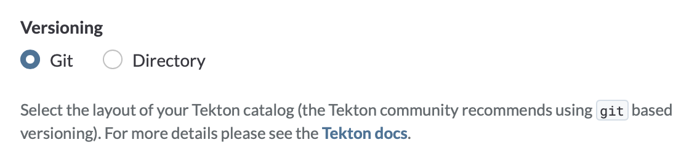

<!-- toc -->
  - [Summary](#summary)
  - [Motivation](#motivation)
  - [Definitions](#definitions)
  - [Proposal](#proposal)
    - [Git-Based Versioning](#git-based-versioning)
      - [Organization Contract](#organization-contract)
      - [Versioning in a Catalog](#versioning-in-a-catalog)
      - [Examples](#examples)
        - [Buildpacks - Catalog with multiple Tasks and Pipelines](#buildpacks---catalog-with-multiple-tasks-and-pipelines)
        - [eBay - Catalog with one Task](#ebay---catalog-with-one-task)
        - [OpenShift](#openshift)
      - [Migration](#migration)
        - [Surface Tekton Catalogs on Artifact Hub](#surface-tekton-catalogs-on-the-artifact-hub)
        - [Tekton Catalog GitHub Organization](#tekton-catalog-github-organization)
        - [Getting Started with Git-Based Versioning](#getting-started-with-git-based-versioning)
    - [Git-Based Resource Reference](#git-based-resource-reference)
      - [Git Resolver](#git-resolver)
      - [Hub Resolver](#hub-resolver)
    - [Tekton Catlin](#tekton-catlin)
  - [Related Work](#related-work)
    - [GitHub Actions](#github-actions)
  - [Future Work](#future-work)
    - [Best Practices](#best-practices)
    - [Catlin](#catlin)
  - [Alternatives](#alternatives)
    - [Tekton Hub Git-Based Versioning](#tekton-hub-git-based-versioning)
    - [One resource per Catalog](#one-resource-per-catalog)
    - [Submodules in Catalogs](#submodules-in-catalogs)
  - [Implementation PRs](#implementation-prs)
  - [References](#references)
<!-- /toc -->

# TEP-0115: Tekton Catalog Git-Based Versioning

## Summary

Tekton Catalog organization and versioning is directory-based which presents challenges in scaling and version bumping.
In this TEP, we propose a git-based versioning and flat organization for Tekton Catalogs. This TEP builds on prior 
work in [TEP-0003][tep-0003] and [TEP-0110][tep-0110], and is a blocker for [TEP-0079][tep-0079].

## Motivation

As of today, the Tekton Catalog organization and versioning is directory-based: versions are expressed as directories.

The Catalog organization contract with directory-based versioning is:

```bash
# Optional: owner(s) and reviewer(s) of the resource (all versions)
./{resource-type}/{resource-name}/OWNERS
# The README of the resource (what is the resource about, list of versions, …)
./{resource-type}/{resource-name}/README.md

# The resource itself
./{resource-type}/{resource-name}/{version}/{resource}.yaml

# The README of the versioned resource (usage, …)
./{resource-type}/{resource-name}/{version}/README.md

# Optional: Test working samples.
# Those samples would be used to run automated tests
./{resource-type}/{resource-name}/{version}/tests/...
# Optional: Addition samples.
# Those samples would be used to run automated tests
./{resource-type}/{resource-name}/{version}/samples/...
```

For example, the a Tekton Catalog with multiple `Tasks` and `Pipelines` is organized as such:

```bash
./task/
  /argocd
    /0.1
      /README.md
      /argocd.yaml
      /samples
      /tests
    /0.2
      /README.md
      /argocd.yaml
      /samples
      /tests
    /OWNERS
  /golang-build
    /0.1
      /README.md
      /golang-build.yaml
      /samples
      /tests
    /0.2
      /README.md
      /golang-build.yaml
      /samples
      /tests
    /OWNERS
  /foo-task
    /0.1
    /0.2 
  /bar-task
    /0.1
    /0.2
    /0.3
  /...
./pipeline/
  /go-release
    /0.1
      /README.md
      /go-release.yaml
      /samples
      /tests
    /0.2
      /README.md
      /go-release.yaml
      /samples
      /tests
    /OWNERS
  /foo-pipeline
    /0.1
    /0.2 
  /bar-pipeline
    /0.1
    /0.2
    /0.3
  /...
```

For further information, see [TEP-0003: Tekton Catalog Organization][tep-0003].

The current directory-based organization and versioning presents challenges:
- Bumping versions of resources is cumbersome which encourages making "minor" changes in existing versions. Some changes
that seem minor cause surprising breaking changes for users, such as described in [tektoncd/catalog#784][784].
- Resources that are frequently updated with new versions end up with a lot of duplication because any change requires
copying over everything into a new directory. For example, [git-clone][git-clone] `Task` has seven versions with a lot
of duplication across versions.

Previously, there was tight coupling between the organization and how users referenced resources which made it hard to 
change the organization of the Catalog without breaking users. In [TEP-0110][tep-0110], we decoupled the Catalog 
organization from resource reference. Now, we can create a new organization and versioning contract for Catalogs to
address the challenges with the directory-based organization and versioning.

The aim of this TEP is to create a new organization and versioning for Tekton Catalogs, building on the prior work and 
experiences from [TEP-0003][tep-0003]. In [TEP-0079: Tekton Catalog Support Tiers][tep-0079], we provide official 
support tier which will use this new organization and versioning contract - therefore, this proposal is a blocker 
for [TEP-0079][tep-0079].

## Definitions

Terms used in this TEP are defined as follows:

* **Repository**: A versioned source of a project. There's no special definition of "repository" in the context of this
TEP. A repository may be a Catalog.

* **Catalog**: A repository that complies with the organization contract defined by Tekton. The directory-based contract
is defined in [TEP-0003: Tekton Catalog Organization][tep-0003-org] and the [git-based contract](#organization-contract)
is defined in this TEP. A Catalog may contain one or more resources.

* **Resource**: Item shared in a Catalog e.g. `Task` or `Pipeline`.

* **Hub**: User interface for one or more Catalogs.
    * **Artifact Hub (https://artifacthub.io/)**: The primary and suggested user interface for Tekton Catalogs. Catalogs with git-based versioning will **ONLY** be discussed in the Artifact Hub in the first iteration of this TEP.
    * **Tekton Hub (https://hub.tekton.dev/)**: The old Tekton owned user interface for Tekton Catalogs.
    
    (*Note: The Tekton Hub will be deprecated as the community is working on migrating from the Tekton Hub to the Artifact Hub. Details in [tektoncd/hub#667][667]*)

## Proposal

We propose providing a git-based versioning of Tekton Catalogs.

### Git-Based Versioning

#### Organization Contract

We propose removing the directories - `0.1`...`0.n` - that are used for versioning resources in the Catalogs. 

The new organization contract with git-based versioning would be:

```bash
# Optional: owner(s) and reviewer(s) of the resource (all versions)
# These owners of specific resources can no longer make resource-specific
# releases because releases apply to the whole catalog (more details below)
./{resource-type}/{resource-name}/OWNERS
# The README of the resource (what is the resource about, usage, ...)
./{resource-type}/{resource-name}/README.md

# The resource itself
./{resource-type}/{resource-name}/{resource-name}.yaml

# Optional: Tests verifying functionality.
./{resource-type}/{resource-name}/tests/...

# Optional: Additional samples.
./{resource-type}/{resource-name}/{version}/samples/...
```

The example directory structure shown [above](#motivation) will be updated as such:

```bash
./task/
  /argocd
    /README.md
    /argocd.yaml
    /samples
    /tests
    /OWNERS
  /golang-build
    /README.md
    /golang-build.yaml
    /samples
    /tests
    /OWNERS
  /foo-task
  /bar-task
  /...
./pipeline/
  /go-release
    /README.md
    /go-release.yaml
    /samples
    /tests
    /OWNERS
  /foo-pipeline
  /bar-pipeline
  /...  
```

Note that there are no changes to the contents of the resources themselves, only the organization contract of Catalogs.

#### Versioning in a Catalog

Versioning will move from the resources themselves to the Catalog as a whole. This is because releases and version tags
apply to the whole repository. Therefore, Catalogs will contain one or multiple resources with shared versioning. Owners
of Catalogs will make regular releases of Catalogs - the release cadence for the official Catalogs will be determined
in [TEP-0079][tep-0079]. The release notes should provide details about the changes in the specific resources in the
Catalog in a given release, including notes about breaking changes.

The versions in the Artifact Hub should use [semver][semver] - `<major-version>.<minor-version>.<patch-version>` and this value should match the value of the `app.kubernetes.io/version` label in the resource yaml file. We propose that the release tags in Catalogs follow the semantic versioning model - `v<major-version>.<minor-version>.<patch-version>`. As such, the tags in the Catalogs will map to versions in the Artifact Hub, e.g. tag "v0.7.0" in a Catalog maps to version "0.7.0" in the Hub. Patch versions are made for backward-compatible bug fixes, minor versions are made if there are backward-compatible new features in the Catalog, while major versions are made if there are any backward-incompatible changes in the Catalog. 

Specifically, use patch versions when:
1. Backward-compatible bug fixes for the features supported in the `<major-verion>.<minor-version>`. For example, fixing the authentication bugs to fetch private repositories in the [git-clone task](https://artifacthub.io/packages/tekton-task/quan-git-clone/git-clone).
2. Backward-compatible security updates in the resource file.
3. Backward-compatible updates of the container images that are used in the resource.

Catalog owners can generate tags/releases following the above rules when needed. The Hub will recognize this versioning model only, therefore Catalogs must use this versioning to surface versions in the Hub.

Instead of the centralized Catalog from the community, we will encourage users to create Catalogs in their own GitHub
organizations following the above versioning strategy and share them through the Hub.

#### Examples

##### Buildpacks - Catalog with multiple Tasks and Pipelines

Buildpacks has a Catalog with two `Tasks` and one `Pipeline` - [Buildpacks Tekton Catalog][buildpacks]. Today, the team
copies the resources into the Tekton Community Catalog: ["buildpacks"][bt] `Task`, ["buildpacks-phases"][bpt], and 
["buildpacks" `Pipeline`][bp]. They also added subdirectories to version the resources. 

```shell
./task
  /buildpacks
    /0.1
      /buildpacks.yaml
      /...
    /0.2
      /buildpacks.yaml
      /...
    /0.3
      /buildpacks.yaml
      /...    
    /0.4
      /buildpacks.yaml
      /...
    /0.5
      /buildpacks.yaml
      /...
    /OWNERS
  /buildpacks-phases
    /0.1
      /buildpacks-phases.yaml
      /...
    /0.2
      /buildpacks-phases.yaml
      /...
    /OWNERS
./pipeline
  /buildpacks
    /0.1
      /buildpacks.yaml
      /...
    /0.2
      /buildpacks.yaml
      /...
```

With the solution proposed in this TEP, the Buildpacks team will host their own Catalog without having to copy it to
Tekton Catalog. Instead, they would make releases in their own [Buildpacks][buildpacks] Catalog and the Hub will pick
up the versions based on the tags in the Catalog.

```shell
./task
  /buildpacks
    /buildpacks.yaml
    /...
    /OWNERS
  /buildpacks-phases
    /buildpacks-phases.yaml
    /...
    /OWNERS
./pipeline
  /buildpacks
    /buildpacks.yaml
    /...
```

Note that the version tags used in this Catalog applies to all the resources. For example, if the Buildpacks team
updates the "buildpack-phases" `Task` and make a new release tagged "v0.17.0" then there will be a version "0.17.0" for
the Catalog. If the Buildpacks team would prefer to decouple the versioning of the resources, they can split the
resources into separate Catalogs where each will have its own versioning.

##### eBay - Catalog with one Task

[eBay][ebay] shared a repository with a single `Task` for sending Slack messages.

The eBay team could modify the repository to meet the organization contract in this TEP - this would make it a Catalog. 

```shell
./task
  /slack-notify
    /slack-notify.yaml
    /...
    /OWNERS
```

The eBay team can share this Catalog with the `Task` in the Artifact Hub without adding it to a centralized Catalog. They can 
then version the Catalog and its resources using release tags, which would be picked up by the Artifact Hub.

##### OpenShift

There are several `Tasks` in Tekton Catalog that are used in Openshift: 

```shell
./task/
  /openshift-client-kubecfg
    /0.1
      /README.md
      /openshift-client-kubecfg.yaml
    /OWNERS
  /openshift-client-python
    /0.1
      /README.md
      /openshift-client-python.yaml
      /Dockerfile
  /openshift-client
    /0.1
      /README.md
      /openshift-client.yaml
      /tests
    /0.2
      /README.md
      /openshift-client.yaml
      /tests
      /samples
    /OWNERS
  /openshift-install
    /0.1
      /README.md
      /openshift-client.yaml
      /tests
  /openshift-uninstall
    /0.1
      /README.md
      /openshift-client.yaml
      /tests
```

With this proposal, these `Tasks` can be moved to a Catalog in the Openshift GitHub organization and have it
organized using the new contract as such:

```shell
./task/
  /openshift-client-kubecfg
    /README.md
    /openshift-client-kubecfg.yaml
    /OWNERS
  /openshift-client-python
    /README.md
    /openshift-client-python.yaml
    /Dockerfile
  /openshift-client
    /README.md
    /openshift-client.yaml
    /tests
    /samples
    /OWNERS
  /openshift-install
    /README.md
    /openshift-client.yaml
    /tests
  /openshift-uninstall
    /README.md
    /openshift-client.yaml
    /tests
```

The Openshift team can share this Catalog with the `Tasks` in the Artifact Hub without adding it to a centralized Catalog. 
They can then version the Catalog and its resources using release tags, which would be picked up by the Artifact Hub.

Note that the version tags used in this Catalog applies to all the resources. For example, if the Openshift team
updates the "openshift-client" `Task` and makes a new release tagged "v0.5.0" then there will be a version "0.5.0" for
all the resources in the Catalog. If the Openshift team would prefer to decouple the versioning of a specific resource
from the rest, they can isolate the resources into its own Catalog where it will have its own versioning.

#### Migration
##### Surface Tekton Catalogs on the Artifact Hub

The Artifact Hub should support both directory-based and git-based versioning to provide backwards compatibility. Catalog owners can follow the [repository registration](https://artifacthub.io/docs/topics/repositories/tekton-tasks/) guide to register Tekton Catalogs from the Artifact Hub [Control Panel](https://artifacthub.io/control-panel/repositories?page=1). The registration process should allow users select the versioning layout of the catalog: 



##### Tekton Catalog GitHub Organization

We will provide official Tekton resources through multiple Catalogs in the `tektoncd-catalog` GitHub organization - 
https://github.com/tektoncd-catalog.

The official resources will be a small set of resources that are critical in running Tekton. Owners of the official
resources will be the Tekton Catalog Maintainers; we will update the contributor ladder for Catalog to reflect that
contributions are distributed in multiple repositories.

This work will be scoped out further in [TEP-0079][tep-0079].

Based on the usefulness of the resources and the bandwidth of the catalog maintainers, the Tekton community has discussed and decided to migrate the following 5 tasks from the current centralized Catalog repository to the `tektoncd-catalog` GitHub organization in the first iteration. The versioning in the new catalog repository starts with `1.0.0`:

<table>
    <thead>
        <tr>
            <th>Resource Name</th>
            <th>Old Version (directory-based)</th>
            <th>New Catalog Name</th>
            <th>New Version (git-based)</th>
        </tr>
    </thead>
    <tbody>
        <tr>
            <td rowspan=4><a href="https://github.com/tektoncd/catalog/tree/main/task/git-clone">git-clone</a></td>
            <td>0.6</td>
            <td rowspan=4>git-clone</td>
            <td>1.0.0</td>
        </tr>
        <tr>
            <td>0.7</td>
            <td>2.0.0</td>
        </tr>
        <tr>
            <td>0.8</td>
            <td>3.0.0</td>
        </tr>  
        <tr>
            <td>0.9</td>
            <td>4.0.0</td>
        </tr>          
        <tr>
            <td rowspan=1><a href="https://github.com/tektoncd/catalog/tree/main/task/golang-build">golang-build</a></td>
            <td>0.3</td>
            <td rowspan=2>golang</td>
            <td>1.0.0</td>
        </tr>
        <tr>
            <td rowspan=1><a href="https://github.com/tektoncd/catalog/tree/main/task/golang-test">golang-test</a></td>
            <td>0.2</td>
            <td>1.0.0</td>
        </tr>
        <tr>
            <td rowspan=1><a href="https://github.com/tektoncd/catalog/tree/main/task/kaniko">kaniko</a></td>
            <td>0.6</td>
            <td>kaniko</td>
            <td>1.0.0</td>
        </tr>
        <tr>
            <td rowspan=1><a href="https://github.com/tektoncd/catalog/tree/main/task/git-batch-merge">git-batch-merge</a></td>
            <td>0.2</td>
            <td>git-batch-merge</td>
            <td>1.0.0</td>
        </tr>
    </tbody>
</table>

The existing Tekton Catalog - `tektoncd/catalog` - will remain as it is using the directory-based contract. It will
be read-only and will encourage owners of the resources to move them to their own repositories in their own GitHub
organizations once TEP-0115 is `implemented`. After 9 months, we will archive the `tektoncd/catalog` repository.

The Tekton Catalog Maintainers will continue to maintain the above selected official tasks in the current centralized repo until
TEP-0115 is `implemented`.

##### Getting Started with Git-Based Versioning

To make it easy for the community to create Catalogs, we will provide a template Catalog in the `tektoncd-catalog`
GitHub organization - https://github.com/tektoncd-catalog. This template will contain `Tasks` and `Pipelines`, and
will include the testing setup that users can use to get started in validating the functionality of their resources.
Note that we are planning to update the testing setup to be Tekton-based in [TEP-0079][tep-0079]; the updated testing
set up will be provided in the template Catalog.

### Git-Based Resource Reference

In Tekton Catalogs, users can reference specific versions of the resources using git revisions - commits, tags or 
branches. In Hub, users can rely on the versions which map to release tags in the Catalogs.

#### Git Resolver

[Git Resolver][git-resolver] already has a `"commit"` parameter that can be used to fetch a specific version of a 
resource, for example [this commit][bp-commit] of buildpacks `Task`:

```yaml
apiVersion: tekton.dev/v1beta1
kind: TaskRun
metadata:
  name: buildpacks
spec:
  taskRef:
    resolver: git
    resource:
    - name: url
      value: https://github.com/tekton/catalog.git
    - name: path
      value: task/buildpacks/buildpacks.yaml
    - name: commit
      value: d9183e36f00c712b5de59932650c071674ea89b8
```

[Git Resolver][git-resolver] has a `"branch"` parameter that can be used to get a version of a resource from a
specific branch, for example [this branch][bp-branch] of buildpacks `Task`:

```yaml
apiVersion: tekton.dev/v1beta1
kind: TaskRun
metadata:
  name: buildpacks
spec:
  taskRef:
    resolver: git
    resource:
    - name: url
      value: https://github.com/tekton/catalog.git
    - name: path
      value: task/buildpacks/buildpacks.yaml
    - name: branch
      value: main
```

Note that a user can specify either `"commit"` or `"branch"`, but not both. We need to support `"tags"` as well as a
form of revision. Therefore, we propose removing `"commit"` and `"branch"` from Git Resolver, and replace them
with `"revision"` which can be a commit, branch or tag. The `"revision"` will default to `"main"` if not provided.

```yaml
# using commit in revision
apiVersion: tekton.dev/v1beta1
kind: TaskRun
metadata:
  name: buildpacks
spec:
  taskRef:
    resolver: git
    resource:
    - name: url
      value: https://github.com/tekton/catalog.git
    - name: path
      value: task/buildpacks/buildpacks.yaml
    - name: revision
      value: d9183e36f00c712b5de59932650c071674ea89b8
---
# using branch in revision
apiVersion: tekton.dev/v1beta1
kind: TaskRun
metadata:
  name: buildpacks
spec:
  taskRef:
    resolver: git
    resource:
      - name: url
        value: https://github.com/tekton/catalog.git
      - name: path
        value: task/buildpacks/buildpacks.yaml
      - name: revision
        value: main
---
# using tag in revision
apiVersion: tekton.dev/v1beta1
kind: TaskRun
metadata:
  name: buildpacks
spec:
  taskRef:
    resolver: git
    resource:
      - name: url
        value: https://github.com/tekton/catalog.git
      - name: path
        value: task/buildpacks/buildpacks.yaml
      - name: revision
        value: v0.5 
```

#### Hub Resolver

[Hub Resolver][hub-resolver] has a `"version"` parameter that can be used to get a specific version of a resource. For example [this version][bp-hub] of buildpacks `Task`:

```yaml
apiVersion: tekton.dev/v1beta1
kind: TaskRun
metadata:
  name: buildpacks
spec:
  taskRef:
    resolver: hub
    resource:
    - name: kind
      value: task
    - name: name
      value: buildpacks
    - name: version
      value: 0.5.0
```

We propose adding a `"catalog"` parameter to the Hub Resolver. This will be useful in resolving conflicts when
resources from separate Catalogs have the same names. For example, a `TaskRun` executing the "openshift-client"
from the Openshift Catalog described [above](#openshift) would use the Hub Resolver as such:

```yaml
apiVersion: tekton.dev/v1beta1
kind: TaskRun
metadata:
  name: openshift-install
spec:
  taskRef:
    resolver: hub
    resource:
    - name: kind
      value: task
    - name: name
      value: openshift-client
    - name: catalog
      value: openshift
    - name: version
      value: 0.3
```

As we are working on migrating from the Tekton Hub to the Artifact Hub ([tektoncd/hub#667][667]), we propose adding an optional `"type"` parameter to the Hub Resolver indicating which Hub API should be used to fetch the catalog. The value can be set to `"artifact"` or `"tekton"`. The default value is `"artifact"`.

Note that the Catalog versioning in the Artifact Hub follows the semantic versioning (i.e. `<major-version>.<minor-version>.<patch-version>`). For backward compatibility in the Hub Resolver, both full (i.e. `<major-version>.<minor-version>.<patch-version>`) and simplified semantic versioning (i.e. `<major-version>.<minor-version>`) will be accepted by the `"version"` parameter. The Hub Resolver will map the version to the format expected by the target Hub type.

Example:
```yaml
apiVersion: tekton.dev/v1beta1
kind: TaskRun
metadata:
  name: openshift-install
spec:
  taskRef:
    resolver: hub
    resource:
    - name: type
      value: artifact
    - name: kind
      value: task
    - name: name
      value: openshift-client
    - name: catalog
      value: openshift
    - name: version
      value: 0.3
```


When setting to `"artifact"`, the following Artifact Hub API will be invoked to fetch **task** resources:
```shell
curl -X 'GET' \
  '{ARTIFACT_HUB_API}/api/v1/packages/tekton-<resource-kind>/<catalog-name>/<resource-name>/<resource-version>' \
  -H 'accept: application/json'
```

The `ARTIFACT_HUB_API` can be configured by setting the `ARTIFACT_HUB_API` environment variable in [resolver-deployment.yaml](https://github.com/tektoncd/pipeline/blob/main/config/resolvers/resolvers-deployment.yaml). The default value is `https://artifacthub.io/`.
```yaml
env
- name: ARTIFACT_HUB_API
  value: "https://artifacthub.io/"
```

When setting to `"tekton"`, the following Artifact Hub API will be invoked to fetch resources:
```shell
curl -X 'GET' \
  '{TEKTON_HUB_API}/v1/resource/<catalog-name>/<resource-kind>/<resource-name>/<resource-version>/yaml'
```

The `TEKTON_HUB_API` can be configured by setting the `TEKTON_HUB_API` environment variable in [resolver-deployment.yaml](https://github.com/tektoncd/pipeline/blob/main/config/resolvers/resolvers-deployment.yaml). For backward compatibility of the Hub Resolver, we propose to remove the default value (`https://api.hub.tekton.dev`) of `TEKTON_HUB_API` since the default `type` is changed to `artifact` and the Tekton Hub is planned to be deprecated soon. The users must configure their own private instance of the Tekton Hub to use the Hub Resolver with `"type"` setting to `"tekton"`.
```yaml
env
- name: TEKTON_HUB_API
  value: "https://api.private.hub.instance.dev"
```

### Tekton Catlin

[Tekton Catlin](https://github.com/tektoncd/catlin) has the capability to validate the file path of catalog resources in the directory-based versioning. The expected resource file path is: ```<catalog>/<resource-type>/<resource-name>/<resource-version>/<resource-name>.yaml``` (e.g. ```catalog/task/git-clone/0.8/git-clone.yaml```).

We propose to add an optional new flag ```versioning``` for [catlin validate](https://github.com/tektoncd/catlin#validate) command and the value can be set to ```git``` or ```directory```, for example:

```shell
catlin validate <actual-file-path-to-resource> --versioning git
```

When setting to ```git```, the expected file path is ```<catalog>/<resource-type>/<resource-name>/<resource-name>.yaml``` as required in [Organization Contract](#organization-contract); the expected file path remains unchanged (i.e. ```<catalog>/<resource-type>/<resource-name>/<resource-version>/<resource-name>.yaml```) when setting to ```directory```. The default value of the flag is ```directory```, which will be changed to ```git``` after archiving the [centralized catalog repo](https://github.com/tektoncd/catalog).

Other functionalities of ```Catlin``` should remain the same.

## Related Work

### GitHub Actions
 
As described in [docs][gha], GitHub Actions must meet these conditions: (1) the action must be in a public repository,
and (2) each repository must contain a single action. These actions are published to the GitHub Marketplace by tagging
new releases and publishing them.

In this proposal we do not enforce that each Catalog must have a single resource. However, this proposal takes the same
approach of tagging new releases in the Catalogs as is done in GitHub Actions.

## Future Work

### Best Practices

We could provide guidelines and recommendations for creating Catalogs e.g. deciding whether to group resources together
instead of splitting them into separate Catalogs. We can explore this in future work. 

### Catlin 

Today, [catlin bump](https://github.com/tektoncd/catlin#bump) command only supports directory-based versioning catalog. We could further extend the [catlin bump](https://github.com/tektoncd/catlin#bump) command to support git-based versioning catalogs (where the command will create a new git tag and a corresponding release note based on the current latest version).

## Alternatives
### Tekton Hub Git-Based Versioning

To support git-based versioning in the Tekton Hub, the [config.yaml][cy] will take a `versioning` field under `catalogs`, which will default to `"directory"` and users can set it to `"git"`. For example, the entries in [config.yaml][cy] could be:

```yaml
catalogs:

- name: tekton
  org: tektoncd
  type: community
  provider: github
  url: https://github.com/tektoncd/catalog

- name: buildpacks
  org: buildpacks
  type: community
  provider: github
  url: https://github.com/buildpacks/tekton-integration
  versioning: git
 ```

 However, given the git-based versioning is already supported in the Artifact Hub and the Tekton Hub will be deprecated, this work is no longer required.

### One resource per Catalog

We could require that each resource is defined in its own repository. This will ensure that each resource will
have its own tag, hence its own versioning. However, this is a restrictive requirement when users have resources
that can be in one Catalog with a shared git-based versioning.

### Submodules in Catalogs

We could require that each resource is defined in its own repository, then they are included in the Catalog as
[submodules][submodules]. This will ensure that each resource will have its own tag, hence its own versioning.
This could be a future optimization, if needed.

## Implementation PRs

- [Git Resolver revision resolution](https://github.com/tektoncd/resolution/pull/75)
- [Artifact Hub Resolver](https://github.com/tektoncd/pipeline/pull/5666)
- [Catlin git-based validation](https://github.com/tektoncd/catlin/pull/6)
- [Artifact Hub Git-based versioning](https://github.com/artifacthub/hub/pull/2337)

## References

- Tekton Enhancement Proposals
  - [TEP-0003: Tekton Catalog Organization][tep-0003]
  - [TEP-0079: Tekton Catalog Support Tiers][tep-0079]
  - [TEP-0110: Decouple Catalog Organization and Resource Reference][tep-0110]
- Issues:
  - [tektoncd/catalog#784: versioning resources whenever change is made][784] 

[tep-0003]: ./0003-tekton-catalog-organization.md
[tep-0003-org]: https://github.com/tektoncd/community/blob/main/teps/0003-tekton-catalog-organization.md#organization
[tep-0079]: ./0079-tekton-catalog-support-tiers.md
[tep-0110]: ./0110-decouple-catalog-organization-and-reference.md
[784]: https://github.com/tektoncd/catalog/issues/784
[667]: https://github.com/tektoncd/hub/issues/667
[git-clone]: https://github.com/tektoncd/catalog/tree/main/task/git-clone/0.7
[git-resolver]: https://github.com/tektoncd/resolution/tree/7f92187843085874229aa4c43e5c6d7d392a26fa/gitresolver
[hub-resolver]: https://github.com/tektoncd/resolution/tree/5d7918cb5b6f183d79cf0f91f4f08ecb204505a0/hubresolver
[bp-commit]: https://github.com/tektoncd/catalog/blob/d9183e36f00c712b5de59932650c071674ea89b8/task/buildpacks/0.5/buildpacks.yaml
[bp-branch]: https://github.com/tektoncd/catalog/blob/main/task/buildpacks/0.5/buildpacks.yaml
[bp-hub]: https://artifacthub.io/packages/tekton-task/tekton-catalog-tasks/buildpacks/0.5.0
[semver]: https://semver.org/
[buildpacks]: https://github.com/buildpacks/tekton-integration
[bt]: https://github.com/tektoncd/catalog/tree/main/task/buildpacks
[bpt]: https://github.com/tektoncd/catalog/tree/main/task/buildpacks-phases
[bp]: https://github.com/tektoncd/catalog/tree/main/pipeline/buildpacks
[eBay]: https://github.com/eBay/tekton-slack-notify
[cy]: https://github.com/tektoncd/hub/blob/0ba02511db7a06aef54e2257bf2540be85b53f45/config.yaml
[gha]: https://docs.github.com/en/actions/creating-actions/publishing-actions-in-github-marketplace
