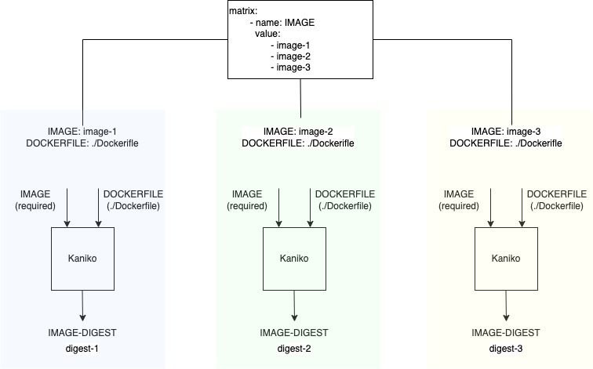
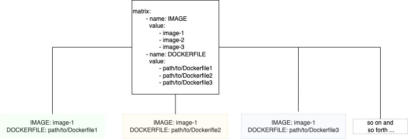

# TEP-0118: Matrix with Explicit Combinations of Parameters

<!-- toc -->
- [Summary](#summary)
- [Motivation](#motivation)
  - [Use Cases](#use-cases)
    - [Adding a specific combination in the Matrix](#adding-a-specific-combination-in-the-matrix)
    - [Explicitly defining combinations in the Matrix](#explicitly-defining-combinations-in-the-matrix)
  - [Goals](#goals)
  - [Non-Goals](#non-goals)
- [Proposal](#proposal)
  - [Include specific combinations in the Matrix](#include-specific-combinations-in-the-matrix)
  - [Define explicit combinations in the Matrix](#define-explicit-combinations-in-the-matrix)
  - [API Change](#api-change)
- [Alternatives](#alternatives)
  - [Using Object Parameters](#using-object-parameters)
  - [Upgrade and Migration Strategy](#upgrade-and-migration-strategy)
- [References](#references)
<!-- /toc -->

## Summary

[TEP-0090: Matrix](0090-matrix.md) introduced `Matrix` to the `PipelineTask` specification such that the `PipelineTask`
executes a list of `TaskRuns` or `Runs` in parallel with the specified list of inputs for a `Parameter` or with
different combinations of the inputs for a set of `Parameters`.

In this TEP, we build on the work in [TEP-0090: Matrix](0090-matrix.md) by allowing passing in a specific combinations
of `Parameters` into the `Matrix`.

## Motivation

A `Task` in the Tekton Catalog is designed to be shared and reusable across the `Pipelines`. A `Task` must be designed
to solve a single unit of execution which relies on one or more `Parameters`. Some of these `Parameters` signify the key
information to execute this kind of `Task`. For example, [Kaniko][kaniko-task] `Task` in a Catalog defines one required
`Parameter`, `"IMAGE"` and an optional `Parameter`, `"DOCKERFILE"`, along with many others. Kaniko `Task` builds source
into a container image using the `Dockerfile` specified in `"DOCKERFILE"`.

`Pipeline` authors often require to include the same `Task` to be executed with a set of `Parameter` values. `Matrix`
has enabled `Pipeline` authors to simplify their `Pipelines` by allowing them to specify variations for executing a
`Task`. Adding specific combinations in the `Matrix` was a non-goal in [TEP-0090](0090-matrix.md#non-goals).

The motivation of this TEP is to extend `Matrix` to allow `Pipeline` authors to further specify the combination of
`Parameters`.

### Use Cases

#### Adding a specific combination in the Matrix

Let's take an example of a [golang-test][golang-test] `Task` from the  *Tekton Catalog*. The `Pipeline` author would
like to test a Go project on variety of architectures. The [golang-test][golang-test] `Task` is designed to run `go
test` in package list mode in which `go test` is invoked with explicit package arguments, for example, `go test . /...`.
The [golang-test][golang-test] `Task` defines one required parameter `"package"` to specify the base package to test,
and two optional `Parameters` (in addition to many others) `"GOARCH"` to specify the architecture target (the default
architecture is `amd64`) and `"flags"` to specify the flags for the `go test` command (the default `flags` are
`-race -cover -v`).

The `Pipeline` author can use `Matrix` with the `golang-test` `Task` to test a Go project on different `linux` platforms:

```yaml
apiVersion: tekton.dev/v1beta1
kind: Pipeline
metadata:
  name: pipeline-to-build-and-test-go-project
spec:
  workspaces:
    - name: shared-workspace
  tasks:
    - ...
    - name: golang-test
      taskRef:
        name: golang-test
      workspaces:
        - name: source
          workspace: shared-workspace
      params:
        - name: package
          value: "github.com/tektoncd/pipeline"
        - name: packages
          value: "./pkg/..."
      matrix:
        - name: GOARCH
          value:
            - "linux/amd64"
            - "linux/s390x"
            - "linux/ppc64le"
        - name: flags
          value:
            - "-race -cover -v"
    - ...
```

In this example, [golang-test][golang-test] will be executed on three different linux flavors with the single value
of `flags` - `-race -cover -v`. However, `race` is only supported on `linux/amd64` and `linux/ppc64le` but not on
`linux/s390x`.

Now, we need a way to only specify flags `-cover -v` for `linux/s390x`. The `Pipeline` will need to define a `Matrix`
that will execute `golang-test` in three different linux flavors. While running on `amd64` and `ppc64le`, `golang-test`
needs to execute `go test github.com/tektoncd/pipeline/pkg/... -race -cover -v`. While running on `linux/s390x`,
`golang-test` needs to executes `go test github.com/tektoncd/pipeline/pkg/... -cover -v`.

#### Explicitly defining combinations in the Matrix

Let's look at the same [kaniko][kaniko-task] `Task` from the  *Tekton Catalog*. The `Pipeline` author can use `Matrix`
with the `kaniko` `Task` to build three separate images from a single repository:

```yaml
apiVersion: tekton.dev/v1beta1
kind: Pipeline
metadata:
  name: pipeline-to-build-images-from-a-single-repo
spec:
  workspaces:
    - name: shared-workspace
  tasks:
    - ...
    - name: kaniko-build
      taskRef:
        name: kaniko
      workspaces:
        - name: source
          workspace: shared-workspace
      matrix:
        - name: IMAGE
          value: [ "image-1", "image-2", "image-3" ]
    - ...
```

In this example, [Kaniko][kaniko-task] `Task` will be executed with three different values for `IMAGE` but with the
same default value of the `DOCKERFILE` which is `./Dockerfile`.



This is not a desired outcome for this use case. The `Pipeline` author intended to create three separate images using
three separate `Dockerfiles`.

Further, following the `Matrix` syntax, as a `Pipeline` author, including `DOCKERFILE` into `Matrix`:

```yaml
apiVersion: tekton.dev/v1beta1
kind: Pipeline
metadata:
  name: pipeline-to-build-multiple-images
spec:
  workspaces:
    - name: shared-workspace
  tasks:
    - ...
    - name: kaniko-build
      taskRef:
        name: kaniko
      workspaces:
        - name: source
          workspace: shared-workspace
      matrix:
        - name: IMAGE
          value: [ "image-1", "image-2", "image-3" ]
        - name: DOCKERFILE
          value: [ "path/to/Dockerfile1", "path/to/Dockerfile2", "path/to/Dockerfile3" ]
    - ...
```

`Matrix` by design with multiple `Parameters` calculates all the possible combinations and executes an instance of
`PipelineTask` with each combination. Now, this specification of the `Matrix` creates 9 different combinations, such
as:



This is not a desired outcome either. We need a way to specify explicit mapping between `IMAGE` and `DOCKERFILE`, such
as:

```yaml
    - IMAGE: "image-1"
      DOCKERFILE: "path/to/Dockerfile1"

    - IMAGE: "image-2"
      DOCKERFILE: "path/to/Dockerfile2"

    - IMAGE: "image-3"
      DOCKERFILE: "path/to/Dockerfile3"
```

### Goals

The main goal of this TEP is to extend `Matrix` functionality to enable executing a `PipelineTask` with a limited or
specific set of combinations of `Parameters`.

### Non-Goals

This TEP focuses on adding a specific combination of input values for `Matrix` parameters, excluding a specific
combination from `Matrix` is out of scope for this TEP.

## Proposal

We propose adding a field - `include` - within the `matrix` field. This requires that we also move the existing array
of `Parameters` to a field - `params` - within the `matrix` field. This allows users to specify the `Parameters`
whose combinations should be generated, and the explicit combinations of `Parameters` that need to be added into the
`Matrix`.

### Include specific combinations in the Matrix

Take the use case described [above](#adding-a-specific-combination-in-the-matrix). The `Pipeline` will need to define a
`Matrix` that will execute `golang-test` in three different linux flavors. While running on `amd64` and `ppc64le`,
`golang-test` should execute `go test github.com/tektoncd/pipeline/pkg/... -race -cover -v`. While running on
`linux/s390x`, `golang-test` should execute `go test github.com/tektoncd/pipeline/pkg/... -cover -v`.

The `Pipeline` addressing this use case will be defined as shown below:

```yaml
apiVersion: tekton.dev/v1beta1
kind: Pipeline
metadata:
  name: pipeline-to-build-and-test-go-project
spec:
  workspaces:
    - name: shared-workspace
  tasks:
    - ...
    - name: golang-test
      taskRef:
        name: golang-test
      workspaces:
        - name: source
          workspace: shared-workspace
      params:
        - name: package
          value: "github.com/tektoncd/pipeline"
        - name: packages
          value: "./pkg/..."
      matrix:
        params:
          - name: GOARCH
            value:
              - "linux/amd64"
              - "linux/ppc64le"
              - "linux/s390x"
        include:
          - name: s390x-no-race
            params:
              - name: GOARCH
                value: "linux/s390x"
              - name: flags
                value: "-cover -v"
    - ...
```

The `matrix.include` section when specified with `matrix.params` is used to expand existing auto-populated `Matrix`.
The above `Matrix` specification will create three `taskRuns`, one for each architecture in `GOARCH` (`"linux/amd64"`,
`"linux/ppc64le"`, and `"linux/s390x"`) and with default `flags`. Now, when a `taskRun` is created for the `GOARCH`
value of `linux/s390x`, an additional parameter called `flags` with the value of `-cover -v` will be included in the
`taskRun`. The `matrix.include` section can list `params` which does not exist in the `matrix.params` section. In this
example specification, `flags` was not listed in `matrix.params`. At the same time, `matrix.include` section can
list `params` which does exist in the `matrix.params` section.

Let's expand this use case to showcase a little more complex combinations, for example:

```yaml
      matrix:
        params:
          - name: GOARCH
            value:
              - "linux/amd64"
              - "linux/ppc64le"
              - "linux/s390x"
          - name: version
            value:
              - "go1.17"
              - "go1.18.1"
```

This `matrix` specification will result in six `taskRuns` with the following `matrix` combinations:

```json!
{ "GOARCH": "linux/amd64", "version": "go1.17" }

{ "GOARCH": "linux/amd64", "version": "go1.18.1" }

{ "GOARCH": "linux/ppc64le", "version": "go1.17" }

{ "GOARCH": "linux/ppc64le", "version": "go1.18.1" }

{ "GOARCH": "linux/s390x", "version": "go1.17" }

{ "GOARCH": "linux/s390x", "version": "go1.18.1" }
```

Now, let's introduce `include` with a couple of `Parameters`: `"package"`, `"flags"` and `"context"`:

```yaml=
      matrix:
        params:
          - name: GOARCH
            value:
              - "linux/amd64"
              - "linux/ppc64le"
              - "linux/s390x"
          - name: version
            value:
              - "go1.17"
              - "go1.18.1"
        include:
          - name: common-package
            params:
              - name: package
                value: "path/to/common/package/"
          - name: s390x-no-race
            params:
              - name: GOARCH
                value: "linux/s390x"
              - name: flags
                value: "-cover -v"
          - name: go117-context
            params:
              - name: version
                value: "go1.17"
              - name: context
                value: "path/to/go117/context"
         - name: non-existent-arch
           params:
              - name: GOARCH
                value: "I-do-not-exist"
```

The first `include` clause is added to all the original `matrix` combintations without overwriting any `parameters` of
the original combinations:

```json!
{ "GOARCH": "linux/amd64", "version": "go1.17", **"package": "path/to/common/package/"** }

{ "GOARCH": "linux/amd64", "version": "go1.18.1", **"package": "path/to/common/package/"** }

{ "GOARCH": "linux/ppc64le", "version": "go1.17", **"package": "path/to/common/package/"** }

{ "GOARCH": "linux/ppc64le", "version": "go1.18.1", **"package": "path/to/common/package/"** }

{ "GOARCH": "linux/s390x", "version": "go1.17", **"package": "path/to/common/package/"** }

{ "GOARCH": "linux/s390x", "version": "go1.18.1", **"package": "path/to/common/package/"** }
```

The second `include` clause adds `"flags": "-cover -v"` only to the original `matrix` combinations that include
`"GOARCH": "linux/s390x"`:

```json!
{ "GOARCH": "linux/s390x", "version": "go1.17", "package": "path/to/common/package/", **"flags": "-cover -v"** }

{ "GOARCH": "linux/s390x", "version": "go1.18.1", "package": "path/to/common/package/", **"flags": "-cover -v"** }
```

The third `include` clause adds `"context": "path/to/go117/context"` only to the original `matrix` combinations
that include `"version": "go1.17"`:

```json!
{ "GOARCH": "linux/amd64", "version": "go1.17", "package": "path/to/common/package/", **"context": "path/to/go117/context"** }

{ "GOARCH": "linux/ppc64le", "version": "go1.17", "package": "path/to/common/package/", **"context": "path/to/go117/context"** }

{ "GOARCH": "linux/s390x", "version": "go1.17", "package": "path/to/common/package/", "flags": "-cover -v", **"context": "path/to/go117/context"** }
```

The fourth `include` clause cannot be added to any original `matrix` combination without overwriting any `params` of the
original combinations, so it is added as an additional `matrix` combination:

```json!
* { **"GOARCH": "I-do-not-exist"** }
```

The above specification will result in seven `taskRuns` with the following matrix combinations:

```json!
{ "GOARCH": "linux/amd64", "version": "go1.17", "package": "path/to/common/package/", "context": "path/to/go117/context" }

{ "GOARCH": "linux/amd64", "version": "go1.18.1", "package": "path/to/common/package/" }

{ "GOARCH": "linux/ppc64le", "version": "go1.17", "package": "path/to/common/package/", "context": "path/to/go117/context" }

{ "GOARCH": "linux/ppc64le", "version": "go1.18.1", "package": "path/to/common/package/" }

{ "GOARCH": "linux/s390x", "version": "go1.17", "package": "path/to/common/package/", "flags": "-cover -v", "context": "path/to/go117/context" }

{ "GOARCH": "linux/s390x", "version": "go1.18.1", "package": "path/to/common/package/", "flags": "-cover -v" }

{ "GOARCH": "I-do-not-exist" }
```

### Define explicit combinations in the Matrix

Take the use case described [above](#explicitly-defining-combinations-in-the-matrix). The user needs to specify explicit
mapping between `IMAGE` and `DOCKERFILE`, such as:

```yaml
    - IMAGE: "image-1"
      DOCKERFILE: "path/to/Dockerfile1"

    - IMAGE: "image-2"
      DOCKERFILE: "path/to/Dockerfile2"

    - IMAGE: "image-3"
      DOCKERFILE: "path/to/Dockerfile3"
```

The `Pipeline` addressing this use case will be defined as shown below:

```yaml
apiVersion: tekton.dev/v1beta1
kind: Pipeline
metadata:
  name: pipeline-to-build-images-from-a-single-repo
spec:
  workspaces:
    - name: shared-workspace
  tasks:
    - ...
    - name: kaniko-build
      taskRef:
        name: kaniko
      workspaces:
        - name: source
          workspace: shared-workspace
      matrix:
        include:
          - name: build-1
            params:
              - name: IMAGE
                value: "image-1"
              - name: DOCKERFILE
                value: "path/to/Dockerfile1"
          - name: build-2
            params:
              - name: IMAGE
                value: "image-2"
              - name: DOCKERFILE
                value: "path/to/Dockerfile2"
          - name: build-3
            params:
              - name: IMAGE
                value: "image-3"
              - name: DOCKERFILE
                value: "path/to/Dockerfile3"
    - ...
```

This configuration allows users to take advantage of `Matrix` to fan out without having an auto-populated `Matrix`.

The `include` section in the `Matrix` can be specified with or without `params` section. The initial use case
[adding-a-specific-combination-in-the-matrix](#adding-a-specific-combination-in-the-matrix) demonstrated using
`include` section with`params` section.
This example of [explicitly-defining-combinations-in-the-matrix](#explicitly-defining-combinations-in-the-matrix)
demonstrates using `include` section without `params` section. `Matrix` with `include` section without `params`
section creates the number of `taskRuns` specified in the `include` section with the specified `parameters`.

### API Change

With this proposal, `matrix` is defined as:

```go
type Matrix struct {
    // Params is a list of parameters used to fan out the pipelineTask
    // Params takes only `Parameters` of type `"array"`
    // Each array element is supplied to the `PipelineTask` by substituting `params` of type `"string"` in the underlying `Task`.
    // The names of the `params` in the `Matrix` must match the names of the `params` in the underlying `Task` that they will be substituting.
    Params []Param `json:"params,omitempty"`

    // Include is a list of MatrixInclude
    Include []Include `json:"include,omitempty"`
}

type Include struct {
    // Name the specified combination
    Name string `json:"name,omitempty"`

    // Params takes only `Parameters` of type `"string"`
    // The names of the `params` must match the names of the `params` in the underlying `Task`
    Params []Param `json:"params,omitempty"`
}
```

## Alternatives

### Using Object Parameters

The explicit combinations of `Parameters` could be of type `Object`.

Instead of the [the solution](#include-specific-combinations-in-the-matrix) for including a specific combination in the
`Matrix`, we could use `Parameter` of type `Object` as such:

```yaml
apiVersion: tekton.dev/v1beta1
kind: Pipeline
metadata:
  name: pipeline-to-build-and-test-go-project
spec:
  workspaces:
    - name: shared-workspace
  tasks:
    - ...
    - name: golang-test
      taskRef:
        name: golang-test
      workspaces:
        - name: source
          workspace: shared-workspace
      params:
        - name: package
          value: "github.com/tektoncd/pipeline"
        - name: packages
          value: "./pkg/..."
      matrix:
        params:
          - name: GOARCH
            value:
              - "linux/amd64"
              - "linux/ppc64le"
          - name: flags
            value:
              - "-race -cover -v"
        include:
          - name: s390x-no-race
            value:
              GOARCH: "linux/s390x"
              flags: "-cover -v"
    - ...
```

Instead of the [the solution](#define-explicit-combinations-in-the-matrix) for including a specific combination in the
`Matrix`, we could use `Parameter` of type `Object` as such:

```yaml
apiVersion: tekton.dev/v1beta1
kind: Pipeline
metadata:
  name: pipeline-to-build-images-from-a-single-repo
spec:
  workspaces:
    - name: shared-workspace
  tasks:
    - ...
    - name: kaniko-build
      taskRef:
        name: kaniko
      workspaces:
        - name: source
          workspace: shared-workspace
      matrix:
        include:
          - name: build-1
            value:
              IMAGE: "image-1"
              DOCKERFILE: "path/to/Dockerfile1"
          - name: build-2
            value:
              IMAGE: "image-2"
              DOCKERFILE: "path/to/Dockerfile2"
          - name: build-3
            value:
              IMAGE: "image-3"
              DOCKERFILE: "path/to/Dockerfile3"
    - ...
```

However, this approach mixes two ways of specifying `Parameters`. Also, `Parameters` of type `Object` is in alpha, so
we'd prefer not to couple `Matrix` to another alpha feature that can change or be removed any time. Moreover, there's
no clear benefit of using `Parameters` of type `Object` over the proposed solution.

### Upgrade and Migration Strategy

`Matrix` is still in `alpha` so we can make the proposed changes per the API compatibility policy. We will communicate
the breaking changes to users in the release notes, and through an email to tekton-dev@ and tekton-users@ if needed.

## References

- [TEP-0090: Matrix](0090-matrix.md)
- [Implementation]

[implementation]: https://github.com/tektoncd/pipeline/issues/6351
[kaniko-task]: https://github.com/tektoncd/catalog/blob/main/task/kaniko/0.5/kaniko.yaml
[golang-test]: https://github.com/tektoncd/catalog/blob/main/task/golang-test/0.2/golang-test.yaml
