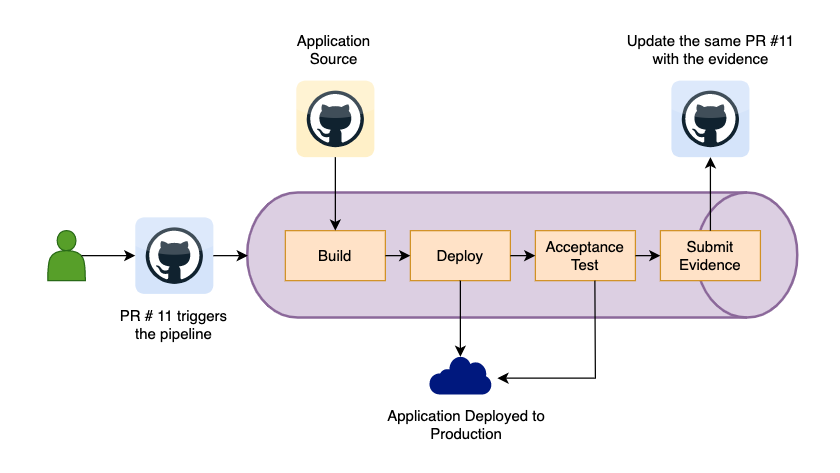
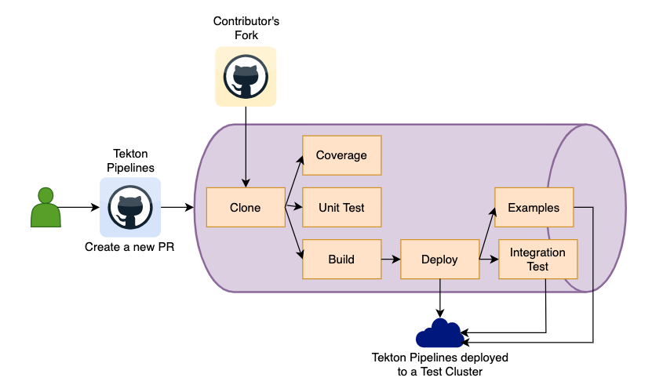

# TEP-0123: Specifying on-demand-retry in a PipelineTask


<!-- toc -->
- [Summary](#summary)
- [Motivation](#motivation)
  - [Goals](#goals)
  - [Non-Goals](#non-goals)
- [Requirements](#requirements)
  - [Use Cases](#use-cases)
    - [CD Use Case](#cd-use-case)
    - [CI Use Case](#ci-use-case)
- [References](#references)
<!-- /toc -->

## Summary

This TEP proposes a mechanism to allow users to choose when to retry a failed `pipelineTask` of a pipeline.
This kind of `on-demand` retry of a `pipelineTask` is executed with the original `params` and `specifications`.
The `on-demand` retry of a `pipelineTask` allow users to continue to retry until the task succeeds. After the offending task
succeeds, the rest of the `pipeline` continues executing as usual until the completion. This retry of a `pipelineTask`
just like the existing `retry` strategy is only applicable within the context of an original `pipelineRun` i.e.
a `pipelineTask` can only be retried until the `pipelineRun` that it's part of is `running`.

## Motivation

The primary motivation of this proposal is to enable pipeline authors to overcome any flakes without re-running
the whole pipeline but to re-run the flakes and continue the execution until the pipeline finishes. The main motivation
of this proposal is to enable pipeline authors to specify **when** to re-run such flakes.

Tekton controller does support [retries](https://github.com/tektoncd/pipeline/blob/main/docs/pipelines.md#using-the-retries-field)
in which a pipeline author can specify the number of the times a task can be retried when it fails. The `retries` are designed
such that once a task fails, it is retried immediately. Other CI/CD systems supports an additional retry strategies, such as:

* Argo Workflow offers a variety of retry policies. One of them is [Back-Off](https://argoproj.github.io/argo-workflows/retries/#back-off),
in which a user can configure the delay between retries.

* GitHub action supports a retry of an action allowing to set some delay between attempts through [attempt_delay](https://github.com/marketplace/actions/retry-action#attempt_delay).

These additional retry strategies allows users to specify a reasonable delay during which a transient failure can be
fixed.

Jenkins takes `retry` one step further where a user can specify [conditions](https://www.jenkins.io/doc/pipeline/steps/workflow-basic-steps/#retry-retry-the-body-up-to-n-times)
for which a task/stage must be retried. For example, when a stage fails because of an underlying infrastructure issue
rather than the execution of the `script`. Jenkins stage author can specify a condition `agent` which will allow
retry once the connection to an agent is fixed.

Jenkins declarative pipeline supports restarting stages with the same parameters and actions as documented in
[restarting stages](https://issues.jenkins.io/browse/JENKINS-45455):
> When long-running Pipelines fail intermittently for environmental purposes the developer must be able to restart
> the execution of the stage that failed within the Pipeline. This allows the developer to recoup time lost running the
> pipeline to the point of failure.


### Goals

* Provide a mechanism to enable on-demand-retry of a `pipelineTask` in a `pipeline`.
* Provide a mechanism to signal a failed `taskRun` to start executing with the original specifications. This mechanism
will only be supported for a `pipelineTask` which opts in for on-demand-retry.

### Non-Goals

* Pause/Resume:
  * Support pausing a running `taskRun` as that would require pausing the `pod` itself.
  * Support suspending a running `taskRun` for some manual intervention such as approval before resuming the same `taskRun`
  and the rest of the `pipeline`.
  * Support pausing a running `taskRun` until a condition is met.
* Ignoring a task failure and continue running the rest of the `pipeline` which is proposed in [TEP-0050](0050-ignore-task-failures.md).
* Partial pipeline execution - [TEP-0077](https://github.com/tektoncd/community/pull/484) (not merged) and [tektoncd/pipeline issue#50](https://github.com/tektoncd/pipeline/issues/50)
  * Create a separate `pipelineRun` with an option of choosing different pipeline params.
* Retry failed tasks on demand in a pipeline - [TEP-0065](https://github.com/tektoncd/community/pull/422) (not merged)
  * Even though the title sounds almost the same, the focus of this TEP is to declare `pipelineTask` with an on-demand-retry
as part of the `pipeline` specification rather than relying on any manual intervention during runtime to decide whether
to rerun or not.
* [Disabling a task in a pipeline](https://docs.google.com/document/d/1rleshixafJy4n1CwFlfbAJuZjBL1PQSm3b0Q9s1B_T8/edit#heading=h.jz9jia3av6h1)
  * Disabling a task in a pipeline is driven by runtime configuration v/s being part of the `pipeline` specifications itself.
* Update existing `retry` functionality.

## Requirements

* The resolved specifications (`params`, the resolved results from a parent task, `taskRef` or `taskSpec`, etc ) of an
`on-demand-retry` pipelineTask cannot be updated during such retry.
* A pipeline author can specify one or more on-demand-retry `pipelineTasks` in a pipeline.
* A pipeline author can choose any task from `tasks` section or any `finally` task for on-demand-retry.
* When an On-demand-retry `pipelineTask` fails again after a retry, it goes back into the same mode of on-demand-retry.
  The users have an option to retry such task again.
* If on-demand-retry `pipelineTask` does not succeed until the pipeline hits the timeout, the failed tasks will be
  eventually canceled.
* Until all on-demand-retry `pipelineTask` succeeds and the rest of the pipelineTasks finish executing, the `pipelineRun`
  status stays as `running`.
* In a `pipeline` with multiple branches, a new `pipelineTask` from an independent branch can be scheduled while
  `on-demand-retry` is waiting to be restarted. For example, the following pipeline has `B` defined as
  `on-demand-retry` and B fails while `D` is running, the `pipeline` continues to schedule `E` and `F` while waiting
  on user input for `B`. If there is a `finally` section in the pipeline, it will wait until `B` is retried and succeeds.
  The user has an option to stop retrying and execute finally by [gracefully cancelling a pipelineRun](How can the user request to stop retrying and execute finally).

```markdown
   ┌─────────────────────────────────────┐ ┌────────────┐
   │                          Main       │ │  Finally   │
   │   ┌───┐    ┌───┐                    │ │            │
   │   │   │    │   │                    │ │            │
   │   │ A ├────┤ B (failed)             │ │            │
   │   │   │    │ - │                    │ │            │
   │   └───┘    └───┘                    │ │   ┌───┐    │
   │                                     │ │   │   │    │
   │                                     │ │   │ G │    │
   │   ┌───┐    ┌───┐    ┌───┐    ┌───┐  │ │   │   │    │
   │   │   │    │   │    │   │    │   │  │ │   └───┘    │
   │   │ C ├────┤ D ├────┤ E ├────┤ F │  │ │            │
   │   │   │    │   │    │   │    │   │  │ │            │
   │   └───┘    └───┘    └───┘    └───┘  │ │            │
   │                                     │ │            │
   └─────────────────────────────────────┘ └────────────┘
```

### Use Cases

#### CD Use Case

Let's take an example of a CD `pipeline` to deploy an application to production. The CD `pipeline` is configured to
trigger a new run for every new change request i.e. a PR created in the `application-deployment` repo.

The release manager creates a new change request by creating a PR with the details needed for the deployment such as
an application GitHub repo and a specific branch or commit. Creation of a PR triggers a new `pipelineRun` in which the
application source is cloned, built, and deployed to the production cluster. After the deployment succeeds, a flaky
acceptance test is executed against the production deployment. The acceptance tests are flaky and results in failure
sometimes. This failure prevents updating the change request with the deployment evidences.

Now, the release manager has three choices to work around this flakiness:

1) Configure acceptance-tests task with a reasonable amount of retries. But this might or might not work depending on the
cause of the flakiness. Retrying a task once it fails might address network connectivity issue as mentioned in the pipeline
[specification](https://github.com/tektoncd/pipeline/blob/main/docs/pipelines.md#using-the-retries-field). If the
flakiness is caused by an issue which requires a fix from the users, this kind of retry does not help.

2) Close the existing PR and create a new PR for the same request. This new PR will trigger a new `pipelineRun` which
will start from the beginning i.e. clone, build, and deploy the same application source.

3) Create an asynchronous pipeline with just the two tasks `acceptance-test` and `submit-evidence`. Trigger this `pipeline`
manually with the data (deployment evidence and other configuration needed for the test) from the failed `pipelineRun`.



#### CI Use Case

Let's take an example of a CI `pipeline` to validate and test the changes being proposed. Tekton projects has a set of
checks defined to test the changes from any contributor before merging them upstream.

A contributor creates a PR with the changes and creation of a PR triggers a new `pipelineRun` in which a branch from a
contributor's forked repo is cloned, the coverage report is generated, a flaky unit test (just like one of our projects)
and other tests are executed. Now, a flaky unit test often fails and requires a couple of retries before it can
succeed.

Today, our CI is set up such that we have one `pipeline` per CI job, for example, `unit-test` has its own `pipeline`,
`integration-test` has its own `pipeline`. With this set up, a flaky unit test can be independently triggered without
running any other checks.

Let's take this further, in an organization, there is often a single resource to manage CI of multiple applications.
Now instead of writing multiple CI pipelines for each application, it's easier to manage one common CI pipeline for all
applications. The CI pipeline is fairly simple and common for all applications. It includes `build`, `test`, and `deploy`.
Now, when a `unit-test` fails, it's always desirable to just re-run `unit-test` rather than re-running the whole
pipeline.




## References

* [How can I pause the running task and later resume it or retry the failed task even if it exceeds the Retry times?](https://github.com/tektoncd/pipeline/issues/5348)
* [Add pending/pause task in pipeline](https://github.com/tektoncd/pipeline/issues/3796)
* [TEP-0015 - Add a pending setting to Tekton PipelineRun and TaskRuns](https://github.com/tektoncd/community/pull/203)
* [How to retry only failed tests in the CI job run on Gitlab?](https://stackoverflow.com/questions/63612992/how-to-retry-only-failed-tests-in-the-ci-job-run-on-gitlab)
* [Retrying failing jobs](https://docs.bullmq.io/guide/retrying-failing-jobs)
* [Restart At Stage](https://stackoverflow.com/questions/38129745/jenkins-build-pipeline-restart-at-stage)