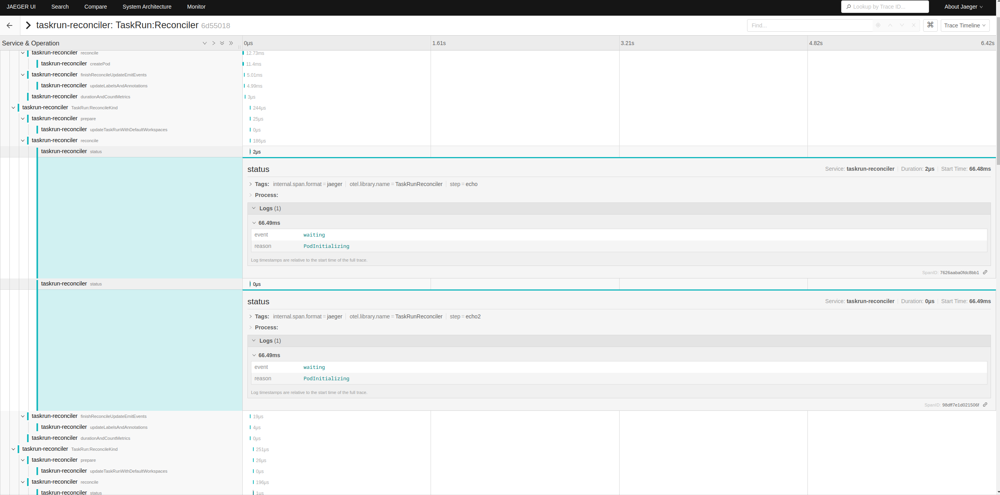
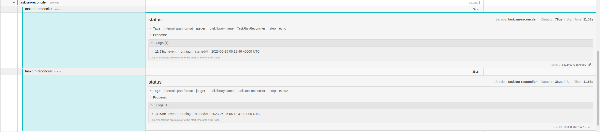
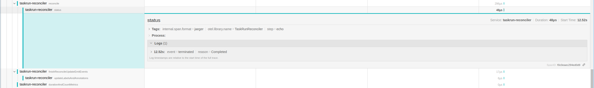

# TEP-0136: Capture traces for task pod events

<!-- toc -->
- [Summary](#summary)
- [Motivation](#motivation)
  - [Goals](#goals)
  - [Non-Goals](#non-goals)
  - [Use Cases](#use-cases)
  - [Requirements](#requirements)
- [Proposal](#proposal)
- [Design Details](#design-details)
  - [Capturing step status update](#capturing-step-status-update)
  - [POC](#poc)
- [Design Evaluation](#design-evaluation)
  - [Reusability](#reusability)
  - [Simplicity](#simplicity)
  - [Conformance](#conformance)
  - [Performance](#performance)
  - [Drawbacks](#drawbacks)
- [Implementation Plan](#implementation-plan)
  - [Test Plan](#test-plan)
  - [Implementation Pull Requests](#implementation-pull-requests)
- [References](#references)
<!-- /toc -->

## Summary

This proposal extends instrumentation of tekton pipelines to include traces for pod events. Currently only reconciler related events are recorded as traces. The proposal is to capture container Phases (Waiting -> Running -> Completed ) for each step of each task in the trace.

## Motivation

When we debug the performance of tekton pipelines, it is important to understand how much time is being spent on each step of the tasks. The total time of execution for a pipeline includes the time taken to initialize the pod, pull the images, run of init containers, sidecars etc. until completion. By tracing these phases, the end-users can easily visualize the steps in Jaeger UI.

### Goals

- Capture traces during phase change of a task pod
  - Creation of container and waiting for start
  - Running the container
  - Finish running the container
- Capture error and exit codes if the task was not successful due to failure in a step


### Non-Goals

- Tracing individual lines of each step
- Tracing sidecars

### Use Cases

As a pipeline user:
- I would like to understand the time taken by each step in a task so that I can optimize for performance
- I would like to visualize the task steps in Jaeger to get a better understanding of the flow

### Requirements

- Enable tracing and provide Jaeger endpoint URL to the operator

## Proposal

`TaskRun` status already keeps track of the state of each step in the task, based on container statuses in the pod. The idea is to raise a trace event during transition of a step state.


## Design Details

When a `TaskRun` is created in the cluster, the status field of the taskrun is updated as per the example below,

```
status:
  conditions:
  - lastTransitionTime: "2023-02-14T08:43:51Z"
    message: 'pod status "Ready":"False"; message: "containers with unready status:
      [step-echo step-echo2]"'
    reason: Pending
    status: Unknown
    type: Succeeded
  podName: hello-task-run-pod
  startTime: "2023-02-14T08:43:41Z"
  steps:
  - container: step-echo
    name: echo
    waiting:
      reason: PodInitializing
  - container: step-echo2
    name: echo2
    waiting:
      reason: PodInitializing
  taskSpec:
    steps:
    ...
```

### Capturing step status update

The `reconcile` method calls `MakeTaskRunStatus` method to updates the step status fields based on container status. We can keep a copy of `tr.Status.Steps` and compare it with the same after this method is called to determine state transition. It is important to raise events only during state transition so that jaeger doesn't get flooded with duplicate events. The logic is similar to how Kubernetes events are raised in `finishReconcileUpdateEmitEvents` method.

Code block example:

```
// Duplicate stepstates
beforeSteps := make([]v1beta1.StepState, len(tr.Status.Steps))
copy(beforeSteps, tr.Status.Steps)

// Existing method call to determine new states
// Convert the Pod's status to the equivalent TaskRun Status.
tr.Status, err = podconvert.MakeTaskRunStatus(ctx, logger, *tr, pod, c.KubeClientSet, rtr.TaskSpec)


// Returns true if stepstate has changed from beforeSteps
if hasStepStateChanged(beforeSteps, tr.Status.Steps) {
    // raise events

    if st.Waiting != nil {
        span.AddEvent("waiting", trace.WithAttributes(attribute.String("reason", st.Waiting.Reason)))
    }
    if st.Running != nil {
        span.AddEvent("running", trace.WithAttributes(attribute.String("startedAt", st.Running.StartedAt.String())))
    }
    if st.Terminated != nil {
        span.AddEvent("terminated", trace.WithAttributes(attribute.String("reason", st.Terminated.Reason)))
    }
}

```

### POC

The following screenshot shows how the pod status is shown when the container is in `PodInitializing` phase.



Similarly, the images below shows `Running` and `Completed` phases respectively.






## Design Evaluation
<!--
How does this proposal affect the api conventions, reusability, simplicity, flexibility
and conformance of Tekton, as described in [design principles](https://github.com/tektoncd/community/blob/master/design-principles.md)
-->

### Reusability

<!--
https://github.com/tektoncd/community/blob/main/design-principles.md#reusability

- Are there existing features related to the proposed features? Were the existing features reused?
- Is the problem being solved an authoring-time or runtime-concern? Is the proposed feature at the appropriate level
authoring or runtime?
-->

This feature addresses runtime concerns of TaskRuns. It uses the step states under TaskRun status to determine the transition time of container phases. Taskrun status does not keep track of previous states, which is why this feature is important.

### Simplicity

<!--
https://github.com/tektoncd/community/blob/main/design-principles.md#simplicity

- How does this proposal affect the user experience?
- What’s the current user experience without the feature and how challenging is it?
- What will be the user experience with the feature? How would it have changed?
- Does this proposal contain the bare minimum change needed to solve for the use cases?
- Are there any implicit behaviors in the proposal? Would users expect these implicit behaviors or would they be
surprising? Are there security implications for these implicit behaviors?
-->

This feature improves user experience by giving more visibility into the timing of each task. Currently we can determine the total time taken to run each task. But, the total time may also include time taken for the pod to be scheduled, pulling of images etc. This feature allows more visiblity into this hidden steps.

### Flexibility

<!--
https://github.com/tektoncd/community/blob/main/design-principles.md#flexibility

- Are there dependencies that need to be pulled in for this proposal to work? What support or maintenance would be
required for these dependencies?
- Are we coupling two or more Tekton projects in this proposal (e.g. coupling Pipelines to Chains)?
- Are we coupling Tekton and other projects (e.g. Knative, Sigstore) in this proposal?
- What is the impact of the coupling to operators e.g. maintenance & end-to-end testing?
- Are there opinionated choices being made in this proposal? If so, are they necessary and can users extend it with
their own choices?
-->

There are no additional dependencies with this proposal. The idea is to enhance the existing tracing feature to include more usable information as part of the traces.

### Conformance

<!--
https://github.com/tektoncd/community/blob/main/design-principles.md#conformance

- Does this proposal require the user to understand how the Tekton API is implemented?
- Does this proposal introduce additional Kubernetes concepts into the API? If so, is this necessary?
- If the API is changing as a result of this proposal, what updates are needed to the
[API spec](https://github.com/tektoncd/pipeline/blob/main/docs/api-spec.md)?
-->

This feature has no implications on the APIs

### Performance

<!--
(optional)

Consider which use cases are impacted by this change and what are their
performance requirements.
- What impact does this change have on the start-up time and execution time
of TaskRuns and PipelineRuns?
- What impact does it have on the resource footprint of Tekton controllers
as well as TaskRuns and PipelineRuns?
-->

The performance impact of this change is negligible. The traces are pushed to the receiver asynchronously in the background without blocking main threads. This proposal only adds a very small payload to the existing traces.

### Drawbacks

<!--
Why should this TEP _not_ be implemented?
-->
This is an enhancement to an already existing feature. There are no drawbacks as far as we know.


## Implementation Plan

<!--
What are the implementation phases or milestones? Taking an incremental approach
makes it easier to review and merge the implementation pull request.
-->


### Test Plan

<!--
Consider the following in developing a test plan for this enhancement:
- Will there be e2e and integration tests, in addition to unit tests?
- How will it be tested in isolation vs with other components?

No need to outline all the test cases, just the general strategy. Anything
that would count as tricky in the implementation and anything particularly
challenging to test should be called out.

All code is expected to have adequate tests (eventually with coverage
expectations).
-->

Integration tests can be added to make sure the pod phases are captured correctly. This feature itself is used for testing and debugging, so there is no point in adding e2e tests.

### Implementation Pull Requests

<!--
Once the TEP is ready to be marked as implemented, list down all the GitHub
merged pull requests.

Note: This section is exclusively for merged pull requests for this TEP.
It will be a quick reference for those looking for implementation of this TEP.
-->

## References

<!--
(optional)

Use this section to add links to GitHub issues, other TEPs, design docs in Tekton
shared drive, examples, etc. This is useful to refer back to any other related links
to get more details.
-->

* [TEP-0124: Distributed tracing for Tasks and Pipelines](https://github.com/tektoncd/community/blob/main/teps/0124-distributed-tracing-for-tasks-and-pipelines.md)
