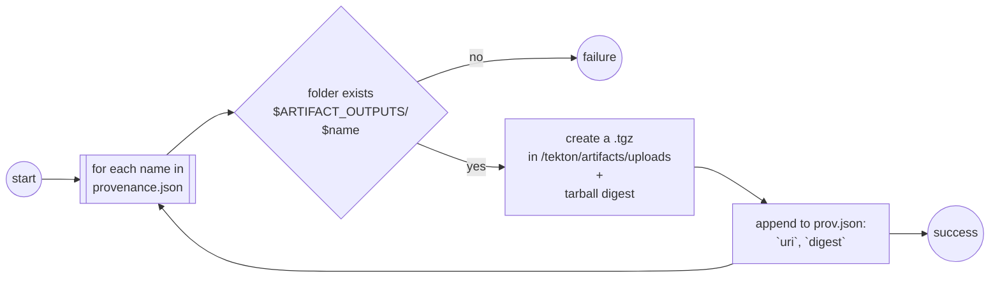
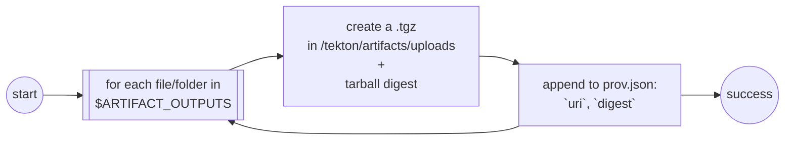

# TEP-0139: Trusted Artifacts
---

<!-- toc -->
- [Summary](#summary)
- [Motivation](#motivation)
  - [Goals](#goals)
  - [Non-Goals](#non-goals)
  - [Use Cases](#use-cases)
  - [Requirements](#requirements)
- [Proposal](#proposal)
  - [Steps Interface Specification](#steps-interface-specification)
    - [Provenance Files](#provenance-files)
      - [<code>uri</code>](#uri)
      - [<code>digest</code>](#digest)
      - [Multiple Versions](#multiple-versions)
  - [Artifact Provenance](#artifact-provenance)
    - [From Step into Status](#from-step-into-status)
    - [From Status into Variables and Files](#from-status-into-variables-and-files)
      - [Variables for Pipeline authors](#variables-for-pipeline-authors)
      - [Variables for Task authors](#variables-for-task-authors)
      - [List of artifacts](#list-of-artifacts)
      - [Inputs](#inputs)
      - [Outputs](#outputs)
  - [Artifacts API](#artifacts-api)
    - [Example Producer Task](#example-producer-task)
    - [Example Consumer Task](#example-consumer-task)
    - [Example Pipeline](#example-pipeline)
  - [Steps Implementation](#steps-implementation)
    - [Digest](#digest)
    - [Upload](#upload)
    - [Download](#download)
    - [Verification](#verification)
  - [Artifact Workspace](#artifact-workspace)
  - [Notes and Caveats](#notes-and-caveats)
- [Design Details](#design-details)
- [Design Evaluation](#design-evaluation)
  - [Reusability](#reusability)
  - [Simplicity](#simplicity)
  - [Flexibility](#flexibility)
  - [Conformance](#conformance)
  - [User Experience](#user-experience)
  - [Performance](#performance)
  - [Risks and Mitigations](#risks-and-mitigations)
  - [Drawbacks](#drawbacks)
- [Alternatives](#alternatives)
- [Implementation Plan (TBD)](#implementation-plan-tbd)
  - [Test Plan](#test-plan)
  - [Infrastructure Needed](#infrastructure-needed)
  - [Upgrade and Migration Strategy](#upgrade-and-migration-strategy)
  - [Implementation Pull Requests](#implementation-pull-requests)
  - [References](#references)
<!-- /toc -->

## Summary

This TEP proposes to build a chain of trust for data shared between Tasks by moving the responsibility of transferring data to/from shared storage to a set of trusted steps, with a well defined interface, that hash data before upload and verify the hash after download.
To avoid wasteful copy data, these trusted step need better granularity than that provided today by `Workspaces`. To that end we introduce the concept of `Artifact`, which identifies a chunk of data either consumer or produced by a `Task`.

The introduction of trusted steps and the concept of `Artifacts` will strengthen the chain of trust of pipelines executed by Tekton, and will improve the process of producing provenance document in collaboration with Tekton chains.

## Motivation

The Tekton runtime model maps the execution of a `Task` (i.e. `TaskRun`) to a Kubernetes `Pod` and the execution of `Pipeline` (i.e. `PipelineRun`) to a collection of `Pods`. `Tasks` in a `Pipeline` may share data using the `Workspace` abstraction, which can be bound to a persistent volume (or `PV`) in Kubernetes. Because of the nature of `PVs`, a downstream `TaskRun` has no way of knowing whether the content of a `workspace` it receives as input has been tampered with.

Using existing Tekton capabilities, a producer and a consumer task could safely share artifacts in a workspace, like a file or a folder, by introducing extra steps that calculate the digest, upload, download and verify artifacts, as shown by this [demo `PipelineRun`](https://gist.github.com/afrittoli/3e7600eac3172a9f683f294610218635).


The digest, upload, download and verify steps are defined and controller by users. The process production and consumption of provenance data relies on Tekton object results and parameters.

This implementation suffers from a few limitations:

- No interface defined for steps: there is no common format defined for the inputs and outputs of the four steps
- Verbosity: Tasks that want to safely produce and consume artifacts must define the parameters/results needed and prepend/append the corresponding steps.
- Sharing the provenance data relies on parameters and results rather than a mechanism dedicated to artifact
- Users are responsible for the definition of the steps. This can also be considered an advantage, as it gives users flexibility to provide their implementation, but it also means that the whole chain of trust relies on trusting the implementation provided by the user.
- Steps must be copy/pasted every time they're used. Note that this will be more generally addressed by [TEP-0142 step reusability](https://github.com/tektoncd/community/pull/1065).

This works aims to overcome these limitations.

### Goals

- Provide a layered set of functionality:
  1. a standard interface for the steps required to produce and consumer artifacts within a `PipelineRun` while maintaining the chain of trust
  1. a mechanism for surfacing artifact provenance data to the `TaskRun` status
  1. a mechanism for making the artifact provenance data of a `TaskRun` available to downstream `TaskRuns` through variables
  1. an API for users to declare upfront artifacts consumed and produced by `Tasks`
  1. an out-of-the-box mechanism to safely share artifacts and their provenance data between `Tasks` through a reference implementation of the steps required, automatic injection of the steps and provisioning of the required storage
- Improve the current mechanism of collecting provenance by Tekton Chains that relies on type hinting
- Contribute to the chain of trust by allowing consumer `Tasks` to trust artifacts on a `Workspace` from producer `Tasks`, as long as `TaskRun` status can be trusted.

### Non-Goals

- Provide a set of upload and download steps for different storages. The proposal only considers the `workspace` storage as a default implementation managed by Tekton
- Provide a mechanism for Tekton to inject user-defined digest, verify, upload and download steps, when the artifact API is used. Users can still benefit from the step interface and adopt user-defined steps when not using the artifact API to declare artifacts upfront
- This proposal does not discuss how to expose artifacts outside of a pipeline, even though it sets foundations that could be used to achieve that
- This proposal does not discuss how to inject artifact as inputs to a pipeline, even though it sets foundations that could be used to achieve that. For instance, one could use a workspace pre-provisioned with artifacts and use artifact type params as inputs for a pipeline

### Use Cases

This TEP contributes to the achievements of the following use cases:

- Achieve SLSA L3 supply chain security through Tekton `PipelineRuns`
- End-to-end trust of the provenance produced by Tekton Chains for Tekton `PipelineRuns`
- Seamless and secure sharing of artifacts between `Tasks` in a `Pipeline` for artifacts defined upfront through the `Artifacts` API
- Secure sharing of artifacts between `Tasks` in a `Pipeline` through user defined steps for artifacts only defined at run time through their user-generated provenance

### Requirements

Support the following combinations:

- One producer, one consumer
- One producer, N consumers, including with write-one, read-many storage class
- Many producers, one consumer
- Many producers, many consumers, including with write-one, read-many storage class
- Fail execution if checksum validation fail, surface error to TaskRun/PipelineRun failure reason
- Automatically provision a volume if none is available and artifacts are used

## Proposal

Define the interface for the *download*, *verify*, *digest* and *upload* steps and how the information they consume and produced is shared across `Tasks`. Define an *artifact* API to let `Tasks` define input and output artifacts upfront as well as a default implementation of the four steps with automatic workspace provisioning.

The following chapters in the proposal describe in details the proposed phased implementation approach:

- [steps interface](#steps-interface-specification)
- [surfacing artifact provenance into the status](#from-step-into-status)
- [exposing artifact provenance through variables](#from-status-into-variables-and-files)
- [artifact API](#artifacts-api)
- [default steps implementation](#steps-implementation)
- [artifact workspace](#artifact-workspace)

### Steps Interface Specification

Steps in Tekton do not have a YAML-based API. This may change one [TEP-0142 - Reusable Steps](https://github.com/tektoncd/community/pull/1065) is implemented, but only for reusable steps. Inlined steps will continue same as today.
In the absence of a YAML API, the step interface is defined as a combination of **input and output files and folders**:

- Provenance files: `/tekton/artifacts/**/provenance.json`
- Tarred artifacts: `/tekton/artifacts/**/<digest>.tgz` or `/tekton/artifacts/**/<name>.tgz`
- Artifacts: `/tekton/artifacts/**/<name>`

See the [list of artifacts](#list-of-artifacts) paragraph for more details about how lists are provided to steps.
The four steps use different combinations of those:

- `download` step: `/tekton/artifacts/downloads/provenance.json` (optional) -> [`/tekton/artifacts/downloads/<digest>.tgz`]
- `verify` step: [`/tekton/artifacts/downloads/<digest>.tgz`] -> `/tekton/artifacts/inputs/provenance.json`, [`/tekton/artifacts/inputs/<name>/`)]
- `digest` step: `/tekton/artifacts/downloads/provenance.json` (optional), [`/tekton/artifacts/outputs/<name>`] -> `/tekton/artifacts/outputs/provenance.json`, [`/tekton/artifacts/uploads/<name>.tgz`]
- `upload` step: [`/tekton/artifacts/uploads/<name>.tgz`] -> `/tekton/artifacts/uploads/provenance.json`

Steps that download, verify, digest and upload artifacts must be able to handle arrays of `artifacts` to be uploaded/downloaded to/from the same storage, hence the `[ ]` signs to indicate arrays of files and folders. The storage in scope for this TEP is a folder in a volume, typically mounted by the `Task` though a `Workspace`.

Implementations can provide the four steps independently, or aggregate `download` with `verify` and/or `digest` with `upload`.
The implementation of or aggregated steps MUST still consume the inputs of the first step and produce *all* outputs, from the first and second step.

The [artifact provenance](#artifact-provenance) section describes how steps inputs and outputs are bound with the `Tasks` and `Pipelines`.
More details are described in the [step implementation section](#steps-implementation).

#### Provenance Files

Provenance files are used for both inputs and outputs.
The `download` step MAY read a `provenance.json` with the list of artifacts to download and their expected digest.
The `verify` step produces a `provenance.json` with the list of artifacts to verified and their actual digest.
The `digest` step MAY read a `provenance.json` (with names only) and produces a `provenance.json` with the list of artifacts produced and their digest.
The `upload` step produces a `provenance.json` with the list of artifacts uploaded and their digest.

The file includes a list of maps, one per artifacts. Each `artifact` is described by three fields, `name`, `uri` and `digest`. 
The `uri` includes the artifact `name`, as shown in the [`uri specification`](#uri). 
Translated into YAML, an example content would be:

```yaml
- name: foo
  uri: pkg:generic/foo
  digest: sha256:8796357729cfd877cf8fa7d45a8ab3524d9249c23a0bf68bb0026c0783b881d2
- name: bar
  uri: pkg:generic/bar
  digest: sha256:33a06c928729e52d1991a2c55765a7c30ef72b098533f220f3f1d6f352fd32e8
```

This approach enables users who do not wish to use the [artifacts API](#artifacts-api) to use custom steps and still have provenance data injected into the `TaskRun` status.

##### `uri`

The `uri` component identifies an artifact within the artifact storage in use.
The storage itself is included as part of the `TaskRun` and `PipelineRun` definition.

The recommended format for the`uri` is [purl-generic](https://github.com/package-url/purl-spec/blob/master/PURL-TYPES.rst#generic). Example values:

- `pkg:generic/<name>`
- `pkg:generic/build`
- `pkg:generic/repo`
- `pkg:generic/test-results`
- `pkg:generic/sbom`

Each `uri` MUST contain an artifact `name`. Each `uri` and `name` MUST identify an artifact uniquely.

##### `digest`

The `digest` component includes the result of applying an hash function to the artifact itself.
The `digest` is in the format `hash-function:<digest>`. Example values:

- `md5:471a3a9ddc1d6e699190b9f4ca88aadf`
- `sha256:8796357729cfd877cf8fa7d45a8ab3524d9249c23a0bf68bb0026c0783b881d2`

##### Multiple Versions

In case of multiple version of the same artifact, the version information MUST be part of `name`, so that the four steps may treat them as individual artifacts, for instance:

- `pkg:generic/build-v1, sha256:33a06c928729e52d1991a2c55765a7c30ef72b098533f220f3f1d6f352fd32e8`
- `pkg:generic/build-v2, sha256:8796357729cfd877cf8fa7d45a8ab3524d9249c23a0bf68bb0026c0783b881d2`

### Artifact Provenance

This chapter defines the plumbing required in the Tekton controller to bring the artifact provenance data (`uri`, `digest`) from steps into the `TaskRun` status, and from `TaskRun` status into the context of dependent `TaskRuns`, through variable expansion.

#### From Step into Status

The artifact provenance data is extracted from the local storage using the same mechanism used for results. Results and artifacts data is collated together and stored either in the termination message or in a sidecar log, depending on configuration.
Artifact data is stored in the same way a object results would be stored, using the artifact name as key, and `uri` and `digest` in a serialized JSON string as value. Two new dedicated result types are introduced:

- `InputArtifactResultType = 4` for input artifacts
- `OutputArtifactResultType = 5` for output artifacts

For example:

```
Message: [{"key":"release","value":"https://storage.googleapis.com/tekton-releases/pipeline/previous/v0.50.2/release.yaml\n","type":1},{"key":"source","value":"{\"uri\":\"pkg:generic/source\",\"digest\":\"sha256:8796357729cfd877cf8fa7d45a8ab3524d9249c23a0bf68bb0026c0783b881d2\"}","type":4}{"key":"release-file","value":"{\"uri\":\"pkg:generic/release-file\",\"digest\":\"sha256:33a06c928729e52d1991a2c55765a7c30ef72b098533f220f3f1d6f352fd32e8\"}","type":5},{"key":"StartedAt","value":"2023-10-16T10:06:11.990Z","type":3}]
```

The key difference from an entrypoint point of view is that, unlike results, the list of expected artifact names may not be known in advance. In that case the entrypoint will process all folders available under `/tekton/artifacts/inputs/` for input artifacts and under `/tekton/artifacts/outputs/` for output artifacts.

The artifact data is then read by the Tekton `TaskRun` controller and copied stored into the `TaskRun` status:

```yaml
status:
  results:
  - name: release
    type: string
    value: |
      https://storage.googleapis.com/tekton-releases/pipeline/previous/v0.50.2/release.yaml
  inputs:
  - name: source
    uri: pkg:generic/source
    digest: sha256:8796357729cfd877cf8fa7d45a8ab3524d9249c23a0bf68bb0026c0783b881d2
  outputs:
  - name: release-file
    uri: pkg:generic/release-file
    digest: sha256:33a06c928729e52d1991a2c55765a7c30ef72b098533f220f3f1d6f352fd32e8
```

#### From Status into Variables and Files

The `TaskRun` provenance status is published by the `PipelineRun` controller to downstream `PipelineTasks` (consumers) through dedicated variables.
References to variables are validated by the `Pipeline` validation webhook.
The use of these references in a `PipelineTask` creates a dependency between `PipelineTasks` which affects the resulting execution DAG.

##### Variables for Pipeline authors

Two following two variables are available for `Tasks` that do not use the [artifacts API](#artifacts-api).
They allow downstream `PipelineTasks` to have access to the list of artifacts consumed and produced by other specific `PipelineTasks`.

- `$(tasks.<pipelinetask-name>.inputs)` - a string, serialized JSON representation of the `status.input` of `<pipelinetask-name>`
- `$(tasks.<pipelinetask-name>.output)` - a string, serialized JSON representation of the `status.output` of `<pipelinetask-name>`

They can be passed to a `PipelineTask` parameter, for the `Task` with to use. They cannot be used in combination with the [artifacts API](#artifacts-api).

For `Task` that define input and outputs artifact upfront through the [artifacts API](#artifacts-api), additional variables are available, to be used in the `Pipeline` definition, within the `PipelineTask` specification:

- `$(tasks.<pipelinetask-name>.outputs.<artifact-name>` - a map, it can only be used to bind an input artifact

##### Variables for Task authors

For `Task` that define input and outputs artifact upfront through the [artifacts API](#artifacts-api), the following variables are available:

- `$(inputs.<artifact-name>.uri)` - a string
- `$(inputs.<artifact-name>.digest)` - a string
- `$(outputs.<artifact-name>.uri)` - a string
- `$(outputs.<artifact-name>.digest)` - a string

##### List of artifacts

It is very convenient, for download, verify, digest and upload steps, and possibly for others as well, to have access to artifacts as an array.
This enables step to easily loop over the list and do something for each artifact.

##### Inputs

The content of the list of artifacts changes depending on whether the [artifacts API](#artifacts-api) is used or not:
- when used: the list of artifacts is restricted to those defined in the API
- when **not** used: the list of input artifacts is **not** defined as the `Task` may want to access any upstream artifact. Since `Tasks` are authored in isolation from `Pipelines`, they have no knowledge of upstream `Tasks`. One option could be to consider a list with all artifacts produced by all upstream `Tasks`, and let the user-defined download logic filter what it needs

Since each artifact is a map, artifacts are described a list of maps, which are not yet supported by parameters and results.
There are a few ways we can make the list available in steps:

- Variable: an `$(inputs.array)` that contains a serialized JSON array of maps
- File: a `provenance.json` file injected in the `/tekton/artifacts/downloads` folder. This file could be injected by the entrypoint, symmetrically to the way the entrypoint parses results from the termination message

##### Outputs

The content of the list of artifacts changes depending on whether the [artifacts API](#artifacts-api) is used or not:

  - when used: the list of expected output artifacts is known in advance, steps can use it to validate that all outputs have been produced
  - when **not** used: steps can only use what is produced in folders, so no list exists

There are a few ways we can make the list available in steps:

- Variable: an `$(outputs.array)` that contains a serialized JSON array of names
- File: a `provenance.json` file, with only names, injected in the `/tekton/artifacts/outputs` folder. This file could be injected by the entrypoint, symmetrically to the way the entrypoint parses results from the termination message

### Artifacts API

The artifacts API lets Tekton `Task` authors define upfront artifacts consumed and produced by ` Task`.
It also let `Pipeline` author connect `PipelineTasks` through artifact, by "piping" a `PipelineTask` output artifact into another `PipelineTask` input artifact.

The artifacts API defines:
- `spec.inputs`: list of input artifacts, which are defined similarly to object-type parameters, with a fixed set of properties (`uri`, `digest`)
- `spec.outputs`: list of output artifacts, which are defined similarly to object-type results, with a fixed set of properties (`uri`, `digest`)

#### Example Producer Task

```yaml
apiVersion: tekton.dev/v1
kind: Task
metadata:
  name: trusted-producer
spec:
  outputs:
    - name: foo
      description: An output folder
  steps:
    - name: produce-file
      image: bash:latest
      env:
        - name: FOO_PATH
          value: $(inputs.foo.path) # resolves to /tekton/artifacts/outputs/foo/
      script: |
        #!/usr/bin/env bash
        # Produce some content. 
        date +%s | tee "${FOO_PATH}/afile.txt"
```

#### Example Consumer Task

```yaml
apiVersion: tekton.dev/v1
kind: Task
metadata:
  name: trusted-producer
spec:
  inputs:
    - name: bar
      description: An input folder
  steps:
    - name: consume-file
      image: bash:latest
      env:
        - name: BAR_PATH
          value: $(inputs.bar.path) # resolves to /tekton/artifacts/inputs/bar/
        - name: BAR_DIGEST
          value: $(inputs.bar.digest)
      script: |
        #!/usr/bin/env bash
        # Consume some content. 
        # The variable "$(inputs.bar.path)" resolves to 
        echo "Folder content: $(ls ${BAR_PATH})"
        echo "Content digest: ${BAR_DIGEST}"
```

#### Example Pipeline

```yaml
apiVersion: tekton.dev/v1
kind: Pipeline
metadata:
  generateName: trusted-artifacts
spec:
  tasks:
    - name: producer
      taskRef:
        name: trusted-producer
    - name: consumer
      taskRef:
        name: trusted-consumer
      inputs:
        - name: bar
          value: $(tasks.producer.foo)
```

### Steps Implementation

Steps are implemented as a single go binary that takes command line arguments to implement the logic of the four different steps.
The go binary is built for all Tekton supported architectures and OSes. The steps point to the multi-arch image manifest so that the container runtime may download the correct version.

#### Digest

```
`/tekton/artifacts/downloads/provenance.json` (optional), [`/tekton/artifacts/outputs/<name>`] -> `/tekton/artifacts/outputs/provenance.json`, [`/tekton/artifacts/uploads/<name>.tgz`]
```

The `digest` step creates an archive and calculates the digest of an array of artifacts from the local `${ARTIFACT_OUTPUTS}:-/tekton/artifacts/outputs/}` storage, based on an optional list of artifact names, defined in the `/tekton/artifacts/downloads/provenance.json` provenance file:
- when the `provenance.json` file is provided, the `digest` step searches for each `name` in the `$ARTIFACT_OUTPUTS` folder, and fail if at least one is not found



- when the `provenance.json` file is not provided, the `digest` step considers any file or folder in the `$ARTIFACT_OUTPUTS` folder as an artifact. This enables use cases where the list of artifact is not known upfront.



The resulting provenance file contains the digest of all tarballs, stored under `/tekton/artifacts/outputs/provenance.json`.

#### Upload

```
[`/tekton/artifacts/uploads/<name>.tgz`] -> `/tekton/artifacts/uploads/provenance.json`
```

The `upload` step takes the outputs of the `digest` one, an array of tarballs and a `provenance.json` file with their digests, and uploads them to specific path with the PVC. To reduce the need to for extra parameters, the step will assume that the workspace is mounted to the `/tekton/artifacts/shared` path, and it will copy the artifacts under a `PipelineRun` specific location:

```
/tekton/artifacts/shared/<pipelinerun-uuid>/<digest.tgz>
```

Consumers will use the provenance data from the `TaskRun` status to associate the digest in the filename back to an artifact name.
Using the digest as filename ensures there is no name conflict within the `pipelinerun-uuid` folder.
A `pipelinerun-uuid` folder is needed to avoid the risk of `PipelineRuns` sharing artifacts in case the PVC is re-used for multiple `PipelineRuns`.

#### Download

```
`/tekton/artifacts/downloads/provenance.json` (optional) -> [`/tekton/artifacts/downloads/<digest>.tgz`]
```

#### Verify

```
[`/tekton/artifacts/downloads/<digest>.tgz`] -> `/tekton/artifacts/inputs/provenance.json`, [`/tekton/artifacts/inputs/<name>/`)]
```

### Artifact Workspace

When the [artifact API](#artifacts-api) is used, the default [implementation of steps](#steps-implementation) is injected by the Tekton controller.
Those steps rely on a shared folder being available through a `Workspace`.

When only one `Workspace` is defined by the `Pipeline`, it will be used for artifact sharing purposes, as long as all `Tasks` using artifacts are bound to it.
When more than one `Workspace` is defined by the `Pipeline`, the only one that is bound to all `Tasks` that use artifacts will be selected for artifacts sharing purposes. When more than one such `Workspaces` exists, the user must select the workspace to be used. This may be done, as a last resort, via a dedicated API field (TBD).

To make the user experience as seamless as possible in many use cases, the `Workspace` used to share artifact should be transparent to users.
Ideally `Tasks` and `Pipelines` shall not define a `Workspace` for the sole purpose of sharing artifacts and the Tekton controller could define be responsible for provisioning and attaching the volume. This feature needs to be designed so that auto-provisioning is only used when workspace based steps are used.

Auto-provisioning of the artifact workspace will require careful design and is considered out-of-scope for this TEP.

### Notes and Caveats

Some questions raised during the initial presentation:

* Q: Can we restrict access to the persistent volumes to the injected steps? Maybe using TEP-0029
* A: We could mount the workspace to injected steps instead of relying on propagated workspaces. This would not prevent users from mounting the workspace to other steps / sidecars though, unless we add validation to prevent that. However that would mean that a consumer could not use the artifact workspace to produce another artifact, which would be problematic

* Q: Using an emptyDir secures the data, but may be less performant than writing directly
* A: On the producing side, we need to let users write to an `emptyDir`, and the injected step will calculate the hash and then copy the data to the workspace. On the consuming side, we need to copy data to an `emptyDir` and then verify the checksum, or else we cannot be sure that the data has not been compromised after the checksum verification

* Q: Controller could be the one that has access to write the files to the artifact storage
* A: Using the Tekton controller to transfer data for all `TaskRuns` would turn it into an I/O bottleneck. We could conceive a Tekton managed service where artifact are uploaded to/downloaded from, but for this proposal I wanted to rely on the existing workspace as a baby-step forward. Once that is in place, we can introduce different kinds of backends. The beauty of it is that we can switch the implementation behind the scenes with no impact on the user interface and thus no impact on existing tasks and pipelines

* Q: How do user specify path to artifacts on the producing side
* A: They don't: producers must write their artifact to `$(results.<name>.data.path)`. The controller decides what that corresponds to. In the initial iteration that will be a folder on the artifact workspace. It may change in future implementations, but the user interface will remain the same

* Q: If an Artifact needs to be consumed by multiple Tasks, do we need a lock?
* A: We don't need a lock, but we need to copy the artifact to the Pod local disk (`emptyDir`) first, then verify the checksum, and then hand-off control to the user

* Q: What about the flexibility of the (injected) steps?
* A: The implementation for workspace (this TEP) won't be flexible. In future we will introduce support for other kind of backends, and perhaps user-defined ones, which means we may need to give users a way to define what the upload/download steps look like. I purposefully wanted to steer away from that complexity in this proposal.

* Q: Is the path/hash to be used for provenance generation?
* A: This proposal is only meant for tasks to securely share artifact between each other. Provenance generation is interested in input and output artifacts instead. That said, this proposal is designed so that it may be used and extended for input and output artifacts as well, in which case the artifact metadata will become relevant from a provenance point of view.

* Q: What happens if the artifacts do not fit the local file system?
* A: The space available depends very much on the node and cluster setup of the infrastructure where Tekton is running. For use cases where very large amounts of data are required, enough that would not fit in the space available to the Pod `emptyDir`, this solution is not suitable. Such use cases will require a different solution that may involve content addressable storage or storage with strict access control rules in place.


## Design Details

TBD


## Design Evaluation


### Reusability

Adopting trusted artifacts would require users to make changes to their Tasks and Pipelines, albeit minimal ones.

### Simplicity

The proposed functionality relies as much as possible on existing Tekton features, it uses a syntax that users are already familiar with by extending it consistently.

### Flexibility

The proposed functionality relies on workspaces and `PVCs`, however it could easily be extended to support additional storage formats. In terms of flexibility of adoption in pipelines, there are no assumptions made on the `Tasks` and `Pipelines` where this is used.

The artifact schema could extended in future, or it could support custom fields to be specified by users in the same way they do today for object parameters and results, to allow users to attach additional metadata to their artifacts/


### Conformance

TBD

### User Experience

The API surface change is minimal and consistent with the API that users are familiar with today.

### Performance

Injected steps would impact the execution of `TaskRuns` and `PipelineRuns`, however impact should be minimal:
- a single producer and consumer step can be used to handle multiple artifacs to avoid the overhead of one container per artifact
- steps shall be injected only where needed
- the ability to use `workspaces` means that minimal extra data I/O is required:
  - tar/untar folders for hashing purposes
  - copy data on the consuming side to avoid dirty reads

### Risks and Mitigations

N/A

### Drawbacks

N/A

## Alternatives

We could document the demo pipeline and let users apply that approach explicitly in their pipelines.


## Implementation Plan (TBD)

###  Test Plan

### Infrastructure Needed

### Upgrade and Migration Strategy

### Implementation Pull Requests

### References
