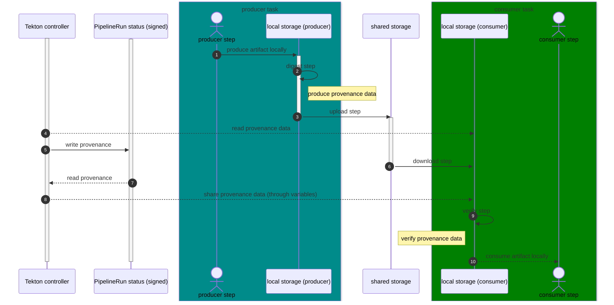
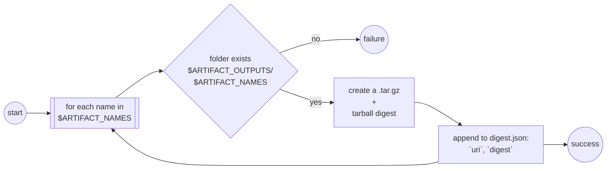
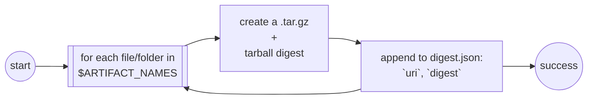

# TEP-0139: Trusted Artifacts
---

<!-- toc -->
- [Summary](#summary)
- [Motivation](#motivation)
  - [Goals](#goals)
  - [Non-Goals](#non-goals)
  - [Use Cases](#use-cases)
  - [Requirements](#requirements)
- [Proposal](#proposal)
  - [Notes and Caveats](#notes-and-caveats)
- [Design Details](#design-details)
- [Design Evaluation](#design-evaluation)
  - [Reusability](#reusability)
  - [Simplicity](#simplicity)
  - [Flexibility](#flexibility)
  - [User Experience](#user-experience)
  - [Performance](#performance)
  - [Risks and Mitigations](#risks-and-mitigations)
  - [Drawbacks](#drawbacks)
- [Alternatives](#alternatives)
- [Implementation Plan](#implementation-plan)
  - [Test Plan](#test-plan)
  - [Infrastructure Needed](#infrastructure-needed)
  - [Upgrade and Migration Strategy](#upgrade-and-migration-strategy)
  - [Implementation Pull Requests](#implementation-pull-requests)
- [References](#references)
<!-- /toc -->

## Summary

This TEP proposes to build a chain of trust for data shared between Tasks by moving the responsibility of transferring data to/from shared storage to a set of trusted steps, that hash data before upload and verify the hash after download.
To avoid wasteful copy data, these trusted step need better granularity than that provided today by `Workspaces`. To that end we introduce the concept of `Artifact`, which identifies a chunk of data either consumer or produced by a `Task`.

The introduction of trusted steps and the concept of `Artifacts` will strengthen the chain of trust of pipelines executed by Tekton, and will improve the process of producing provenance document in collaboration with Tekton chains.

## Motivation

The Tekton runtime model maps the execution of a `Task` (i.e. `TaskRun`) to a Kubernetes `Pod` and the execution of `Pipeline` (i.e. `PipelineRun`) to a collection of `Pods`. `Tasks` in a `Pipeline` may share data using the `Workspace` abstraction, which can be bound to a persistent volume (or `PV`) in Kubernetes. Because of the nature of `PVs`, a downstream `TaskRun` has no way of knowing whether the content of a `workspace` it receives as input has been tampered with.

Using existing Tekton capabilities, a producer and a consumer task could safely share artifacts in a workspace, like a file or a folder, by introducing extra steps that calculate the digest, upload, download and verify artifacts, as shown by this [demo `PipelineRun`](https://gist.github.com/afrittoli/3e7600eac3172a9f683f294610218635).



 The digest, upload, download and verify steps are defined and controller by users. The process production and consumption of provenance data relies on Tekton object results and parameters.

This implementation suffers from a few limitations:

- No interface defined for steps: there is no common format defined for the inputs and outputs of the four steps
- Verbosity: Tasks that want to safely produce and consume artifacts must define the parameters/results needed and prepend/append the corresponding steps.
- Users are responsible for the definition of the steps. This can also be considered an advantage, as it gives users flexibility to provide their implementation, but it also means that the whole chain of trust relies on trusting the implementation provided by the user.
- Steps must be copy/pasted every time they're used. Note that this will be more generally addressed by [TEP-0142 step reusability](https://github.com/tektoncd/community/pull/1065).

This works aims to overcome these limitations and provide users with a out-of-the-box mechanism to safely share artifacts and their provenance data between Tasks.

### Goals

- Define an common interface for inputs and outputs of steps that produce and consume artifacts
- Define an API that let Tekton users specify input and output artifacts in `Tasks`, so that digest, verify, upload and download may happen transparently for users
- Contribute to the chain of trust by allowing consumer `Tasks` to trust artifacts on a `Workspace` from producer `Tasks`, as long as results can be trusted. 

### Non-Goals

- Provide a set of upload and download steps for different storages. The proposal only considers the `workspace` storage as a default implementation managed by Tekton.
- Provide a mechanism for Tekton to inject user-defined digest, verify, upload and download steps. Users may still benefit from the common format 
- This proposal does not discuss how to expose artifacts outside of a pipeline, even though it sets foundations that could be used to achieve that
- This proposal does not discuss how to inject artifact as inputs to a pipeline, even though it sets foundations that could be used to achieve that. For instance, one could use a workspace pre-provisioned with artifacts and use artifact type params as inputs for a pipeline

### Use Cases

- Extend the chain of trust across Tasks for provenance produced by Tekton Chains based on the `TaskRuns` and `PipelineRuns` executed by Tekton Pipeline

### Requirements

Support the following combinations:

- One producer, one consumer
- One producer, N consumers, including with write-one, read-many storage class
- Many producers, one consumer
- Many producers, many consumers, including with write-one, read-many storage class
- Fail execution if checksum validation fail, surface error to TaskRun/PipelineRun failure reason
- Automatically provision a volume if none is available and artifacts are used

## Proposal

### Steps Interface Specification

Steps that download, verify, digest and upload artifacts must be able to handle arrays of `artifacts` to be uploaded/downloaded to/from the same storage. The storage in scope for this TEP is a folder in a volume, typically mounted by the `Task` though a `Workspace`.

Each `artifact` is described by two fields, `uri` and `digest`. The `uri` includes the artifact `name`, as shown in the [`uri specification`](#uri). An overview of how `uri` and `digest` are used by steps is provided below:

- `download` step: [(`uri`, expected `digest`)] -> [`/tekton/artifacts/downloads/<digest>.tgz`]
- `verify` step: [`/tekton/artifacts/downloads/<digest>.tgz`] -> [(`verified`, `/tekton/artifacts/inputs/<name>/`)]
- `digest` step: [`<name>`] -> [(`uri`, `digest`, `/tekton/artifacts/uploads/<name>.tgz`)]
- `upload` step: [`/tekton/artifacts/outputs/<name>.tgz`] -> [(`uri`, `digest`)]

The full details are described in the [step implementation section](#steps-implementation).

The data in `uri` and `digest` could be used by steps to produce provenance data for input artifacts (aka "materials") and output artifacts (aka "products") to be added to `TaskRun.status.provenance`. This functionality is not the scope for this TEP, but the design takes it into account.

#### `uri`

The `uri` component identifies an artifact within the artifact storage in use.
The storage itself is included as part of the `TaskRun` and `PipelineRun` definition.

The `uri` is in [purl-generic](https://github.com/package-url/purl-spec/blob/master/PURL-TYPES.rst#generic). Example values:

- `pkg:generic/<name>`
- `pkg:generic/build`
- `pkg:generic/repo`
- `pkg:generic/test-results`
- `pkg:generic/sbom`


#### `digest`

The `digest` component includes the result of applying an hash function to the artifact itself.
The `digest` is in the format `hash-function:<digest>`. Example values:

- `md5:471a3a9ddc1d6e699190b9f4ca88aadf`
- `sha256:8796357729cfd877cf8fa7d45a8ab3524d9249c23a0bf68bb0026c0783b881d2`

### Steps Implementation

Steps in Tekton do not have a YAML-based API. This may change one [TEP-0142 - Reusable Steps](https://github.com/tektoncd/community/pull/1065) is implemented, but only for reusable steps. Inlined steps will continue same as today.

Even without a YAML API, the step interface can be defined as a combination of input environment variables and files and output files.
Tekton will then map data coming from the Tekton API into the `download` step interface and data produced by the `upload` and `download` steps into the `TaskRun` status.

This approach enables users who do not wish to use the [artifacts API](#artifacts-api) to use custom steps and still have provenance data injected into the `TaskRun` status.

Steps are implemented as a single go binary that takes command line arguments to implement the logic of the four different steps.
The go binary is built for all Tekton supported architectures and OSes. The steps point to the multi-arch image manifest so that the container runtime may download the correct version.

#### Digest

```
[`ARTIFACT_NAMES`] -> [`/tekton/artifacts/uploads/<digest>.tgz`, `/tekton/artifacts/uploads/<digest>.json`]
```

The `digest` step creates and archive and calculates the digest of an array of artifacts from the local `${ARTIFACT_OUTPUTS}:-/tekton/artifacts/outputs/}` storage, based on a list of `names`:
- when the `ARTIFACT_NAMES` environment variables is set, the `digest` step searches for each `name` in the `$ARTIFACT_OUTPUTS` folder, and fail if at least one is not found



- when the `ARTIFACT_NAMES` environment variables is not set, the `digest` step considers any file or folder in the `$ARTIFACT_OUTPUTS` folder as an artifact. This enables use cases where the list of artifact is not known upfront.



#### Upload

TBD

#### Download

TBD

#### Verification

TBD


### Artifact Workspace

TBD

### Artifacts API

TBD

In short the proposal is to:

- extend parameters and result types to a new type `artifact`, an object type with a fixed schema
- extend the `Pod` logic in the controller to inject hashing and checking steps when required
- extend variable expansion to include `.data.path` for artifact parameters and results

The same pipeline from the demo, rewritten after implementation, is shown by this [demo pipeline](https://gist.github.com/afrittoli/7236be5fca524b752c221d2346497bb7):

<details>
  <summary>Demo Pipeline:</summary>

```yaml=
apiVersion: tekton.dev/v1
kind: PipelineRun
metadata:
  generateName: trusted-artifacts-sugar
spec:
  pipelineSpec:
    workspaces:
      - name: artifactStorage  # In this example this is where we store artifacts
        artifacts: true # this will result in failed validation if the workspace is bound to a readonly backend like a secret
    tasks:
      - name: producer
        taskSpec:
          results:
            - name: aFileArtifact
              type: artifact # inbuilt object schema (path, hash, type)
              description: An artifact file
            - name: aFolderArtifact
              type: artifact # inbuilt object schema (path, hash, type)
              description: An artifact folder
          steps:
            - name: produce-file
              image: bash:latest
              script: |
                #!/usr/bin/env bash
                # Produce some content. The result "data.path" will resolve to an empty dir
                date +%s | tee "$(results.aFileArtifact.data.path)/afile.txt"
                # The controller appends a step that calculates the hash, copies the data to
                # the workspace marked for artifacs, builds the object result json,
                # and stores it under $(results.aFileArtifact.path)
                # The type is detected from the context of $(results.aFileArtifact.data.path)
                # If it's a single file, it's type, if one or more files and folders it's folder
                # The hash is calculated and added to into the json.
            - name: produce-folder
              image: bash:latest
              script: |
                #!/usr/bin/env bash
                A_FOLDER_PATH=$(results.aFolderArtifact.path)/afolder
                mkdir "$A_FOLDER_PATH"
                date +%s | tee "${A_FOLDER_PATH}/a.txt"
                date +%s | tee "${A_FOLDER_PATH}/b.txt"
                date +%s | tee "${A_FOLDER_PATH}/c.txt"
      - name: consumer
        taskSpec:
          params:
            - name: aFileArtifact
              type: artifact # inbuilt object schema (path, hash, type)
            - name: aFolderArtifact
              type: artifact # inbuilt object schema (path, hash, type)
          steps:
            - name: consume-content
              image: bash:latest
              script: |
                #!/usr/bin/env bash
                # A step is prepended, which will automatically check the hashes
                # and fail the task with a specific reason if there is no match
                # The artifact is copied to local disk before the hash is checked
                # to protect from changes on the workspace and support the case
                # of a consumer with write access to the disk.
                # Do something with the verified content. 
                # The path from the object params corresponds to the result's "data.path"
                # The data.path variable corresponds to the local folder
                # and resolves to a path on the workspace
                echo "File content"
                cat $(params.aFileArtifact.data.path)
                echo "Folder content"
                find $(params.aFolderArtifact.data.path) -type f
        params:
          - name: aFileArtifact
            value: $(tasks.producer.results.aFileArtifact)
          - name: aFolderArtifact
            value: $(tasks.producer.results.aFolderArtifact)
  workspaces:
  - name: artifactStorage
    volumeClaimTemplate:
      spec:
        accessModes:
          - ReadWriteOnce
        resources:
          requests:
            storage: 1Gi
```

</details>

</br>

### Notes and Caveats

Some questions raised during the initial presentation:

* Q: Can we restrict access to the persistent volumes to the injected steps? Maybe using TEP-0029
* A: We could mount the workspace to injected steps instead of relying on propagated workspaces. This would not prevent users from mounting the workspace to other steps / sidecars though, unless we add validation to prevent that. However that would mean that a consumer could not use the artifact workspace to produce another artifact, which would be problematic

* Q: Using an emptyDir secures the data, but may be less performant than writing directly
* A: On the producing side, we need to let users write to an `emptyDir`, and the injected step will calculate the hash and then copy the data to the workspace. On the consuming side, we need to copy data to an `emptyDir` and then verify the checksum, or else we cannot be sure that the data has not been compromised after the checksum verification

* Q: Controller could be the one that has access to write the files to the artifact storage
* A: Using the Tekton controller to transfer data for all `TaskRuns` would turn it into an I/O bottleneck. We could conceive a Tekton managed service where artifact are uploaded to/downloaded from, but for this proposal I wanted to rely on the existing workspace as a baby-step forward. Once that is in place, we can introduce different kinds of backends. The beauty of it is that we can switch the implementation behind the scenes with no impact on the user interface and thus no impact on existing tasks and pipelines

* Q: How do user specify path to artifacts on the producing side
* A: They don't: producers must write their artifact to `$(results.<name>.data.path)`. The controller decides what that corresponds to. In the initial iteration that will be a folder on the artifact workspace. It may change in future implementations, but the user interface will remain the same

* Q: If an Artifact needs to be consumed by multiple Tasks, do we need a lock?
* A: We don't need a lock, but we need to copy the artifact to the Pod local disk (`emptyDir`) first, then verify the checksum, and then hand-off control to the user

* Q: What about the flexibility of the (injected) steps?
* A: The implementation for workspace (this TEP) won't be flexible. In future we will introduce support for other kind of backends, and perhaps user-defined ones, which means we may need to give users a way to define what the upload/download steps look like. I purposefully wanted to steer away from that complexity in this proposal.

* Q: Is the path/hash to be used for provenance generation?
* A: This proposal is only meant for tasks to securely share artifact between each other. Provenance generation is interested in input and output artifacts instead. That said, this proposal is designed so that it may be used and extended for input and output artifacts as well, in which case the artifact metadata will become relevant from a provenance point of view.

* Q: What happens if the artifacts do not fit the local file system?
* A: The space available depends very much on the node and cluster setup of the infrastructure where Tekton is running. For use cases where very large amounts of data are required, enough that would not fit in the space available to the Pod `emptyDir`, this solution is not suitable. Such use cases will require a different solution that may involve content addressable storage or storage with strict access control rules in place.

## Design Details

TBD


## Design Evaluation


### Reusability

Adopting trusted artifacts would require users to make changes to their Tasks and Pipelines, albeit minimal ones.

### Simplicity

The proposed functionality relies as much as possible on existing Tekton features, it uses a syntax that users are already familiar with by extending it consistently.

### Flexibility

The proposed functionality relies on workspaces and `PVCs`, however it could easily be extended to support additional storage formats. In terms of flexibility of adoption in pipelines, there are no assumptions made on the `Tasks` and `Pipelines` where this is used.

The artifact schema could extended in future, or it could support custom fields to be specified by users in the same way they do today for object paramters and results, to allow users to attach additional metadata to their artifacts/


### Conformance

TBD

### User Experience

The API surface change is minimal and consistent with the API that users are familiar with today.

### Performance

Injected steps would impact the execution of `TaskRuns` and `PipelineRuns`, however impact should be minimal:
- a single producer and consumer step can be used to handle multiple artifacs to avoid the overhead of one container per artifact
- steps shall be injected only where needed
- the ability to use `workspaces` means that minimal extra data I/O is required:
  - tar/untar folders for hashing purposes
  - copy data on the consuming side to avoid dirty reads

### Risks and Mitigations

N/A

### Drawbacks

N/A

## Alternatives

We could document the demo pipeline and let users apply that approach explicitly in their pipelines.


## Implementation Plan (TBD)

###  Test Plan

### Infrastructure Needed

### Upgrade and Migration Strategy

### Implementation Pull Requests

### References
