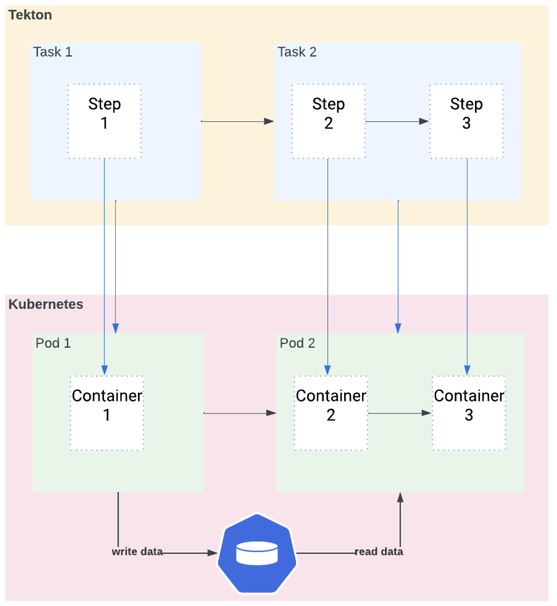
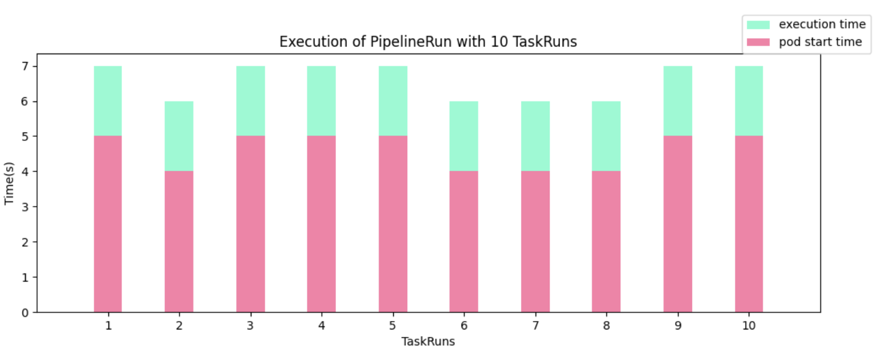
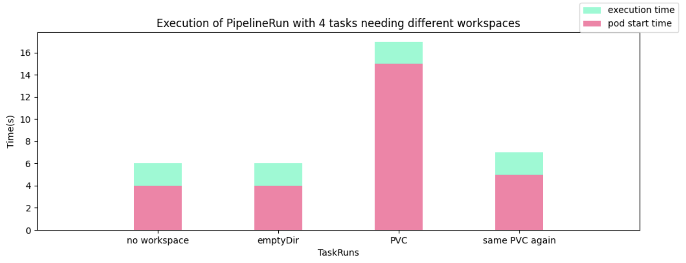
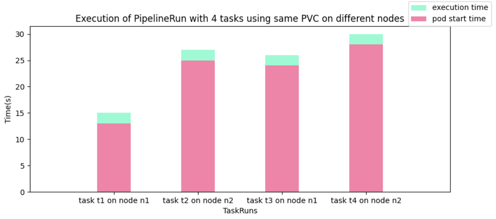
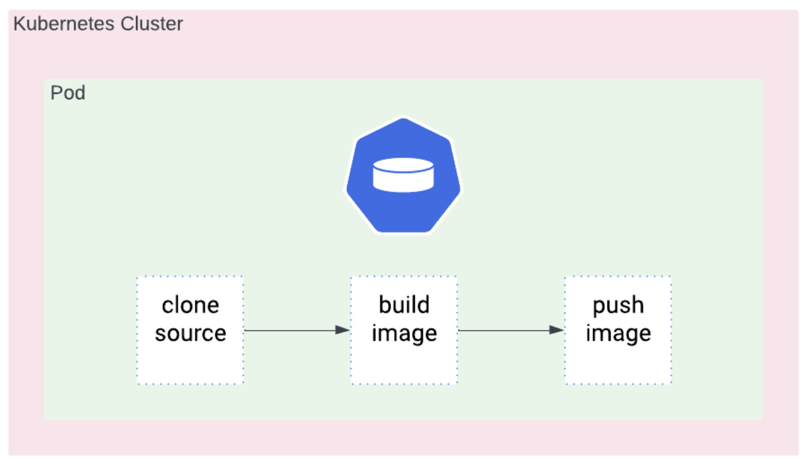
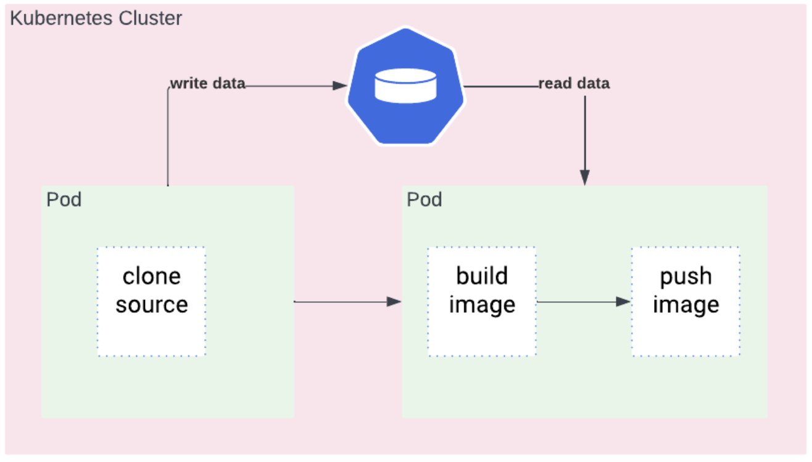

# TEP-0142: Enable Step Reusability 

<!-- toc -->
- [Summary](#summary)
  - [Background](#background)
- [Motivation](#motivation)
  - [Usability](#usability)
  - [Performance](#performance)
    - [Pod Overhead](#pod-overhead)
    - [Workspace Overhead](#workspace-overhead)
  - [Security](#security)
  - [Case Study](#case-study)
  - [Use Cases](#use-cases)
  - [Related Work](#related-work)
    - [Prior Art](#prior-art)
      - [1.TaskGroup Custom Task](#1-taskgroup-custom-task)
      - [2.Reuse Steps](#2-reuse-steps)
      - [3.Pre/Post Steps](#3-prepost-steps)
      - [4.Pipeline in a Pod](#4-pipeline-in-a-pod)
    - [CI/CD Systems based on Tekton](#cicd-systems-based-on-tekton)
      - [1.Nubank Workflows](#1-nubank-workflows)
      - [2.JenkinsX](#2-jenkinsx) 
    - [Comparable CI/CD Systems](#comparable-cicd-systems)
      - [1.Github Actions](#1-github-actions)
- [Proposal](#proposal) 
  - [StepAction CRD](#stepaction-crd)
  - [Referenced Steps](#referenced-steps)
    - [Remote Resolution](#remote-resolution)
    - [Params](#params)
    - [Results](#results)
    - [Workspaces](#workspaces)
    - [WorkingDir](#workingdir)
    - [VolumeMounts](#volumemounts)
    - [SecurityContext](#securitycontext)
    - [Validating StepActions and Steps](#validating-stepactions-and-steps) 
    - [Managing API and feature versions](#managing-api-and-feature-versions) 
  - [Inlined Steps](#inlined-steps)
- [Secure Software Supply Chain](#secure-software-supply-chain)
  - [Trusted Steps](#trusted-steps)
  - [Provenance](#provenance)
- [Possible Names](#possible-names)
- [Future Work](#future-work)
  - [Sidecar](#sidecar)
  - [Tekton v2](#tekton-v2)
  - [Tooling](#tooling)
  - [Conditional Execution of Steps](#conditional-execution-of-steps)
- [Alternatives](#alternatives)
  - [StepCRD](#stepcrd)
  - [ActionCRD](#actioncrd)
  - [Tasks in Tasks](#tasks-in-tasks)
<!-- /toc -->

## Summary

This TEP proposes to introduce a `StepAction` CRD as the smallest, scriptable and reusable unit of work in Tekton. 

The minimum reusable unit of work in Tekton, `Task`, currently cannot natively execute in isolation without relying on a shared file system. As such, Tekton users/authors have to compromise reusability for security, and performance. This design doc revisits the components and architecture of Tekton CRDs to both enable secure reusable objects and optimize performance.

### Background

`Tasks` are the reusable unit of work in Tekton. A `Task` is made up of a sequence of `Steps`. A `Task` and its `Steps` execute in Kubernetes as a `Pod` made up of a sequence of `Containers`. The `Steps` of a `Task` have access to ephemeral shared storage such as `emptyDir`. `Tasks` are combined in `Pipelines` which are graphs where each node represents a `Task`. The `Tasks` in a `Pipeline` execute in separate `Pods`, thus they need to share data via a `Workspace` that is generally backed by a `volume`.



## Motivation

`Steps` are the smallest unit of work but they aren’t reusable because they are specified in `Tasks`. `Task` authors end up writing a lot of general purpose `Tasks` with single `Step` to make them reusable for most users. In fact, about 77% of `Tasks` in the Tekton Catalog have a single `Step` only. However, these reusable units cannot execute in a shared context – `Pod`. 

When users need to combine `Steps` to execute together, they are forced to choose between reusability and performance. If they prioritize performance over reusability, they would copy and paste the `Steps` of the `Tasks` into a new `Task` to execute in one `Pod` with a shared file system. If they prioritize reusability over performance, they would execute the `Tasks` with single `Steps` in separate `Pods` without a shared file system.

### Usability
It is complex and challenging to move data between reusable units of work because they don’t share a filesystem. This is a shared pain point with various efforts to address it [directly](#related-work) in Tekton, [indirectly](#cicd-systems-based-on-tekton) on systems built on Tekton, and now in a dedicated working group. 

### Performance

This section outlines the main takeaways from the performance costs [measurements](https://docs.google.com/document/d/1ifY4dzNCstiTklYEBWMbyz5TeGoXzalYT7zEr5iWJ8Q/edit).

#### Pod Overhead

The overhead of starting a `Pod` is ~4s, as measured in our experiments with very simple `Pods`. While a 4s `Pod` overhead seems like a small fraction of the execution time of a typical CI/CD `Pipeline`, these performance costs add up. The `Pod` overhead increases linearly with an increasing number of sequential `Tasks`, for example a `Pipeline` with 5 sequential `Tasks` would have a `Pod` overhead of ~20s.

**Note**: some project have targets for CI jobs to run within a minute or so, several seconds already have a big impact there.



#### Workspace Overhead

As measured in out experiments, while the overhead of mounting an `EmptyDir Volume` is negligible, the overhead of mounting a `Persistent Volume` is ~10s for the first `Task` that uses it then becomes negligible for future `Tasks` that use it as long as they are on the same node.

**Note** that the `PVC` overhead could run in parallel to the `Pod` setup to reduce this latency.



In the case where `Pods` are scheduled to different nodes in a multi-node cluster, there’s an additional overhead of ~10s for node reattachment besides the ~10s of mounting a `Persistent Volume`. Users can schedule `Pods` to different nodes by disabling `Affinity Assistant`.



### Security

Kubernetes supports two types of volumes: [Ephemeral Volumes](https://kubernetes.io/docs/concepts/storage/ephemeral-volumes/) which are tied to the lifetime of a `Pod`, and [Persistent Volumes](https://kubernetes.io/docs/concepts/storage/persistent-volumes/) which exist beyond the lifetime of a `Pod`. Given that reusable units in Tekton (i.e. `Tasks`) execute in separate `Pods`, they can only natively use `Persistent Volumes` to share data. This limits users who would prefer to use `Ephemeral Volumes` to share data.

A user [noted](https://github.com/tektoncd/pipeline/issues/6601) that: “The ability to modify `Persistent Volumes` contents is an additional threat. If the contents are changed between a git clone `Task` and a container build `Task`, there is no longer a guarantee the build is of the git reference that was checked out. The ability to change the contents of a `Persistent Volume` is granted to anyone that can create a `Pod`”.
 
Enabling use of `Ephemeral Volumes` to share data between reusable units of work via local disks will limit external influence, thereby improving the security of workloads. 

### Case Study

A user relies on [git](https://github.com/tektoncd/catalog/tree/main/task/git-clone/0.9) `Task` to fetch source code from a repo and [kaniko](https://github.com/tektoncd/catalog/blob/main/task/kaniko/0.6/kaniko.yaml) `Task` to build and push an image. 

If they copy and paste the `Steps` of the `Tasks` into a single `Task` to execute in one `Pod`, then the source code will be fetched to a local disk which will be used to build the image. This is performant but hurts reusability.



If they execute the `Tasks` in separate `Pods`, the source code will be fetched to a persistent disk which will be used to build the image. This maintains the well-factored reuse but incurs performance costs.



### Use Cases

1. As a Platform Engineer, I want to take the work that the `Steps` in my `Tasks` perform and make them easily usable and reusable by other teams.
2. As a DevOps Engineer, I want to optimize the performance of Tekton workloads by reducing the execution time and resource utilization.
3. As a Security Engineer, I want developers to use ephemeral local volumes to share data between reusable units of work to limit external influence workloads. 

### Related Work

#### Prior Art

##### 1. TaskGroup Custom Task

OpenShift has an experimental feature [TaskGroup](https://github.com/openshift-pipelines/tekton-task-group/tree/f43d027f4d5928e34d099b98870b17dbbffde65a) `Custom Task` that merges multiple `Tasks` into one `Task` that can be executed in one `Pod` with a shared context. With this option, users do not have to choose between reusability and performance. However, it is not easy to use because it depends on `Custom Tasks`. `Custom Task` implies additionnals component to run on the cluster (i.e. `controller+webhook`, `a CRD`, etc.). It's not really portable if we were having an alternative implementation (e.g. buildkit-tekton).

<table>
<tr>
<td style="vertical-align:top">

```yaml
apiVersion: tekton.dev/v1beta1
kind: TaskGroup
metadata:
  name: ci-tg
spec:
  workspaces:
    - name: shared-data
  params:
    - name: repo-url
    - name: revision
    - name: image-url
    - name: dockerfile
  results:
    - name: commit
    - name: digest
  steps:
  - uses:
      taskRef:
        name: git-clone
      parambindings:
      - name: url
        param: repo-url
      workspacebindings:
      - name: output
        param: shared-data
  - uses:
      taskRef:
        name: kaniko
      parambindings:
      - name: url
        param: image-url
      workspacebindings:
      - name: source
        param: shared-data
```
</td>
<td style="vertical-align:top">

```yaml
apiVersion: tekton.dev/v1beta1
kind: Task
metadata:
  name: ci-tg
spec:
  workspaces:
    - name: shared-data
  params:
    - name: repo-url
    - name: revision
    - name: image-url
    - name: dockerfile
  results:
    - name: commit
    - name: digest
  steps:
  - name: git-clone-clone
    image: gcr.io/tekton-releases/git-init
    script: ...
  - name: kaniko-build-and-push
    workingDir: $(workspaces.source.path)
    image: gcr.io/kaniko-project/executor
    args: ...
``` 
</td>
</tr>
</table>

##### 2. Reuse Steps
[TEP-0054](https://github.com/tektoncd/community/pull/369) proposed reuse of `Steps` from remote versioned `Task` without copying and pasting. Users can choose to reuse all `Steps` or only some `Steps`. Users can also customize the reused `Steps`, such as add volume mounts or add environment variables. However, there were concerns around mutating the user-provided `Task` specification so the proposal was rejected.
##### 3. Pre/Post Steps
[TEP-0080](https://github.com/tektoncd/community/pull/502) proposed partitioning `Steps` into 3 phases: `Pre Steps` (setup/download), `Steps` (execution), `Post Steps` (teardown/upload). The main motivation was to enforce hermetic execution of the `Steps` when they are distinguished from the pre and post `Steps`. However, this proposal would have hurt reusability so it was rejected.
##### 4. Pipeline in a Pod
[TEP-0044](https://github.com/tektoncd/community/blob/main/teps/0044-data-locality-and-pod-overhead-in-pipelines.md) proposed executing all the `Tasks` in a `Pipeline` in one `Pod`. The motivation was to address data locality and `Pod` overhead. However, the proposal was rejected because of complexity and comparison against promising alternatives, such as `Tasks` in `Tasks`.

#### CI/CD Systems based on Tekton

##### 1. Nubank Workflows
[Nubank](https://drive.google.com/file/d/1I80Gttm2ge88IFat945skDPi3hgS-BLy/view?resourcekey=0-gA4v0RfbNJAySDQvMJ9xnA) built `Workflows` on top of Tekton. Users of `Workflows` can define and execute `Tasks` in `Tasks`. This allows the users to reuse `Tasks` while executing them in the same `Pod` to optimize performance.

```yaml
tasks:
  clone-build-push:
    steps:
    - uses: git-clone
      options:
        repo-url: github.com/foo/bar.git
        revision: main
    - uses: kaniko
      options:
        image-url: gcr.io/my_app:version
        dockerfile: ./Dockerfile
```
##### 2. JenkinsX
[JenkinsX](https://jenkins-x.io/blog/2020/03/11/tekton/) is built on Tekton as its execution engine. JenkinsX users needed to copy-paste `Steps` and `Tasks` to execute in one `Pod` which was neither scalable nor maintainable. JenkinsX added a feature that allows users to reuse all or some `Steps` of one `Task` in another `Task`. This feature inspired [TEP-0054](https://github.com/tektoncd/community/pull/369).

```yaml
apiVersion: tekton.dev/v1beta1
kind: Task
metadata:
  name: ci-t
spec:
  workspaces:
    - name: shared-data
  params:
    - name: repo-url
    - name: revision
    - name: image-url
    - name: dockerfile
  results:
    - name: commit
    - name: digest
  steps:
    - uses:
        path: tektoncd/catalog/task/git-clone/0.9/git-clone.yaml@HEAD
    - uses:
        path: tektoncd/catalog/task/git-clone/0.4/kaniko.yaml@HEAD
```

#### Comparable CI/CD Systems

##### 1. Github Actions

[GitHub Actions](https://docs.github.com/en/actions/using-workflows/workflow-syntax-for-github-actions#jobsjob_idstepsuses) allows users to specify `Actions` to run as part of a `Step` in a `Job`. Note that `Action` is the reusable unit of work, and it can contain multiple `Steps`. The `Actions` can execute in an environment with a shared file system, so the users don’t have to choose between reusability and performance.

```yaml
jobs:
  clone-build-push:
    steps:
    - uses: actions/checkout@v0.9
      with:
        repo-url: github.com/foo/bar.git
        revision: main
    - uses: actions/kaniko@v0.4
      with:
        image-url: gcr.io/my_app:version
        dockerfile: ./Dockerfile
```

## Proposal

We propose introducing a `StepAction` CRD (i.e. “the work performed by the Step” ) composed of the actionable parts of the current `Step` object. See the [Step CRD](#stepcrd) section for why we did not pick this name instead.

The `StepAction` will be the reusable and scriptable unit of work that is defined at authoring time and does not contain runtime components.

**Note**: A `Step` is not reusable, the work ir performs is reusable and referenceable. `Steps` are in-lined in the `Task` definition and either perform work directly or perform a `StepAction`. A `StepAction` cannot be run stand-alone (unlike a `TaskRun` or a `PipelineRun`). It has to be referenced by a `Step`. In other words, a `Step` is not composed of `StepActions` (unlike a `Task` being composed of `Steps` and `Sidecars`). A `Step` is an actionable component, meaning that it has the ability to refer to a `StepAction`. The `Task` author should be able to compose a `Step` using a `StepAction` and provide all the necessary context (or orchestration) to it.` 

With this solution, reusable units of work can execute in the same environment with a shared filesystem which improves usability and security. It also eliminates the unnecessary creation of new environments and enables use of local disks to optimize performance.

### StepAction CRD
The `Step` object can be split into “actionable” (aka. “work”) and “orchestration” fields. 

- The “actionable” fields make up the scriptable and reusable parts of a `Step` that should be defined at authoring time. These fields are included in the `StepAction` CRD.
- The “orchestration” fields are useful at `Task` authoring time in defining runtime behavior of `Containers`. These fields are not included in the `StepAction` CRD; they are inlined when authoring a `Task`. 

|Actionable| Orchestration|
|----------|--------------|
|Image|ComputeResources|
|Command|IsolatedWorkspaces|
|Args|VolumeDevices|
|Script|ImagePullPolicy|
|Env|EnvFrom|
|SecurityContext|SecurityContext|
|VolumeMounts|StdoutConfig|
|WorkingDir|OnError|
||StderrConfig|

A `StepAction` should be able to declare the `Parameters` it expects and the `Results` it produces. The Task author should be able to provide the context via supported fields listed below.

<table>
<tr>
<td>Fields in a StepAction CRD</td>
<td>Example StepAction</td>
</tr>
<tr>
<td>Image</td>
<td rowspan="9">

```yaml
apiVersion: tekton.dev/v1alpha1
kind: StepAction
metadata:
  name: git-clone
spec:
  image: ...
  script: |
    git clone ...
  command: 
  args:
  env:
  params:
  results:
```
</td>
</tr>
<tr><td>Command</td></tr>
<tr><td>Args</td></tr>
<tr><td>Script</td></tr>
<tr><td>Env</td></tr>
<tr><td>SecurityContext</td></tr>
<tr><td>VolumeMounts</td></tr>
<tr><td>

[Params](#params)
</td></tr>
<tr><td>

[Results](#results)
</td></tr>
</table>

### Referenced Steps

`Tasks` can reference `StepAction` in a `Step` using a `ref` (similar to `TaskRef` and `PipelineRef`). The actionable components of a `Step` can be either referenced via `StepAction` or inlined, it cannot be both (this will cause a validation error). 

<table>
<tr>
<td>

```yaml
apiVersion: tekton.dev/v1alpha1
kind: StepAction
metadata:
  name: step1
spec:
  image: alpine
  script: |
    echo "I am expendable"
```
</td>
<td rowspan=2>

```yaml
apiVersion: tekton.dev/v1
kind: Task
metadata:
  name: ci-t
spec:
  steps:
    - name: s1
      ref:
        name: step1
    - name: s2
      ref:
        name: step2
```
</td>
</tr>
<tr>
<td>

```yaml
apiVersion: tekton.dev/v1alpha1
kind: StepAction
metadata:
  name: step2
spec:
  image: alpine
  script: |
    echo "I am special"
```
</td>
</tr>
</table>

A `Task` can refer to the `StepAction` from the cluster or fetch it from remote sources via a resolver. 

<table>
<tr>
<td>StepAction from cluster</td>
<td>StepAction from Git repository</td>
</tr>
<tr>
<td>

```yaml
apiVersion: tekton.dev/v1
kind: Task
metadata:
  name: ci-t
spec:
  steps:
    - name: s1
      ref:
        name: step1
```
</td>
<td>

```yaml
apiVersion: tekton.dev/v1
kind: Task
metadata:
  name: ci-t
spec:
  steps:
    - name: s1
      ref:
        resolver: git
        params:
          - name: url
            value: https://...
```
</td>
</tr>
</table>

<table>
<tr>
<td>Example StepAction</td>
<td>Example Task with orchestration in Steps</td>
</tr>
<tr>
<td>

```yaml
apiVersion: tekton.dev/v1alpha1
kind: StepAction
metadata:
  name: step1
spec:
  image: alpine
  script: |
    echo "I am expendable"

```
</td>
<td rowspan=2>

```yaml
apiVersion: tekton.dev/v1
kind: Task
metadata:
  name: ci-t
spec:
  steps:
    - name: s1
      ref:
        name: step1
      onError: continue
    - name: s2
      ref:
        name: step2
      computeResources:
        requests:
          memory: 1Gi
          cpu: 500m
        limits:
          memory: 2Gi
          cpu: 800m
```
</td>
</tr>
<tr>
<td>

```yaml
apiVersion: tekton.dev/v1alpha1
kind: StepAction
metadata:
  name: step2
spec:
  image: alpine
  script: |
    echo "I am special"
  securityContext:
    privileged: true
```
</td>
</tr>
</table>

#### Remote Resolution
When it comes to remote resolution, here is the general flow. 

The pipelines controller creates a Resolution request CRD. The resolvers fetch the resource from the remote locations (`git/artifacthub/oci bundle`) and update the CRD with the raw content (i.e. unmarshalled bytes). The `resolvers` are not aware of the exact Struct that the content needs to resolve to.
The updated to the CRD triggers another reconcile loop and the pipelines controller then accesses the raw content and un-marshalls it to `Pipeline/Task/StepAction`.

This was demonstrated for the `git` resolver in the `StepAction` [POC](https://github.com/tektoncd/pipeline/pull/7124). Assuming that the other resolvers are similar, we do not need to update the resolvers to resolve `StepActions`.

#### Params
If a `StepAction` needs `Parameters`, they need to be declared so that they can be provided by the `Task` author. Without declaring `Parameters`, the `Task` author would have had to go through the `StepAction` specification to decipher what is needed. A `Task` should declare the `Parameters` that the underlying `Step` needs so that they can be provided by the `TaskRun` or the `Pipeline`. 
<table>
<tr>
<td>

```yaml
# This is how a step author would 
# declare the params that it needs.
apiVersion: tekton.dev/v1alpha1
kind: StepAction
metadata:
  name: myStep
spec:
  params:
    - name: foo
      type: string
      description: “This is a param”
      default: bar
  image: myImage
  args:
    - $(params.foo)

```
</td>
<td>

```yaml
# This is how a task author would 
# declare the params that the underlying step needs.
apiVersion: tekton.dev/v1
kind: Task
metadata:
  name: ci-t
spec:
  params:
    - name: foo
      type: string
      description: “This is a param”
      default: bar
  steps:
    - name: step1
      ref: 
        name: myStep
```
</td>
</tr>
</table>

Referencing `StepAction` in a `Task` could create name conflicts that need to be resolved by the `Task` author. For example, if “step1” needs a `Parameter` called “url” and “step2” also needs a `Parameter` called “url” but they are actually meant for different purposes, the `Task` author needs to be able to pass in different values to both these `Parameters`.

All inlined `Steps` and `Sidecars` in a `Task` can access all the `Parameters` and reference them in their work. This behavior is still intact. However, `Parameters` need to be passed explicitly to a referenced `Step`. While users only need to provide values when there are name conflicts (since a `Step` has access to all params of a `Task`) we start by explicitly providing all the required parameters to the `StepAction` and will be enforced during validation. To prevent increased verbosity of the specifications, we can invoke parameter propagation in future work. 

<table>
<tr>
<td>

```yaml
# This is how a step author would
# declare the params that it needs.
apiVersion: tekton.dev/v1alpha1
kind: StepAction
metadata:
  name: myStep
spec:
  params:
    - name: url
      description: “This is a param”
      default: bar
  image: myImage
  args: 
    - $(params.url)

```
</td>
<td rowspan=2>

```yaml
# This is how a task author would provide 
# the params that the step needs.

apiVersion: tekton.dev/v1
kind: Task
metadata:
  name: ci-t
spec:
  params:
    - name: url1
    - name: url2
  steps:
    - name: step1
      ref: 
        name: myStep
      params:
        - name: url
          value: url1
    - name: step2
      ref:
        name: myOtherStep
      params:
        - name: url
          value: url2
```
</td>
</tr>
<tr>
<td>

```yaml
apiVersion: tekton.dev/v1alpha1
kind: StepAction
metadata:
  name: myStep
spec:
  params:
    - name: url
      description: “Another param”
      default: baz
  image: myImage
  args:
    - $(params.url)

```
</td>
</tr>
</table>

#### Results

A referenced `StepAction` needs to declare if it produces a `Result` so that `Task` authors know that they can reference it without having to drill into the `StepAction` specification. 

If multiple `StepActions` produce the different `Results` under the same name then to ensure that they are not overwritten, the `Task` needs to be able to capture them under different names. In order to capture these at the task level, we need to: 
1. Introduce a field to [TaskResults](https://github.com/tektoncd/pipeline/blob/445734d92807a80158b4b7af605d768c647fdb3d/pkg/apis/pipeline/v1/result_types.go#L19-L49) called `Value` like we do for [PipelineResults](https://github.com/tektoncd/pipeline/blob/445734d92807a80158b4b7af605d768c647fdb3d/pkg/apis/pipeline/v1/pipeline_types.go#L129C1-L144C2). (Note this would not be a backwards incompatible change. We would be making an additive change here.)
2. To retain backwards compatibility with the fact that users don’t need to provide a value field under normal circumstances, we continue to surface the results to the `Task`. 

`StepAction` authors should be able to:
1. reference result paths via: `$(step.results.resultName.path)` , *NOT* `$(results.resultName.path)` since `StepAction` are a new addition (backwards compatibility is not required here).
    a .Internally, 
      i. `$(step.results.resultName.path) = /tekton/steps/<step-name>/results/resultName`
`Task` authors should be able to:
1. fetch results from underlying `Steps` using `$(step.stepName.results.resultName)` as the `Value` of the `Task Result`. This will help resolve name conflicts in cases where multiple `StepActions` produce results that may have the same name.
2. For backwards compatibility, we will surface all results by default to the `Task` like we do today via the `entryPointer`. It is the responsibility of the `Task` authors to resolve name conflicts by using the `Value` field proposed in the previous point.
3. also use `$(step.results.resultName.path)` when inlining the `Steps` for [consistency with `StepActions`](#stepresults-in-inlined-steps). 

Consider the following scenario, explained in the example below:

The `Task` uses three `Steps`.
`Steps` step1 and step2 use `StepActions` that  produce a result called `digest`.
`Step` step2 also produces a `result` called `stepResult`.

In this case, the task author needs to distinguish between step1's `digest` and step2's. There they can use:

```
results:
  - name: digest1
    value: $(step.step1.results.digest)
  - name: digest2
    value: $(step.step2.results.digest)
```

Failure to do so will cause both the results to be automatically surfaced to the `Task` where the second `Step's` `result` (in this case, step2's digest) will overwrite step1's value.

The `result` "stepResult" from step2 and "normalResult" from step3 will also be automatically surfaced to the Task level. But since there are no other step in the Task producing results called "stepResult" or "normalResult", the Task author does not need to resolve them.

**Note** that the `Step` `name` is an optional field. When referencing results from the underlying `Steps`, the users will be forced to provide a `name` for the `Step` anyway. Therefore, we suggest keeping the `Step` `name` as optional.

<table>
<tr>
<td>

```yaml
# This is how a step author would 
# declare the results that it needs.
apiVersion: tekton.dev/v1alpha1
kind: StepAction
metadata:
  name: myStep
spec:
  results:
    - name: digest
      description: “One result”
  image: alpine
  script: |
    echo DIGEST >> $(step.results.digest.path)
```
</td>
<td rowspan=2>

```yaml
# This is how a task author would 
# provide the results that the step needs.
apiVersion: tekton.dev/v1
kind: Task
metadata:
  name: ci-t
spec:
  results:
    - name: digest1 # Needs to resolve name conflict here
      value: $(steps.step1.results.digest)
    - name: digest2 # Needs to resolve name conflict here
      value: $(steps.step2.results.digest)
    - name: stepResult # no name conflict here so nothing to resolve 
      description: “Step result automatically surfaced from the Step.”
    - name: normalResult
      description: “Normal result.”#Automatically sent 
# to the TaskRun CRD. No need to fetch it via 
#values since it was written to the old path.
  steps:
    - name: step1
      ref: 
        name: myStep
    - name: step2
      ref:
        name: myOtherStep
    - name: step3
      image: foo
      script: |
        echo RESULT >> $(results.normalResult.path)
```
</td>
</tr>
<tr>
<td>

```yaml
apiVersion: tekton.dev/v1alpha1
kind: StepAction
metadata:
  name: myOtherStep
spec:
  results:
    - name: digest
    - name: stepResult
  image: alpine
  script: |
    echo OTHER-DIGEST >> $(step.results.digest.path)
    echo STEP-RESULT >> $(step.results.stepResult.path)
```
</td>
</tr>
</table>

Currently, `Steps` cannot access `Results` from previous `Steps` via variable interpolation. `Steps` are currently inlined only so `Task` authors can write logic to read the `Result` files written by previous `Steps`. 

However, since the `StepAction` are defined in isolation and are referenced in `Tasks`, it is challenging for the `Task` authors to pass `Results` from one `Step` to another without Tekton providing some API. Therefore, we should enable referencing of `Results` produced by `Steps` via `Parameters` of the subsequent `Steps`. 

`Task` authors should be able to extract `Results` from previous `Steps` (i.e. written to  `$(step.results.resultName.path)`) using `$(steps.stepName.results.resultName)`. `Results` written to `$(results.resultName.path)` are not referenceable.

<table>
<tr>
<td>

```yaml
# This is how a standalone step author 
# would declare the results that it is producing.
apiVersion: tekton.dev/v1alpha1
kind: StepAction
metadata:
  name: myStep
spec:
  results:
    - name: foo
  image: ...
  script: |
    echo “hi” >> $(step.results.foo.path)
```
</td>
<td rowspan=2>

```yaml
# This is how a task author would 
# use the results from one step 
# into subsequent steps.
apiVersion: tekton.dev/v1
kind: Task
metadata:
  name: ci-t
spec:
  results:
    - name: res1
      value: $(steps.step1.results.foo)
  steps:
    - name: step1
      ref:
        name: myStep
    - name: step2
      ref:
        name: myOtherStep
      params:
        - name: p1
          value:  $(steps.step1.results.foo)
```
</td>
</tr>
<tr>
<td>

```yaml
apiVersion: tekton.dev/v1alpha1
kind: StepAction
metadata:
  name: myOtherStep
spec:
  params:
    - name: p1
  image: ...
  env:
    - name: p1
      value: $(params.p1)
  script:
    echo "$p1"

```
</td>
</tr>
</table>

##### StepResults in Inlined-Steps

To enable consistency of `results` usage in `StepActions`, we introduce a `Results` field to the `Step` struct which will be identical to the `Results` field in `StepActions`. `Task` authors cannot use this field at the same time as referencing a `StepAction` since in that case, the `results` from `StepActions` will fill it in. Using it simultaneously with `ref` will result in a validation error.

However, if the `Task` author decides to produce `Step Results` for their inlined steps, they need do declare `Results` in `Steps`. Since this capability for inlined `Steps` is being introduced for consistency with `StepActions`, we gate it behind `enable-step-actions`.

For fully, inlined `Tasks` (i.e. where all the `Steps` are inlined), the use of `Step Results` is not too useful. There have been occasional requests from users to provide the ability to pass `results` as `params` between `Steps`. Until now, we have asked the users to load the results from the files themselves in the `Steps` as a workaround. However, with `StepActions`, the need to pass `results` between `Steps` is necessary since there is no workaround for it. We already plan to do this to support `StepActions` so declaring the `Step Results` and making use of this ability even for `inlined Steps` is something `Task` authors can leverage. 

<table>
<tr>
<td>

```yaml
apiVersion: tekton.dev/v1alpha1
kind: StepAction
metadata:
  name: myStep
spec:
  params:
    - name: p1
  image: ...
  env:
    - name: p1
      value: $(params.p1)
  script:
    echo "$p1"

```
</td>
<td>

```yaml
# This is how a task author would 
# use the Step results from an inlined step 
# into subsequent Steps/StepActions.
apiVersion: tekton.dev/v1
kind: Task
metadata:
  name: ci-t
spec:
  results:
    - name: res1
      value: $(steps.step1.results.foo)
  steps:
    - name: an-inline-step
      results:
        - name: inline-step-result
      image: ubuntu
      script: |
        echo "hello" >> $(step.results.inline-step-result.path)
    - name: step2
      ref:
        name: myStep
      params:
        - name: p1
          value:  $(steps.step1.results.inline-step-result)
```
</td>
</tr>
</table>

#### Workspaces
`Workspace` is an orchestration concept because it’s bound to a `Task`. All the `Steps` in a `Task` can access the Workspaces bound to the `Task`. Occasionally, a `Task` author may want to provide a `Step` exclusive access to some Workspace which they can do via the `Workspaces` field in `Steps`.

The actionable components of a `Step` (i.e. `commands`, `args` and `script`) only require a “path” to a `Workspace` which they refer to via `$(workspaces.someworkspace.path)`. This variable could also be passed in as a string `Parameter` instead. 

When defining an inline `Step`, the `Task` authors have `Workspace` information in context so they can refer to `Workspace` paths directly. However, when referencing a `StepAction`, the `Task` authors should pass paths via `Parameters` because there are no `Workspaces` in `StepAction`.  A `StepAction` should expect to “just work” if all the context is set up appropriately by the `Task` and the correct inputs are passed to it.

This means that if users are migrating inlined `Steps` to `StepAction`, the rules are slightly different so they need to convert an `Workspace` path into a `Parameter` before using it.

<table>
<tr>
<td rowspan=2>

```yaml
apiVersion: tekton.dev/v1
kind: Task
metadata:
  name: ci-t
spec:
  workspaces:
    - name: shared
  steps:
    - name: myStep
      image: myImage
      #A step has a workspace information in
      #its context so it can be used here directly
      script: |
        go test $(workspaces.shared.path)/pkg
```
</td>
<td>

```yaml
# A standalone step has no context about a workspace.
# It just needs a path to do its work 
# which it can accept as a param.
apiVersion: tekton.dev/v1alpha1
kind: StepAction
metadata:
  name: myStep
spec:
  params:
    - name: path
      description: “Path to the test folder”
  image: ...
  script: |
    go test $(params.path)

```
</td>
</tr>
<tr>
<td>

```yaml
apiVersion: tekton.dev/v1
kind: Task
metadata:
  name: ci-t
spec:
  workspaces:
    - name: shared
  params:
    - name: path
      value: $(workspaces.shared.path)/pkg 
      #A task has to provide a path to the 
      # referenced step. Here, it’s done 
      # via a workspace reference.
  steps:
    - name: myStep
      ref:
        name: myStep
```
</td>
</tr>
</table>

While this a perfectly valid view point from the `Step` author’s perspective, the users using these `Steps` to construct `Tasks` and `Pipelines` will need to better understand how a path is used in the `Step` to provide an appropriate `Workspace`. We think that it’s better to start without `Workspaces` and see if this is causing major friction to users before introducing it in the `StepActions's` API spec.

#### WorkingDir

After length discussions, we make `workingDir` an actionable component of the `Step` and as such, add it to `StepActions`. This is because of the following reasons:

1. The `StepAction` has the most insight into the needs of the image it is using and whether it needs a special `workingDir` to function. The `Task` is mainly an orchestration component here and has little insight into the details of the `StepAction` and as such, it is not a good user experience for the `Task` authors to be able to understand the internal details of the `StepAction` since they did not compose it. 
2. From an orchestration concept, the `Task` has more context on the workflow and therefore, it needs to be able to update the `workingDir` based on how it is orchestrating the steps. The `StepAction` can provide flexibility to the `Task` to update the `workingDir` by parametrizing it as shown below. Here, the `StepAction` author can request a path as a `parameter` and work relative to it. This is better than introducing `workingDir` as both an actionable and orchestration field and resolving the precedence since the parameter based approach can achieve the same thing with less complexity.

```yaml
apiVersion: tekton.dev/v1alpha1
kind: StepAction
metadata:
  name: myStep
spec:
  params:
    - name: path
      description: “Path to the test folder”
  image: ...
  workingDir: $(params.path)
```

#### VolumeMounts
In many cases, depending on the image used or the work that the `Step` is performing, a `VolumeMount` is extremely necessary. This is evident from the number of [catalog Tasks](https://github.com/search?q=repo%3Atektoncd%2Fcatalog%20volumeMounts&type=code) that use it. For standalone `StepActions`, it is challenging for authors to convey that such a `VolumeMount` is required for the `StepAction` to run successfully. Failure to provide this ability would make using the `StepAction` prone to errors and degrade user experience. 

However, the `StepAction` should not enforce a runtime behaviour since it is an authoring time concept. If a `StepAction` needs a `volume` to be mounted at a special place, it should expose a parameter that provides the name of the `volume`, so that the `Step` may additionally mount that `volume` on a different path. This also allows the `Task` to provide a `workspace` as a volume.  Additionally, a `Task` could be using multiple `Steps` that require the same `VolumeMount`. When inlining the `Steps`, the `Task` author has the complete context and so this is easy for the author to avoid name clashes and confusion. However, `StepActions` could choose names that conflict with other `StepActions` because they are written in for general use cases. 

Because of this, we propose enforcing parameterizing the name of the `VolumeMount` when requested in a `StepAction`. This validation will be performed during webhook validation and an error will be thrown if it is not parametrized.

<table>
<tr>
<td>

```yaml
apiVersion: tekton.dev/v1alpha1
kind: StepAction
metadata:
  name: myStep
spec:
  params:
    - name: registryConfig
    - name: otherConfig
  volumeMounts:
    - name: $(params.registryConfig)
      mountPath: /registry-config
  volumeMounts:
    - name: $(params.otherConfig)
      mountPath: /other-config
  image: ...
  script: ...
```
</td>
<td>

```yaml
apiVersion: tekton.dev/v1
kind: Task
metadata:
  name: task-name
spec:
  volume:
    - name: registry-config
      secret:
        secretName: foo
  workspaces:
    - name: other-config
  steps:
    - name: myStep
      ref:
        name:  myStep
      params:
        - name: registryConfig
          value: registry-config
        - name: otherConfig
          value: $(workspaces.other-config.volume)
```
</td>
</tr>
</table>

#### SecurityContext
`SecurityContext` of a `Step` is commonly tied to the image that the `Step` is using. It may require a very specific `SecurityContext` like running as root or a specific user. In these cases `StepAction` authors know best what is required by the image.

For most other examples, the `StepAction` itself will not require a `SecurityContext`. However, the pipeline authors may require setting `SecurityContext` (e.g. running as non-root) for all their underlying `Tasks`. The control of `SecurityContext` therefore needs to be available to both `StepActions` and `Tasks`.  

However, this requires a hierarchy in cases where both `StepActions` and `Tasks` set this value to something. Since we expect the authors to set this value only for `StepActions` that actually need it because the underlying image dictates it, we take the precedence of the `StepAction` over what is set in the `Task` during resolution. Authors certainly have the ability to set this to arbitrary things even when it is not required but that would make the `StepAction` less reusable.

#### Validating StepActions and Steps
When `StepActions` are applied directlty on the cluster, we will invoke a webhook validation of the API. This would be similar to validating inlined `Steps` with the addition of `Params` and `Results`. The same validation will also be envoked if the `StepAction` is fetched via the remote resolvers by triggering a `dry-run` submission.

If the `Step` references `StepActions`, it cannot also use the same fields that fall under `StepActions` (i.e. `image`, `command`, `args`, `env`, `script`, `volumeMounts`). This would lead to validation error. If the `Step` is not using `StepActions`, it cannot declare `params` and `results` since it is being inlined. This will also result in a validation error. The Step should only provide `params` ad `results` if referencing a `StepAction`.

After the `StepAction's` spec is fetched, it will efectively convert the `Step` referencing a `StepAction` to an inlined `Step` in the status of the `TaskRun`. We do a similar thing when we resolve `PipelinRef` and `TaskRef`. After this point, the remainder of the validation happens as if it was an inlined `Step` (i.e. no additional validation is required). 

#### Managing API and feature versions
The `StepAction` CRD will be introduced under `v1alpha1` API version and promoted to `v1beta1` and finally to `v1` following the [API compatibility policy](https://github.com/tektoncd/pipeline/blob/main/api_compatibility_policy.md). 

At the same time, we also need to introduce a feature flag for enabling referencing of `StepActions` from `Steps`. [TEP-0138](https://github.com/tektoncd/community/blob/main/teps/0138-decouple-api-and-feature-versioning.md) introduced per-feature-flags. Following that, we will introduce a feature flag called `enable-step-actions`, dedicated for this feature. In the same effort, we also decoupled API and feature versioning. Following that we will not couple the stability level of the `StepAction` CRD and the feature flag. However, since both the CRD and the feature flag, are being introduced at the same time, we propose trying to time the advancement of the feature flag `enable-step-actions` and the API stability level for `StepActions`. If one takes longer than the other then they are not coupled and they can advance at their own pace.

When `enable-step-actions` is `alpha`, the `v1` Task will be able to use `v1alpha1.StepAction`.

When we introduce `v1beta1.StepAction`, `v1alpha1.StepAction` will not be immediately deprecated. We will need to follow the deprecation window to allow users to transition to `v1beta1.StepAction`. In the interim, we will invoke webhook conversion to convert between the two types. As we promote `enable-step-action` to `beta`, `v1.Task` will be able to use both `v1alpha1.StepAction` and `v1beta1.StepAction`. After the deprecation window, we will deprecate `v1alpha1.StepAction`.

Similarly, when `enable-step-actions` is `stable`, the `v1 Task` will be able to use `v1.StepAction` and `v1beta1.StepAction`. We should time the transition such that `v1alpha1.StepAction` is deprecated by now. We will invoke webhook conversion between `v1beta1.StepAction` and `v1.StepAction` so that the `TaskRun` controller can use it to convert to `v1.StepAction` and work with it. Again, after the deprecation window for `v1beta1.StepAction`, we will eventually only have `v1.StepAcion` so that users can transition to using `v1.StepActions`.

### Inlined Steps
We propose not making any changes to inline `Step` specifications to ensure backward compatibility. Any existing `Tasks` and new `Tasks` can continue to compose `Steps` like they do today. We can explore adding `StepSpecs` in future work.

### Secure Software Supply Chain

#### Trusted Steps
As proposed in [TEP-0091](https://github.com/tektoncd/community/blob/main/teps/0091-trusted-resources.md), we added support for Trusted Resources, specifically `Tasks` and `Pipelines`. We propose extending this work to support Trusted `StepAction` as well so that users can execute secure builds and meet SLSA L3 requirements.

#### Provenance

From SLSA perspective, referenced `StepAction` are `Resolved Dependencies/Materials` like referenced `Tasks`:

- Tekton Pipelines will add remote resolution support for `StepAction` and populate the `refSource` (checksum or the digest of the remote resource) of these `StepAction` into the `TaskRun` status.
- Tekton Chains will parse the `TaskRun` and extract the `refSource` populated in the status. 
- Tekton Chains would continue to rely on parsing the type-hinted `Results` from `Tasks` to add `Subjects` and additional `Resolved Dependencies` (e.g. source code). Since the `Results` are automatically surfaced by the `Tasks`, no additional plumbing would have to be provided.

### Possible Names

We want to name the work that the `Step` performs (i.e. actionable components of a `Step`), something that users can declare in isolation. This would be added as a new CRD. Here are some suggestions.

Shortlisted Names:

- **StepAction**
  - The name `StepAction` is different from Github's `Action`.
- **Script**
  - There is a script field. But, this unit is composed of fields that make the “scriptable” unit of work, reusable.
- **StepConfig**
- **ReusableStep**
  - Might imply that tasks and pipelines are NOT reusable?
- **RemoteStep**
  - You can also apply the step locally and fetch it so it’s not necessarily remote

Rejected Names:

- Step
  - Backwards incompatible in Tekton v1 API spec. There is already a type called Step so we cannot use that.
- StepTemplate
  - Same issue: We already have a step template.
- Action
  - Conflicts with Github Actions and creates confusion.

Other Names:

- StepAct
- ReferencedStep
- StepSpec
- StepConfig
- DiscreteStep
- Flow
- StepFlow
- Work
- StepWork
- Play
- Execution
- StepExecution
- Container
- Image
- Unit
- Activity
- Process
- Instruction
- Recipe
- Function
- Command
- Move
- Pluggin
- Operation
 

### Future Work

#### Sidecar
`Sidecars` will continue to be inlined in the `Task` definition. Reusable `Sidecars` could be considered future work.

#### Tekton v2
When we introduce a `v2` api spec in Tekton, we can rename the existing `Step` object to `TaskSteps`, and the proposed `StepAction` to Step in the v2 api to get this desired state. See details in Step CRD alternative.

#### Tooling
Add Tekton CLI command to help with migration from `Tasks` to `StepActions`.

#### Conditional Execution of Steps
`WhenExpressions` were introduced to control the execution of `Tasks` in a `Pipeline` based on specific criteria, including based on outputs of previous `Tasks`. When inlining `Steps`, this use case is not as needed within a `Task` since the `Task` author has all the context and can inline `Steps` to work around the outputs from previous `Steps`. However, `StepActions` are generally written more generically and guarding whether to execute the next `Step` based on a previous `Step` will be required. This is something we can pursue in the future.

### Alternatives

#### StepCRD
This is effectively an alternate name to a `StepAction` CRD. The concepts are the same as the main proposal.

Tekton already uses a struct called `Step`. When introducing a CRD called  `Step` in the v1 API spec, the existing struct would have to be renamed. This makes it a breaking change for all the downstream Tekton users like Tekton Chains and Results in breaking our API compatibility policy. 

When we introduce a v2 api spec in Tekton, we can rename the existing `Step` struct to `TaskSteps`, and the proposed  `StepAction` to `Step` to get this desired state.

Pros

- Cleaner and a more intuitive name compared to StepAction

Cons

- Backwards incompatible with the Tekton v1 API.


#### ActionCRD
This is effectively an alternate name to a `Step` CRD. The concepts are the same as the main proposal. 

The name `Actions` alone was creating confusion with `Github Actions`.

Pros

- `Action` CRD could potentially be used for reusability in Sidecars.

Cons

- `Actions` confusion with Github Actions.


#### Tasks in Tasks

[TEP-0136](https://docs.google.com/document/d/1hQg_WQ_-z6U7-ur74rTGrMd-E-9KwU7VukmKbJR8_80/edit) explored this in detail. We reject it now in favor of the proposed option because of the cons highlighted below.

Pros

- Support for remote resolution and trusted resources already exists here, making it easy to implement.

Cons

- Complex from user’s point of view.
  - It is a difficult concept for users to think about using `Tasks` in `Tasks` (`sub Tasks` and `super Tasks`) while it is not really doing that, but giving a false impression.
- While exploring its design, we needed to descope a lot of things like support for `sidecars`, `stepTemplates` etc. because of conflicts between orchestration fields between what the `Task` authored and what was provided at runtime.
- Leads to complications like users referring to `Tasks` which are in turn, `Tasks` in `Tasks` and potentially leading to cycles.
  - Our current solution was to only allow `Tasks` that did not in-turn have `Tasks` in `Tasks`.
    - For this `Task` authors would have to understand the `sub Tasks` that they are referring to.

