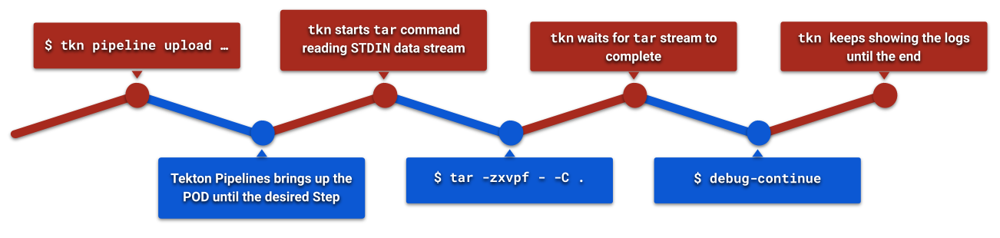

# TEP-0149: Tekton CLI Local Data Upload

- [TEP-0149: Tekton CLI Local Data Upload](#tep-0149-tekton-cli-local-data-upload)
  - [Summary](#summary)
  - [Motivation](#motivation)
    - [Goals](#goals)
    - [Non-Goals](#non-goals)
    - [Use Cases](#use-cases)
      - [Developer's Inner-Loop](#developers-inner-loop)
    - [Interactive Execution](#interactive-execution)
    - [Requirements](#requirements)
  - [Proposal](#proposal)
  - [Design Details](#design-details)
    - [API](#api)
    - [Debug Environment Script](#debug-environment-script)
    - [CLI](#cli)
      - [Local Data Upload](#local-data-upload)
  - [Design Evaluation](#design-evaluation)
  - [Implementation Plan](#implementation-plan)
    - [Test Plan](#test-plan)
  - [References](#references)

## Summary

This proposal improves the groundwork delivered on [TEP-0042][tep0042] and [TEP-0097][tep0097] with the ability to execute an arbitrary command instead of a Step's, providing the opportunity to stream local data into a `Pipeline` or `Task`. The ability to stream is granted due the new debugging breakpoint types proposed here.

A specialization of the breakpoint to stream local data into a `PipelineRun`/`TaskRun` is proposed, the design consists of using tar format via Kubernetes `STDIN` redirect, the same approach is present on ["kubectl cp"][kubectlCP] and [Shipwright][ship0021].

Two new `tkn` subcommands will coordinate the data streaming as well the configuration needed to inject the content, resulting in an "inner loop" developer experience with Tekton Pipeline and cluster resources.

## Motivation

From the developer perspective the ability to quickly iterate through testing local changes against the existing CI is fundamental to improve the "inner loop" routine, the motivation of this proposal is to create the tools and API changes necessary to achieve this goal.

Developers will be able to exercise a `Task` or `Pipeline` using their local repository clone (or any other arbitrary data) immediately watch the `PipelineRun`/`TaskRun` execution and its results, rinse-and-repeat. Another positive side effect is obtained by quickly iterating against CI using remote cluster resources, environment, configuration, services, etc.

The ability to pause on a specific step also helps debugging in general, troubleshooting might involve pausing to run arbitrary commands, inspect the current state, and more. A maintainer should be able to iterate through each Step under debugging, being able to inspect and interact with the runtime environment.

### Goals

- Improve debug toolset with the ability of pause on a specific Task or Step
- Once a Task or Step is "paused" an arbitrary command can be executed
- Once a Task or Step is "paused" the developer can upload local content using the `tkn` CLI

### Non-Goals

- Interfere with how Tekton handles Workspaces, the data upload should happen from the client to the underlying Step's Workspace
- Limit the applications receiving the STDIN stream, any application able to read [tar format][tarStandard] can be employed
- Introduce external dependencies outside of Kuberentes existing capabilities

### Use Cases

#### Developer's Inner-Loop

As a developer, I want to be able to exercise local changes against an existing Tekton Pipeline, in charge of the CI execution for the project at hand. The tools involved are Tekton Pipelines running on a Kuberentes cluster and the `tkn` command-line installed.

The Pipeline contains a Task to clone the repository, thus it needs to be omitted, instead used as an opportunity to stream local changes into the desired Workspace. When the local data upload is completed, the `PipelineRun` can continue with the subsequent steps.

Subsequent changes will take place on the project source code, thus the ability to exercise those against the Tekton Pipeline needs to be as fast as possible, with straightforward output messages, logging and easy to read the `PipelineRun` outcome.

### Interactive Execution

As a developer working with Tekton Pipelines and Tasks, I want to be able to intervene during a `PipelineRun`/`TaskRun` workflow, by suspending a Step and investigating the runtime environment, and run arbitrary commands; in order words, the opportunity to work on the same context and runtime environment.

During the maintenance of Pipelines it's identified a given script block is not working as expected, the ability to suspend a `PipelineRun` execution allows to copy, paste and modify the scripting interactively saves time from trial and error approach.

During the maintenance it is also possible to invoke "`debug-run`" to execute the regular Step's designed commands/script, the "`/tekton/scripts/debug-run`" will do so in a verbose manner, so the maintainer can quickly read the inputs given to the container and return back to the user's control. The maintainer can then decide to "`debug-continue`" or "`debug-fail-continue`".

Once the final script is amended the result is, most likely, submitted to the Pipeline (or Task) maintainer's repository for a later release, this process may involve other changes.

### Requirements

The API must be easy to use and describe which Tasks or Steps are subject to a breaking point, the idea is to allow user intervention on determined parts, including streaming local content.

Streaming data into a Kubernetes POD must allow configuration of the application reading the STDIN using [tar format][tarStandard] for a wide variety of workloads. When the configured executable is not found on the Step's container image the CLI returns error.

The ability to upload local content must respect the Workspace definition, and the upload scope must be restricted to it.

## Proposal

Extend the `.spec.debug` attributes to allow developers to intervene on a `PipelineRun` or `TaskRun` workflow by declaring which Task or Step should be suspended. The workflow in pause can be subject to context inspection, execution of arbitrary commands and as well as leveraging the same machinery ["`kubectl cp`"][kubectlCPSnippet] uses to stream local data into the POD.

This proposal is focused on enhancing the developer experience with the ability to work on an _inner-loop_, as in, testing local modifications against a Tekton defined CI as early as possible, as often as needed in order to iterate on the project at hand.

Currently developers rely on pushing the local changes on a remote repository only to "_git clone_" them into a Pipeline, taking a considerable amount of time. This proposal pivots the path that allows a direct streaming of local changes into the live `PipelineRun`.

To stream local data into a live `PipelineRun`/`TaskRun` requires the CLI to coordinate the execution workflow in order to run the command which will store the data coming via `STDIN`, most of which is already taking place in existing CLI features. The data streaming is a specialization of the debug abilities described in this document.

Additionally, being able to interactively debug a Pipeline or Task allows developers to narrow their focus on a specific part, accessing the runtime environment, trying out scripting changes, asserting the results, rinse-and-repeat until the desired state. Another type of _inner-loop_ activity but for Tekton resource maintainers.

The suspended step will interactively execute the designed command and script blocks using newly added "`debug-run`" script, showing what's being executed on the container and returning the control back to the user to either "`debug-continue`" or "`debug-fail-continue`".

## Design Details

### API

Tekton's `PipelineRun` and `TaskRun` CRDs will be modified, the attribute "`.spec.debug.breakpoint`" will support "`onSteps`" and "`onTasks`", and additional attributes are introduced under "`.spec.debug`" listing a set of Task and Step names.

When the resource lifecycle reaches one of the `.spec.debug.{steps,tasks}` the workflow is paused, allowing the user to take control. The objective of these attributes is to determine where the workflow will be paused.

The following snippet shows the `TaskRun` modifications:

```yml
---
apiVersion: tekton.dev/v1
kind: TaskRun
metadata: {}
spec:
  debug:
    breakpoint: ["onSteps"]
    steps: ["step-name"]
```

For the `PipelineRun`, please consider the following snippet:

```yml
---
apiVersion: tekton.dev/v1
kind: PipelineRun
metadata: {}
spec:
  debug:
    breakpoint: ["onTasks"]
    tasks: ["task-name"]
```

### Debug Environment Script

The debug environment will carry a new script "`debug-run`" ("`/tekton/scripts`"), the script is meant to perform the original Step's command and script block interactively, so it returns the control back to the debugging session right after.

The "`debug-run`" script will show, as much as possible, the command, arguments and/or the script block to the user, as well other relevant details which may influence.

The script is meant to be used in combination with subsequent "`debug-continue`" (or "`debug-fail-continue`") scripts, once "`debug-run`" ends the user has the opportunity to interact with the runtime environment and whether release it for the next lifecycle steps.

### CLI

#### Local Data Upload

As a specialization of the debug ability proposed in this document, developers can benefit from uploading a local repository data directly into a `PipelineRun` or `TaskRun`, instead of having to go through an external VCS (Version Control System) repository route. Here, the CLI's objective is to coordinate the resource lifecycle and stream the data to the desired Step's Workspace, once the upload is done the lifecycle should continue ("`debug-continue`").

The following image shows the sequence of actions, red represents the client side (tkn) while blue represents the Kubernetes workload, driven by Tekton Pipeline.



The following snippet introduces the CLI changes, a new `upload` subcommand for `tkn pipeline` and `tkn task`, i.e.:

```sh
tkn pipeline upload my-pipeline [.] \
    --param="k=v" \
    --ignore="path/to/excluded/directory" \
    --ignore="path/to/another/excluded/directory" \
    --on-directory="path/relative/to/workspace" \
    --on-task="git-clone" \
    --exec="tar" \
    --showlogs
```

The new `upload` subcommand follows the exact same flags as `start`, plus a few more to manage the "`.spec.debug.breakpoint`" attributes. The positional arguments specify the Pipeline name and the local directory respectively, the latter can be omitted assuming "`.`" (current directory).

Upload subcommand flags:

- `--ignore`: configures excluded entries, can be informed multiple times
- `--on-directory`: configures the directory, relative to the Task's mounted Workspace, to receive the data, by default it points to the Workspace root
- `--on-task`: Task name where "onTask" debug breaking point is configured, where the Pipeline waits for user's upload
- `--exec`: configures the command to execute to receive the STDIN data stream, by default it uses "`tar`"
- `--showlogs`: enabled by default, the "upload" subcommand assumes a interactive execution style, the users will have to actively disable this flag

The subcommand "`upload`" approach is analogous to the "`start`", with the addition of [streaming the local content storing the data using "tar"][kubectlCPSnippet] (`--exec` flag) while streaming local [`tar` formatted data][tarStandard] with Kubernetes `STDIN` redirected into the POD's container Step ([example][shipwrightCLIStreamerSnippet]), as it will be waiting for input during `onStep`/`onTask` debugging. When the transfer is completed the next action is running `debug-continue` for the `PipelineRun`/`TaskRun` resume.

For future reference, an additional flag controlling "`debug-continue`" execution may be used to simply transfer the local data, giving the user the opportunity to interactively run "`debug-run`" script with the original Step's objective.

Additionally, the upload mechanism should look for `.gitignore` files, and other formats supported in the future, to skip certain entries. More features like a `--ignore-file` flag to specify additional entries.

The same overall approach will take place on "`tkn task upload`" subcommand, however instead of `--on-task` it should leverage a `--on-step` flag.

## Design Evaluation

- [Reusability](https://github.com/tektoncd/community/blob/main/design-principles.md#reusability): The proposal extends the debugging attributes to support a new use-case, the CRD changes are backwards compatible; only new attributes added.
- [Simplicity](https://github.com/tektoncd/community/blob/main/design-principles.md#simplicity): The design extends the debug ability and restricts the set of tools, as in the commands that may be executed, to the runtime image employed on the `PipelineRun`/`TaskRun`.
- [Flexibility](https://github.com/tektoncd/community/blob/main/design-principles.md#flexibility): The proposed design works on any container image runtime, although transferring data to a `PipelineRun`/`TaskRun` requires "`tar`" (by default), it can be configured as a CLI flag. The CLI itself only coordinates the process and uses the common Kubernetes API to transfer the data.
- [Conformance](https://github.com/tektoncd/community/blob/main/design-principles.md#conformance): The design restricts the context to the set of tools installed on the container image running the `PipelineRun`/`TaskRun`, it conforms to any platform by delegating the responsibility and choice of tools to the end user. The design extends the debugging capabilities and delages to the CLI the responsibility of coordinating data streaming.
- [Security](https://github.com/tektoncd/community/blob/main/design-principles.md#security): The design focus on using common Kubernetes APIs and restricts the end user with the same policies applied to the `PipelineRun`/`TaskRun`, by using Kubernetes APIs it becomes subject to RBAC and other security policies; the proposal does not increase the surface of attack nor via CLI influence is able to elevate user privileges.

## Implementation Plan

The implementation phase will start with the [API changes described in this section][#api], the breakpoint related changes are a dependency for the [local data streaming coordinated by the CLI][#cli]. Together with the API changes the Tekton Pipelines new debug breakpoints "`onTasks`" and "`onSteps`" will take place, allowing to stop on a specific part of the execution.

Once the API modifications are finished, the CLI can take advantage of the new breakpoint types to implement the coordination logic to stream local data into the running POD, produced by a `TaskRun`.

### Test Plan

Unit and integration tests will rely on a [fake client implementation][shipwrightCLIMockSnippet], given the actions are performed on the POD level it can [simulate the "exec" calls][shipwrightCLIUnitTestSnippet] as well as the result of each command.

End-to-end testing will concentrate on uploading test data into a `TaskRun`/`PipelineRun` instance, while a subsequent step will assert the expected data exists, thus it can validate the mechanisms the CLI is relying on to upload data which includes the "`exec`" commands on a running POD.

## References

- [Upload files to a PVC (PR #1334)](https://github.com/tektoncd/cli/pull/1334)
- [Shipwright Local Source Upload (Proposal)][ship0021]
- [Shipwright CLI (GitHub)](https://github.com/shipwright-io/cli)

[kubectlCP]: https://kubernetes.io/docs/reference/generated/kubectl/kubectl-commands#cp
[kubectlCPSnippet]: https://github.com/kubernetes/kubectl/blob/eb3138bd9f8c0a4ec3dece5d431ba21be9c0bcf1/pkg/cmd/cp/cp.go#L285-L331
[ship0021]: https://github.com/shipwright-io/community/blob/main/ships/0021-local-source-upload.md
[shipwrightCLIMockSnippet]: https://github.com/shipwright-io/cli/blob/20819b4140035c3087633848ce5356765bf2c35f/test/mock/fake_remote_executor.go#L12-L18
[shipwrightCLIStreamerSnippet]: https://github.com/shipwright-io/cli/blob/0a8aad60babc7fc5dffc5ad7963caee89ba5d5ef/pkg/shp/streamer/streamer.go#L82-L111
[shipwrightCLIUnitTestSnippet]: https://github.com/shipwright-io/cli/blob/0a8aad60babc7fc5dffc5ad7963caee89ba5d5ef/pkg/shp/streamer/streamer_test.go#L15-L58
[tarStandard]: https://www.gnu.org/software/tar/manual/html_node/Standard.html
[tep0042]: https://github.com/tektoncd/community/blob/main/teps/0042-taskrun-breakpoint-on-failure.md
[tep0097]: https://github.com/tektoncd/community/blob/main/teps/0097-breakpoints-for-taskruns-and-pipelineruns.md 
