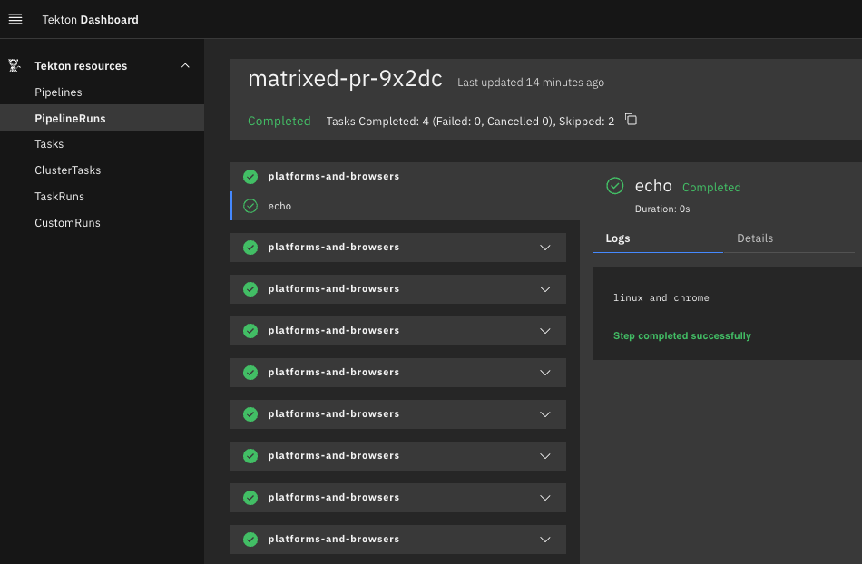
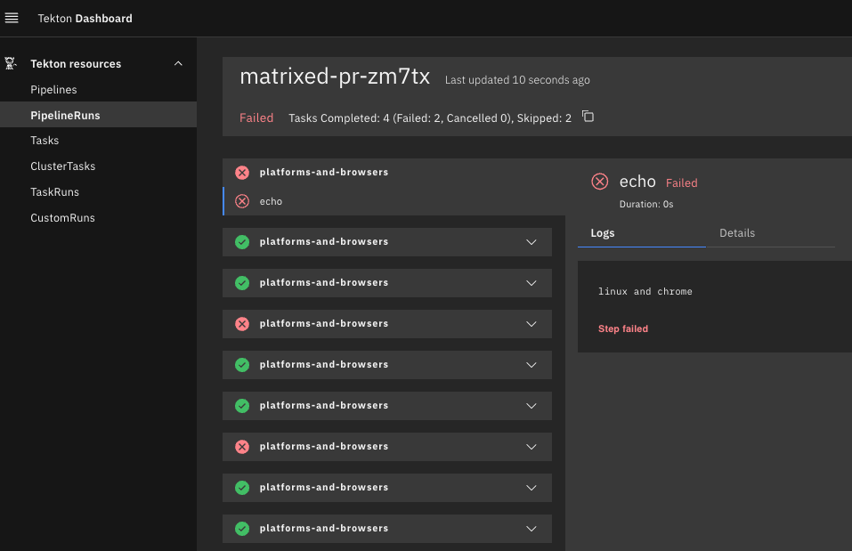

# TEP-0150: displayName in Matrix

<!-- toc -->
- [Summary](#summary)
- [Motivation](#motivation)
  - [Goals](#goals)
  - [Non-Goals](#non-goals)
  - [Use Cases](#use-cases)
- [Proposal](#proposal)
  - [Notes and Caveats](#notes-and-caveats)
- [References](#references)
<!-- /toc -->

## Summary

Matrix feature of Tekton Pipelines allows the `pipeline` author to specify multiple concurrent execution of the
same `pipelineTask`. The same `pipelineTask` is executed in parallel based on the number of input combination of
parameters. 

Matrix supports two different types of specifications including [implicit](https://github.com/tektoncd/pipeline/blob/main/docs/matrix.md#generating-combinations)
and [explicit](https://github.com/tektoncd/pipeline/blob/main/docs/matrix.md#explicit-combinations) combinations of
parameters.

- With implicit combinations, a `pipelineTask` is defined with a list of parameters and one or more values for each
  parameter. Tekton controller generates an exhaustive list of combinations based on the specified parameters. Based on
  the generated list of combinations, a `pipelineTask` is fanned out and executed with each combination. The number of
  `taskRun`s in this case is not predictable and depends on the runtime configuration.

```yaml
- name: platforms-and-browsers
  matrix:
    params:
      - name: platform
        value: $(params.platforms[*])
      - name: browser
        value: $(params.browsers[*])
```

- With explicit combinations, a `pipelineTask` is defined with a list of combinations and Tekton controller fans out the
  task based on the number of combinations. Each running instance receives unique combination of input parameters. The
  pipeline author can easily predict the number of parallel instances in advance based on this specification.

```yaml
- name: platforms-and-browsers
  matrix:
      include:
        - params:
            - name: platform
              value: "linux"
            - name: browser
              value: "chrome"
        - params:
            - name: platform
              value: "mac"
            - name: browser
              value: "safari"
```

The Tekton Dashboard lists all the instances created for a `pipelineTask` with `matrix` as expected but all have the same
`pipelineTask` name.



The users have to click on each `pipelineTask` tab to find the combination of values used for each instance.

## Motivation

The `matrix` functionality in a `pipeline` provides an ability to execute the same `task` with variety of combinations but
distinguishing each instance of a `matrix` is not easy through the existing structure of the `pipelineRun.status`.
The motivation of this proposal is to design an API such that the pipeline authors can specify the distinguishing
parameter for each `matrix` instance. This new API can be utilized by the clinets including CLI, Tekton Dashboard, etc.
to display unique names.

### Goals

- Be able to configure unique names for each `matrix` instance of a `pipelineTask` such that it is easier to distinguish
  all the instances based on their inputs through Tekton Dashboard.

### Non-Goals

- The name of the `taskRun` of each `matrix` instance is generated by Tekton Pipelines and will not be configurable by
  this proposal.

### Use Cases

- Easily identify which all `matrix` instance failed.


## Proposal

We propose utilizing an existing field - `displayName` such that `displayName` can specify `pipelineTask` params.
This allows `pipeline` authors to configure unique names for each instance using the params from each combination such
that the `matrix` instances in the Tekton Dashboard are rendered to distinguishable names.

Here are a few examples of `displayName`:

#### `matrix` with `params`

```yaml
- name: platforms-and-browsers
  displayName: "Platforms and Browsers: $(params.platform) and $(params.browser)"
  matrix:
    params:
      - name: platform
        value: $(params.platforms[*])
      - name: browser
        value: $(params.browsers[*])
  taskRef:
    name: run-tests
```

#### `matrix` with `include`

```yaml
- name: platforms-and-browsers
  displayName: "Platforms and Browsers: $(params.platform) and $(params.browser)"
  matrix:
    include:
      - params:
          - name: platform
            value: "linux"
          - name: browser
            value: "chrome"
      - params:
          - name: platform
            value: "mac"
          - name: browser
            value: "safari"
  taskRef:
    name: run-tests
```

#### `matrix` with `params` which depends on the `taskResult`

```yaml
- name: run-tests
  displayName: "Run Tests - $(params.VARIANT)"
  matrix:
    params:
      - name: VARIANT
        value: $(tasks.calculate-vars.results.variations)
  taskRef:
    name: run-tests-task
```

The resolved `[]tasks.displayName` will be available as part of `pipelineRun.status.childReferences` with each `taskRun`.
This allows the clients to consume `displayName` whenever available.

The `pipeline` with the second example of specifying `displayName` with `include` results in the following
`pipelineRun.status.childReferences`:

```json
[
  {
    "apiVersion": "tekton.dev/v1",
    "kind": "TaskRun",
    "name": "matrixed-pr-vcx79-task-0",
    "pipelineTaskName": "task-0"
  },
  {
    "apiVersion": "tekton.dev/v1",
    "displayName": "Platforms and Browsers: linux and chrome",
    "kind": "TaskRun",
    "name": "matrixed-pr-vcx79-platforms-and-browsers-0",
    "pipelineTaskName": "platforms-and-browsers"
  },
  {
    "apiVersion": "tekton.dev/v1",
    "displayName": "Platforms and Browsers: mac and safari",
    "kind": "TaskRun",
    "name": "matrixed-pr-vcx79-platforms-and-browsers-1",
    "pipelineTaskName": "platforms-and-browsers"
  }
]
```

The `spec.tasks[].displayName` was introduced in [TEP-0047](0047-pipeline-task-display-name.md) which originally allowed
any human-readable plain text and later [enhanced](https://github.com/tektoncd/pipeline/pull/7273) to support using
`params` to allow runtime information in the `displayName`. This proposal is extending the support for the `displayName`
such that the fully resolved `displayName` will be made part of the `pipelineRun.status.childReferences` whenever
specified.

### `tasks[].displayName` and `tasks[].matrix.include[].name`

`matrix.include[]` section allows specifying a `name` along with a list of `params`. The `name` field has no clear
purpose in terms of utilization. We propose to further enhance the `name` field and make it available as part of the
`pipelineRun.status.childReferences[].displayName` if specified. `spec.tasks[].displayName` and
`spec.tasks[].matrix.include[].name` can co-exist but `spec.tasks[].matrix.include[].name` takes higher precedence. We
propose `spec.tasks[].matrix.include[].name` is included in the `pipelineRun.status.childReferences` and
`pipelineRun.status.childReferences[].displayName` is set to `spec.tasks[].matrix.include[].name`. Along with this
proposal, the pipeline author can specify `params` in `spec.tasks[].matrix.include[].name` which are resolved in the
`childReferences`.

```yaml
- name: platforms-and-browsers-with-include
  matrix:
    include:
      - name: "Platform: $(params.platform)"
        params:
          - name: platform
            value: linux111
  params:
    - name: browser
      value: chrome
- name: platforms-and-browsers-with-include-but-not-resolved
  matrix:
    include:
      - name: "Platform: $(params.browser)"
        params:
          - name: platform
            value: linux111
  params:
    - name: browser
      value: chrome
```

### Precedence Order

| specification                                                                            | precedence                      | `childReferences[].displayName` |
|------------------------------------------------------------------------------------------|---------------------------------|---------------------------------|
| `tasks[].displayName`                                                                    | `tasks[].displayName`           |                                 |
| `tasks[].matrix.include[].name`                                                          | `tasks[].matrix.include[].name` | `tasks[].matrix.include[].name` |
| `tasks[].displayName` and `tasks[].matrix.include[].name`                                | `tasks[].matrix.include[].name` | `tasks[].matrix.include[].name` |

### Notes and Caveats

- This proposal is introducing an additional field in `childReferences` which can potentially increase the overall size
  of the status based on what is specified in the `displayName`. For a `displayName` with a references to `params`,
  the runtime configuration can influence the size of the `pipelineRun.status`.
- The resolved `[]tasks.displayName` will save an extra API calls for all the consumers.
- The proposal avoids adding an extra label in the `taskRun` instead of adding this to `childReferences` for a reason.
  While designing a solution for [TEP-0047](0047-pipeline-task-display-name.md), we evaluated using `labels` and
  `annotations` but were rejected for the following [reasons](https://github.com/tektoncd/community/pull/593#issuecomment-1067781861):
  - Using annotations for display names and description: we don't want to do this because as described in the
    [Kubernetes API conventions][k8s], _"Annotations are primarily generated and consumed by tooling and system extensions,
    or are used by end-users to engage non-standard behavior of components"_.
  - Using labels for display names and description: this is a more viable option because as described in the
    [Kubernetes API conventions][k8s], _"Labels are the domain of users. They are intended to facilitate organization
    and management of API resources using attributes that are meaningful to users, as opposed to be meaningful to the system.
    Users will use labels to select resources to operate on, display label values in CLI etc."_. However, we'd have to
    deprecate the existing description fields in the spec.


## References

- https://github.com/tektoncd/pipeline/issues/7082

[k8s]: https://github.com/kubernetes/community/blob/master/contributors/devel/sig-architecture/api-conventions.md#label-selector-and-annotation-conventions
