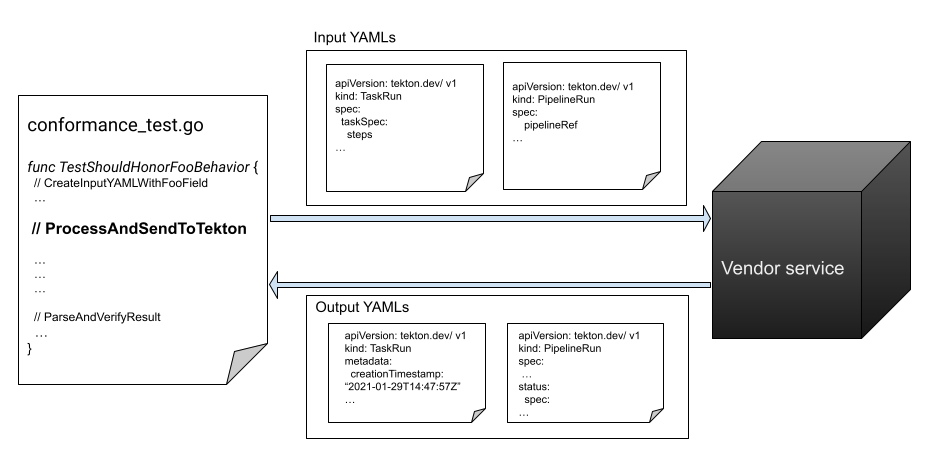

# TEP-0152: Tekton Conformance Verification

<!-- toc -->
- [Summary](#summary)
- [Motivation](#motivation)
  - [Goals](#goals)
  - [Non-Goals](#non-goals)
- [Proposal](#proposal)
  - [Verification Testing Strategy](#verification-testing-strategy)
    - [Alternatives Considered](#alternatives-considered)
  - [Vendor Requirements](#vendor-requirements)
  - [Conformance verification Test coverage](#conformance-verification-test-coverage)
  - [Test Sutie Design Details](#test-sutie-design-details)
  - [Tekton Conformance Verification Versioned](#tekton-conformance-verification-versioned)
- [Design Evaluation](#design-evaluation)
  - [Reliatbility](#reliability)
  - [Reusability](#reusability)
  - [Simplicity](#simplicity)
- [Future Work](#future-work)

## Summary

This TEP outlines the Tekton Conformance verification process according to [Tekton v1 conformance API spec](https://github.com/tektoncd/pipeline/blob/main/docs/api-spec.md). It details the implementation of the Tekton conformance verification test suite, paving the way for a community-driven Tekton conformance certification process.

## Motivation

With the release of [v1 Tekton conformance API spec](https://github.com/tektoncd/pipeline/blob/main/docs/api-spec.md), the Tekton community can now offer Tekton conformance verification. The conformance test suite will be the crucial prerequisite for vendors to claim conformance for their service.

### Goals
- Defines a **detailed conformance verification process** that Tekton vendors can verify and thereby claiming Tekton conformance for their service.
- Establishes a clear versioning policy for the Conformance Policy, including its verification process, to streamline future updates.

## Proposal
To establish Tekton conformance offerings for Pipelines from a community perspective, we need to develop a suite of Pipeline YAML test cases and implement a process for verifying the results.

### Conformance Verification Process
The verification process encompasses both vendor preparation for the conformance certification and community-led verification of conformance results.

#### Pipeline Conformance Offering
We will develop our own Tekton Pipeline Conformance offering and actively share it within the community once we establish the Task suite for vendor result verification. In order to promote understanding, we need to provide the following:
1) A clear overview of Conformance ertification benefits.
2) Step-by-step guidance on the certification process.
3) A list of certified vendor products.

*Whether the offical release for V1 API is a prerequisite for the intial Tekton Conformance Offering remains to be decided as a community*

The complete conformance verification process for vendors:

1) Prepare:

   Vendors learn about the conformance requirements and the [Conformance Tekton Pipelines API Specification](https://github.com/tektoncd/pipeline/blob/main/docs/api-spec.md).

2) Test:

   Vendors integrate their serivce with the Conformance test suite available in Tekton OSS. Run the tests following the instructions provided.

3) Results Submission:
   
   Prepare a PR to submit your results to the Conformance repo on GitHub.

4) Tekton Verification:
   
   A maintainer from Tekton will review and approve the PR Conformance for verificaiton once all the requirements are met.

#### Vendor Outputs Verification

Vendor output verification will take place within a dedicated 'conformance' repository under the TektonCD organization. We will utilize a combination of the existing dogfooding infrastructure for automation and reviewer judgment to ensure a thorough and precise verification process. Results verification could be automated via a script triggered by vendor output submissions through a Pull Request. The script would analyze the output for keywords indicating test passes, providing vendors with clear feedback on any missing or non-compliant conformance fields. More specifically, the deliverables for vendor test output verification include:
- A results verification script that analyzes test results, determines pass/fail status, and generates a summary of missing conformance fields.
- Establitsh a dedicated 'conformance' repository with comprehensive documentations for guidance.
- Define an up-to-date reviewer guide for evaluating and communicating vendor conformance test results.

### Verification Testing Strategy

The Tekton conformance test utilizes black box testing strategy to verify if a vendor services supports the required Tekton conformant APIs. For interoperability and portability, the conformance test suite should not rely on any vendor-specific implementation details.

Tekton OSS repository will house the versioned conformance test suite. This suite will provide input Tekton Primitive YAMLs for the vendor service and then verify the corresponding outputs. Tekton vendors will be able to pull the test suite from the OSS repository and integrate it with their own implementations of the required `ProcessAndSendToTekton` function(see [vendor integration](#vendor-integration) for more details). However, the internal workings of their services will remain a "black box" to the test suite, as it will only evaluate the outputs.



More specifically for the verification process:
- The test suite provides Tekton Primitives YAMLs as inputs for the vendor service to process. The YAMLs are vanilla Tekton-native PipelineRuns and TaskRuns that are vendor-agnostic. Each field/feature will be isolated in separate tests as much as possible to simplify failure attribution.

- The black box testing of the vendor focuses solely on the outputs of the service, disregarding its internal implementation details. The vendor service takes ownership of monitoring CRD reconciliation and delivering compatible Tekton YAML outputs.

- For verifying results, upon receiving [Tekton client](https://github.com/tektoncd/pipeline/blob/main/test/clients.go#L56-L71) readable YAML outputs,  the test suite will leverage the parse pkg for validating whether all the required conformant API fields are populated and the behaviors are honored.

#### Vendor integration

Tekton vendors will have the responsibility of integrating the conformance verification test suite with their respective services. To deliver conformance validation results, vendors must implement the `ProcessAndSendToTekton` function. On a higher level, it is a wrapper of all the vendor service detail, intaking and outputing Tekton YAML for Tekton conformance fields to get verified.

This function transforms vanilla Tekton Pipeline YAMLs into Tekton-parsable YAMLs for results verification. For more details:

```go
// ProcessAndSendToTekton accepts vanilla Tekton PipelineRun and TaskRun YAMLs, waits for the object to complete and outputs the completed PipelineRun and TaskRun along with the status.

// The function parameters are the inputYAML and its corresponding Primitive type (either {PipelineRun} or {TaskRun}). Additionally, the function allows for the inclusion of custom inputs as variadic parameters.

// The function will return the completed output YAML string and any associated errors.
func ProcessAndSendToTekton(inputYAML, type string, customInputs …interface{}) (string, error)
```

#### **Alternatives Considered**
As an alternative, Tekton vendors could expose endpoints for Tekton to call, allowing for  consumption and output of results according to HTTP API conformance (out-of-scope for the existing Tekton Conformance policy). In this scenario, Tekton Pipeline could trigger the testing process autonomously.

##### Cons:
- This would require HTTP API conformance which is not currently in-scope with [v1 Tekton conformance API spec](https://github.com/tektoncd/pipeline/blob/main/docs/api-spec.md).
- This increases complexity and maintenance costs for the Tekton OSS project. Vendors seeking conformance should be responsible for managing these costs.

### Vendor Requirements
- Vendor service should handle conformant vanilla PipelineRun and TaskRun (with referenced Task, Pipeline) YAMLs successfully, ensuring all the `REQUIRED` fields are accepted.
- Vendor service should be able to generate PipelineRun and TaskRun output YAMLs that are also conformant. This ensures that all `REQUIRED` fields are populated, demonstrating the expected functionality.
- For certain behaviours and functionalities, vendors are also required to provide verifiable outcome via specific Run Status fields. For example, to verify Pipeline Workspaces functionalities, we will need the PipelineRunStatus fields to be populated to show the successful support of WorkspaceBinding in each Task.
- To claim conformance for a certain Tekton version, vendors would need to provide artifacts and the way to reproduce to prove the success of all the conformance tests.

### Conformance verification Test coverage
The conformance verification test suite focuses only on the GA, non-optional API fields and features, which includes the `REQUIRED` fields from the Tekton conformant API spec policy. More specifically, the Tekton conformance verification test suite:
- Only tests the support of `GA`/`stable` conformant Tekton API fields and features - no requirements to enable any `alpha` or `beta` features.
- Aims to run tests that are non-flaky and consistent only.
- Should be Tekton vendor-agnostic, eliminating the need for any provider-specific configuration.

The following is out-of-scope:
- The suite does **NOT** test deprecated features
- It does not test for specific Event generation, as we cannot guarantee unchanging event content or delivery.
- It does not check any optional Condition fields because their semantics may change over time.

### Test Sutie Design Details
The conformance verification test leverages the existing YAML files from the Tekton Pipeline end-to-end tests and example tests. The tests cover three general types of verification: **functional**, **behavioral** and **populated** fields. This section aims to give a preview of the inputs with example YAMLs and highlights the discrepancies in the [conformant API-spec](https://github.com/tektoncd/pipeline/blob/a7ab091dd766c6a26fbd592f46c0a6e4a82cd165/docs/api-spec.md). Additionally, it includes a [POC](#proof-of-concept) with a proposed black-box testing strategy for all three test types.

#### **Should Provide Functionality**
GA fields/features functionalities are tested based on the specifications of Tekton Primitives. For each set of specified functional input fields, Tekton vendors must submit a corresponding YAML output. The output should demonstrate successful field processing and confirm that the service provides the agreed-upon functionality.
The functionality test naming will follow the format of `TestShouldProvide<Foo Functionality>`. For example, TestShouldProvidePipelineResult will utilize pipelinerun-results examples test YAML to verify the functionalities of the PipelineResults.

- Params
  - TaskSpec.[Params](https://github.com/tektoncd/pipeline/blob/933f2a07ba6af8826bc42f52de052109ece60f73/docs/api-spec.md#paramspec)
  - TaskRunSpec.[Params](https://github.com/tektoncd/pipeline/blob/933f2a07ba6af8826bc42f52de052109ece60f73/docs/api-spec.md#param)
  - PipelineSpec.[Params](https://github.com/tektoncd/pipeline/blob/933f2a07ba6af8826bc42f52de052109ece60f73/docs/api-spec.md#paramspec)
  - PipelineRunSpec.[Params](https://github.com/tektoncd/pipeline/blob/main/docs/api-spec.md#param)
- Workspaces
  - TaskSpec.[Workspaces](https://github.com/tektoncd/pipeline/blob/933f2a07ba6af8826bc42f52de052109ece60f73/docs/api-spec.md#workspacedeclaration)
  - TaskRunSpec.[Workspaces](https://github.com/tektoncd/pipeline/blob/933f2a07ba6af8826bc42f52de052109ece60f73/docs/api-spec.md#workspacebinding)
  - PipelineSpec.[Workspaces](https://github.com/tektoncd/pipeline/blob/933f2a07ba6af8826bc42f52de052109ece60f73/docs/api-spec.md#pipelineworkspacedeclaration)
  - PipelineRunSpec.[Workspaces](https://github.com/tektoncd/pipeline/blob/933f2a07ba6af8826bc42f52de052109ece60f73/docs/api-spec.md#workspacebinding)
- Results
  - TaskSpec.[Results](https://docs.google.com/document/d/16NJAWhYcduJakQT8YFNNDNI3aqdypml8b9simKtf6vA/edit#heading=h.umw0suvt8dfv)
  - PipelineSpec.[Results](https://github.com/tektoncd/pipeline/blob/933f2a07ba6af8826bc42f52de052109ece60f73/docs/api-spec.md#pipelineresult)
- All `REQUIRED` Tekton Primitive Specification
  - [TaskSpec](https://github.com/tektoncd/pipeline/blob/933f2a07ba6af8826bc42f52de052109ece60f73/docs/api-spec.md#taskspec)
  - [PipelineSpec](https://github.com/tektoncd/pipeline/blob/933f2a07ba6af8826bc42f52de052109ece60f73/docs/api-spec.md#pipelinespec)
  - [TaskRunSpec](https://github.com/tektoncd/pipeline/blob/933f2a07ba6af8826bc42f52de052109ece60f73/docs/api-spec.md#taskrunspec)
  - [PipelineRunSpec](https://github.com/tektoncd/pipeline/blob/933f2a07ba6af8826bc42f52de052109ece60f73/docs/api-spec.md#pipelinerunspec)

#### **Should Honor Behavior**
Fields may exhibit behaviors beyond mere population or modification. To assess these behaviors, we will have to utilize the outputs or functionality of other fields to examine the behavior of certain required features of the field. The behavioral test naming will follow the format of `TestShouldHonor<Bar Behaviour>`.

- Timeouts
  - [TaskRunSpec](https://github.com/tektoncd/pipeline/blob/main/docs/api-spec.md#taskrunspec).Timeout
  - PipelineRunSpec.[Timeouts](https://github.com/tektoncd/pipeline/blob/main/docs/api-spec.md#timeoutfields)
  - [PipelineTask](https://github.com/tektoncd/pipeline/blob/933f2a07ba6af8826bc42f52de052109ece60f73/docs/api-spec.md#pipelinetask).Timeout
- DAG
  - [PipelineTask](https://github.com/tektoncd/pipeline/blob/933f2a07ba6af8826bc42f52de052109ece60f73/docs/api-spec.md#pipelinetask).RunAfter
  - [PipelineSpec](https://github.com/tektoncd/pipeline/blob/933f2a07ba6af8826bc42f52de052109ece60f73/docs/api-spec.md#pipelinespec).Finally
- SecurityContext
  - [Step](https://github.com/tektoncd/pipeline/blob/933f2a07ba6af8826bc42f52de052109ece60f73/docs/api-spec.md#step).SecurityContext.Privileged
  - [Sidecar](https://github.com/tektoncd/pipeline/blob/933f2a07ba6af8826bc42f52de052109ece60f73/docs/api-spec.md#step).SecurityContext.Privileged

#### **Should Populate Static Fields**
- ObjectMeta
  - CreationTimeStamp
  - Name
- TaskRunStatus
  - StartTime
  - CompletionTime
  - [Conditions](https://github.com/tektoncd/pipeline/blob/main/docs/api-spec.md#condition)
  - [Steps](https://github.com/tektoncd/pipeline/blob/main/docs/api-spec.md#stepstate)
- PipelineRunStatus
  - StartTime
  - CompletionTime
  - [Conditions](https://github.com/tektoncd/pipeline/blob/main/docs/api-spec.md#condition)
  - [ChildReferences](https://github.com/tektoncd/pipeline/blob/main/docs/api-spec.md#childstatusreference)


### Proof of concept
To create a proof-of-concept conformance verification process, we initially utilized Tekton Pipeline's end-to-end test infrastructure, mocking the vendor service to confirm conformance. It implements the proposed black-box testing strategy for all three conformance verification test types. Please refer to the [POC conformance test suite](https://github.com/JeromeJu/pipeline/pull/140) for more information.

## Design Evaluation
### Reliability
#### How are we confident the test suite will work in theory?
Test outputs will be compared against the Tekton Pipeline server's results to guarantee interoperability and portability for users of vendor services.

### Reusability
Because conformance test suites are versioned, they should remain reusable as long as the conformance policy/API avoids major version bumps.

### Simplicity
The tests are granular for simplicity and to clearly pinpoint non-conformant fields for vendors.

### Tekton Conformance Verification Versioned
This document proposes that the conformance policy/test suite should honor the same versioning strategy as the [Pipeline releases versioning](https://github.com/tektoncd/pipeline/blob/main/releases.md#release-frequency) to minimize user confusion. In other words, each Tekton Pipeline release will have a corresponding, versioned Tekton conformance test suite. For example, the version of conformance API specification policy/test suite for Pipeline release **v1.29.0** should be consistently versioned as **v1.29.0**.

Note that vendors can still claim conformance to earlier policy versions, even after we update the current version. For instance, a vendor who has passed Tekton Conformance verification for the **v1.0 API** conformance policy can maintain that claim even after the **v2.1** policy becomes available.

## Future Work
- Tekton Conformance WG:
  
  Gaining community recognition on the verification process is crucial for rolling out Tekton conformance certification offerings. We could propose establishing a Tekton Conformance Working Group to drive this effort. 

- Furthermore, once the verification process for Tekton conformance is implemented, exploring the CNCF-hosted model, similar to [Kubernetes conformance](https://www.cncf.io/training/certification/software-conformance/), could be valuable for advocacy and certificate offerings.

## References
- https://github.com/cncf/k8s-conformance/
- https://github.com/knative/specs/blob/main/knative-conformance.md
- https://github.com/tektoncd/pipeline/blob/main/docs/api-spec.md
