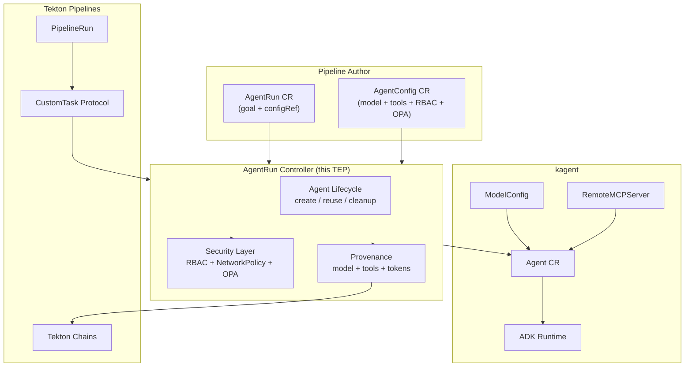
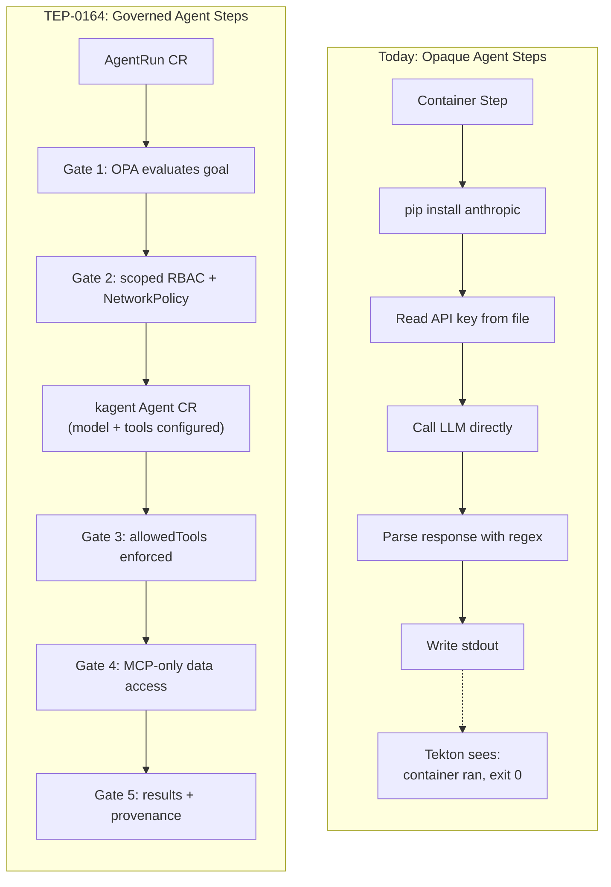
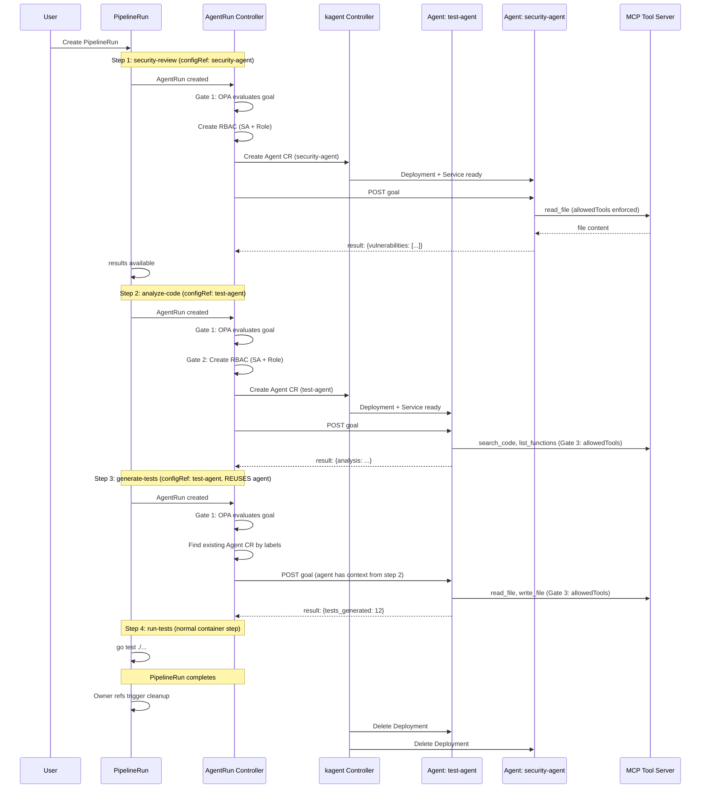
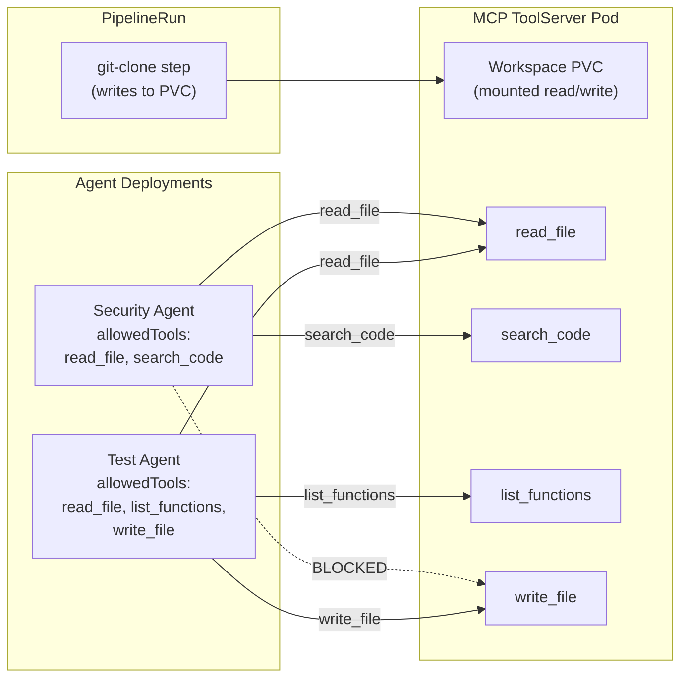
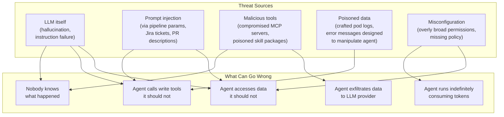
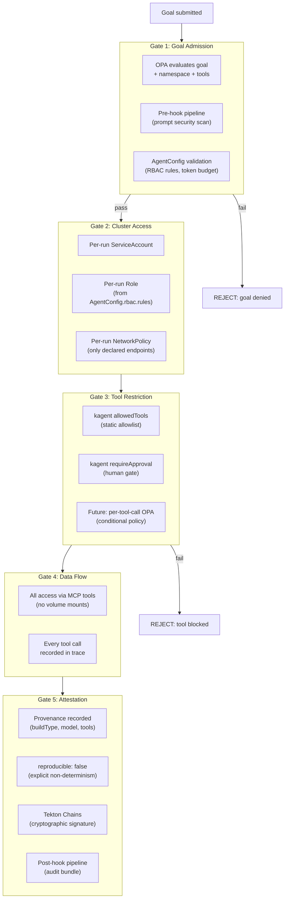
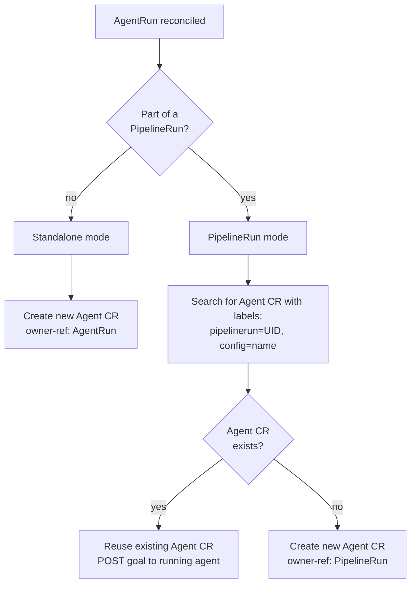

# TEP-0164: Agent-Native Workflows

---

<!-- toc -->
- [Summary](#summary)
- [Motivation](#motivation)
  - [Goals](#goals)
  - [Non-Goals](#non-goals)
  - [Use Cases](#use-cases)
    - [AI Code Review Gate](#ai-code-review-gate)
    - [Multi-Step Test Lifecycle](#multi-step-test-lifecycle)
    - [Deployment Decision Agent](#deployment-decision-agent)
    - [Cluster Diagnostics Agent](#cluster-diagnostics-agent)
  - [Requirements](#requirements)
- [Proposal](#proposal)
  - [Overview](#overview)
  - [AgentRun CRD](#agentrun-crd)
  - [AgentConfig CRD](#agentconfig-crd)
  - [Agent Lifecycle](#agent-lifecycle)
    - [Standalone AgentRun](#standalone-agentrun)
    - [AgentRun in a PipelineRun](#agentrun-in-a-pipelinerun)
    - [Multiple Agents in a PipelineRun](#multiple-agents-in-a-pipelinerun)
  - [Integration with kagent](#integration-with-kagent)
  - [Integration with Tekton Pipelines](#integration-with-tekton-pipelines)
  - [Codebase Access via MCP Tools](#codebase-access-via-mcp-tools)
  - [Security Layer](#security-layer)
  - [Provenance](#provenance)
  - [Notes and Caveats](#notes-and-caveats)
- [Design Details](#design-details)
  - [Execution Flow: Standalone AgentRun](#execution-flow-standalone-agentrun)
  - [Execution Flow: PipelineRun with Agent Steps](#execution-flow-pipelinerun-with-agent-steps)
  - [Agent CR Scoping and Reuse](#agent-cr-scoping-and-reuse)
  - [kagent Resource Resolution](#kagent-resource-resolution)
  - [Security Implementation Details](#security-implementation-details)
  - [CustomTask Adapter](#customtask-adapter)
  - [Provenance Recording](#provenance-recording)
  - [AgentConfig Snapshot](#agentconfig-snapshot)
- [Design Evaluation](#design-evaluation)
  - [Reusability](#reusability)
  - [Simplicity](#simplicity)
  - [Flexibility](#flexibility)
  - [Conformance](#conformance)
  - [User Experience](#user-experience)
  - [Performance](#performance)
  - [Risks and Mitigations](#risks-and-mitigations)
  - [Drawbacks](#drawbacks)
- [Alternatives](#alternatives)
  - [Build Agent Stack Inside Tekton](#build-agent-stack-inside-tekton)
  - [Pod-Per-Run Without Agent CR](#pod-per-run-without-agent-cr)
  - [Pipeline spec.agents Field](#pipeline-specagents-field)
  - [Volume Mounts for Codebase Access](#volume-mounts-for-codebase-access)
  - [Convention-Based Container Wrapping](#convention-based-container-wrapping)
- [Implementation Plan](#implementation-plan)
  - [Milestones](#milestones)
  - [Test Plan](#test-plan)
  - [Infrastructure Needed](#infrastructure-needed)
  - [Upgrade and Migration Strategy](#upgrade-and-migration-strategy)
  - [Implementation Pull Requests](#implementation-pull-requests)
- [References](#references)
<!-- /toc -->

## Summary

AI agents are appearing in CI/CD pipelines, doing code review, security
analysis, test generation, and deployment decisions. Today they run as
opaque Python scripts inside container steps. Tekton cannot see what
model they called, which tools they used, how many tokens they consumed,
or whether they followed security policy.

This TEP proposes making Tekton an **agent-native workflow engine** by
introducing `AgentRun` and `AgentConfig` CRDs that use
[kagent][kagent]'s Agent CR as the agent runtime and add per-run
security controls, pipeline integration via CustomTask, and provenance
recording.



The execution model uses **kagent's existing Agent CR**, which creates a
Deployment and Service for the agent. For standalone AgentRuns, the Agent
CR is created for a single goal and cleaned up after completion. For
PipelineRuns with multiple agent steps, the Agent CR is created at the
first agent step and shared across subsequent steps that reference the
same AgentConfig, preserving conversation context. The Agent CR is
cleaned up when the PipelineRun completes.

The controller adds security controls that neither kagent nor Tekton
Pipelines provides alone: per-run RBAC scoping with configurable rules,
per-run NetworkPolicy generation, layered policy enforcement (OPA at
goal submission + kagent tool allowlists at execution), prompt
auditability, and provenance recording for [Tekton Chains][chains].

A [CustomTask][customtask] adapter allows AgentRuns to participate in
Tekton Pipeline DAGs, making agent steps composable with traditional
container steps using standard result passing and `when` expressions.

## Motivation

AI agents are already appearing in CI/CD pipelines, but they are
invisible to the platform. A [comparison of two real-world pipelines][pipeline-comparison],
one implemented [without agents][pipeline-without-agents] and one
[with agents][pipeline-with-agents], illustrates the problem:

**Without agents** (614 lines, 12 tasks): Template-based test plan
generation using static `case` statements. A manual approval gate where
humans write tests from scratch. Raw pass/fail counts posted as results.

**With agents** (1247 lines, 14 tasks): An agent reads actual source
code, generates real test implementations, self-reviews its own work,
triages test failures (infrastructure vs test bugs vs real regressions),
and produces an intelligent summary report.

The following diagram illustrates the difference between today's opaque
agent steps and the governed model proposed by this TEP:



The agents transform the pipeline from a structure-only scaffold into an
intelligence-augmented workflow. But every agent step is an opaque
container:

```python
# Repeated in every agent step: ~100 lines of boilerplate
subprocess.check_call([sys.executable, "-m", "pip", "install", "anthropic", "-q"])
client = anthropic.Anthropic(api_key=api_key)
# ... 80 more lines of prompt construction, response parsing
```

Tekton sees these as ordinary container steps. There is no way for a
platform operator to:

- Scope agent permissions to exactly the Kubernetes resources they need
- Enforce which tools an agent may call, with real-time policy evaluation
- Audit which models and prompts were used across the organization
- Record agent behavior in SLSA-compatible attestations
- Set token budgets or network isolation per agent execution

Meanwhile, [kagent][kagent] provides CRDs for [model configuration][kagent-models]
(8 providers), [MCP tool servers][kagent-tools] (with automatic tool
discovery), and agent runtimes (Python and Go ADKs). But kagent does not provide pipeline
orchestration, supply-chain provenance, or the per-execution security
controls that a CI/CD platform requires.

### Goals

1. Define `AgentRun` and `AgentConfig` CRDs that enable goal-driven
   agent execution with per-run security controls
2. Use kagent's Agent CR as the agent runtime, creating Agent CRs
   scoped to AgentRun or PipelineRun lifetimes
3. Use kagent's `ModelConfig` and `RemoteMCPServer` CRDs for model and
   tool configuration without reimplementing them
4. Add per-run security controls: RBAC scoping with configurable rules,
   NetworkPolicy, layered policy enforcement (OPA + kagent tool
   restrictions)
5. Provide a CustomTask adapter so AgentRuns participate in Tekton
   Pipeline DAGs with result passing and `when` expression support
6. Record agent execution provenance for consumption by Tekton Chains
7. Route all data access (codebase, cluster state) through MCP tool
   calls for uniform policy enforcement and audit

### Non-Goals

1. Building a new agent runtime (kagent provides the ADK)
2. Building LLM provider integrations (kagent supports 8 providers)
3. Building MCP server infrastructure (kagent provides
   `RemoteMCPServer` and `ToolServer`)
4. Adding new fields to Tekton's Pipeline or PipelineRun CRDs
5. Defining multi-agent communication protocols
6. Implementing or bundling any LLM model or inference engine

### Use Cases

#### AI Code Review Gate

As a platform engineer, I want an agent step in my Pipeline that reviews
a pull request diff and returns a structured `approved`/`findings`
result, so that downstream steps can conditionally block or proceed,
with full provenance of what the agent saw and decided.

This is a standalone agent task. One AgentRun, one goal, one result.

#### Multi-Step Test Lifecycle

As a QA engineer, I want a pipeline where an agent analyzes a codebase,
generates test implementations, self-reviews them, and triages any
failures. The agent should maintain context across these steps so it
does not re-read the codebase at each step.

This is a multi-step agent workflow. Multiple AgentRuns in a PipelineRun
sharing the same Agent CR, with conversation context preserved across
steps.

#### Deployment Decision Agent

As a DevOps engineer, I want an agent step that queries my observability
stack via permitted MCP tools and returns a structured `proceed`/`hold`
recommendation, enforced by OPA policy so it cannot access resources
outside its declared scope.

#### Cluster Diagnostics Agent

As a cluster administrator, I want to create an AgentRun with a goal
like "diagnose why deployment api-server is failing in namespace
production" and have the agent investigate using only the Kubernetes
resources I have authorized via per-run RBAC.

### Requirements

| ID | Requirement | Priority |
|----|-------------|----------|
| R1 | AgentRun controller MUST create kagent Agent CRs for agent execution | Must |
| R2 | Agent CRs MUST be scoped to AgentRun (standalone) or PipelineRun (multi-step) lifetime | Must |
| R3 | Multiple AgentRuns with the same configRef in a PipelineRun MUST reuse the same Agent CR | Must |
| R4 | AgentRun controller MUST generate per-run RBAC using rules from AgentConfig | Must |
| R5 | AgentConfig MUST reference kagent ModelConfig for model selection | Must |
| R6 | AgentConfig MUST reference kagent RemoteMCPServer for tool providers | Must |
| R7 | Agent execution results MUST be recorded in AgentRun status | Must |
| R8 | Policy enforcement MUST use a five-gate model: OPA at goal submission (Gate 1) + RBAC and NetworkPolicy (Gate 2) + allowedTools/requireApproval at tool execution (Gate 3) + MCP-only data access (Gate 4) + provenance (Gate 5) | Must |
| R9 | OPA goal-level input MUST be constructed by the controller from AgentRun metadata, not from LLM-controlled data | Must |
| R10 | Per-tool-call OPA enforcement inside the kagent ADK SHOULD be contributed upstream as a future enhancement | Should |
| R11 | A CustomTask adapter MUST allow AgentRun to participate in Pipeline DAGs via the Tekton CustomRun protocol | Must |
| R12 | AgentRun results MUST be passable to downstream Pipeline steps via `when` expressions | Must |
| R13 | NetworkPolicy SHOULD be generated when networkPolicy is set to strict | Should |
| R14 | Provenance metadata MUST be recorded in AgentRun status (observable fields in Phase 1, full execution trace when kagent telemetry is available) | Must |
| R15 | All per-run resources MUST use owner references for garbage collection | Must |
| R16 | AgentRun SHOULD support Tekton PipelineRun-based pre/post hooks | Should |
| R17 | AgentRun MUST fail gracefully with a clear message when kagent CRDs are not installed | Must |
| R18 | OPA policy MUST default to fail-closed (deny-all) when no policy is configured, unconditionally | Must |
| R19 | All codebase and cluster access SHOULD go through MCP tool calls, not volume mounts | Should |

## Proposal

### Overview

The following diagram shows how a PipelineRun with multiple agent steps
and a traditional container step works end-to-end:



```
PipelineRun
│
├── AgentRun Controller sees agent steps (CustomTask references)
│
├── Creates kagent Agent CR per unique configRef
│   └── kagent controller creates Deployment + Service
│       └── Agent HTTP server running ADK runtime
│
├── Step 1 (agent, security-agent): Gate 1 OPA, Gate 2 RBAC, create Agent CR, POST goal
├── Step 2 (agent, test-agent): Gate 1 OPA, Gate 2 RBAC, create Agent CR, POST goal
├── Step 3 (agent, test-agent): Gate 1 OPA, reuse Agent CR, POST goal (context preserved)
├── Step 4 (container): normal Tekton step, uses agent results
│
├── PipelineRun completes
└── Agent CRs garbage collected via owner references
```

| Layer | Responsibility | Owner |
|-------|---------------|-------|
| Agent Runtime | LLM calls, MCP tool execution, agent loop | kagent (Agent CR, ADK) |
| Model + Tool Config | Model endpoints, credentials, MCP servers | kagent (ModelConfig, RemoteMCPServer) |
| Agent Lifecycle | Create/reuse/cleanup Agent CRs per scope | AgentRun controller (this TEP) |
| Security | Per-run RBAC, NetworkPolicy, OPA | AgentRun controller (this TEP) |
| Pipeline Integration | DAG sequencing, hooks, result passing | Tekton Pipelines + CustomTask |
| Provenance | Attestation of agent behavior | AgentRun status + Tekton Chains |

### AgentRun CRD

```yaml
apiVersion: agent.tekton.dev/v1alpha1
kind: AgentRun
metadata:
  name: debug-api-server
spec:
  configRef:
    name: cluster-diagnostics
  goal: |
    Diagnose why deployment 'api-server' is failing in namespace 'production'.
  context:
    hints:
      - "Check recent events"
      - "Review pod logs for OOMKilled"
status:
  phase: Succeeded
  startTime: "2026-03-20T14:20:04Z"
  completionTime: "2026-03-20T14:22:30Z"
  iterations: 3
  agentRef: cluster-diagnostics-7xk2    # kagent Agent CR used
  results:
    - name: diagnosis
      value: "OOMKilled: memory limit 256Mi too low for request pattern"
    - name: recommendation
      value: "Increase memory limit to 512Mi"
  provenance:
    buildType: "https://tekton.dev/agent-provenance/v1"
    reproducible: false
    internalParameters:
      model:
        provider: Anthropic
        modelId: "claude-sonnet-4-6"
      systemPromptHash: "sha256:abc123..."
    tokenUsage:
      totalTokens: 4200
    policyDecisions:
      layer1_opa:
        evaluated: 1
        allowed: 1
        denied: 0
```

### AgentConfig CRD

```yaml
apiVersion: agent.tekton.dev/v1alpha1
kind: AgentConfig
metadata:
  name: cluster-diagnostics
spec:
  # -- kagent references --------------------------
  modelConfigRef:
    name: claude-sonnet
    namespace: kagent-system

  toolServers:
    - ref:
        name: k8s-read-tools
        namespace: kagent-system
        kind: RemoteMCPServer
      allowedTools:
        - k8s_get_resources
        - k8s_get_logs
        - k8s_describe
      requireApproval: []

  # -- Agent behavior -----------------------------
  maxIterations: 5
  timeout: 10m
  tokenBudget: 16384              # enforced in Phase 2; informational in Phase 1
  systemPrompt: |
    You are a Kubernetes cluster diagnostics agent.
    You may ONLY use the tools provided.

  # -- Per-run RBAC (configurable rules) ----------
  rbac:
    rules:
      - apiGroups: [""]
        resources: [pods, services, events]
        verbs: [get, list, watch]
      - apiGroups: [apps]
        resources: [deployments, replicasets]
        verbs: [get, list, watch]

  # -- OPA policy ---------------------------------
  policy:
    opa:
      configMapRef:
        name: agent-policies
        key: tool-policy.rego
      defaultDeny: true

  # -- Network isolation --------------------------
  networkPolicy: strict

  # -- Tekton hooks (optional) --------------------
  preHooks:
    pipelineRef:
      name: prompt-security-scan
  postHooks:
    pipelineRef:
      name: audit-bundle-collection
```

### Agent Lifecycle

#### Standalone AgentRun

When an AgentRun is created outside a PipelineRun:

1. Controller creates a kagent Agent CR, owner-referenced to the
   AgentRun
2. kagent creates the Deployment + Service
3. Controller waits for Agent Ready condition
4. Controller POSTs the goal to the Agent Service via HTTP
5. Controller collects results from the response
6. AgentRun marked Succeeded/Failed
7. Agent CR garbage collected via owner reference

The Agent Deployment is short-lived. It exists only for this one goal.

#### AgentRun in a PipelineRun

When multiple AgentRuns in a PipelineRun reference the same
AgentConfig:

1. First AgentRun: controller creates a kagent Agent CR, labeled
   with the PipelineRun UID and AgentConfig name
2. kagent creates the Deployment + Service
3. Controller POSTs the first goal, collects results
4. Second AgentRun (same configRef, same PipelineRun): controller
   finds the existing Agent CR by label, reuses it
5. Controller POSTs the second goal. The agent has conversation
   context from the first goal.
6. PipelineRun completes: Agent CR is cleaned up

The Agent maintains conversation context across all steps that share
the same configRef within a PipelineRun.

#### Multiple Agents in a PipelineRun

Different configRef values create different Agent CRs:

```yaml
tasks:
  - name: security-review
    taskRef:
      apiVersion: agent.tekton.dev/v1alpha1
      kind: AgentRun
    params:
      - name: configRef
        value: security-agent        # Agent CR #1
      - name: goal
        value: "Review for vulnerabilities"

  - name: analyze-code
    taskRef:
      apiVersion: agent.tekton.dev/v1alpha1
      kind: AgentRun
    params:
      - name: configRef
        value: test-agent            # Agent CR #2
      - name: goal
        value: "Analyze the codebase"

  - name: generate-tests
    runAfter: [analyze-code]
    taskRef:
      apiVersion: agent.tekton.dev/v1alpha1
      kind: AgentRun
    params:
      - name: configRef
        value: test-agent            # Reuses Agent CR #2
      - name: goal
        value: "Generate tests based on your analysis"
```

This PipelineRun creates two Agent CRs. `security-agent` handles one
step. `test-agent` handles two steps with shared context.

### Integration with kagent

The AgentRun controller uses kagent in two ways:

**1. Agent CR (agent runtime)**

The controller creates kagent `Agent` CRs via the dynamic client. Each
Agent CR references a kagent `ModelConfig` for the LLM provider and
kagent `RemoteMCPServer` resources for tools. kagent's controller
handles creating the Deployment, Service, and configuring the ADK
runtime. The AgentRun controller does not build Pods directly.

**2. Configuration CRDs (read-only, via dynamic client)**

The controller reads kagent `ModelConfig` and `RemoteMCPServer` CRs to
validate that referenced models exist and tools are discovered. These
are long-lived cluster resources managed by platform administrators.

The controller interacts with all kagent CRDs via
`k8s.io/client-go/dynamic` to avoid Go module version coupling
(kagent uses k8s.io v0.35, this controller uses v0.32).

### Integration with Tekton Pipelines

**CustomTask adapter** (Phase 1): AgentRun implements the Tekton
CustomTask protocol, allowing it to be referenced from Pipeline steps:

```yaml
apiVersion: tekton.dev/v1
kind: Pipeline
metadata:
  name: review-and-deploy
spec:
  tasks:
    - name: code-review
      taskRef:
        apiVersion: agent.tekton.dev/v1alpha1
        kind: AgentRun
      params:
        - name: configRef
          value: code-review-agent
        - name: goal
          value: "Review the PR diff for security issues"
    - name: deploy
      runAfter: [code-review]
      when:
        - input: "$(tasks.code-review.results.approved)"
          operator: in
          values: ["true"]
      taskRef:
        name: kubectl-deploy
```

**Pre/post hooks**: Optional Tekton PipelineRuns for security scanning
(pre) and audit collection (post) around agent execution. Created via
dynamic client, owner-referenced for cleanup. When Tekton Pipelines is
not installed, hooks configuration is rejected at validation time.

### Codebase Access via MCP Tools

Agents access codebases and cluster state through [MCP][mcp] tool
calls, not through volume mounts. This is a deliberate architectural decision.

Volume mounts give the agent raw filesystem access. The agent can read
any file on the mounted volume. OPA policy cannot restrict which files
the agent reads because file reads happen inside the container, outside
the tool call protocol.

MCP tools route every data access through the tool protocol. Every
`read_file`, `search_code`, `list_functions` call goes through the MCP
server, which means every call is restricted by kagent's
`allowedTools` enforcement and recorded in the agent's tool call
history for provenance.

```
Volume mount:  Agent reads filesystem directly. No restriction. No audit.
MCP tools:     Agent calls tool. kagent enforces allowedTools. MCP server reads file. Audited.
```

The following diagram shows how multiple agents access the same
codebase through a shared MCP server with different tool allowlists:



For multi-agent pipelines working on the same codebase, all agents talk
to the same MCP server. Each agent has its own tool allowlist controlling
what it can access through that server:

```
PipelineRun
├── MCP Server (ToolServer CR, has workspace PVC mounted)
│   ├── read_file
│   ├── search_code
│   ├── list_functions
│   └── write_file
│
├── Agent CR #1 (security-agent)
│   └── allowedTools: [read_file, search_code]
│
├── Agent CR #2 (test-agent)
│   └── allowedTools: [read_file, list_functions, write_file]
```

Agents that need to write files (test generation) use a `write_file`
tool on the MCP server. The write is controlled by kagent's
`allowedTools` (Gate 3) and recorded in the provenance trace (Gate 5).

### Security Layer

#### Threat Model

Agentic workflows introduce threats that do not exist in traditional
container-based CI/CD:



The [CoSAI Principles for Secure Agentic Systems][cosai] state: "The
non-deterministic nature of AI means we cannot always predict the exact
path an agent will take, making strong foundational cybersecurity
controls that strictly limit potential actions to expected and intended
purposes critical."

The [OWASP Top 10 for Agentic Applications][owasp-agentic] identifies
agent behavior hijacking (ASI01), prompt injection (ASI02), and tool
misuse (ASI03) as the top risks. These are the threats this security
layer addresses.

#### Five-Gate Security Architecture

Each threat is stopped at a specific point in the execution path.
No single gate is sufficient. The five gates compose Kubernetes RBAC,
NetworkPolicy, OPA, kagent tool restrictions, and MCP protocol into a
coherent security boundary around agent execution.



| Gate | Threat Addressed | Provided By | Exists Today? |
|------|-----------------|-------------|---------------|
| 1. Goal admission | Prompt injection, misconfiguration | OPA (library) + Tekton pre-hook PipelineRun | Yes |
| 2. Cluster access | Unauthorized data access, lateral movement | Kubernetes RBAC + NetworkPolicy (native K8s) | Yes |
| 3. Tool restriction | Tool misuse, unauthorized write operations | kagent allowedTools + requireApproval | Yes |
| 4. Data flow | Data exfiltration, unaudited access | MCP protocol (all access via tool calls) | Yes |
| 5. Attestation | Invisible agent behavior, no accountability | Provenance struct + Tekton Chains | Partially (provenance new, Chains exists) |

Every gate except provenance uses existing infrastructure. AgentRun
does not invent new security primitives. It composes existing
Kubernetes, kagent, and Tekton mechanisms into a per-execution
security boundary with cleanup and audit trail.

#### Gate 1: Goal Admission (OPA)

The controller evaluates OPA policy at goal submission time. The OPA
input includes the goal text, requested tool servers, target
namespaces, and the AgentConfig reference. OPA can reject the entire
execution before any agent is created.

```rego
package agent.goals

default allow = false

allow {
    input.namespace in data.allowed_namespaces
}

deny[msg] {
    some tool in input.requested_tools
    tool in data.write_tools
    not tool in input.require_approval
    msg := sprintf("write tool %s must have requireApproval set", [tool])
}
```

OPA input is constructed by the controller, not the LLM:

```go
input := map[string]interface{}{
    "goal":             agentRun.Spec.Goal,
    "namespace":        agentRun.Namespace,
    "requested_tools":  allowedToolsList,
    "require_approval": requireApprovalList,
    "config":           agentConfigName,
}
```

Default policy is **fail-closed**: when no OPA policy ConfigMap is
configured, goal submission is denied unconditionally. The
`defaultDeny` field in AgentConfig is reserved for future use to
allow explicit opt-in to permissive mode; the default behavior is
always deny.

The controller also sets `allowedTools` and `requireApproval` on
the Agent CR, which kagent enforces at Gate 3.

#### Gate 2: Cluster Access (RBAC + NetworkPolicy)

For each AgentRun (or per PipelineRun for shared agents), the
controller creates:
- A `ServiceAccount` named `<agentrun-name>-sa`
- A `Role` with rules from `AgentConfig.spec.rbac.rules`
- A `RoleBinding` binding the Role to the ServiceAccount

The kagent Agent CR is configured with
`spec.declarative.deployment.serviceAccountName` so the agent
Deployment uses this scoped ServiceAccount. All resources are
owner-referenced for cleanup.

When `networkPolicy: strict`, the controller generates a
NetworkPolicy that:
- Allows ingress from the AgentRun controller (HTTP communication)
- Allows egress to: Kubernetes API server (resolved cluster IP,
  443/tcp), DNS (53/udp), declared MCP tool server endpoints
- Denies all other traffic

#### Gate 3: Tool Restriction (kagent)

kagent's ADK runtime enforces `allowedTools` (the agent cannot call
tools not in the list) and `requireApproval` (the agent pauses and
waits for human approval before calling specified tools). These are
set by the AgentRun controller when constructing the Agent CR from
the AgentConfig.

Future: per-tool-call OPA evaluation inside the kagent ADK, where
the full tool call input (namespace, resource type, label selectors)
is available. This requires an upstream contribution to kagent.

#### Gate 4: Data Flow (MCP)

All codebase and cluster access goes through MCP tool calls, not
volume mounts. This means every data access is visible in the
execution trace, restricted by the tool allowlist, and auditable
in provenance. See [Codebase Access via MCP Tools](#codebase-access-via-mcp-tools).

#### Gate 5: Attestation (Provenance + Chains)

See [Provenance](#provenance) for the full provenance schema,
buildType URI, telemetry data flow, and Chains integration.

### Provenance

#### Agent Provenance vs Build Provenance

Traditional CI/CD provenance (SLSA, in-toto) assumes a deterministic
build: the same source, builder, and parameters produce the same
artifact. Agent execution is fundamentally different. The same goal,
model, and tools can produce different tool call sequences, different
reasoning paths, and different results on every run. This is not a
bug; it is the nature of LLM-based reasoning.

This means agent provenance must be **descriptive** (what happened)
rather than **prescriptive** (what should happen). A verifier cannot
reproduce an agent execution from its provenance. Instead, provenance
answers: what model was used, what prompt was given, what tools were
called in what order, what policy decisions were made, and what
results were produced.

The TEP proposes an agentic provenance extension that records this
metadata in a format compatible with [SLSA provenance][slsa] and
informed by the [PROV-AGENT][prov-agent] schema for tracking AI
agent interactions. The [LLM Agents for Interactive Workflow
Provenance][workflow-provenance] reference architecture provides
additional context for provenance capture in non-deterministic
workflows.

#### buildType

The TEP defines a new buildType URI for agentic executions:

```
https://tekton.dev/agent-provenance/v1
```

This buildType signals to verifiers that the execution is
non-deterministic, the artifact cannot be reproduced from the same
inputs, and the provenance contains agent-specific fields
(model identity, tool call sequence, policy decisions).

#### Provenance Fields

The `AgentRun.status.provenance` captures the following, mapped to
SLSA predicate fields:

```yaml
provenance:
  # Build definition
  buildType: "https://tekton.dev/agent-provenance/v1"
  reproducible: false
  reproducibilityNote: "LLM-based agent execution is non-deterministic"

  # External parameters (user-provided inputs)
  externalParameters:
    goal: "Diagnose why deployment api-server is failing"
    goalHash: "sha256:def456..."
    hints: ["Check recent events", "Review pod logs"]
    agentConfigRef: cluster-diagnostics
    agentConfigHash: "sha256:789abc..."    # hash of snapshotted config

  # Internal parameters (system-determined)
  internalParameters:
    model:
      provider: Anthropic
      modelId: "claude-sonnet-4-6"
      apiVersion: "2023-06-01"
      temperature: 0.2
      maxTokens: 4096
      tokenBudget: 16384
    systemPromptHash: "sha256:abc123..."
    maxIterations: 5
    timeout: "10m"
    opaPolicy:
      configMapRef: agent-policies
      policyHash: "sha256:fed321..."

  # Resolved dependencies (runtime-discovered)
  resolvedDependencies:
    - name: kagent-agent-cr
      uri: "kagent.dev/v1alpha2/Agent/default/cluster-diagnostics-7xk2"
    - name: adk-runtime-image
      uri: "ghcr.io/kagent-dev/kagent/app"
      digest: "sha256:a1b2c3..."
    - name: mcp-server-k8s-read-tools
      uri: "kagent.dev/v1alpha2/RemoteMCPServer/kagent-system/k8s-read-tools"
      toolsDiscovered: ["k8s_get_resources", "k8s_get_logs", "k8s_describe"]
    - name: model-config
      uri: "kagent.dev/v1alpha2/ModelConfig/kagent-system/claude-sonnet"

  # Execution trace (ordered tool call sequence)
  executionTrace:
    iterations: 3
    toolCalls:
      - sequence: 1
        iteration: 1
        tool: k8s_get_resources
        inputHash: "sha256:111..."
        outputHash: "sha256:222..."
        timestamp: "2026-03-20T14:20:05Z"
        durationMs: 340
        policyVerdict: allowed
      - sequence: 2
        iteration: 1
        tool: k8s_get_logs
        inputHash: "sha256:333..."
        outputHash: "sha256:444..."
        timestamp: "2026-03-20T14:20:06Z"
        durationMs: 520
        policyVerdict: allowed
      - sequence: 3
        iteration: 2
        tool: k8s_describe
        inputHash: "sha256:555..."
        outputHash: "sha256:666..."
        timestamp: "2026-03-20T14:20:08Z"
        durationMs: 280
        policyVerdict: allowed
    llmInvocations:
      - sequence: 1
        iteration: 1
        requestHash: "sha256:aaa..."
        responseHash: "sha256:bbb..."
        promptTokens: 1200
        completionTokens: 800
      - sequence: 2
        iteration: 2
        requestHash: "sha256:ccc..."
        responseHash: "sha256:ddd..."
        promptTokens: 2400
        completionTokens: 600

  # Token usage (total and per-invocation breakdown)
  tokenUsage:
    totalPromptTokens: 3600
    totalCompletionTokens: 1400
    totalTokens: 5000

  # Policy decisions
  policyDecisions:
    layer1_opa:
      engine: OPA
      evaluated: 1
      allowed: 1
      denied: 0
    layer2_kagent:
      allowedToolsEnforced: true
      toolsBlocked: 0
      approvalsPaused: 0

  # Builder identity
  builder:
    controllerVersion: "v0.1.0"
    kagentVersion: "v0.7.13"
    adkImageDigest: "sha256:a1b2c3..."

  # Result
  resultHash: "sha256:eee..."
```

#### Telemetry Data Flow

The controller cannot observe individual tool calls and LLM
invocations because they happen inside the kagent ADK runtime. The
execution trace is collected from the kagent Agent's HTTP response.

The controller POSTs a goal to the Agent Service and expects a
structured JSON response that includes both the result and execution
telemetry:

```json
{
  "result": {
    "diagnosis": "OOMKilled: memory limit too low",
    "recommendation": "Increase to 512Mi"
  },
  "telemetry": {
    "iterations": 3,
    "toolCalls": [...],
    "llmInvocations": [...],
    "tokenUsage": {...}
  }
}
```

kagent's ADK already tracks tool calls and LLM invocations internally
for its session management. Exposing this data in the HTTP response
is an upstream contribution to kagent. Until this is available, the
controller records what it can observe directly: model identity,
prompt hash, policy decisions (Gate 1), and timing metadata.

#### Tekton Chains Integration

Tekton Chains discovers agent provenance through the CustomTask
adapter. When an AgentRun completes as a CustomRun within a
PipelineRun, Chains processes it like any other step:

1. Chains watches CustomRun completion events
2. The CustomRun status contains the `provenance` struct
3. Chains maps the struct to an in-toto attestation using the
   `https://tekton.dev/agent-provenance/v1` buildType
4. The attestation is signed and stored alongside the PipelineRun
   attestation

For standalone AgentRuns (not in a Pipeline), a Chains extension
watches AgentRun completion events directly and produces standalone
attestations.

The `reproducible: false` flag signals to any SLSA verifier that
this execution cannot be reproduced from the same inputs. This is
a necessary extension for non-deterministic build steps.

#### Prompt Auditability

The `systemPrompt` field in AgentConfig is mutable. The controller
records `systemPromptHash` (SHA-256) in provenance. This is
auditability, not immutability: you can verify what was used and
detect changes between runs. True immutability would require an
admission webhook and is out of scope.

#### Token Budget

The `tokenBudget` field is passed to the kagent Agent as
configuration. If the ADK runtime does not enforce it natively, the
controller enforces a timeout-based fallback. Token budgets via Pod
timeout are best-effort because a model can consume many tokens in a
short time. This limitation is acknowledged.

#### Prior Art

- [PROV-AGENT][prov-agent] extends W3C PROV with agent-specific
  entities (AIAgent, AgentTool, AIModelInvocation) and relationships
  for tracking non-deterministic agent interactions. The provenance
  schema in this TEP is informed by PROV-AGENT's entity model.
- [CoSAI Principles][cosai] recommend adapting SLSA for agent and
  model artifact provenance, with continuous runtime validation.
- [OWASP Top 10 for Agentic Applications][owasp-agentic] identifies
  agent behavior hijacking (ASI01), prompt injection (ASI02), and
  tool misuse (ASI03) as top risks. The provenance trace enables
  post-hoc detection of all three.

### Notes and Caveats

- **kagent ADK image compatibility**: The controller creates kagent
  Agent CRs that reference a specific ADK image tag. Breaking changes
  in kagent's Agent CR spec would require controller updates. This is
  mitigated by pinning to tested kagent versions in CI.
- **Cross-namespace secret access**: ModelConfig in `kagent-system`
  references API key secrets in `kagent-system`. The Agent Deployment
  runs in the user's namespace. kagent's controller handles secret
  mounting in the Agent Deployment. The AgentRun controller does not
  need to manage cross-namespace secrets directly.
- **AgentConfig mutability during execution**: If AgentConfig is
  updated while an AgentRun is in the Acting phase, the running agent
  is not affected because the Agent CR was created with a snapshot of
  the configuration at reconcile time. Subsequent AgentRuns will use
  the updated AgentConfig.

## Design Details

### Execution Flow: Standalone AgentRun

```
AgentRun.Phase: Pending
  ├── Validate AgentConfig exists
  ├── Snapshot AgentConfig spec (immutable for this run)
  ├── Resolve kagent ModelConfig via dynamic client GET
  ├── Resolve kagent RemoteMCPServer(s) via dynamic client GET
  ├── Validate: model ready, tools discovered, OPA policy exists
  ├── Create ServiceAccount, Role, RoleBinding (owner-referenced)
  └── Create NetworkPolicy if strict (owner-referenced)

AgentRun.Phase: PreHooks (if configured)
  ├── Create Tekton PipelineRun (owner-referenced)
  └── Watch PipelineRun completion

AgentRun.Phase: Acting
  ├── Create kagent Agent CR (owner-referenced to AgentRun):
  │     spec.type: Declarative
  │     spec.declarative.modelConfig: <from AgentConfig>
  │     spec.declarative.systemMessage: <from AgentConfig>
  │     spec.declarative.tools: <from AgentConfig.toolServers>
  │     spec.declarative.deployment.serviceAccountName: <generated SA>
  ├── Wait for Agent Ready condition
  ├── POST goal to Agent Service HTTP endpoint
  └── Collect results from response

AgentRun.Phase: PostHooks (if configured)
  ├── Create Tekton PipelineRun with results as params
  └── Watch PipelineRun completion

AgentRun.Phase: Succeeded / Failed
  ├── Update status with results and provenance
  ├── Emit Kubernetes events
  └── Per-run resources cleaned up via owner references
```

### Execution Flow: PipelineRun with Agent Steps

```
PipelineRun starts with agent steps (CustomTask references)

First AgentRun with configRef "test-agent":
  ├── Create Agent CR "test-agent-<pipelinerun-uid-suffix>"
  │     labels:
  │       agent.tekton.dev/pipelinerun: <pipelinerun-uid>
  │       agent.tekton.dev/config: test-agent
  │     ownerReferences: [{kind: PipelineRun}]
  ├── Create RBAC resources (owner-referenced to PipelineRun)
  ├── Wait for Agent Ready
  ├── POST goal, collect results
  └── AgentRun marked Succeeded

Second AgentRun with configRef "test-agent" (same PipelineRun):
  ├── Find existing Agent CR by labels:
  │     agent.tekton.dev/pipelinerun: <pipelinerun-uid>
  │     agent.tekton.dev/config: test-agent
  ├── Agent already Ready
  ├── POST goal (agent has context from first call)
  ├── Collect results
  └── AgentRun marked Succeeded

PipelineRun completes:
  └── Agent CR garbage collected via owner reference to PipelineRun
```

### Agent CR Scoping and Reuse

The following diagram shows how the controller decides whether to
create a new Agent CR or reuse an existing one:



The controller uses labels to track Agent CR ownership:

| Label | Value | Purpose |
|-------|-------|---------|
| `agent.tekton.dev/config` | AgentConfig name | Identifies which config this agent uses |
| `agent.tekton.dev/agentrun` | AgentRun name | Set for standalone AgentRuns |
| `agent.tekton.dev/pipelinerun` | PipelineRun UID | Set for PipelineRun-scoped agents |

Reuse logic:
- Standalone: always create a new Agent CR
- In PipelineRun: list Agent CRs with matching `pipelinerun` and
  `config` labels. If found, reuse. If not, create.

Owner references:
- Standalone: Agent CR owner-referenced to AgentRun
- In PipelineRun: Agent CR owner-referenced to PipelineRun (so it outlives
  individual AgentRuns but is cleaned up when the PipelineRun ends)

### kagent Resource Resolution

The controller reads kagent CRDs via `k8s.io/client-go/dynamic`.

At reconcile time, the controller:

1. GETs the referenced `kagent.dev/v1alpha2 ModelConfig` to validate
   the model exists and is ready
2. GETs each referenced `kagent.dev/v1alpha2 RemoteMCPServer` to
   validate tools are discovered
3. Constructs the kagent Agent CR spec with the resolved references

The controller does not build `config.json` itself. kagent's own
controller handles the translation from Agent CR to ADK configuration.

If kagent CRDs are not installed in the cluster, the controller sets a
`KagentNotInstalled` condition on the AgentRun with a clear message.

### Security Implementation Details

The five-gate security architecture is described in the
[Security Layer](#security-layer) section of the Proposal. This
section provides implementation-level details for Gates 1 and 2,
which are implemented by the AgentRun controller. Gate 3
(allowedTools/requireApproval) and Gate 4 (MCP-only access) are
enforced by [kagent][kagent] inside the agent runtime. Gate 5
(provenance) is detailed in
[Provenance Recording](#provenance-recording).

#### Gate 1: OPA Goal Admission

```
// Pseudocode: OPA evaluation at goal submission
allowResult := opaEngine.Evaluate("data.agent.goals.allow", input)
denyResults := opaEngine.Evaluate("data.agent.goals.deny", input)

if !allowResult || len(denyResults) > 0 {
    reject AgentRun with PolicyDenied condition
}
```

Default policy when no ConfigMap is configured:

```rego
package agent.goals
default allow = false
```

#### Gate 2: RBAC Resources

```yaml
apiVersion: v1
kind: ServiceAccount
metadata:
  name: debug-api-server-sa
  ownerReferences:
    - apiVersion: agent.tekton.dev/v1alpha1
      kind: AgentRun
      name: debug-api-server
      uid: <agentrun-uid>
---
apiVersion: rbac.authorization.k8s.io/v1
kind: Role
metadata:
  name: debug-api-server-role
  ownerReferences:  # abbreviated, same as above
    - apiVersion: agent.tekton.dev/v1alpha1
      kind: AgentRun
      name: debug-api-server
      uid: <agentrun-uid>
rules:   # from AgentConfig.spec.rbac.rules
  - apiGroups: [""]
    resources: [pods, services, events]
    verbs: [get, list, watch]
  - apiGroups: [apps]
    resources: [deployments, replicasets]
    verbs: [get, list, watch]
---
apiVersion: rbac.authorization.k8s.io/v1
kind: RoleBinding
metadata:
  name: debug-api-server-binding
  ownerReferences:  # abbreviated
    - apiVersion: agent.tekton.dev/v1alpha1
      kind: AgentRun
      name: debug-api-server
      uid: <agentrun-uid>
roleRef:
  apiGroup: rbac.authorization.k8s.io
  kind: Role
  name: debug-api-server-role
subjects:
  - kind: ServiceAccount
    name: debug-api-server-sa
```

The kagent Agent CR is configured with
`spec.declarative.deployment.serviceAccountName: debug-api-server-sa`.

For PipelineRun-scoped agents, RBAC resources are owner-referenced to the
PipelineRun. Since all AgentRuns sharing this agent use the same
AgentConfig, there is no rule conflict.

#### Gate 2: NetworkPolicy Resources

```yaml
apiVersion: networking.k8s.io/v1
kind: NetworkPolicy
metadata:
  name: debug-api-server-netpol
  ownerReferences:  # abbreviated
    - apiVersion: agent.tekton.dev/v1alpha1
      kind: AgentRun
      name: debug-api-server
      uid: <agentrun-uid>
spec:
  podSelector:
    matchLabels:
      agent.tekton.dev/config: cluster-diagnostics
  policyTypes: [Ingress, Egress]
  ingress:
    - from:
        - podSelector:
            matchLabels:
              app.kubernetes.io/component: agentrun-controller
  egress:
    - to:
        - ipBlock:
            cidr: <kubernetes-api-server-ip>/32
      ports: [{protocol: TCP, port: 443}]
    - to:
        - namespaceSelector:
            matchLabels:
              kubernetes.io/metadata.name: kube-system
      ports: [{protocol: UDP, port: 53}]
    # MCP tool server endpoints added dynamically
```

API server egress uses `ipBlock` with the resolved cluster IP, not
`namespaceSelector`, to avoid allowing the agent to reach arbitrary
HTTPS endpoints.

### CustomTask Adapter

When a Pipeline step references an AgentRun via `taskRef`, Tekton's
PipelineRun controller creates a `CustomRun` object (not an AgentRun
directly). The AgentRun controller watches `CustomRun` objects where
`spec.customRef.apiVersion` is `agent.tekton.dev/v1alpha1` and
`spec.customRef.kind` is `AgentRun`.

```yaml
# Pipeline author writes:
taskRef:
  apiVersion: agent.tekton.dev/v1alpha1
  kind: AgentRun

# Tekton creates a CustomRun. AgentRun controller reconciles it.
```

The controller reconciles the `CustomRun` directly (it does not
create a separate `AgentRun` CR). The `CustomRun.spec.params` are
mapped to AgentRun spec fields:

| CustomRun param | Maps to |
|-----------------|---------|
| `configRef` | AgentConfig name |
| `goal` | Goal text |
| `hints` | Context hints |

The controller discovers the owning PipelineRun by inspecting
`CustomRun.metadata.ownerReferences` for a reference with
`kind: PipelineRun`. This PipelineRun UID is used for Agent CR
scoping and reuse.

Results are written to `CustomRun.status.results` so downstream
Pipeline steps can reference them via `$(tasks.<name>.results.<key>)`.
The `when` expression support follows from standard Tekton result
passing.

Timeout and cancellation are handled by observing the `CustomRun`
spec: if Tekton sets a timeout or cancellation condition, the
controller stops the agent execution and cleans up.

### Provenance Recording

The provenance struct captures the full execution trace of an
agent run, mapped to SLSA predicate fields:

```go
type AgentRunProvenance struct {
    BuildType            string                  `json:"buildType"`
    Reproducible         bool                    `json:"reproducible"`
    ReproducibilityNote  string                  `json:"reproducibilityNote,omitempty"`
    ExternalParameters   ExternalParams          `json:"externalParameters"`
    InternalParameters   InternalParams          `json:"internalParameters"`
    ResolvedDependencies []ResolvedDependency    `json:"resolvedDependencies"`
    ExecutionTrace       ExecutionTrace          `json:"executionTrace"`
    TokenUsage           TokenUsage              `json:"tokenUsage"`
    PolicyDecisions      PolicyDecisions         `json:"policyDecisions"`
    Builder              BuilderIdentity         `json:"builder"`
    ResultHash           string                  `json:"resultHash"`
}

type ExternalParams struct {
    Goal            string   `json:"goal"`
    GoalHash        string   `json:"goalHash"`
    Hints           []string `json:"hints,omitempty"`
    AgentConfigRef  string   `json:"agentConfigRef"`
    AgentConfigHash string   `json:"agentConfigHash"`
}

type InternalParams struct {
    Model            ModelIdentity `json:"model"`
    SystemPromptHash string        `json:"systemPromptHash"`
    MaxIterations    int           `json:"maxIterations"`
    Timeout          string        `json:"timeout"`
    TokenBudget      int           `json:"tokenBudget,omitempty"`
    OPAPolicyHash    string        `json:"opaPolicyHash,omitempty"`
}

type ModelIdentity struct {
    Provider    string  `json:"provider"`
    ModelID     string  `json:"modelId"`
    APIVersion  string  `json:"apiVersion,omitempty"`
    Temperature float64 `json:"temperature,omitempty"`
    MaxTokens   int     `json:"maxTokens,omitempty"`
}

type ResolvedDependency struct {
    Name            string   `json:"name"`
    URI             string   `json:"uri"`
    Digest          string   `json:"digest,omitempty"`
    ToolsDiscovered []string `json:"toolsDiscovered,omitempty"`
}

type ExecutionTrace struct {
    Iterations     int               `json:"iterations"`
    ToolCalls      []ToolCallRecord  `json:"toolCalls"`
    LLMInvocations []LLMInvocation   `json:"llmInvocations"`
}

type ToolCallRecord struct {
    Sequence      int    `json:"sequence"`
    Iteration     int    `json:"iteration"`
    Tool          string `json:"tool"`
    InputHash     string `json:"inputHash"`
    OutputHash    string `json:"outputHash"`
    Timestamp     string `json:"timestamp"`
    DurationMs    int    `json:"durationMs"`
    PolicyVerdict string `json:"policyVerdict"`
}

type LLMInvocation struct {
    Sequence         int    `json:"sequence"`
    Iteration        int    `json:"iteration"`
    RequestHash      string `json:"requestHash"`
    ResponseHash     string `json:"responseHash"`
    PromptTokens     int    `json:"promptTokens"`
    CompletionTokens int    `json:"completionTokens"`
}

type TokenUsage struct {
    TotalPromptTokens     int `json:"totalPromptTokens"`
    TotalCompletionTokens int `json:"totalCompletionTokens"`
    TotalTokens           int `json:"totalTokens"`
}

type PolicyDecisions struct {
    Layer1OPA   OPADecisions   `json:"layer1_opa"`
    Layer2Kagent KagentDecisions `json:"layer2_kagent"`
}

type OPADecisions struct {
    Engine    string `json:"engine"`
    Evaluated int    `json:"evaluated"`
    Allowed   int    `json:"allowed"`
    Denied    int    `json:"denied"`
}

type KagentDecisions struct {
    AllowedToolsEnforced bool `json:"allowedToolsEnforced"`
    ToolsBlocked         int  `json:"toolsBlocked"`
    ApprovalsPaused      int  `json:"approvalsPaused"`
}

type BuilderIdentity struct {
    ControllerVersion string `json:"controllerVersion"`
    KagentVersion     string `json:"kagentVersion"`
    ADKImageDigest    string `json:"adkImageDigest"`
}
```

The `ExecutionTrace` and `TokenUsage` fields depend on telemetry
from the kagent ADK runtime (see [Telemetry Data Flow](#telemetry-data-flow)
in the Proposal section). Until kagent exposes this telemetry in its
HTTP response, the controller populates what it can observe directly:
`ExternalParameters`, `InternalParameters`, `ResolvedDependencies`,
`PolicyDecisions` (Gate 1), and `Builder`.

### AgentConfig Snapshot

When an AgentRun is reconciled, the controller snapshots the
AgentConfig spec into the AgentRun status. This ensures that if the
AgentConfig is modified during execution, the running agent is not
affected and the provenance record reflects the actual configuration
used.

## Design Evaluation

### Reusability

This proposal follows Tekton's [design principles][design-principles]
by reusing two existing projects:
- **[kagent][kagent]** provides the [Agent CR][kagent-agents], ADK
  runtime, [ModelConfig][kagent-models], and
  [RemoteMCPServer][kagent-tools] CRDs
- **Tekton Pipelines** provides Pipeline orchestration and the
  [CustomTask][customtask] protocol

The [AgentRun PoC][agentrun-poc] demonstrates the concept. The
controller adds agent lifecycle management, security, and provenance.

### Simplicity

Users interact with two CRDs (`AgentRun` and `AgentConfig`). In a
Pipeline, agent steps look like any other CustomTask reference. The
agent lifecycle (create, reuse, cleanup) is managed by the controller.

### Flexibility

- kagent ModelConfig supports 8 LLM providers
- MCP tool servers are pluggable
- RBAC rules are configurable per AgentConfig
- [OPA][opa] policies are user-defined via ConfigMaps
- Tekton Pipelines integration is optional
- Multiple agents with different configs can coexist in a PipelineRun

### Conformance

This proposal does not modify any existing Tekton APIs. New CRDs are
under the `agent.tekton.dev` API group. The CustomTask adapter follows
the existing CustomTask protocol. No changes to `Task`, `Pipeline`,
`TaskRun`, or `PipelineRun` resources.

This proposal introduces kagent and OPA as additional concepts users
must understand. kagent CRDs are managed by cluster administrators.
OPA policies are managed by security teams. Pipeline authors only
interact with AgentRun and AgentConfig.

### User Experience

- **Cluster administrators** install kagent and configure ModelConfigs
  and RemoteMCPServers
- **Platform engineers** create AgentConfigs with RBAC rules and OPA
  policies
- **Pipeline authors** reference AgentRuns in Pipeline specs via
  CustomTask
- **Security teams** define OPA policies and review agent provenance

### Performance

- **Agent startup**: kagent Agent Deployments require pod scheduling.
  Typical startup is 5-15 seconds with pre-pulled images. For
  PipelineRun-scoped agents, this cost is paid once and amortized
  across all agent steps.
- **Controller footprint**: The controller creates Agent CRs and sends
  HTTP requests. No LLM processing occurs in the controller.
- **Cleanup**: Owner references ensure no resource leaks.

### Risks and Mitigations

| Risk | Mitigation |
|------|------------|
| kagent Agent CR spec changes | Dynamic client is resilient to field additions. Pin to kagent v1alpha2. Test against kagent releases in CI. |
| kagent CRDs not installed | Controller checks at startup. Clear condition on AgentRun. |
| Tekton Pipelines not installed | Hooks are optional. CustomTask adapter degrades gracefully. Hooks configuration rejected at validation when Tekton is absent. |
| Agent Deployment startup latency | Pre-pulled images. PipelineRun-scoped agents amortize startup across steps. |
| OPA policy misconfiguration | Default fail-closed. Deny all when no policy is configured. |
| Per-tool-call OPA not available in Phase 1 | Five-gate model: OPA at goal level (Gate 1) + kagent allowedTools/requireApproval (Gate 3) provide meaningful security. Per-tool-call OPA is a future kagent contribution. |
| LLM-controlled tool inputs spoofing OPA | Gate 1 OPA input is constructed by the controller, not the LLM. Gate 3 tool restrictions are set on the Agent CR, not controllable by the LLM. |
| Token budget not enforced by ADK | Fallback to timeout. Acknowledge as best-effort. |
| PipelineRun cancelled while agent is running | Owner reference on Agent CR triggers garbage collection. Agent Deployment receives SIGTERM. |
| AgentConfig modified during execution | Config snapshotted at reconcile time. Running agent not affected. |

### Drawbacks

- **Dependency on kagent**: The proposal uses kagent's Agent CR and
  CRDs. If kagent changes direction, the controller would need
  adaptation. The dynamic client approach minimizes coupling.
- **Two systems to install**: Users must install kagent and the
  AgentRun controller. Mitigated by Helm charts that bundle both.
- **Deployment overhead for standalone AgentRuns**: A single-goal
  AgentRun creates a full Deployment + Service for one HTTP call. This
  is the cost of using kagent's existing model. If kagent adds a
  Job/batch mode ([kagent#1089][kagent-1089]), standalone AgentRuns
  could switch to the lighter-weight model.

## Alternatives

### Build Agent Stack Inside Tekton

Add an `agent` step type to `Task.spec.steps`, build MCPServerRef CRD,
build agent runtime sidecar, model configuration, tool discovery.

Rejected: Massive scope that duplicates kagent. Would require the
Tekton community to build and maintain an agent runtime.

### Pod-Per-Run Without Agent CR

Create a Pod directly using kagent's ADK image for each AgentRun,
bypassing the Agent CR entirely.

Rejected: Requires building a config.json translator that replicates
kagent's controller logic (model credential injection, MCP server
resolution, TLS configuration). Also requires kagent to support a
batch/one-shot mode ([kagent#1089][kagent-1089]) that does not exist
today. Using the Agent CR avoids both issues.

### Pipeline spec.agents Field

Add a new `spec.agents` field to Tekton's Pipeline CRD, analogous to
`spec.workspaces`, for declaring agent environments.

Rejected: Requires changes to Tekton's core Pipeline CRD, which is a
much larger scope and would need its own TEP. The CustomTask approach
achieves the same result without modifying existing APIs.

### Volume Mounts for Codebase Access

Mount workspace PVCs directly into agent Deployments so agents can
read codebases via the filesystem.

Rejected: Volume mounts give the agent raw filesystem access outside
the tool call protocol. OPA cannot restrict which files the agent
reads. No audit trail for file access. MCP tools route all data access
through the tool protocol, enabling uniform policy enforcement and
provenance recording.

### Convention-Based Container Wrapping

Continue wrapping agents in container steps with ad-hoc Python scripts.

Rejected: This is the status quo. Opaque, insecure, unauditable.

## Implementation Plan

### Milestones

**Phase 1: Core**
- AgentRun and AgentConfig CRDs with `rbac.rules`, `tokenBudget`,
  `policy.opa.defaultDeny` fields
- kagent Agent CR creation with dynamic client (standalone lifecycle)
- Per-run RBAC generation (ServiceAccount + Role + RoleBinding)
- Real-time OPA enforcement (both `allow` and `deny`, namespaced
  inputs, fail-closed default)
- kagent ModelConfig and RemoteMCPServer validation via dynamic client
- CustomTask adapter for Tekton Pipeline integration
- PipelineRun-scoped Agent CR reuse (same configRef = same agent)
- Provenance recording in AgentRun status
- AgentConfig snapshot at reconcile time

**Phase 2: Hardening**
- Per-run NetworkPolicy generation (API server ipBlock, controller
  ingress, MCP server egress)
- Tekton PipelineRun-based pre/post hooks
- Token budget enforcement (ADK config + timeout fallback)
- Tekton Chains extension for agent provenance attestation

**Phase 3: Advanced**
- Per-tool-call OPA enforcement via kagent ADK hook (upstream
  contribution to kagent)
- Pipeline-level agent cost aggregation
- Agent memory integration (kagent Memory CRD)
- Prompt auditability alerting (hash comparison between runs)
- Standalone AgentRun optimization via kagent batch mode
  ([kagent#1089][kagent-1089]) when available

### Test Plan

- **Unit tests**: AgentConfig validation (rbac.rules required, OPA
  configMapRef format), Agent CR construction (correct labels, owner
  references, serviceAccountName), RBAC generation (rules from config,
  not hardcoded), OPA input namespacing (verify key injection is
  impossible), NetworkPolicy construction (ipBlock for API server, MCP
  server egress), AgentConfig snapshot immutability
- **Integration tests**: End-to-end AgentRun lifecycle with mock kagent
  CRDs (fake dynamic client), Agent CR reuse with same configRef in
  mock PipelineRun, CustomTask adapter with mock Pipeline controller
- **E2E tests**: Full execution in Kind cluster with kagent installed.
  Create ModelConfig, RemoteMCPServer, AgentConfig, AgentRun. Validate:
  Agent CR created with correct SA, RBAC matches config rules, OPA
  denies disallowed tools, results collected, provenance recorded.
  Multi-step PipelineRun with shared agent context.
- **Security tests**: OPA input injection (verify `input.params.tool`
  cannot overwrite `input.tool`), RBAC isolation (agent cannot access
  resources outside declared rules), fail-closed default (no policy =
  all denied)
- **Negative tests**: Non-existent AgentConfig reference, empty API
  key secret, kagent CRDs not installed, PipelineRun cancellation
  during agent execution, malformed Rego in OPA ConfigMap

### Infrastructure Needed

- Repository: `tektoncd/agentrun` (or initially
  `waveywaves/tekton-agentrun`)
- CI pipeline: Kind cluster with kagent + Tekton Pipelines installed
- Helm chart for bundled installation

### Upgrade and Migration Strategy

This is a new feature with no existing behavior to migrate from. CRDs
are introduced at `v1alpha1` stability. Breaking changes are expected
during alpha.

### Implementation Pull Requests

To be populated when implementation begins.

## References

- [kagent][kagent]
- [kagent Agent CRD documentation][kagent-agents]
- [kagent ModelConfig documentation][kagent-models]
- [kagent RemoteMCPServer documentation][kagent-tools]
- [kagent batch/Job mode request][kagent-1089]
- [Model Context Protocol specification][mcp]
- [AgentRun PoC][agentrun-poc]
- [Pipeline comparison (with/without agents)][pipeline-comparison]
- [Tekton Chains][chains]
- [Tekton CustomTask specification][customtask]
- [SLSA Provenance Framework][slsa]
- [Open Policy Agent][opa]
- [Tekton Design Principles][design-principles]
- [PROV-AGENT: Unified Provenance for AI Agent Interactions][prov-agent]
- [LLM Agents for Interactive Workflow Provenance][workflow-provenance]
- [CoSAI Principles for Secure Agentic Systems][cosai]
- [OWASP Top 10 for Agentic Applications][owasp-agentic]

[kagent]: https://kagent.dev
[kagent-agents]: https://kagent.dev/docs/kagent/concepts/agents
[kagent-models]: https://kagent.dev/docs/kagent/concepts/model-providers
[kagent-tools]: https://kagent.dev/docs/kagent/concepts/tool-servers
[kagent-1089]: https://github.com/kagent-dev/kagent/issues/1089
[mcp]: https://modelcontextprotocol.io/
[agentrun-poc]: https://github.com/waveywaves/tekton-agentrun
[pipeline-without-agents]: https://github.com/waveywaves/tektoncd-pipeline-mgmt/blob/main/demos/jira-test-lifecycle/pipeline-without-agents.yaml
[pipeline-with-agents]: https://github.com/waveywaves/tektoncd-pipeline-mgmt/blob/main/demos/jira-test-lifecycle/pipeline-with-agents.yaml
[pipeline-comparison]: https://github.com/waveywaves/tektoncd-pipeline-mgmt/tree/main/demos/jira-test-lifecycle
[chains]: https://github.com/tektoncd/chains
[customtask]: https://tekton.dev/docs/pipelines/runs/
[slsa]: https://slsa.dev/
[opa]: https://www.openpolicyagent.org/
[design-principles]: https://github.com/tektoncd/community/blob/main/design-principles.md
[prov-agent]: https://arxiv.org/abs/2508.02866
[workflow-provenance]: https://arxiv.org/abs/2509.13978
[cosai]: https://www.coalitionforsecureai.org/announcing-the-cosai-principles-for-secure-by-design-agentic-systems/
[owasp-agentic]: https://www.practical-devsecops.com/owasp-top-10-agentic-applications/
