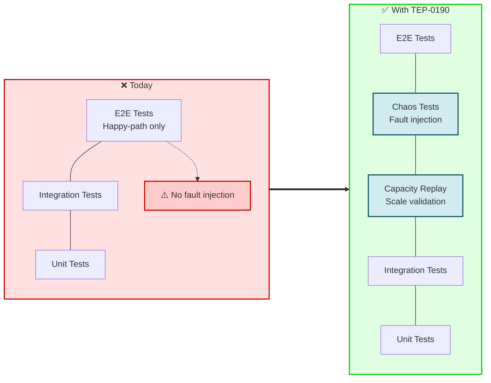
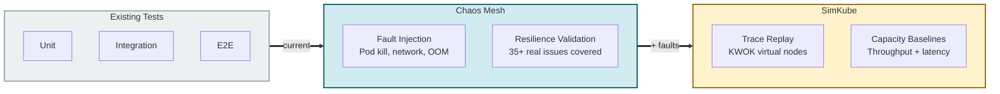
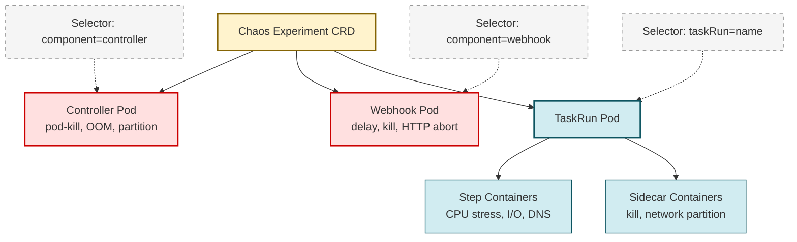
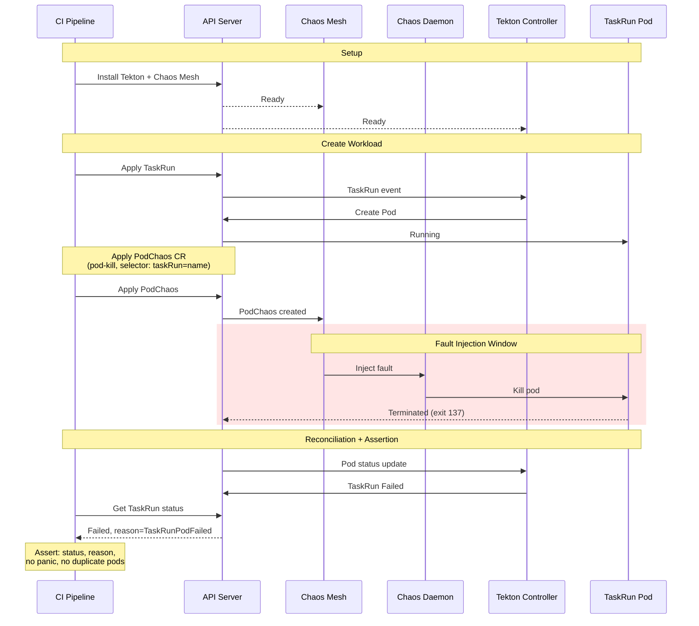
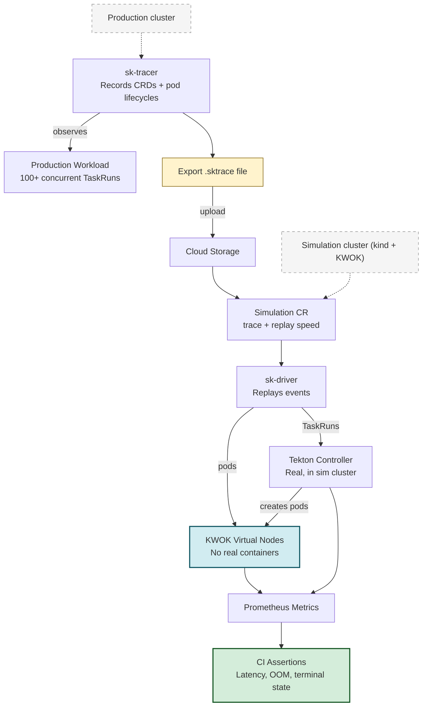
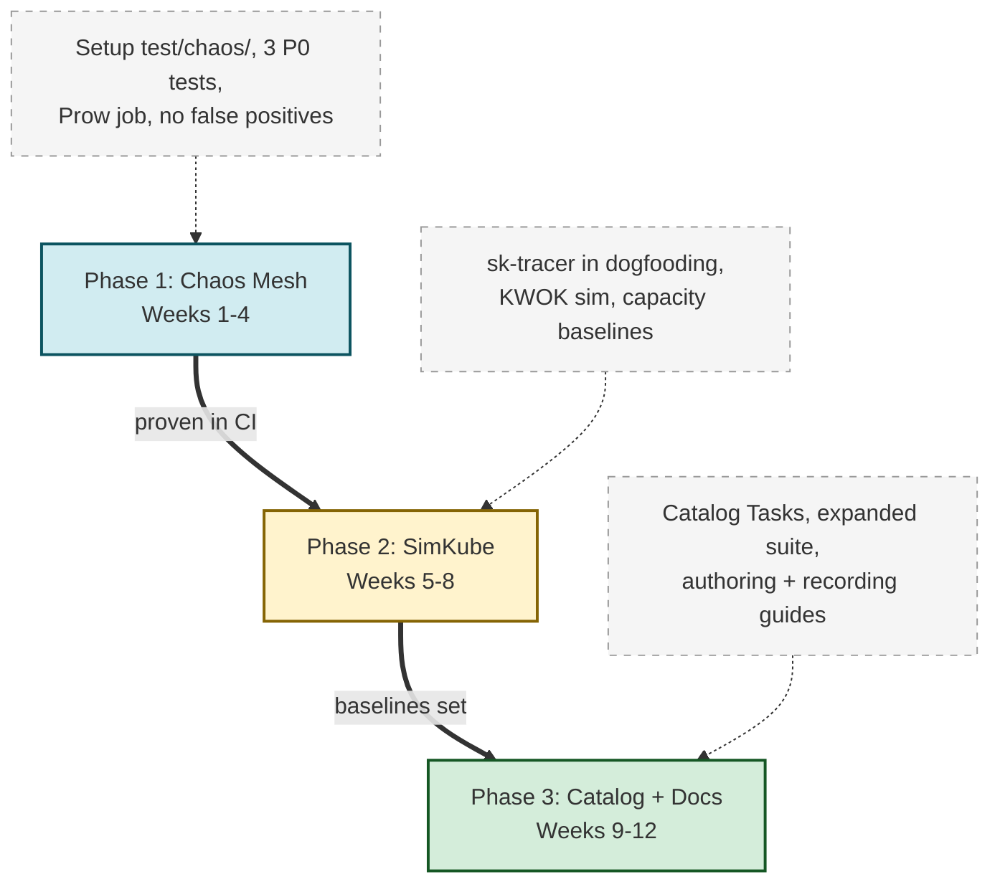

# TEP-0190: Chaos Testing for Tekton Pipelines

<!-- toc -->
- [Summary](#summary)
- [Motivation](#motivation)
- [Goals](#goals)
- [Non-Goals](#non-goals)
- [Requirements](#requirements)
- [Use Cases](#use-cases)
  - [Control Plane Resilience Validation](#control-plane-resilience-validation)
  - [Pod Eviction and Retry Correctness](#pod-eviction-and-retry-correctness)
  - [Webhook Availability Under Disruption](#webhook-availability-under-disruption)
  - [Capacity Planning and Performance Regression Detection](#capacity-planning-and-performance-regression-detection)
  - [Upgrade Resilience Verification](#upgrade-resilience-verification)
- [Proposal](#proposal)
  - [Overview](#overview)
  - [Two-Tool Architecture](#two-tool-architecture)
  - [Chaos Test Suite Structure](#chaos-test-suite-structure)
  - [Chaos Mesh Experiment Definitions](#chaos-mesh-experiment-definitions)
  - [SimKube Trace and Replay](#simkube-trace-and-replay)
  - [CI Integration](#ci-integration)
  - [Security Considerations](#security-considerations)
- [Design Details](#design-details)
  - [Test Directory Layout](#test-directory-layout)
  - [Go Test Framework](#go-test-framework)
  - [Chaos Mesh CRD Patterns for Tekton](#chaos-mesh-crd-patterns-for-tekton)
  - [SimKube Trace Configuration for Tekton](#simkube-trace-configuration-for-tekton)
  - [Verification and Assertions](#verification-and-assertions)
  - [Chaos Mesh Workflow Orchestration](#chaos-mesh-workflow-orchestration)
- [Design Evaluation](#design-evaluation)
  - [Pros](#pros)
  - [Cons](#cons)
  - [Risks and Mitigations](#risks-and-mitigations)
  - [Prior Art](#prior-art)
    - [Kubernetes Ecosystem Chaos Testing](#kubernetes-ecosystem-chaos-testing)
    - [Tekton Resilience History](#tekton-resilience-history)
- [Alternatives](#alternatives)
  - [LitmusChaos Instead of Chaos Mesh](#litmuschaos-instead-of-chaos-mesh)
  - [Controller-Level Fault Injection Hooks](#controller-level-fault-injection-hooks)
  - [kube-monkey for Pod Kill Testing](#kube-monkey-for-pod-kill-testing)
  - [Chaos Toolkit with Python Driver](#chaos-toolkit-with-python-driver)
  - [Chaos Mesh Only (No SimKube)](#chaos-mesh-only-no-simkube)
  - [SimKube Only (No Chaos Mesh)](#simkube-only-no-chaos-mesh)
- [Test Plan](#test-plan)
  - [Unit Tests](#unit-tests)
  - [Integration Tests](#integration-tests)
  - [CI Testing Matrix](#ci-testing-matrix)
- [Implementation Plan](#implementation-plan)
  - [Milestones](#milestones)
- [Future Work](#future-work)
- [References](#references)
<!-- /toc -->

## Summary

This TEP introduces a structured chaos testing framework for Tekton Pipelines. The framework uses
two complementary tools: [Chaos Mesh](https://chaos-mesh.org/) for active fault injection and
resilience validation, and [SimKube](https://github.com/acrlabs/simkube) for deterministic
workload replay and capacity testing. These tools form two layers in a testing pyramid that sits
between Tekton's existing unit/integration tests and its end-to-end test suite.

The framework consists of:

1. A `test/chaos/` directory in `tektoncd/pipeline` containing Go test files that deploy Tekton
   workloads, create Chaos Mesh experiment CRDs to inject faults, and assert correct behavior.
2. SimKube trace configurations for recording and replaying Tekton workload patterns against
   KWOK-based simulation clusters to test control plane capacity and scheduling behavior.
3. Reusable Tekton Catalog Tasks that wrap chaos experiment creation and validation, enabling
   the community to chaos-test their own Tekton installations.

The chaos test suite targets six failure categories derived from 35+ real production incidents
reported in the `tektoncd/pipeline` issue tracker: controller crashes, pod eviction mishandling,
webhook fragility, network partitions, resource pressure, and data integrity loss.

## Motivation

Tekton Pipelines has no proactive framework for systematically discovering failure modes. The
project relies on reactive bug fixes after failures are discovered in production or CI. The
`tektoncd/pipeline` issue tracker contains over 35 real-world failure reports that chaos testing
could have caught earlier or could validate ongoing resilience against.

The following diagram illustrates the gap in Tekton's current testing strategy:



Key failure patterns from the issue tracker that motivate this TEP:

| Pattern | Issue Count | Example Issues | Impact |
|---------|-------------|----------------|--------|
| Controller panics from unexpected input | 8 | [#8083](https://github.com/tektoncd/pipeline/issues/8083), [#8514](https://github.com/tektoncd/pipeline/issues/8514), [#7720](https://github.com/tektoncd/pipeline/issues/7720), [#6885](https://github.com/tektoncd/pipeline/issues/6885) | Single bad PipelineRun crashes the entire control plane |
| Pod eviction mishandling | 6 (3 open) | [#9467](https://github.com/tektoncd/pipeline/issues/9467), [#7218](https://github.com/tektoncd/pipeline/issues/7218), [#6145](https://github.com/tektoncd/pipeline/issues/6145) | Wrong status, duplicate pods, failed reconciliation |
| Webhook fragility | 4 (2 open) | [#8713](https://github.com/tektoncd/pipeline/issues/8713), [#4542](https://github.com/tektoncd/pipeline/issues/4542), [#6823](https://github.com/tektoncd/pipeline/issues/6823) | All pipeline creation blocked, configmap deadlocks |
| State loss after controller restart | 4 | [#8757](https://github.com/tektoncd/pipeline/issues/8757), [#5146](https://github.com/tektoncd/pipeline/issues/5146), [#7902](https://github.com/tektoncd/pipeline/issues/7902) | PVCs double-deleted, metrics vanish, updates lost |
| Timing-dependent race conditions | 5 | [#9364](https://github.com/tektoncd/pipeline/issues/9364), [#5595](https://github.com/tektoncd/pipeline/issues/5595), [#8170](https://github.com/tektoncd/pipeline/issues/8170) | Bugs only manifest under contention or slow I/O |

These are not theoretical risks. Issue [#9467](https://github.com/tektoncd/pipeline/issues/9467)
(PipelineRun permanently fails when TaskRun recovers after pod eviction) and Issue
[#8713](https://github.com/tektoncd/pipeline/issues/8713) (webhook service unavailable blocks
TaskRun creation) are still open as of March 2026 and affect production users.

## Goals

- Establish a chaos testing suite in `tektoncd/pipeline` that validates controller, webhook, and
  TaskRun pod resilience under fault injection.
- Provide deterministic workload replay capability for capacity planning and performance
  regression detection.
- Define a prioritized set of chaos test scenarios derived from real production incidents.
- Run chaos tests as an optional CI job that does not block regular e2e tests.
- Enable the community to chaos-test their own Tekton installations via reusable Catalog Tasks.

## Non-Goals

- Replacing or modifying existing unit, integration, or e2e tests. Chaos tests are additive.
- Testing application-level logic inside TaskRun steps. The framework tests Tekton's control
  plane and orchestration behavior, not user workload correctness.
- Providing a general-purpose chaos testing platform for arbitrary Kubernetes workloads. The
  scope is Tekton-specific failure modes.
- Guaranteeing deterministic chaos test results. Chaos testing is inherently probabilistic; the
  framework validates resilience properties, not exact outcomes.

## Requirements

- Chaos tests must be runnable in kind clusters to match Tekton's existing CI infrastructure.
- Chaos experiments must be scoped to annotated namespaces only (no cluster-wide blast radius).
- Every chaos test must have a clear expected behavior assertion, not just "inject fault and
  observe."
- The framework must support running chaos experiments concurrently with standard Tekton
  workloads.
- SimKube simulations must run without AWS dependencies to integrate with Tekton's GKE-based
  Prow CI.
- All chaos experiment definitions must be declarative YAML, version-controlled alongside the
  test code.

## Use Cases

The following table summarizes the use cases this TEP addresses:

| Use Case | Persona | Tool | Priority |
|----------|---------|------|----------|
| Control plane resilience | Tekton maintainer | Chaos Mesh | P0 |
| Pod eviction correctness | Tekton maintainer | Chaos Mesh | P0 |
| Webhook availability | Tekton maintainer | Chaos Mesh | P0 |
| Capacity planning | Tekton operator | SimKube | P1 |
| Upgrade resilience | Tekton maintainer | Chaos Mesh + SimKube | P2 |

### Control Plane Resilience Validation

As a Tekton maintainer, I need to verify that the pipeline controller recovers correctly after
being killed, OOM-killed, or network-partitioned from the API server. Issue
[#6885](https://github.com/tektoncd/pipeline/issues/6885) (controller panic during reconcile)
and Issue [#8757](https://github.com/tektoncd/pipeline/issues/8757) (controller deletes
already-deleted PVCs after restart) demonstrate that controller restart during active workloads
causes data integrity issues. Chaos testing with PodChaos and NetworkChaos experiments targeting
the controller pod validates that in-flight TaskRuns and PipelineRuns resume correctly after
recovery.

### Pod Eviction and Retry Correctness

As a Tekton maintainer, I need to verify that TaskRun and PipelineRun status correctly reflects
pod eviction events and that retry mechanisms create new pods on healthy nodes. Issue
[#9467](https://github.com/tektoncd/pipeline/issues/9467) (PipelineRun permanently fails when
TaskRun recovers after pod eviction) and Issue
[#7218](https://github.com/tektoncd/pipeline/issues/7218) (retry pod created while previous
attempt still running) are open bugs that chaos testing with PodChaos pod-kill experiments
directly targets.

### Webhook Availability Under Disruption

As a Tekton maintainer, I need to verify that webhook unavailability does not permanently block
pipeline operations and that the system recovers after webhook pods restart. Issue
[#8713](https://github.com/tektoncd/pipeline/issues/8713) (webhook service unavailable blocks
TaskRun creation) and Issue [#4542](https://github.com/tektoncd/pipeline/issues/4542) (deadlock
between webhook and configMaps) demonstrate that the webhook is a single point of failure.

### Capacity Planning and Performance Regression Detection

As a Tekton operator running Tekton at scale, I need to understand how the control plane behaves
under high concurrency. SimKube enables recording a burst of TaskRuns from a real CI cluster and
replaying them in a simulation cluster to determine maximum throughput before the control plane
degrades. This is a capacity planning and performance regression testing use case that cannot be
addressed by fault injection alone.

### Upgrade Resilience Verification

As a Tekton maintainer, I need to verify that upgrading the controller while PipelineRuns are
active does not corrupt state or crash the new controller. Issue
[#8086](https://github.com/tektoncd/pipeline/issues/8086) (controller crashes for certain
Pipeline after upgrade) demonstrates that legacy resources from older versions can crash the
reconciler after an upgrade.

## Proposal

### Overview

This TEP proposes a two-tool chaos testing architecture that addresses complementary failure
domains:

| Layer | Tool | What It Tests | How |
|-------|------|---------------|-----|
| Resilience | Chaos Mesh | Fault tolerance under active failure injection | CRD-based experiments targeting Tekton components |
| Capacity | SimKube | Control plane behavior at scale | Record-and-replay of production workload patterns on KWOK clusters |

The following diagram illustrates how these two tools complement each other across the testing
spectrum:



### Two-Tool Architecture

**Chaos Mesh** (CNCF Incubating) is the primary tool for active fault injection. It provides
CRD-based experiment definitions for pod kill, network partition, memory stress, I/O faults, DNS
failures, and time skew. Its architecture consists of a controller-manager that reconciles chaos
CRDs and a DaemonSet (chaos-daemon) that performs fault injection by entering container
namespaces on each node.

Chaos Mesh is the strongest fit for Tekton because:
1. CRD-native design aligns with Tekton's Kubernetes-native philosophy.
2. Broadest fault type coverage (pod, network, stress, I/O, DNS, time, HTTP).
3. Fine-grained selectors can target specific Tekton components by label.
4. Declarative YAML experiments integrate naturally with version control and CI.
5. CNCF incubating project with active maintenance.
6. No competing workflow engine dependency (unlike LitmusChaos, which uses Argo Workflows).

**SimKube** is the secondary tool for deterministic workload replay and capacity testing. It
records Kubernetes resource events from a production cluster (sk-tracer), stores them as
msgpack trace files (.sktrace), and replays them in a simulation cluster (sk-driver) backed by
KWOK (Kubernetes WithOut Kubelet). KWOK fakes pod status without running actual containers,
enabling simulation of thousands of pods at minimal resource cost.

SimKube adds value that Chaos Mesh does not provide:

| Capability | SimKube | Chaos Mesh |
|-----------|---------|------------|
| Deterministic replay of production workload patterns | Yes | No |
| Capacity planning ("what if we 2x the workload?") | Yes | No |
| Scheduler testing at scale | Yes | No |
| Autoscaler validation | Yes | No |
| Control plane stress with thousands of pods | Yes (low cost via KWOK) | Partially (real resource cost) |

Conversely, Chaos Mesh provides capabilities SimKube cannot:

| Capability | Chaos Mesh | SimKube |
|-----------|------------|---------|
| Fault injection (pod kill, network partition, I/O) | Yes | No |
| Testing error handling code paths | Yes | No |
| Network chaos (latency, packet loss, partition) | Yes | No |
| Stress testing (CPU, memory, I/O pressure) | Yes | No |
| Tekton result/status propagation under failure | Yes | No |

### Chaos Test Suite Structure

The chaos test suite lives in `test/chaos/` within `tektoncd/pipeline`. Tests are organized by
failure category, each targeting a specific Tekton component:

| Category | Target | Chaos Type | Priority | Issues Covered |
|----------|--------|------------|----------|----------------|
| Controller crash recovery | `tekton-pipelines-controller` | PodChaos (pod-kill) | P0 | [#6885](https://github.com/tektoncd/pipeline/issues/6885), [#8757](https://github.com/tektoncd/pipeline/issues/8757), [#7902](https://github.com/tektoncd/pipeline/issues/7902) |
| Controller OOM | `tekton-pipelines-controller` | StressChaos (memory) | P0 | [#8652](https://github.com/tektoncd/pipeline/issues/8652), [#8514](https://github.com/tektoncd/pipeline/issues/8514) |
| TaskRun pod eviction | TaskRun pods | PodChaos (pod-kill) | P0 | [#9467](https://github.com/tektoncd/pipeline/issues/9467), [#7218](https://github.com/tektoncd/pipeline/issues/7218), [#6145](https://github.com/tektoncd/pipeline/issues/6145) |
| Webhook disruption | `tekton-pipelines-webhook` | PodChaos + NetworkChaos | P0 | [#8713](https://github.com/tektoncd/pipeline/issues/8713), [#4542](https://github.com/tektoncd/pipeline/issues/4542) |
| Controller-APIServer partition | `tekton-pipelines-controller` | NetworkChaos (partition) | P1 | [#5146](https://github.com/tektoncd/pipeline/issues/5146), [#6977](https://github.com/tektoncd/pipeline/issues/6977) |
| Webhook latency | `tekton-pipelines-webhook` | NetworkChaos (delay) | P1 | [#8713](https://github.com/tektoncd/pipeline/issues/8713) |
| DNS failure for resolution | TaskRun pods | DNSChaos | P1 | Remote resolution failures |
| OOM in TaskRun steps | TaskRun step containers | StressChaos (memory) | P1 | [#8170](https://github.com/tektoncd/pipeline/issues/8170), [#7396](https://github.com/tektoncd/pipeline/issues/7396) |
| Disk I/O errors on result volume | TaskRun pods | IOChaos | P2 | [#6590](https://github.com/tektoncd/pipeline/issues/6590) |
| CPU pressure during pipeline burst | TaskRun pods | StressChaos (CPU) | P2 | [#9364](https://github.com/tektoncd/pipeline/issues/9364) |
| Clock skew on controller | `tekton-pipelines-controller` | TimeChaos | P2 | Timeout calculation bugs |
| Multi-phase combined chaos | All components | Workflow | P3 | Combined resilience |

### Chaos Mesh Experiment Definitions

Each chaos test is backed by a declarative Chaos Mesh CRD. The following are representative
examples for the P0 scenarios.

**Kill controller pod during active PipelineRuns:**

```yaml
apiVersion: chaos-mesh.org/v1alpha1
kind: PodChaos
metadata:
  name: kill-controller
  namespace: tekton-pipelines
spec:
  action: pod-kill
  mode: one
  selector:
    namespaces: ["tekton-pipelines"]
    labelSelectors:
      app.kubernetes.io/component: controller
      app.kubernetes.io/part-of: tekton-pipelines
  gracePeriod: 0
```

**Evict TaskRun pod mid-execution:**

```yaml
apiVersion: chaos-mesh.org/v1alpha1
kind: PodChaos
metadata:
  name: kill-taskrun-pod
  namespace: default
spec:
  action: pod-kill
  mode: one
  selector:
    namespaces: ["default"]
    labelSelectors:
      tekton.dev/taskRun: long-running-build
    podPhaseSelectors:
      - Running
  gracePeriod: 0
```

**OOM the controller:**

```yaml
apiVersion: chaos-mesh.org/v1alpha1
kind: StressChaos
metadata:
  name: controller-oom
  namespace: tekton-pipelines
spec:
  mode: all
  selector:
    namespaces: ["tekton-pipelines"]
    labelSelectors:
      app.kubernetes.io/component: controller
      app.kubernetes.io/part-of: tekton-pipelines
  containerNames: ["tekton-pipelines-controller"]
  stressors:
    memory:
      workers: 4
      size: "2GB"
      oomScoreAdj: 1000
  duration: "60s"
```

**Network partition between controller and API server:**

```yaml
apiVersion: chaos-mesh.org/v1alpha1
kind: NetworkChaos
metadata:
  name: controller-apiserver-partition
  namespace: tekton-pipelines
spec:
  action: partition
  mode: all
  selector:
    namespaces: ["tekton-pipelines"]
    labelSelectors:
      app.kubernetes.io/component: controller
      app.kubernetes.io/part-of: tekton-pipelines
  direction: both
  externalTargets:
    - "10.96.0.1:443"
  duration: "30s"
```

**Delay webhook responses:**

```yaml
apiVersion: chaos-mesh.org/v1alpha1
kind: NetworkChaos
metadata:
  name: webhook-delay
  namespace: tekton-pipelines
spec:
  action: delay
  mode: all
  selector:
    namespaces: ["tekton-pipelines"]
    labelSelectors:
      app.kubernetes.io/component: webhook
      app.kubernetes.io/part-of: tekton-pipelines
  direction: from
  delay:
    latency: "5s"
    jitter: "2s"
    correlation: "50"
  duration: "120s"
```

### SimKube Trace and Replay

SimKube traces are recorded from Tekton's dogfooding cluster or a production-like test cluster.
The tracer configuration for Tekton resources:

```yaml
trackedObjects:
  tekton.dev/v1.TaskRun:
    podSpecTemplatePaths:
      - /spec/template
    trackLifecycle: true
  tekton.dev/v1.PipelineRun:
    podSpecTemplatePaths: []
  tekton.dev/v1.Task:
    podSpecTemplatePaths: []
  tekton.dev/v1.Pipeline:
    podSpecTemplatePaths: []
```

The Tekton controller must be installed in the simulation cluster alongside KWOK. During replay,
SimKube applies recorded TaskRun and PipelineRun objects into virtual namespaces. The Tekton
controller reconciles them and creates pods, which the SimKube mutation webhook routes to KWOK
virtual nodes. This enables testing:

- How the controller handles 100+ concurrent TaskRuns.
- Whether the scheduler keeps up under burst workload patterns.
- Whether the API server handles the watch/list load from the controller at scale.
- Performance regression detection by comparing simulation metrics across releases.

SimKube simulations produce Prometheus metrics that are collected automatically. These metrics
include API server request latency, controller reconcile duration, and queue depth.

### CI Integration

Chaos tests run as a separate optional CI job, not blocking regular e2e tests. The CI setup
requires:

1. A kind cluster (already used by Tekton CI).
2. Chaos Mesh installed via Helm with kind-specific configuration.
3. Namespace annotations to scope chaos injection.

The Chaos Mesh installation script for kind:

```bash
helm repo add chaos-mesh https://charts.chaos-mesh.org
helm install chaos-mesh chaos-mesh/chaos-mesh \
  --namespace chaos-mesh \
  --create-namespace \
  --set controllerManager.replicaCount=1 \
  --set chaosDaemon.runtime=containerd \
  --set chaosDaemon.socketPath=/run/containerd/containerd.sock \
  --set dashboard.create=false \
  --set controllerManager.enableFilterNamespace=true \
  --version 2.7.0

kubectl -n chaos-mesh wait --for=condition=Ready pods --all --timeout=120s
kubectl annotate ns tekton-pipelines chaos-mesh.org/inject=enabled --overwrite
kubectl annotate ns default chaos-mesh.org/inject=enabled --overwrite
```

For SimKube, the CI job creates a kind cluster with KWOK installed, deploys sk-ctrl, and runs
`skctl run` with pre-recorded trace files. This avoids the AWS dependency of the
simkube-ci-action by building the equivalent setup as container images runnable in Prow.

### Security Considerations

- Chaos Mesh's chaos-daemon runs as privileged on every node. In CI, this is acceptable because
  kind clusters are ephemeral. In production test clusters, namespace filtering
  (`enableFilterNamespace: true`) restricts chaos injection to annotated namespaces only.
- Chaos experiment CRDs are namespace-scoped. The `selector.namespaces` field explicitly
  restricts which namespaces are affected. If empty, it defaults to the CR's own namespace.
- SimKube's mutation webhook intercepts pod creation only for pods owned by simulation roots.
  It does not affect non-simulation workloads.
- No chaos-related code is added to Tekton's production binaries. All chaos testing
  infrastructure is external tooling and test code.

## Design Details

### Test Directory Layout

```
test/chaos/
  README.md
  setup.sh                          # Install Chaos Mesh + annotate namespaces
  teardown.sh                       # Clean up chaos resources
  experiments/                      # Chaos Mesh CRD YAML files
    controller-pod-kill.yaml
    controller-oom.yaml
    controller-apiserver-partition.yaml
    taskrun-pod-kill.yaml
    webhook-delay.yaml
    webhook-pod-kill.yaml
    dns-failure-git-clone.yaml
    io-fault-result-volume.yaml
    multi-phase-workflow.yaml
  simkube/
    tracer-config.yaml              # sk-tracer configuration for Tekton CRs
    traces/                         # Pre-recorded .sktrace files
      burst-100-taskruns.sktrace
      sustained-pipeline-load.sktrace
    simulation.yaml                 # SimKube Simulation CRD template
  controller_chaos_test.go          # Controller resilience tests
  taskrun_chaos_test.go             # TaskRun pod failure tests
  webhook_chaos_test.go             # Webhook disruption tests
  network_chaos_test.go             # Network partition/latency tests
  capacity_test.go                  # SimKube capacity tests
  helpers_test.go                   # Shared test utilities
```

Tests use the `chaos` build constraint tag to prevent execution during regular `go test` runs:

```go
//go:build chaos
```

### Go Test Framework

Each chaos test follows a consistent pattern:

```go
//go:build chaos

package chaos

import (
    "context"
    "testing"
    "time"

    pipelinev1 "github.com/tektoncd/pipeline/pkg/apis/pipeline/v1"
    metav1 "k8s.io/apimachinery/pkg/apis/meta/v1"
    "k8s.io/apimachinery/pkg/apis/meta/v1/unstructured"
    "k8s.io/client-go/dynamic"
)

func TestControllerRecoveryAfterPodKill(t *testing.T) {
    ctx := context.Background()
    clients := setup(t)

    // 1. Create a long-running PipelineRun
    pr := createPipelineRun(ctx, t, clients, "controller-kill-test")
    waitForPipelineRunRunning(ctx, t, clients, pr.Name)

    // 2. Apply Chaos Mesh experiment to kill the controller
    applyChaosExperiment(ctx, t, clients, "experiments/controller-pod-kill.yaml")

    // 3. Wait for controller pod to be killed and restarted
    waitForControllerRestart(ctx, t, clients, 60*time.Second)

    // 4. Verify PipelineRun completes successfully after recovery
    waitForPipelineRunCompletion(ctx, t, clients, pr.Name, 5*time.Minute)

    // 5. Verify no data integrity issues
    assertPipelineRunResultsIntact(ctx, t, clients, pr.Name)
    assertNoOrphanedTaskRuns(ctx, t, clients, pr.Name)

    // 6. Clean up chaos experiment
    deleteChaosExperiment(ctx, t, clients, "kill-controller")
}
```

The `applyChaosExperiment` helper uses the Kubernetes dynamic client to create unstructured
Chaos Mesh CRDs from YAML files. The `waitForControllerRestart` helper polls the controller
pod status until it transitions through Terminated and back to Running.

### Chaos Mesh CRD Patterns for Tekton

The following selector patterns target Tekton components:

| Target | Selector |
|--------|----------|
| Pipeline controller | `namespaces: ["tekton-pipelines"]`, `labelSelectors: {app.kubernetes.io/component: controller, app.kubernetes.io/part-of: tekton-pipelines}` |
| Webhook | `namespaces: ["tekton-pipelines"]`, `labelSelectors: {app.kubernetes.io/component: webhook, app.kubernetes.io/part-of: tekton-pipelines}` |
| Specific TaskRun pods | `namespaces: ["default"]`, `labelSelectors: {tekton.dev/taskRun: <name>}` |
| All PipelineRun pods | `namespaces: ["default"]`, `labelSelectors: {tekton.dev/pipelineRun: <name>}` |
| Specific step containers | Above selector + `containerNames: ["step-<name>"]` |

Chaos Mesh mode semantics used in tests:

| Mode | Value | Use Case |
|------|-------|----------|
| `one` | n/a | Kill a single controller replica |
| `all` | n/a | Partition all controller replicas from API server |
| `fixed` | `"2"` | Kill exactly 2 out of N TaskRun pods |
| `fixed-percent` | `"50"` | Stress 50% of pods in a PipelineRun |

The following diagram shows how Chaos Mesh targets different Tekton components:



The following diagram shows the end-to-end flow of a chaos test from CI trigger to assertion:



### SimKube Trace Configuration for Tekton

The sk-tracer watches Tekton CRDs and all pods, recording resource events with timestamps.
Because Tekton's controller creates pods programmatically (not from a standard
`/spec/template` path in the TaskRun spec), the `podSpecTemplatePaths` for TaskRun is set to
`/spec/template` (the `podTemplate` field) but the actual pod construction is handled by the
controller in the simulation cluster. This means the Tekton controller must be installed in
the simulation cluster for SimKube replay to work correctly.

The simulation workflow:



### Verification and Assertions

Each chaos test verifies specific resilience properties. The assertion framework checks:

| Property | Verification Method |
|----------|-------------------|
| Controller recovery | Poll controller pod until Running, then verify reconciliation resumes |
| TaskRun status correctness | Assert TaskRun condition reason matches expected failure type (e.g., `TaskRunPodFailed`) |
| PipelineRun status consistency | Verify PipelineRun reflects final TaskRun status, not intermediate failure |
| No orphaned resources | List TaskRuns/pods with PipelineRun owner label, verify all are accounted for |
| Result integrity | Verify results from completed steps are preserved even when later steps fail |
| Metrics continuity | Query `/metrics` endpoint before and after chaos, verify counters are monotonic |
| Event correctness | Check Kubernetes events for expected failure/recovery events |

Chaos Mesh provides built-in verification via CRD status conditions:

```bash
kubectl get podchaos kill-controller -o jsonpath='{.status.conditions}'
```

Conditions include `Selected` (targets found), `AllInjected` (fault applied), and
`AllRecovered` (fault removed after duration expires).

### Chaos Mesh Workflow Orchestration

For multi-phase chaos scenarios, the Chaos Mesh Workflow CRD orchestrates sequential and
parallel fault injection:

```yaml
apiVersion: chaos-mesh.org/v1alpha1
kind: Workflow
metadata:
  name: tekton-resilience-suite
  namespace: tekton-pipelines
spec:
  entry: main
  templates:
    - name: main
      templateType: Serial
      deadline: 600s
      children:
        - network-degradation
        - recovery-pause
        - controller-restart
        - verify-pause
        - webhook-stress
    - name: network-degradation
      templateType: NetworkChaos
      deadline: 60s
      networkChaos:
        action: delay
        mode: all
        selector:
          namespaces: ["tekton-pipelines"]
          labelSelectors:
            app.kubernetes.io/part-of: tekton-pipelines
        delay:
          latency: "500ms"
          jitter: "200ms"
    - name: recovery-pause
      templateType: Suspend
      deadline: 30s
    - name: controller-restart
      templateType: PodChaos
      deadline: 30s
      podChaos:
        action: pod-kill
        mode: one
        selector:
          namespaces: ["tekton-pipelines"]
          labelSelectors:
            app.kubernetes.io/component: controller
    - name: verify-pause
      templateType: Suspend
      deadline: 30s
    - name: webhook-stress
      templateType: StressChaos
      deadline: 60s
      stressChaos:
        mode: all
        selector:
          namespaces: ["tekton-pipelines"]
          labelSelectors:
            app.kubernetes.io/component: webhook
        stressors:
          cpu:
            workers: 2
            load: 80
```

This workflow tests a realistic compound failure scenario: network degradation followed by
controller crash followed by webhook stress, with recovery periods between phases.

## Design Evaluation

### Pros

- Directly addresses 35+ real production incidents documented in the `tektoncd/pipeline`
  issue tracker.
- Uses CNCF-ecosystem tools (Chaos Mesh is CNCF Incubating) that align with Tekton's
  governance and community standards.
- CRD-based chaos experiments are declarative YAML, matching Tekton's Kubernetes-native design
  philosophy.
- Two-tool approach covers both resilience testing (Chaos Mesh) and capacity testing (SimKube)
  without overlap.
- Chaos tests are additive and run as an optional CI job, introducing zero risk to existing
  test infrastructure.
- The phased implementation plan allows incremental adoption and validation.
- Reusable Catalog Tasks enable the broader community to benefit from the framework.

### Cons

- Adds Chaos Mesh as a cluster dependency for chaos test runs, increasing CI infrastructure
  complexity.
- SimKube is a relatively young project (v2.4.4, Rust-based) with a smaller community than
  Chaos Mesh.
- Chaos tests are inherently non-deterministic and may produce flaky results if assertion
  timeouts are too tight.
- SimKube replay is not fully deterministic due to timing fluctuations in the real control
  plane.
- In kind clusters, all pods share a single node, limiting the value of node-level chaos
  scenarios.

### Risks and Mitigations

| Risk | Likelihood | Impact | Mitigation |
|------|-----------|--------|------------|
| Chaos tests are flaky due to timing sensitivity | High | Medium | Use generous timeouts, retry assertions with backoff, mark known-flaky tests with `t.Skip` and track in issues |
| Chaos Mesh version incompatibility with kind/k8s versions | Medium | Medium | Pin Chaos Mesh version in CI, test against Tekton's supported k8s versions |
| SimKube cannot trace Tekton CRDs correctly | Medium | Low | Phase 2 gating: validate SimKube trace/replay with Tekton CRDs before committing to full integration |
| Chaos tests mask real bugs as "expected chaos behavior" | Low | High | Every chaos test must have a clear pass/fail assertion; "inject and observe" tests are not accepted |
| Chaos Mesh's privileged DaemonSet introduces security exposure in test clusters | Low | Low | Use `enableFilterNamespace: true` to restrict blast radius; kind clusters are ephemeral |
| CI resource costs increase significantly | Medium | Medium | Run chaos tests on a separate schedule (nightly, not per-PR) for P2/P3 scenarios |

### Prior Art

#### Kubernetes Ecosystem Chaos Testing

| Project | Approach | Tekton Relevance |
|---------|----------|-----------------|
| [etcd fault injection](https://github.com/etcd-io/etcd/tree/main/tests/integration) | In-process fault injection hooks in Go code | Considered as Alternative (see below); rejected due to security concerns |
| [Kubernetes e2e chaos tests](https://github.com/kubernetes/kubernetes/tree/master/test/e2e/chaosmonkey) | ChaosMonkey framework in e2e tests that disrupts nodes during test execution | Closest prior art; validates the "chaos alongside e2e" approach |
| [Istio chaos testing](https://istio.io/latest/docs/tasks/traffic-management/fault-injection/) | Uses Envoy proxy for HTTP fault injection | Not applicable; Tekton does not use a service mesh |
| [Knative upstream](https://github.com/knative/serving) | No formal chaos testing framework | Tekton would be the first knative-ecosystem project to adopt chaos testing |

#### Tekton Resilience History

Tekton has no existing chaos testing framework, TEP, or formal resilience testing initiative.
However, several reactive fixes demonstrate the need:

- Issue [#3000](https://github.com/tektoncd/pipeline/issues/3000): Controller panicked with
  nil map assignment during PipelineRun status reconciliation. A chaos test killing the
  controller during `updatePipelineRunStatusFromTaskRuns` would have caught this.
- Issue [#618](https://github.com/tektoncd/pipeline/issues/618): TaskRun pod deleted
  mid-execution is never recreated. The controller logs errors repeatedly instead of retrying.
- Issue [#3378](https://github.com/tektoncd/pipeline/issues/3378): PipelineRun failed when
  informer cache was behind the API server. Fix introduced `resources.MinimumAge` buffer with
  requeue-and-backoff. A chaos test introducing API server latency would validate this fix.
- Issue [#5835](https://github.com/tektoncd/pipeline/issues/5835): Feature request for
  PipelineRun queueing explicitly lists "Chaos Engineering" as a use case, demonstrating
  community awareness of the need.

## Alternatives

### LitmusChaos Instead of Chaos Mesh

[LitmusChaos](https://litmuschaos.io/) (CNCF Incubating) provides a ChaosHub with pre-built
experiments and a ChaosCenter UI. Its architecture uses an Argo Workflows-based engine to
orchestrate multi-step chaos experiments.

```yaml
apiVersion: litmuschaos.io/v1alpha1
kind: ChaosEngine
metadata:
  name: tekton-controller-chaos
spec:
  appinfo:
    appns: tekton-pipelines
    applabel: app.kubernetes.io/component=controller
  chaosServiceAccount: litmus-admin
  experiments:
    - name: pod-delete
      spec:
        components:
          env:
            - name: TOTAL_CHAOS_DURATION
              value: "30"
            - name: CHAOS_INTERVAL
              value: "10"
```

This approach was rejected because:
- LitmusChaos uses Argo Workflows internally. Argo is a competing workflow engine to Tekton,
  creating conceptual friction and potential confusion when proposing chaos testing for Tekton.
- The ChaosCenter UI and ChaosHub add operational complexity that is unnecessary for CI-only
  usage.
- Chaos Mesh's pure CRD model (no intermediate workflow engine) is simpler and more aligned
  with Tekton's Kubernetes-native approach.

### Controller-Level Fault Injection Hooks

Add optional fault injection points directly in the Tekton controller code, similar to
[etcd's fault injection framework](https://github.com/etcd-io/etcd/tree/main/tests/integration):

```go
// In reconciler code
func (r *Reconciler) ReconcileKind(ctx context.Context, pr *v1.PipelineRun) error {
    chaos.MaybeInjectFault("reconcile-start") // inject delay/panic/error
    // ... reconciliation logic ...
}
```

This approach was rejected because:
- It adds dead code to production binaries, increasing attack surface.
- Fault injection code in production controllers is a security concern even behind feature
  flags.
- It creates high maintenance burden as injection points must be updated with every code change.
- It does not test infrastructure-level failures (pod eviction, network partition, OOM) that
  external tools can simulate.
- It is not how the broader Kubernetes ecosystem does chaos testing.

### kube-monkey for Pod Kill Testing

[kube-monkey](https://github.com/asobti/kube-monkey) is a simple pod-killing controller that
creates daily kill schedules during configurable time windows.

This approach was rejected because:
- It only kills pods. It cannot inject network faults, I/O errors, DNS failures, memory
  pressure, or time skew.
- It has no fine-grained timing control. Kill schedules are daily, not per-test.
- It is too simplistic for controller-level resilience testing where specific failure modes
  need to be targeted at specific reconciliation points.

### Chaos Toolkit with Python Driver

[Chaos Toolkit](https://chaostoolkit.org/) provides a Python CLI with JSON/YAML experiment
definitions and extensible driver plugins.

This approach was rejected because:
- It introduces a Python runtime dependency into a Go-only test infrastructure.
- Community adoption has declined since 2018.
- CLI-only execution (no scheduling, no Kubernetes-native integration) is a poor fit for
  CI automation.
- CRD-based tools (Chaos Mesh) integrate more naturally with Kubernetes test infrastructure.

### Chaos Mesh Only (No SimKube)

Use Chaos Mesh exclusively for all chaos and capacity testing.

This approach is a valid alternative but was not chosen because:
- Chaos Mesh cannot replay production workload patterns. It generates faults but does not
  create realistic workload baselines.
- Capacity testing with Chaos Mesh requires real resources for every simulated pod. SimKube
  with KWOK can simulate thousands of pods at negligible cost.
- SimKube enables deterministic regression testing by replaying the same trace across releases.
- The phased implementation plan (Phase 1: Chaos Mesh, Phase 2: SimKube) means SimKube is
  only adopted after Chaos Mesh integration is validated.

### SimKube Only (No Chaos Mesh)

Use SimKube exclusively by recording and replaying failure scenarios.

This approach was rejected because:
- SimKube cannot inject faults. All KWOK pods succeed with exit code 0 by default.
- It cannot test network partitions, I/O errors, DNS failures, or memory pressure.
- It cannot test Tekton-specific error handling paths because no actual container execution
  occurs.
- It is suited only for control plane capacity testing, not resilience validation.

## Test Plan

### Unit Tests

No unit tests are introduced by this TEP. The chaos testing framework is a test infrastructure
addition, not a code change to Tekton's production binaries. The test helper functions in
`test/chaos/helpers_test.go` are validated by the chaos tests themselves.

### Integration Tests

The chaos tests serve as integration tests between Tekton and its runtime environment under
fault conditions. Each test is a Go test function with the `chaos` build constraint tag.

The following table lists the P0 test cases:

| Test | Input | Chaos | Expected Behavior |
|------|-------|-------|-------------------|
| `TestControllerRecoveryAfterPodKill` | Active PipelineRun | PodChaos: kill controller | PipelineRun completes after controller restart |
| `TestControllerRecoveryAfterOOM` | Active PipelineRun | StressChaos: 2GB memory on controller | Controller OOM-killed, restarts, PipelineRun completes |
| `TestTaskRunStatusOnPodEviction` | Active TaskRun | PodChaos: kill TaskRun pod | TaskRun reports Failed with reason containing eviction context |
| `TestPipelineRunRetryOnPodEviction` | PipelineRun with retries: 1 | PodChaos: kill TaskRun pod | Retry creates new pod, PipelineRun succeeds |
| `TestNoDuplicatePodsOnEviction` | Active TaskRun | PodChaos: kill TaskRun pod | Only one replacement pod created, no duplicates |
| `TestWebhookRecoveryAfterPodKill` | None (test creates resources after chaos) | PodChaos: kill webhook | TaskRun creation succeeds after webhook restarts |
| `TestWebhookLatencyDoesNotCorrupt` | None (test creates resources during chaos) | NetworkChaos: 5s delay on webhook | TaskRun created with correct defaults, no missing fields |

### CI Testing Matrix

| CI Job | Trigger | Kubernetes Version | Tests Run | Timeout |
|--------|---------|-------------------|-----------|---------|
| `chaos-p0` | Nightly + release branch | Latest supported | P0 tests only | 30 min |
| `chaos-full` | Weekly + manual trigger | Latest supported | P0 + P1 + P2 | 60 min |
| `capacity-simkube` | Weekly + manual trigger | Latest supported | SimKube capacity tests | 45 min |
| `chaos-multi-k8s` | Release branch only | All supported versions | P0 tests | 30 min per version |

All chaos CI jobs are optional (not blocking) and report results as GitHub check annotations.

## Implementation Plan

The following diagram shows the three implementation phases with dependencies and deliverables:



### Milestones

1. **Milestone 1: Chaos Mesh integration and P0 tests** (Phase 1)
   - Add `test/chaos/` directory structure to `tektoncd/pipeline`.
   - Implement `setup.sh` for Chaos Mesh installation in kind clusters.
   - Implement P0 chaos tests: controller kill, controller OOM, TaskRun pod eviction, webhook
     disruption.
   - Add `chaos-p0` Prow job running nightly.
   - Gate: All P0 tests pass consistently for 2 weeks.

2. **Milestone 2: P1 tests and Chaos Mesh Workflow** (Phase 1 continued)
   - Implement P1 chaos tests: network partition, webhook latency, DNS failure, step OOM.
   - Implement multi-phase Workflow CRD for combined chaos scenarios.
   - Add `chaos-full` Prow job running weekly.
   - Gate: P0 + P1 tests pass consistently for 2 weeks.

3. **Milestone 3: SimKube integration for capacity testing** (Phase 2)
   - Build Prow job with kind + KWOK + SimKube (no AWS dependency).
   - Record baseline traces from Tekton's dogfooding cluster.
   - Implement capacity tests: burst TaskRun handling, controller reconcile throughput.
   - Add `capacity-simkube` Prow job running weekly.
   - Gate: SimKube traces replay correctly with Tekton controller in simulation cluster.

4. **Milestone 4: Reusable Catalog Tasks** (Phase 3)
   - Create `chaos-mesh-inject` Task: applies Chaos Mesh experiment CRDs.
   - Create `chaos-validate` Task: asserts system behavior during/after chaos.
   - Create `chaos-cleanup` Task: removes chaos experiments.
   - Publish to Tekton Catalog with documentation and example Pipelines.
   - Gate: End-to-end chaos Pipeline works against a user-deployed Tekton installation.

## Future Work

- Integrate chaos test results with Tekton's release readiness criteria. A release could
  require all P0 chaos tests to pass before cutting a release candidate.
- Extend SimKube traces to cover multi-tenant scenarios where multiple teams share a Tekton
  installation with namespace isolation.
- Add chaos experiments targeting Tekton Chains, Triggers, and Dashboard components once the
  framework is validated for the core pipeline controller.
- Explore Chaos Mesh's `remoteCluster` field for federated pipeline chaos testing across
  multiple clusters.
- Contribute upstream fixes to SimKube for better Tekton CRD tracing, particularly around
  the `podSpecTemplatePaths` handling for controller-created pods.
- Build a chaos test report dashboard that aggregates results across nightly runs and
  correlates failures with code changes.

## References

- [Chaos Mesh documentation](https://chaos-mesh.org/)
- [Chaos Mesh GitHub repository](https://github.com/chaos-mesh/chaos-mesh)
- [SimKube GitHub repository](https://github.com/acrlabs/simkube)
- [SimKube CI Action](https://github.com/acrlabs/simkube-ci-action)
- [KWOK (Kubernetes WithOut Kubelet)](https://kwok.sigs.k8s.io/)
- [tektoncd/pipeline#8083](https://github.com/tektoncd/pipeline/issues/8083) - Index out of range panic in CheckMissingResultReferences
- [tektoncd/pipeline#8514](https://github.com/tektoncd/pipeline/issues/8514) - Controller segfault with matrix + regular parameters
- [tektoncd/pipeline#7720](https://github.com/tektoncd/pipeline/issues/7720) - Pipelines-in-pipelines controller segfault
- [tektoncd/pipeline#6885](https://github.com/tektoncd/pipeline/issues/6885) - PipelineRun reconciler panic
- [tektoncd/pipeline#6823](https://github.com/tektoncd/pipeline/issues/6823) - Conversion webhook panic
- [tektoncd/pipeline#9467](https://github.com/tektoncd/pipeline/issues/9467) - PipelineRun permanently fails when TaskRun recovers after pod eviction
- [tektoncd/pipeline#7218](https://github.com/tektoncd/pipeline/issues/7218) - Retry pod created while previous attempt still running
- [tektoncd/pipeline#6145](https://github.com/tektoncd/pipeline/issues/6145) - TaskRun reports success when pod was evicted
- [tektoncd/pipeline#8713](https://github.com/tektoncd/pipeline/issues/8713) - Webhook service unavailable blocks TaskRun creation
- [tektoncd/pipeline#4542](https://github.com/tektoncd/pipeline/issues/4542) - Deadlock between webhook and configMaps
- [tektoncd/pipeline#8757](https://github.com/tektoncd/pipeline/issues/8757) - Controller deletes already-deleted PVCs after restart
- [tektoncd/pipeline#5146](https://github.com/tektoncd/pipeline/issues/5146) - Reconcilers bypass knative/pkg Update path
- [tektoncd/pipeline#7902](https://github.com/tektoncd/pipeline/issues/7902) - Metrics suddenly stop reporting
- [tektoncd/pipeline#9364](https://github.com/tektoncd/pipeline/issues/9364) - Resolver cache race condition
- [tektoncd/pipeline#5595](https://github.com/tektoncd/pipeline/issues/5595) - Race condition writing exitCode file
- [tektoncd/pipeline#8170](https://github.com/tektoncd/pipeline/issues/8170) - TaskRun didn't fail promptly after OOM
- [tektoncd/pipeline#7396](https://github.com/tektoncd/pipeline/issues/7396) - Surface TaskRun failure reason
- [tektoncd/pipeline#8652](https://github.com/tektoncd/pipeline/issues/8652) - Excessive memory consumption in git resolver
- [tektoncd/pipeline#8086](https://github.com/tektoncd/pipeline/issues/8086) - Controller crashes after upgrade
- [tektoncd/pipeline#6977](https://github.com/tektoncd/pipeline/issues/6977) - Controller doesn't dynamically reload config-leader-election
- [tektoncd/pipeline#3000](https://github.com/tektoncd/pipeline/issues/3000) - Controller crash during updatePipelineRunStatusFromTaskRuns
- [tektoncd/pipeline#618](https://github.com/tektoncd/pipeline/issues/618) - Pods not restarted after deletion
- [tektoncd/pipeline#3378](https://github.com/tektoncd/pipeline/issues/3378) - PipelineRun fails too eagerly on missing resources
- [tektoncd/pipeline#5835](https://github.com/tektoncd/pipeline/issues/5835) - Tekton Queue/Concurrency (mentions chaos engineering)
- [tektoncd/pipeline#6558](https://github.com/tektoncd/pipeline/issues/6558) - Node shutdown breaks retry mechanism
- [tektoncd/pipeline#3654](https://github.com/tektoncd/pipeline/issues/3654) - PodDisruptionBudget blocks node drain
- [tektoncd/pipeline PR #9368](https://github.com/tektoncd/pipeline/pull/9368) - Surface TaskRun failure reason
- [Kubernetes e2e ChaosMonkey](https://github.com/kubernetes/kubernetes/tree/master/test/e2e/chaosmonkey)
- [TEP-0001: Tekton Enhancement Proposal Process](https://github.com/tektoncd/community/blob/main/teps/0001-tekton-enhancement-proposal-process.md)
